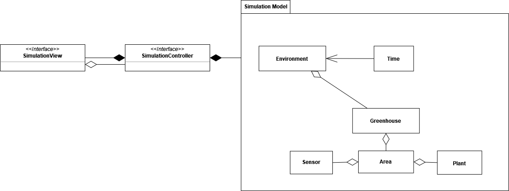

# 3. Design architetturale
Durante il primo meeting di avviamento del progetto, il team di sviluppo ha provveduto a definire ad alto livello il desgin architetturale dell'applicazione. Il risultato ottenuto verrà pertanto descritto nelle seguenti sezioni.

## 3.1 Architettura complessiva
Per l'architettura principale, si è deciso di adottare un componente `Simulation` il quale si occuperà di gestire i diversi elementi dell'applicazione.

Come si può osservare nella figura [Fig. 3.1.1], il componente `Simulation` viene suddiviso in tre elementi principali:
- `Simulation Model`, costituito dai diversi componenti dell'applicazione che si occupano di gestire la logica di funzionamento del programma;
- `SimulationView`, il quale invece è incaricato di mostrare i diversi elementi dell'interfaccia grafica e di gestire l'interazione con l'utente;
- `SimulationController`, il quale ricopre il ruolo di intermediario fra View e Model e si occupa di gestire lo scambio di informazioni fra questi due elementi.

  
  
 Fig. 3.1.1 - Architettura ad alto livello 

[Fig. 3.1.1]:img/architettura_alto_livello.png

Il Model, nello specifico è costituito dai componenti:
- `Time`, che rappresenta il tempo virtuale dell'applicazione;
- `Environment`, che rappresenta l'ambiente in cui è immersa la serra che si vuole gestire;
- `Greenhouse`, che rappresenta la serra della simulazione e si compone di aree, a loro volta rappresentate dall'elemento `Area`;
- `Area`, che rappresenta una zona della serra dove viene coltivata una delle piante selezionate dall'utente, rappresentata dall'elemento `Plant`. Infine, un'area viene monitorata da appositi sensori rappresentati dal componente `Sensor`.

## 3.2 Pattern architetturali utilizzati

Per realizzare la simulazione, si è deciso di utilizzare il pattern architetturale _MVC (Model, View, Controller)_ il quale consente di poter separare la logica di presentazione dei dati dalla logica di business, al fine di rendere quanto più possibile indipendenti i diversi moduli che lo costituiscono.

Nello specifico, il funzionamento del pattern architetturale _MVC_ è il seguente:

- il Model cattura il comportamento dell'applicazione, indipendentemente dall'interfaccia utente, e fornisce i metodi per poter accedere ai dati utili ad essa;
- il Controller riceve i comandi dall'utente attraverso la View e reagisce modificando lo stato degli altri due componenti;
- la View visualizza i dati contenuti nel Model e si occupa dell'interazione con gli utenti, notificando il Controller.

Si è deciso di utilizzare questo pattern in quanto: favorisce il riuso del codice, facilità la manutenzione del software e ne agevola la scalabilità.
