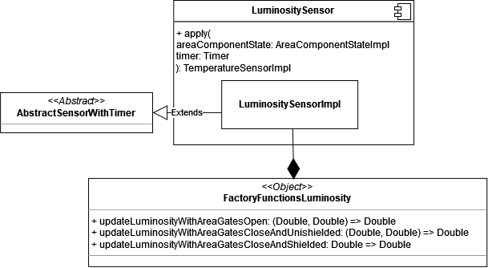
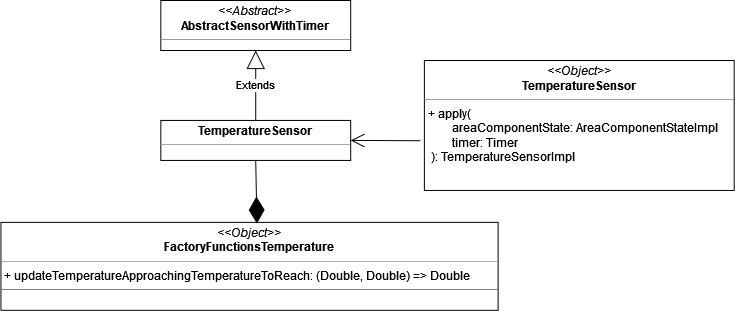

# 4. Design dettagliato
//TODO introduzione capitolo, che cosa verrà inserito, cosa prevede, parlare di Cake Pattern e MVC

## 4.1 Simulazione
//TODO Simulation View Ele, Simulation Controller Vero

//TODO decidere sezioni capitoli
## 4.2 Impostazione dei parametri della simulazione

### 4.2.1 Selezione della città
//TODO Elena

#### 4.2.2.1 Environment
//TODO Maria

### 4.2.2 Selezione delle piante
Per poter realizzare il meccanismo di selezione delle piante si è deciso di adottare, come già detto precedentemente, il _pattern MVC_ e il _Cake pattern_.

In particolare, come si può vedere dalla figura [Fig. 4.2.2.1], la classe `PlantSelectorMVC`, racchiude i componenti: `PlantSelectorModel`, `PlantSelectorController` e `PlantSelectorView` derivanti dai rispettivi moduli. L’adozione di quest’architettura, quindi, non rende più necessaria l’istanziazione di ogni componente e il loro successivo collegamento per risolvere le diverse dipendenze, ma gli elementi del _pattern MVC_ vengono racchiusi all’interno di `PlantSelectorMVC` e possono essere acceduti liberamente.

Per poter utilizzare `PlantSelectorModel`, `PlantSelectorController` o `PlantSelectorView`, basterà semplicemente istanziare `PlantSelectorMVC` e accedere ai suoi elementi. 

  
  
 Fig. 4.2.2.1 - MVC per la selezione delle piante 

[Fig. 4.2.2.1]: img/plant_selector_MVC.png

#### 4.2.2.1 Model per la selezione delle piante

Il Model per la selezione delle piante ([Fig. 4.2.2.1.1]) viene racchiuso all'interno di un modulo chiamato `PlantSelectorModelModule`, nello specifico all'interno del suddetto modulo torviamo:

- il `trait PlantSelectorModel`, il quale espone i diversi metodi che potranno essere richiamati sul Model e che consentono la gestione del meccanismo di selezione delle piante;
- la classe `PlantSelectorModelImpl`, la quale detiene l'implementazione dei metodi dell'interfaccia `PlantSelectorModel` e viene racchiusa all'interno del `trait Component`;
- il `trait Provider`, che detiene l'oggetto `plantSelectorModel` che potrà essere utilizzato dall'MVC;
- il `trait interface`, il quale estende sia il `trait Provider` che il `trait Component` riusciendo così a comprendere tutte le loro proprietà e a sua volta `Interface` verrà poi esteso da `PlantSelectorMVC` che in questo modo potrà utilizzare l'elemento `plantSelectorModel` e accedere alle proprieta del modello.

L'architettura realizzata tramite questi componenti e il loro _mix-in_ costituisce, quindi, il _Cake Pattern_ del Model.

  
  
 Fig. 4.2.2.1.1 - Model per la selezione delle piante 

[Fig. 4.2.2.1.1]: img/plant_selector_model.png

Il Model ha come obiettivo principale quello di mantenre sempre aggiornata la lista delle piante selezionate dall'utente, per fare questo è necessario che il Controller lo informi ogni qual volta l'utente compie un'azione relativa alla selezione delle piante. 

La lista di piante rappresenta un elemento osservabile dal Controller, infatti, ogni qual volta viene aggiunto o rimosso un elemento a questa lista, il Controller viene notificato e si occupa di propagare tale informazione alla View. Il Controller, quindi, richiamando il metodo `registerCallbackPlantSelection` si registra all'`Observable` della lista delle piante e specifica quali sono le azioni che devono essere intraprese quando: una nuova pianta viene selezionata, se viene generato un errore o in caso di completamento dell'emmissione dei dati.

Infine, il Model, una volta che l'utente ha terminato la selezione delle piante che intende coltivare all'interno della serra e richiede di dare il via alla simulazione, si occupa di istanziare gli oggetti `Plant`, rappresentanti le piante scelte e contenenti tutte le diverse informazioni utili per la loro gestione.

#### 4.2.2.2 View per la selezione delle piante

La View per la selezione delle piante ([Fig. 4.2.2.2.1]), viene racchiusa all'interno del modulo `SelectPlantViewModule` e al suo interno troviamo:

- il `trait SelectPlantView`, che detiene i diversi metodi che potranno essere richiamati sulla View e che si occupano di gestire l'interazione con l'utente. 

  il `trait SelectPlantView` rappresenta anche il Controller dell'FXML, per la relativa schermata di selezione delle piante. Essa implementa sia l'interfaccia  `ViewComponent` che l'interfaccia `ContiguousSceneView`. In particolare, `SelectPlantView`, racchiude il `BorderPane` che contiente i diversi elementi della     scena di selzione delle piante, tale scena viene inserita all'interno della `BaseView` dell'applicazione che contiene gli elementi comuni a tutte le schermate   che vengono sempre riportati; in questo modo, quindi, `SelectPlantView` rappresenta una scena che verrà racchiusa all'interno di un'altra e tutte le scene,     per poter essere visualizzate correttamente e racchiuse all'interno della scena principale, devono implementare l'interfaccia `ViewComponent`. 

  L'interfaccia `ContiguousSceneView`, invece, racchiude i metodi comuni a tutte le views che danno la possibilità all'utente di effettuare uno spostamento a     una schermata successiva;
- la classe `SelectPlantViewImpl`, la quale detiene l'implementazione dei metodi del `trait SelectPlantView` e viene racchiusa all'interno del `trait Component`;
- il `trait Component`, il quale rispetto al Model, contiente un campo `context` di tipo `Requirements`, nello specifico `Requirments` è un  _abstract type_ e viene utilizzato per specificare le dipendenze che legano la View agli altri elementi del _pattern MVC_, infatti la View, per poter funzionare correttamente ha necessita di informare il Controller delle azioni che sono state compiute dall'utente, per fare questo, quindi, ha bisogno del componente Controller e di conseguenza il tipo `Requirements` sarà proprio rappresentato dal `Provider` del Controller;
- il `trait Provider`, che detiene l'oggetto `SelectPlantView` che potrà essere utilizzato dall MVC;
- il `trait Interface`, il quale come per il Model, estende sia il `trait Provider` che il `trait Component`, riuscendo ad ereditare tutte le loro proprietà dando quindi la possibilità a `PlantSelectorMVC`, che lo estende, di poter utilizzare l'elemento `selectPlantView` e accedere alle proprietà della View.

Rispetto all'architettura del Model vista precedentemente, la View presenta l'elemento `Requirements` che viene utilizzato per specificare le dipendenze che vi sono e che devono essere risolte fra View e Controller. Per il _pattern MVC_ infatti, sappiamo che vi sono queste dipendenze: C->V, V->C e C->M e tramite il _Cake Pattern_, una volta realizzati tutti gli elementi di cui si compone, possiamo risolvere automaticamente queste dipendenze ed è proprio questo il suo principale vantaggio.

  
  
 Fig. 4.2.2.2.1 - View per la selezione delle piante 

[Fig. 4.2.2.2.1]: img/select_plant_view.png

La View inizialmente si occuperà di mostrare le piante selezionabili all'utente, ottenendole dal Controller, dopodichè si occuperà di notificare il Controller ogni qual volta l'utente compirà un'azione di selezione o di deselezione e nel caso in cui il Controller li notifichi, il verificarsi di una situazione di errore, si occuperà di mostrare un messaggio di errore all'utente.

#### 4.2.2.3 Controller per la selezione delle piante

Il Controller per la selezione delle piante ([Fig. 4.2.2.3.1]), è stato racchiuso all'interno del modulo `PlantSelectorControllerModule`, al cui interno troviamo:

- il `trait PlantSelectorController`, il quale estende l'interfaccia `SceneController` contenente i metodi comuni a tutti i controllers e detiene i diversi metodi che potranno essere richiamati sul Controller che si occuperà di fungere da intermediario fra View e Model;
- la classe `PlantSelectorControllerImpl`, la quale contiene l'implementazione dei metodi del `trait PlantSelectorController` e viene racchiusa all'interno del `trait Component`;
- il `trait Component`, che come già visto per la View, racchiude l'oggetto `context` di tipo `Requirements` che in questo caso contiene le dipendenze che legano il Controller alla View e il Model e pertanto è realizzato attraverso il `Provider` del Model e della View, in quanto il Controller per poter funzionare correttamente ha la necessità di comunicare con entrambi questi elementi;
- il `trait Interface`, il quale estende sia il `trait Provider` che il `trait Component` ereditando tutte le loro proprietà consentendo a `PlantSelectorMVC`, che lo estende, di poter utilizzare l'elemento `plantSelectorController` racchiuso all'interno di `Provider` e di poter accedere ai suoi metodi.

Una volta, quindi, che tutti gli elementi che costituiscono il _pattern MVC_ sono stati realizzati, `PlantSelectorMVC`, semplicemente estendendo il `trait Interface` di ognuno di loro è in grado di ottenere tutte le loro proprietà e le dipendenze che li legano sono già state risolte al momento della loro creazione, quindi, `PlantSelectorMVC` non si deve preoccupare di questo aspetto, ma può passare direttamente al loro utilizzo.

  
  
 Fig. 4.2.2.3.1 - Controller per la selezione delle piante 

[Fig. 4.2.2.3.1]: img/plant_selector_controller.png

Inizialmente il Controller si occupa di impostare la schermata di selezione delle piante, richiedendo al Model quali siano le piante che possono essere selezionate e alla View, di mostrare tali piante all'utente.

Dopodichè, il compito principale del Controller per la selezione delle piante, consiste nel notificare il Model ogni qual volta l'utente compie un'azione di selezione o deselzione per una specifica pianta e nel caso in cui si verifichi una situazione di errore notificatagli dal Model, richiederà alla View di mostrare all'utente un'apposito messaggio, che lo informi dell'errore rilevato. 

#### 4.2.2.4 Plant
//TODO Vero

## 4.3 Avvio Simulazione
//TODO Ele e Vero

### 4.3.1 Caricamento dei dati

Una volta che l'utente ha provveduto a selezionare le piante che intende coltivare all'interno della serra e ha richiesto l'avvio della simulazione, l'applicazione provvede a raccogliere tutti i dati relativi alle piante, ai loro parametri ottimali e alle condizioni ambientali della città di ubicazione della serra. 

Nelle successive sezioni quindi, verranno spiegati i meccanismi messi in atto per gestire il caricamento dei dati dell'ambiente e dei dati delle piante

#### 4.3.1.1 Caricamento dei dati delle piante

 Per poter raccogliere le informazioni relative alle piante, l'applicazione impiega un certo tempo, di conseguenza, per mantenere l'interfaccia reattiva e fornire infromazioni all'utente relative ai compiti che il sistema sta svolgendo in questo momento, si è deciso di inserire un componente intermedio, che mostri il caricamento dei dati.

In particolare, si è deciso di realizzare l'elemento `LoadingPlantMVC`, il quale racchiude i comonenti del _pattern MVC_ dedicati al caricamento dei dati delle piante.

Come si può vedere dalla figura [Fig. 4.3.1.1.1] anche `LoadingPlantMVC` sfrutta il _cake pattern_ ed estende: il `trait Interface` di `PlantSelectorModelModule`, il `trait Interface` di `LoadingPlantControllerModule` e il `trait Interface` di `LoadingPlantViewModule`. Di conseguenza, risulta che il Model del `LoadingPlantMVC` è lo stesso di `PlantSelectorMVC`, questo perchè è proprio questo Model che detiene le infromazioni relative alle piante selezionate dall'utente e che può essere utilizzato per poter istanziare l'oggetto `Plant`, contenente tutti i dati utili alla gestione delle piante all'interno della serra.

  
  
 Fig. 4.3.1.1.1 - MVC per il caricamento dei dati delle piante 

[Fig. 4.3.1.1.1]: img/loading_plant_MVC.png

Per poter accedere agli elementi Model, View e Controller e alle loro proprietà, chi ne avesse bisogno avrà solamente la necessita di istanziare il componente `LoadingPlantMVC` e accedere ai suoi elementi.

 Una volta creato l'elemento MVC inoltre, le dipendenze presente fra i diversi componenti del pattern vengono già risolte automaticamente e l'utilizzatore non si deve preoccupare di questo aspetto, ma può concentrarsi solamente sul loro utilizzo.

Dato che il Model è già stato discusso nella precedente sezione [Sec. 4.2.2.1](#4221-model-per-la-selezione-delle-piante), di seguito verranno discussi solamente i componenti View e Controller per il caricamento dei dati.

**View per il caricamento dei dati delle piante**

La View per il caricamento dei dati delle piante ([Fig. 4.3.1.1.2]) si trova all'interno del modulo `LoadingPlantViewModule` al cui interno troviamo:

- il `trait LoadingPlantView`, che contiene i metodi della View che possono essere richiamati per gestire l'interazione con l'utente. `LoadingPlantView` estende sia l'interfaccia `ViewComponent` che l'interfaccia `ContigusSceneView`, in quanto rappresenta una scena che viene inserita all'interno di quella madre e consente il proseguimento alla scena successiva;
- la classe `LoadingPlantViewImpl`, la quale detiene l'implementazione dei metodi relativi alla View ed è racchiusa all'interno del `trait Component`;
- il `trait Component`, che contiene l'oggetto `context` di tipo `Requirements` che specifica quali siano le dipendenze che devono essere soddisfatte affinchè la View possa lavorare correttamente, in particolare la View per poter funzionare correttamente ha bisogno del Controller, quindi l'elemento `Requirements` sara proprio costituito dal `Provider` del controller, situato all'interno del modulo `LoadingPlantControllerModule`;
- il `trait Provider`, il quale detiene l'oggetto View che potrà essere utilizzato dall'MVC;
- il `trait Interface`, che estende sia l'interfaccia `Provder` che l'interfaccia `Component` e che a sua volta può essere esteso dall'elemento MVC, consentendoli di ereditare le proprietà della View.

`Requirments` è un'_abstract type_ e viene utilizzato per poter definire quali siano i "requisiti" o meglio gli elementi che devono essere realizzati per far si che la View possa essere implementata e funzionare correttamente.

  
  
 Fig. 4.3.1.1.2 - View per il caricamento dei dati delle piante 

[Fig. 4.3.1.1.2]: img/loading_plant_view.png

La View per il caricamento dei dati delle piante, presenta un `ProgressIndicator`, che viene incrementato di volta in volta, a mano a mano che i diversi dati delle piante vengono caricati e i rispettivi oggetti `Plant` vengono istanziati. Una volta che il caricamento dei dati risulta essere completato, si può passare alla schermata successiva.

**Controller per il caricamento dei dati delle piante**

Il Controller per il caricamento dei dati delle piante si trova all'interno del modulo `LoadingPlantControllerModule`, nello specifico all'intenro del suddetto modulo troviamo:

- il `trait LoadingPlantController`, il quale estende l'interfaccia SceneController contenente i metodi comuni a tutti i controllers e detiene i diversi metodi che potranno essere richiamati sul Controller, che si occuperà di fungere da intermediario fra View e Model;
- la classe `LoadingPlantControllerImpl`, che implementa l'interfaccia `LoadingPlantController` ed è racchiusa all'interno del `trait Component`;
- il `trait Component`, il quale oltre a contenere la classe `LoadingPlantControllerImpl`, detiene anche l'oggetto `context`, che viene utilizzato per specificare quali siano gli elementi che devono essere compresi nel Controller, affinchè questi possa funzionare correttamente. 

  Nello specifico, il Controller, necessita sia del Model che della View per svolgere la sua funzione di intermediaro, di conseguenza, l'_abstract type_ `Requirements` sarà proprio costituito dai `Provider` del Model e della View;
- il trait `Provider`, che contiene il campo `plantSelectorController`, che potrà essere utilizzato dall'elemento MVC;
- il trait `Interface`, il quale potrà essere esteso da `LoadingPlantMVC`, per poter ottenere le proprietà del `Controller` e per fare questo però è necessario che `Interface` estenda sia il `trait Provider` che il `trait Component`.

In questo caso, rispetto alla View e al Model, il Controller presenta l'_abstract type_ `Requirements`, che richiede due elementi per poter essere definito, il `Provider` del Model, situato all'interno del modulo `PlantSelectorModelModule` e il `Provider` della View, situato all'interno del modulo `LoadingPlantViewModule`, questo perchè le dipendenze che è necessario risolvere sono: C->V e C->M.

Sia la View che il Controller che il Model, sono stati realizzati tramite il _cake pattern_, dando la possibilità, in questo modo, di definire l'oggetto `LoadingPlantMVC`, in modo tale che contenga tutti gli elementi del _pattern MVC_ e che consenta il loro utilizzo diretto senza doversi preoccupare di risolvere le dipendenze che legano questi componenti, in quanto gia soddisfatte alla creazione degli elementi.

  
  
 Fig. Fig. 4.3.1.1.3 - Controller per il caricamento dei dati delle piante 

[Fig. Fig. 4.3.1.1.3]: img/loading_plant_controller.png

Come possibile vedere dalla figura [Fig. 4.3.1.1.3], il `LoadingPlantController` presenta un unico metodo `setupBehaviour`, il quale si occupa di registrare la callback sul Model relativa al caricamento dei dati delle piante. Infatti, all'intenro di questo metodo, viene richiamata la funzione `registerCallbackPlantInfo` di `PlantSelectorModel`, specificando quali sono le azioni che devono essere intraprese quando: viene istanziata una nuova pianta con tutte le relative informazioni, viene prodotto un errore o tutte le piante siano state create e i relativi dati caricati. 

Ne risulta, quindi, che quando verrà prodotta una nuova pianta il Controller richiamerà il metodo `IncrementProgressIndicator` della View e quando invece il caricamento dei dati delle piante risulterà essere completato, il Controller richiederà alla View di passare alla schermata successiva.

#### 4.3.1.2 Caricamento dei dati ambientali
//TODO Vero

### 4.3.2 Ambiente
//TODO Vero

### 4.3.3 Tempo virtuale
//TODO Model Ele, View Vero, Controller Ele e Vero

## 4.4 Serra
//TODO

### 4.4.1 Suddivisione in aree
//TODO Maria

### 4.4.2 Visualizzazione dettaglio aree
//TODO Model Maria, View Ele Controller Maria e Ele

### 4.4.3 Sensori
Ogni area è monitorata da quattro sensori principali, i quali si occupano di rilevare i seguenti parametri: luminosità, temperatura, umidità dell'aria e del terreno.

Per il progetto non sono stati utilizzati dei sensori veri e propri ma bensì simulati, quindi, i sensori che si occupano di monitorare le diverse aree della serra sono stati emulati tramite software.

In particolare, il codice dei sensori rientra nel package `model` del progetto, in quanto essi possono essere sfruttati dai diversi componenti Model dell'applicazione e racchiudono la logica di aggiornamento e notifica dei nuovi valori rilevati.

  
  
Fig. 4.4.3.1 - Interfaccie Sensor e SensorWithTimer 

[Fig. 4.4.3.1]: img/sensor.png

Per poter realizzare i sensori, prima di tutto si è deciso di analizzare quali sono gli aspetti comuni che questi presentano e di raccogliere questi aspetti all'interno di un interfaccia comune per tutte le successive implementazioni. Il `trait Sensor` realizzato ([Fig. 4.4.3.1]), rappresenta proprio l'interfaccia che assolve questo scopo e al suo intenro troviamo la dichiarazione dei metodi:

- `setObserverEnvironmentValue`, il quale si occupa di registrare l'`observable` del sensore interessato a ricevere aggiornamenti sul parametro ambientale di riferimento rispetto ai dati dell'ambiente, quindi ad esempio, al sensore della l'uminosità interesserà sapere ogni qual volta viene emesso un nuovo dato dall'ambiente relativo ai _lux_, in modo tale da poter aggiornare il proprio valore. 

  Per poter rilevare il nuovo valore, ogni sensore tiene conto del parametro ambientale di riferimento e tramite questo metodo, ha la possibilità di registrare un l'`observer` per poter ricevere notifica, di ogni nuovo valore rilevato;
- `setObserverActionArea`, il valore rilevato da un sensore, non dipende solamente dal parametro ambientale di riferimento, ma può anche essere influenzato dalle azioni correttive che vengono compiute dall'utente, di conseguenza, per poter ricevere notifica di ogni nuova azione che viene computa dall'utente, il sensore registra un `observer` al relativo `observable` dello stato dell'area.

  Ogni qual volta viene compiuta una niova azione, nell'area monitorata dal sensore, egli viene notificato e si occuperà di analizzare l'azione che è stata compiuta e nel caso in cui questa  influenzi il parametro monitorato, potrà decidere di aggiustare il valore rilevato e sucessivamente di emettere questo nuovo valore;
- `onNextAction`, è il metodo che racchiude i compiti che devono essere svolti ogni qual volta l'utente compie una nuova azione per l'area monitorata;
- `onNextEnvironmentValue`, è il metodo al cui interno vengono specificate le azioni che devono essere intraprese ogni qual volta viene emesso un nuovo valore, per il parametro ambientale di riferimento.

Una volta racchiusi gli aspetti comuni dei sensori all'interno dell'interfaccia `Sensor`, ci si è ionterrogati su come l'aggiornamento e l'emissione dei valori rilevati dai sensori doveva avvenire, giungendo alla conclusione che esistono due tipologie di sensori: i sensori che effettuano un'aggiornamento periodico del valore rilevato, rappresentati dall'interfaccia `SensorWithTimer` e i sensori che invece cambiano il valore rilevato istantaneamente, al verificarsi di determinate condizioni.

L'interfaccia `SensorWithTimer` estende l'interfaccia `Sensor`, di conseguenza `SensorWithTimer` è un sottotipo di `Sensor` e rispetto al sensore normale, effettua l'aggiornamento del parametro riilevato periodicamente, emettendo di volta in volta un nuovo valore; per fare questo `SensorWithTimer` richiede l'implementazione di un unico metodo `registerTimerCallback`, il quale consente il collegamento del sensore al timer della simulazione, consentendoli di specificare un tempo che deve trascorrere rispetto a quello virtuale della simulazione.

Ogni qual volta il sensore riceve l'evento del timer, che lo informa del fatto che il tempo specificato è trascorso, egli si occuperà a rilevare il nuovo valore e di emettere tale valore sul flusso dell'`observable` dedicato, in modo tale da infromare l'area del nuovo parametro rilevato.

#### 4.4.3.1 Sensore per la luminosità

  
  
Fig. 4.4.3.1.1 - Sensore della luminosità

[Fig. 4.4.3.1.1]: img/luminosity_sensor.png

Il sensore della luminosità ([Fig. 4.4.3.1.1]) non è un sensore periodico, di fatti egli implementa solamente l'interfaccia `Sensor` estendendo la classe astratta `AbstractSensor`, la quale racchiude già l'implementazione comune di alcuni metodi dell'interfaccia.

Il sensore della luminosità, quindi, è un sensore istantaneo, il che significa che non appena ha luogo un cambiamento della luminosità o viene compiuta un'azione da parte dell'utente che la influenza, il sensore cambierà subito il suo valore, senza aspettare un aggiornamento periodico, questo perchè la velocità con cui la luce cambia all'interno di un ambiente e molto rapida rispetto, invece, a quella che può essere la velocità di aggiornamento della temperatura. Ad esempio, se immaginiamo di trovarci in una stanza buia in cui vi è una temperatura più bassa rispetto a quella esterna, se decidiamo di aprire la finestra, la luce entrerà subito, mentre la temperatura interna impiegerà diverso tempo per avvicinarsi a quella dell'ambiente.

Per poter calcolare correttamente il valore della luminosita, bisogna tenere conto delle azioni che l'utente può compiere, che possono influenzarla, le quali sono: 

- **l'apertura o chiusura delle porte dell'area**, in particolare se le porte della serra sono chiuse la luce presente all'interno dell'area sarà leggermente minore rispetto a quella ambientale, in quanto le pareti della serra la filtreranno, se invece le porte della serra sono aperte ,la luce dell'ambiente non verrà più filtrata  ed entrerà completamente;
- **la regolazione dell'intensità delle lampade**, l'utente ha la possibilità di regolare la luminosità delle lampade, poste all'interno dell'area. La luce prodotta dalle lampade sommata alla luminosità dell'ambiente, contribuisocono alla determinazione del valore rilevato dal sensore.

Per poter determinare il valore del parametro rilevato rispetto allo stato dell'area, è stato definito l'oggetto `FactoryFunctionsLuminosity` visibile in figura [Fig. 4.4.3.1], il quale rappresenta una _factory_ di funzioni, che possono essere utilizzate per poter deterimanare il nuovo valore rilevato dal sensore. 

Ogni qual volta l'utente compie una nuova azione o viene rilevato un nuovo parametro ambientale, a seconda dello stato in cui si trovano i comonenti della serra, si richiama la funzione della _factory_ corrispondente, in modo da determinare il nuovo valore rilevato.

Nello specifico, abbiamo detto nella precedente sezione [Sec. 4.4.3](#443-sensori), che ogni sensore presenta due `observer`, uno che viene notificato ogni qual volta un nuovo valore ambientale viene rilevato e l'altro che viene invece notificato, ogni qual volta l'utente compie una nuova aizone sull'area. Quando uno di questi due eventi si verifica, in ogni caso, il sensore controlla lo stato attuale dei componenti dell'area e poi sceglie la funzione da applicare per calcolare il nuovo valore, infine, emette questo nuovo valore sul flusso dell'`observable`, dedicato alle rilevazioni.

#### 4.4.3.2 Sensore per la temperatura
Il sensore della temperatura, è un sensore dotato di timer, pertanto ha la possibilità di fornire periodicamente l'infomrazione del valore rilevato. 

Come si può vedere dalla figura [Fig. 4.4.3.2.1], il sensore, implementa l'interfaccia `SensorWithTimer` tramite la classe astratta `AbstractSensorWithTimer`. 

  
  
Fig. 4.4.3.2.1 - Sensore della temperatura

[Fig. 4.4.3.2.1]: img/temperature_sensor.png

L'utente all'intenro dell'area monitorata dal sensore, ha la possibilità di regolare la temperatura, questa operazione chiaramente influisce sulle rilevazioni del parametro, inoltre, anche l'apertura o la chiusura delle porte dell'area possono influenzare il valore della temperatura.

In particolare, nel caso in cui le porte dell'area siano aperte, la temperatura verrà completamente influenzata da quella esterna e il valore rilevato dal sensore si aviccineraà periodicamente a quello ambientale, quando invece, le porte dell'area sono chiuse, la temperatura verrà completamente influenzata da quella interna, regolata dall'utente e le rilevazioni effettuate dal sensore cercheranno di avvicinarsi periodicamente a questo valore, fino a quando non lo avranno raggiunto.

Per poter calcolare le rilevazioni del sensore della temperatura, è stato realizzato l'oggetto `FactoryFunctionsTemperature`, il quele rappresenta una _factory_ di funzioni che possono essere applicate per poter calcolare il nuovo valore della temperatura.

Specificatamente, il sensore della temperatura effettua un aggiornamento del valore rilevato: ogni qual volta l'utente compie una nuova azione che influenzi il parametro, nel caso in cui venga rilevato un nuovo valore della temperatura esterna o nel caso in cui il timer, abbia emesso l'evento indicante lo scadere del tempo per le rilevazioni periodiche. Quindi, ogni qual volta si verifica una di queste condizioni, il sensore della temperatura utilizza la _factory_, per poter calcolare il nuovo valore della rilevazione. 

#### 4.4.3.3 Sensore per l'umiditià dell'aria
//TODO Ele

#### 4.4.3.4 Sensore per l'umidità del suolo
//TODO Ele

## 4.5 Fine simulazione
Nel caso in cui l'utente, una volta nella schermata principale della simulazione decida di fermarla in anticipo, o nel caso in cui il tempo virtuale sia interamente trascorso, egli verrà reinderizzatto alla schermata di fine simulazione, in cui li verrà data la possibilità di iniziarne una nuova.

Gli elementi grafici della schermata di fine simulazione, sono contenuti all'interno del relativo `.fxml` e `FinishSimulationView` rappresenta il Controller FXML, associato a tale schermata.

  
  
Fig. 4.5.1 - View fine simulazione

[Fig. 4.5.1]: img/finish_simulation_view.png

Come si può vedere dalla figura [Fig. 4.5.1], per poter realizzare la View di fine simulazione è stata definita l'interfaccia `FinishSimulationView`, la quale estende l'interfaccia `ViewComponent`, dichiarando che il pannello principale, contenente tutti i diversi elementi di questa scena, è un `BorderPane`. 

La scena di fine simulazione, quindi, verrà mostrata all'interno della scena madre e grazie alle relazione che vi sono fra i diversi elementi dell'architettura, `FinishSimulationView`, è in grado di accedere alle proprietà di `SimulationView`, riuscendo a specificare quale dovrà essere l'azione che dove essere compiuta nel caso in cui l'utente, clicchi sul pulsante "Start a new simulation".

In particolare, Se l'utente decida di premere il pulsante presente sulla scena, che li consente di iniziare una nuova simulazione, verrà istanziato l'elemento `SelectCityMVC` e l'applicazione riprenderà dalla schermata si selezione della città.
