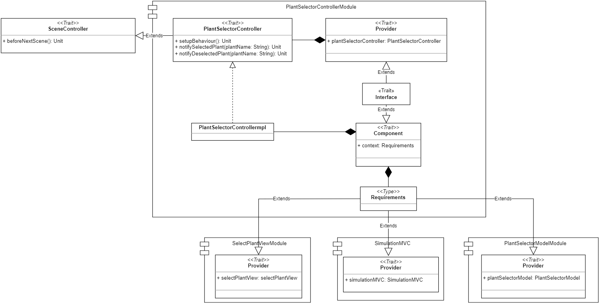
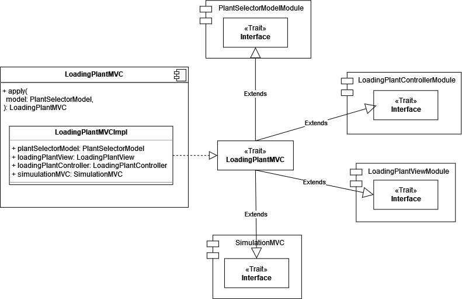

# 4. Design dettagliato
//TODO introduzione capitolo, che cosa verrà inserito, cosa prevede, parlare di Cake Pattern e MVC

## 4.1 Simulazione
//TODO Simulation View Ele, Simulation Controller Vero

//TODO decidere sezioni capitoli
## 4.2 Impostazione dei parametri della simulazione

### 4.2.1 Selezione della città
//TODO Elena

#### 4.2.2.1 Environment
//TODO Maria

### 4.2.2 Selezione delle piante
Per poter realizzare il meccanismo di selezione delle piante si è deciso di adottare, come già detto precedentemente, il _pattern MVC_ e il _Cake pattern_.

In particolare, come si può vedere dalla figura [Fig. 4.2.2.1], la classe `PlantSelectorMVC`, racchiude i componenti: `PlantSelectorModel`, `PlantSelectorController` e `PlantSelectorView` derivanti dai rispettivi moduli. L’adozione di quest’architettura, quindi, non rende più necessaria l’istanziazione di ogni componente e il loro successivo collegamento per risolvere le diverse dipendenze, ma gli elementi del _pattern MVC_ vengono racchiusi all’interno di `PlantSelectorMVC` e possono essere acceduti liberamente.

Per poter utilizzare `PlantSelectorModel`, `PlantSelectorController` o `PlantSelectorView`, basterà semplicemente istanziare `PlantSelectorMVC` e accedere ai suoi elementi. 

  
  
 Fig. 4.2.2.1 - MVC per la selezione delle piante 

[Fig. 4.2.2.1]: img/plant_selector_MVC.png

#### 4.2.2.1 Model per la selezione delle piante

Il Model per la selezione delle piante ([Fig. 4.2.2.1.1]) viene racchiuso all'interno di un modulo chiamato `PlantSelectorModelModule`, nello specifico all'interno del suddetto modulo torviamo:

- il `trait PlantSelectorModel`, il quale espone i diversi metodi che potranno essere richiamati sul Model e che consentono la gestione del meccanismo di selezione delle piante;
- la classe `PlantSelectorModelImpl`, la quale detiene l'implementazione dei metodi dell'interfaccia `PlantSelectorModel` e viene racchiusa all'interno del `trait Component`;
- il `trait Provider`, che detiene l'oggetto `plantSelectorModel` che potrà essere utilizzato dall'MVC;
- il `trait interface`, il quale estende sia il `trait Provider` che il `trait Component` riusciendo così a comprendere tutte le loro proprietà e a sua volta `Interface` verrà poi esteso da `PlantSelectorMVC` che in questo modo potrà utilizzare l'elemento `plantSelectorModel` e accedere alle proprieta del modello.

L'architettura realizzata tramite questi componenti e il loro _mix-in_ costituisce, quindi, il _Cake Pattern_ del Model.

  
  
 Fig. 4.2.2.1.1 - Model per la selezione delle piante 

[Fig. 4.2.2.1.1]: img/plant_selector_model.png

Il Model ha come obiettivo principale quello di mantenre sempre aggiornata la lista delle piante selezionate dall'utente, per fare questo è necessario che il Controller lo informi ogni qual volta l'utente compie un'azione relativa alla selezione delle piante. 

La lista di piante rappresenta un elemento osservabile dal Controller, infatti, ogni qual volta viene aggiunto o rimosso un elemento a questa lista, il Controller viene notificato e si occupa di propagare tale informazione alla View. Il Controller, quindi, richiamando il metodo `registerCallbackPlantSelection` si registra all'`Observable` della lista delle piante e specifica quali sono le azioni che devono essere intraprese quando: una nuova pianta viene selezionata, se viene generato un errore o in caso di completamento dell'emmissione dei dati.

#### 4.2.2.2 View per la selezione delle piante

La View per la selezione delle piante ([Fig. 4.2.2.2.1]), viene racchiusa all'interno del modulo `SelectPlantViewModule` e al suo interno troviamo:

- il `trait SelectPlantView`, che detiene i diversi metodi che potranno essere richiamati sulla View e che si occupano di gestire l'interazione con l'utente. 

  il `trait SelectPlantView` rappresenta anche il Controller dell'FXML, per la relativa schermata di selezione delle piante. Essa implementa sia l'interfaccia  `ViewComponent` che l'interfaccia `ContiguousSceneView`. In particolare, `SelectPlantView`, racchiude il `BorderPane` che contiente i diversi elementi della     scena di selzione delle piante, tale scena viene inserita all'interno della `BaseView` dell'applicazione che contiene gli elementi comuni a tutte le schermate   che vengono sempre riportati; in questo modo, quindi, `SelectPlantView` rappresenta una scena che verrà racchiusa all'interno di un'altra e tutte le scene,     per poter essere visualizzate correttamente e racchiuse all'interno della scena principale, devono implementare l'interfaccia `ViewComponent`. 

  L'interfaccia `ContiguousSceneView`, invece, racchiude i metodi comuni a tutte le views che danno la possibilità all'utente di effettuare uno spostamento a     una schermata successiva;
- la classe `SelectPlantViewImpl`, la quale detiene l'implementazione dei metodi del `trait SelectPlantView` e viene racchiusa all'interno del `trait Component`;
- il `trait Component`, il quale rispetto al Model, contiente un campo `context` di tipo `Requirements`, nello specifico `Requirments` è un  _abstract type_ e viene utilizzato per specificare le dipendenze che legano la View agli altri elementi del _pattern MVC_, infatti la View, per poter funzionare correttamente ha necessita di informare il Controller delle azioni che sono state compiute dall'utente, per fare questo, quindi, ha bisogno del componente Controller e di conseguenza il tipo `Requirements` sarà proprio rappresentato dal `Provider` del Controller;
- il `trait Provider`, che detiene l'oggetto `SelectPlantView` che potrà essere utilizzato dall MVC;
- il `trait Interface`, il quale come per il Model, estende sia il `trait Provider` che il `trait Component`, riuscendo ad ereditare tutte le loro proprietà dando quindi la possibilità a `PlantSelectorMVC`, che lo estende, di poter utilizzare l'elemento `selectPlantView` e accedere alle proprietà della View.

Rispetto all'architettura del Model vista precedentemente, la View presenta l'elemento `Requirements` che viene utilizzato per specificare le dipendenze che vi sono e che devono essere risolte fra View e Controller. Per il _pattern MVC_ infatti, sappiamo che vi sono queste dipendenze: C->V, V->C e C->M e tramite il _Cake Pattern_, una volta realizzati tutti gli elementi di cui si compone, possiamo risolvere automaticamente queste dipendenze ed è proprio questo il suo principale vantaggio.

  
  
 Fig. 4.2.2.2.1 - View per la selezione delle piante 

[Fig. 4.2.2.2.1]: img/select_plant_view.png

La View inizialmente si occuperà di mostrare le piante selezionabili all'utente, ottenendole dal Controller, dopodichè si occuperà di notificare il Controller ogni qual volta l'utente compirà un'azione di selezione o di deselezione e nel caso in cui il Controller li notifichi, il verificarsi di una situazione di errore, si occuperà di mostrare un messaggio di errore all'utente.

#### 4.2.2.3 Controller per la selezione delle piante

Il Controller per la selezione delle piante ([Fig. 4.2.2.3.1]), è stato racchiuso all'interno del modulo `PlantSelectorControllerModule`, al cui interno troviamo:

- il `trait PlantSelectorController`, il quale estende l'interfaccia `SceneController` contenente i metodi comuni a tutti i controllers e detiene i diversi metodi che potranno essere richiamati sul Controller che si occuperà di fungere da intermediario fra View e Model;
- la classe `PlantSelectorControllerImpl`, la quale contiene l'implementazione dei metodi del `trait PlantSelectorController` e viene racchiusa all'interno del `trait Component`;
- il `trait Component`, che come già visto per la View, racchiude l'oggetto `context` di tipo `Requirements` che in questo caso contiene le dipendenze che legano il Controller alla View e il Model e pertanto è realizzato attraverso il `Provider` del Model e della View, in quanto il Controller per poter funzionare correttamente ha la necessità di comunicare con entrambi questi elementi;
- il `trait Interface`, il quale estende sia il `trait Provider` che il `trait Component` ereditando tutte le loro proprietà consentendo a `PlantSelectorMVC`, che lo estende, di poter utilizzare l'elemento `plantSelectorController` racchiuso all'interno di `Provider` e di poter accedere ai suoi metodi.

Una volta, quindi, che tutti gli elementi che costituiscono il _pattern MVC_ sono stati realizzati, `PlantSelectorMVC`, semplicemente estendendo il `trait Interface` di ognuno di loro è in grado di ottenere tutte le loro proprietà e le dipendenze che li legano sono già state risolte al momento della loro creazione, quindi, `PlantSelectorMVC` non si deve preoccupare di questo aspetto, ma può passare direttamente al loro utilizzo.

  
  
 Fig. 4.2.2.3.1 - Controller per la selezione delle piante 

[Fig. 4.2.2.3.1]: img/plant_selector_controller.png

Inizialmente il Controller si occupa di impostare la schermata di selezione delle piante, richiedendo al Model quali siano le piante che possono essere selezionate e alla View, di mostrare tali piante all'utente.

Dopodichè, il compito principale del Controller per la selezione delle piante, consiste nel notificare il Model ogni qual volta l'utente compie un'azione di selezione o deselzione per una specifica pianta e nel caso in cui si verifichi una situazione di errore notificatagli dal Model, richiederà alla View di mostrare all'utente un'apposito messaggio, che lo informi dell'errore rilevato. 

#### 4.2.2.4 Plant
//TODO Vero

## 4.3 Avvio Simulazione
//TODO Ele e Vero

### 4.3.1 Caricamento dei dati

Una volta che l'utente ha provveduto a selezionare le piante che intende coltivare all'interno della serra e ha richiesto l'avvio della simulazione, l'applicazione provvede a raccogliere tutti i dati relativi alle piante, ai loro parametri ottimali e alle condizioni ambientali della città di ubicazione della serra. Tuttavia, per poter raccogliere tutte queste infromazioni, specialmente quelle relative alle piante, l'applicazione impiega un certo tempo, di conseguenza, per mantenere l'interfaccia reattiva e fornire infromazioni all'utente relative alle operazioni che il sistema sta svolgendo in questo momento, si è deciso di inserire un componente intermedio, che mostri il caricamento dei dati.

In particolare, si è deciso di realizzare l'elemento `LoadingPlantMVC`, il quale racchiude i comonenti del _pattern MVC_ dedicati al caricamento dei dati delle piante.

Come si può vedere dalla figura [Fig. 4.3.1.1] anche `LoadingPlantMVC` sfrutta il _cake pattern_ ed estende: il `trait Interface` di `PlantSelectorModelModule`, il `trait Interface` di `LoadingPlantControllerModule` e il `trait Interface` di `LoadingPlantViewModule`. Di conseguenza, risulta che il Model del `LoadingPlantMVC` è lo stesso di `PlantSelectorMVC`, questo perchè è proprio questo Model che detiene le infromazioni relative alle piante selezionate dall'utente e che può essere utilizzato per poter istanziare l'oggetto `Plant`, contenente tutti i dati utili alla gestione delle piante all'interno della serra.

  
  
 Fig. 4.3.1.1 - MVC per il caricamento dei dati delle piante 

[Fig. 4.3.1.1]: img/loading_plant_MVC.png

Per poter accedere agli elementi Model, View e Controller e alle loro proprietà, chi ne avesse bisogno avrà solamente la necessita di istanziare il componente `LoadingPlantMVC` e accedere ai suoi elementi.

 Una volta creato l'elemento MVC inoltre, le dipendenze presente fra i diversi componenti del pattern vengono già risolte automaticamente e l'utilizzatore non si deve preoccupare di questo aspetto, ma può concentrarsi solamente sul loro utilizzo.

Dato che il Model è già stato discusso nella precedente sezione [Sec. 4.2.2.1](#4221-model-per-la-selezione-delle-piante), di seguito verranno discussi solamente i componenti View e Controller per il caricamento dei dati.

#### 4.3.1.1 View per il caricamento dei dati delle piante

La View per il caricamento dei dati delle piante ([Fig. 4.3.1.1.1]) si trova all'interno del modulo `LoadingPlantViewModule` al cui interno troviamo:

- il `trait LoadingPlantView`, che contiene i metodi della View che possono essere richiamati per gestire l'interazione con l'utente. `LoadingPlantView` estende sia l'interfaccia `ViewComponent` che l'interfaccia `ContigusSceneView`, in quanto rappresenta una scena che viene inserita all'interno di quella madre e consente il proseguimento alla scena successiva;
- la classe `LoadingPlantViewImpl`, la quale detiene l'implementazione dei metodi relativi alla View ed è racchiusa all'interno del `trait Component`;
- il `trait Component`, che contiene l'oggetto `context` di tipo `Requirements` che specifica quali siano le dipendenze che devono essere soddisfatte affinchè la View possa lavorare correttamente, in particolare la View per poter funzionare correttamente ha bisogno del Controller, quindi l'elemento `Requirements` sara proprio costituito dal `Provider` del controller, situato all'interno del modulo `LoadingPlantControllerModule`;
- il `trait Provider`, il quale detiene l'oggetto View che potrà essere utilizzato dall'MVC;
- il `trait Interface`, che estende sia l'interfaccia `Provder` che l'interfaccia `Component` e che a sua volta può essere esteso dall'elemento MVC, consentendoli di ereditare le proprietà della View.

`Requirments` è un'_abstract type_ e viene utilizzato per poter definire quali siano i "requisiti" o meglio gli elementi che devono essere realizzati per far si che la View possa essere implementata e funzionare correttamente.

  
  
 Fig. 4.3.1.1.1 - View per il caricamento dei dati delle piante 

[Fig. 4.3.1.1.1]: img/loading_plant_View.png

La View per il caricamento dei dati delle piante, presenta un `ProgressIndicator`, che viene incrementato di volta in volta, a mano a mano che i diversi dati delle piante vengono caricati e i rispettivi oggetti `Plant` vengono istanziati. Una volta che il caricamento dei dati risulta essere completato, si può passare alla schermata successiva.

#### 4.3.1.2 Controller per il caricamento dei dati delle piante

Il Controller per il caricamento dei dati delle piante si trova all'interno del modulo `LoadingPlantControllerModule`, nello specifico all'intenro del suddetto modulo troviamo:

- il `trait LoadingPlantController`, il quale estende l'interfaccia SceneController contenente i metodi comuni a tutti i controllers e detiene i diversi metodi che potranno essere richiamati sul Controller, che si occuperà di fungere da intermediario fra View e Model;
- la classe `LoadingPlantControllerImpl`, che implementa l'interfaccia `LoadingPlantController` ed è racchiusa all'interno del `trait Component`;
- il `trait Component`, il quale oltre a contenere la classe `LoadingPlantControllerImpl`, detiene anche l'oggetto `context`, che viene utilizzato per specificare quali siano gli elementi che devono essere compresi nel Controller, affinchè questi possa funzionare correttamente. 

  Nello specifico, il Controller, necessita sia del Model che della View per svolgere la sua funzione di intermediaro, di conseguenza, l'_abstract type_ `Requirements` sarà proprio costituito dai `Provider` del Model e della View;
- il trait `Provider`, che contiene il campo `plantSelectorController`, che potrà essere utilizzato dall'elemento MVC;
- il trait `Interface`, il quale potrà essere esteso da `LoadingPlantMVC`, per poter ottenere le proprietà del `Controller` e per fare questo però è necessario che `Interface` estenda sia il `trait Provider` che il `trait Component`.

In questo caso, rispetto alla View e al Model, il Controller presenta l'_abstract type_ `Requirements`, che richiede due elementi per poter essere definito, il `Provider` del Model, situato all'interno del modulo `PlantSelectorModelModule` e il `Provider` della View, situato all'interno del modulo `LoadingPlantViewModule`, questo perchè le dipendenze che è necessario risolvere sono: C->V e C->M.

Sia la View che il Controller che il Model, sono stati realizzati tramite il _cake pattern_, dando la possibilità, in questo modo, di definire l'oggetto `LoadingPlantMVC`, in modo tale che contenga tutti gli elementi del _pattern MVC_ e che consenta il loro utilizzo diretto senza doversi preoccupare di risolvere le dipendenze che legano questi componenti, in quanto gia soddisfatte alla creazione degli elementi.

  
  
 Fig. 4.3.1.2.1 - Controller per il caricamento dei dati delle piante 

[Fig. 4.3.1.1.1]: img/loading_plant_Controller.png

Come possibile vedere dalla figura [Fig. 4.3.1.1.1], il `LoadingPlantController` presenta un unico metodo `setupBehaviour`, il quale si occupa di registrare la callback sul Model relativa al caricamento dei dati delle piante. Infatti, all'intenro di questo metodo, viene richiamata la funzione `registerCallbackPlantInfo` di `PlantSelectorModel`, specificando quali sono le azioni che devono essere intraprese quando: viene istanziata una nuova pianta con tutte le relative informazioni, viene prodotto un errore o tutte le piante siano state create e i relativi dati caricati. 

Ne risulta, quindi, che quando verrà prodotta una nuova pianta il Controller richiamerà il metodo `IncrementProgressIndicator` della View e quando invece il caricamento dei dati delle piante risulterà essere completato, il Controller richiederà alla View di passare alla schermata successiva.

### 4.3.2 Ambiente
//TODO Vero

### 4.3.3 Tempo virtuale
//TODO Model Ele, View Vero, Controller Ele e Vero

## 4.4 Serra
//TODO

### 4.4.1 Suddivisione in aree
//TODO Maria

### 4.4.2 Visualizzazione dettaglio aree
//TODO Model Maria, View Ele Controller Maria e Ele

### 4.4.3 Sensori
//TODO Sensor Anna, Luminosità e temperatura Anna, Umidità Ele

## 4.5 Fine simulazione
//TODO Anna
