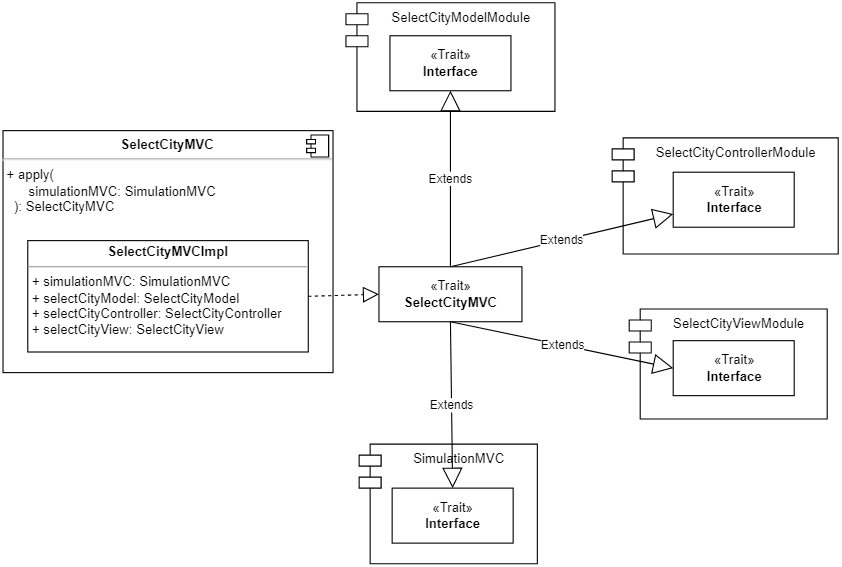
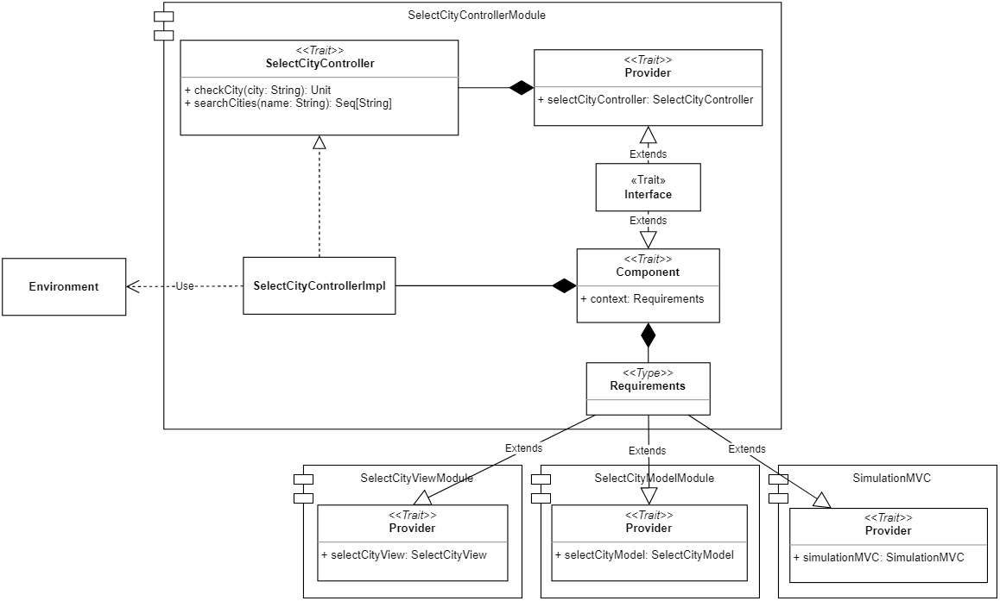
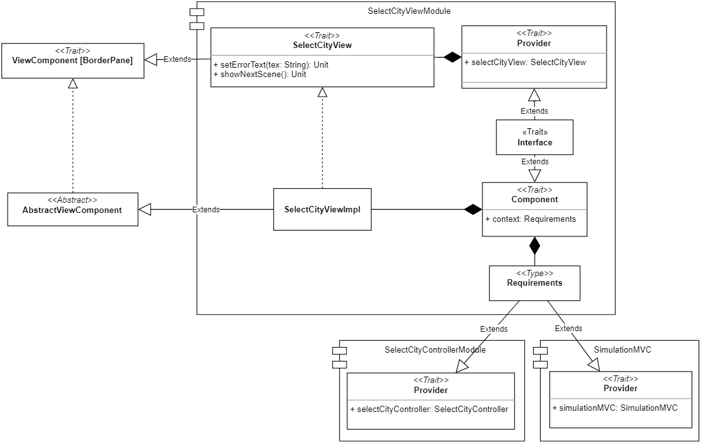
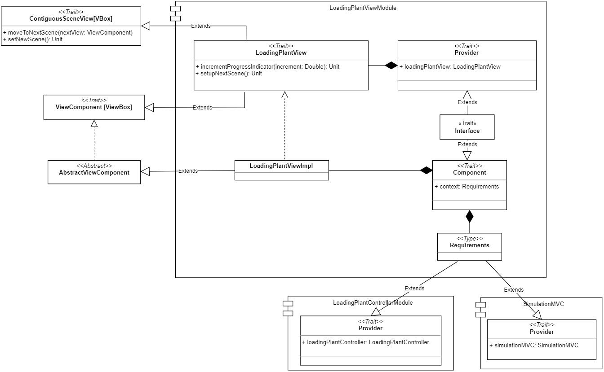
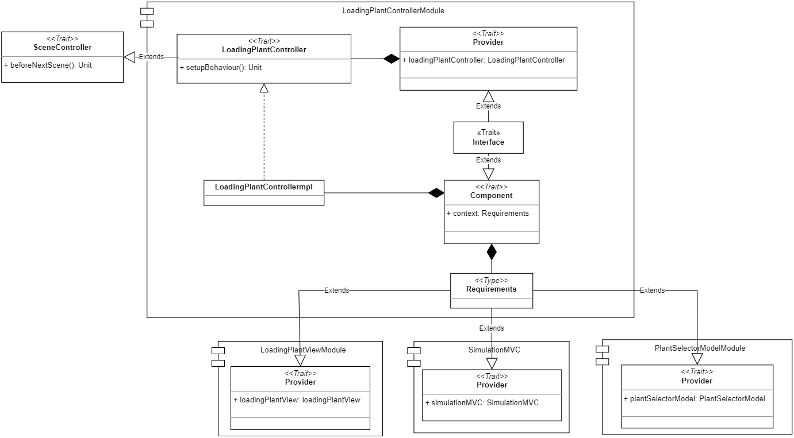
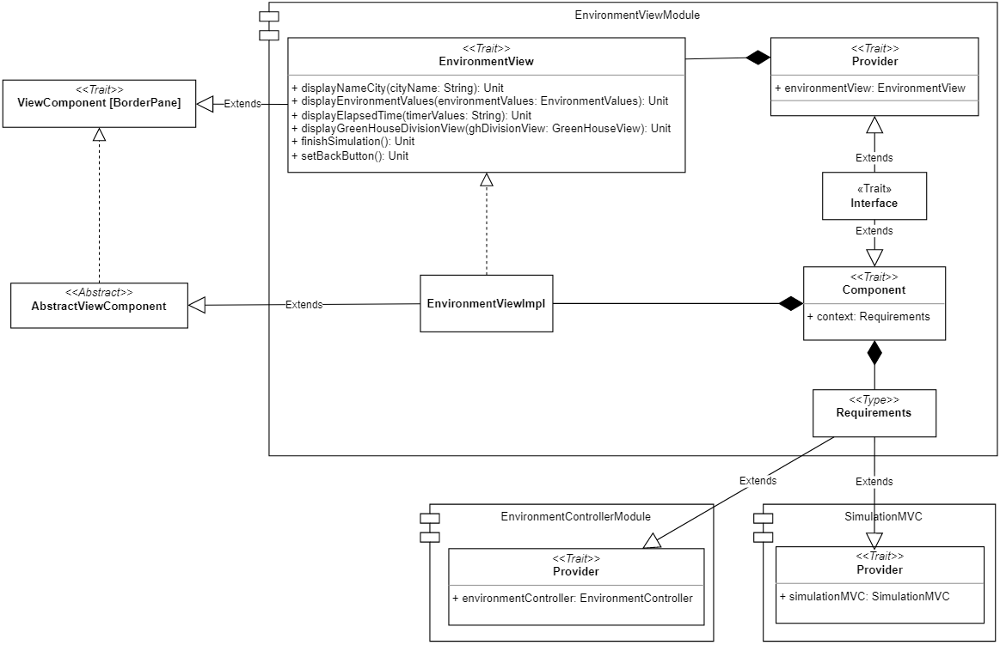
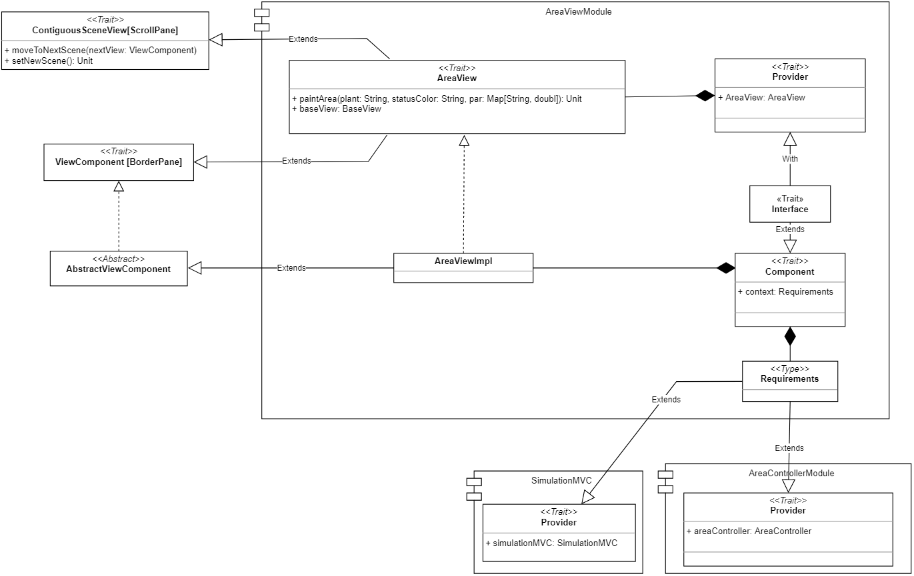
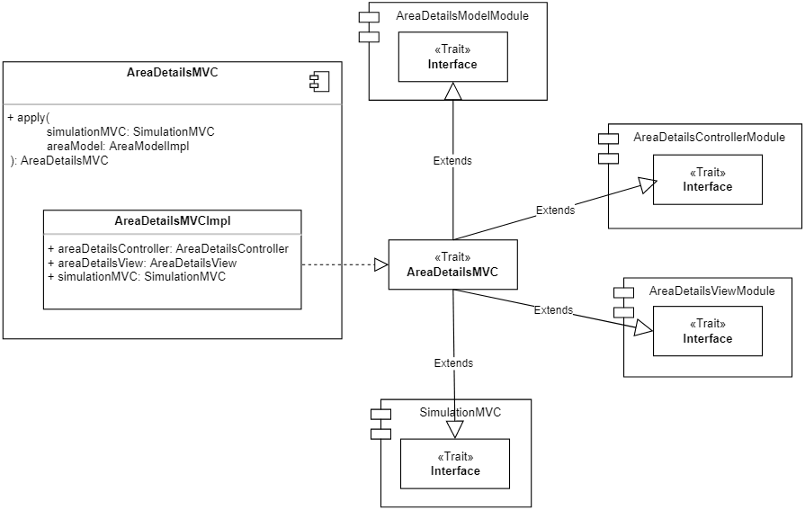

# 4. Design dettagliato
In questo capitolo verrà descritta nel dettaglio l'architettura del sistema, analizzandone i principali componenti e le rispettive caratteristiche.

L'applicazione è costituita da diverse scene, ciascuna delle quali racchiude una propria logica applicativa ed effettua delle elaborazioni a seguito delle azioni compiute dall'utente. Per riuscire a rispettare i requisiti e realizzare un sistema che fosse sufficientemente modulare, facilmente estendibile e quanto più possibile riutilizzabile e manutenibile, si è deciso di utilizzare il _Pattern MVC_ in combinazione al _Cake pattern_.

Tramite il _Pattern MVC_, come già descritto nella sezione [Sec. 3.2](#32-pattern-architetturali-utilizzati), abbiamo la possibilità di separare la logica di presentazione dei dati da quella di business, realizzando una View del tutto indipendente dal modello. In questo modo, se in un futuro si decidesse di adottare una tecnologia diversa da _ScalaFX_ per l'implementazione della View, si potrebbe tranquillamente intraprendere questo cambiamento, senza dover modificare il Model associato alle diverse schermate.

Il _Cake pattern_, invece, ci dá la possibilità di risolvere in modo agevole le dipendenze che legano gli elementi dell'_MVC_ tramite l'utilizzo di meccanismi della programmazione funzionale come: _mix-in_, _self-type_, _type members_, ecc... 

Questa strategia, sostanzialmente, prevede di implementare il _pattern MVC_ come una composizione di tre elementi: Model (M), View (V) e Controller (C), i quali presentano le seguenti dipendenze: C->V, V->C e C->M. 
Più precisamente, possiamo realizzare questi tre elementi incapsulando già al loro interno la risoluzione delle dipendenze precedentemente citate: alla fine, potremo istanziare un oggetto _MVC_ che li detiene tutti e tre e che è in grado di di accedere alle rispettive proprietà, senza doversi preoccupare del loro collegamento.

Gli elementi Model, View e Controller vengono racchiusi in moduli, composti da:
- un `trait` (`Model`, `View` o `Controller`), il quale definisce l'interfaccia del rispettivo elemento;
-	una classe `ModelImpl`, `ViewImpl` o `ControllerImpl`, che rappresenta l'implementazione dell’interfaccia;
- un `trait Component`, il quale racchiude la classe implementativa. Tale trait assume forme differenti in base al modulo nel quale è racchiuso:
  - nel caso del Model si compone esclusivamente della classe implementativa [Fig. 4.1];
  - nel caso della View contiene il campo `context` di tipo `Requirements`, il quale viene utilizzato per specificare le dipendenze che legano la View al Controller [Fig. 4.2];
  - nel caso del Controller contiene sempre il capo `context` di tipo `Requirements` che viene, però, utilizzato per specificare le dipendenze che legano il Controller al Model e alla View [Fig. 4.3];
- un `trait Provider` che si occupa di detenere il rispettivo oggetto  di tipo `View`, `Model` o `Controller`;
- un `trait Interface` che si occupa di completare e connettere tutti i componenti del modulo per renderli utilizzabili nell'oggetto _MVC_.

  
  
 Fig. 4.1 - Model module 

[Fig. 4.1]: img/cake_model.png

  
  
 Fig. 4.2 - View module 

[Fig. 4.2]: img/cake_view.png

  
  
 Fig. 4.3 - Controller module 

[Fig. 4.3]: img/cake_controller.png

Tutti gli elementi principali dell'applicazione, che richiedono di eseguire operazioni o di elaborare informazioni e fornire risultati a seguito delle azioni compiute dall'utente, sono state realizzate seguendo questa strategia e nelle seguenti sezioni verranno descritti con maggiore dettaglio.

## 4.1 View e Controller: elementi comuni

I componenti, descritti nelle successive sottosezioni, fattorizzano elementi comuni del codice e permettono di evitarne la ripetizione.

### ViewComponent
`ViewComponent` è un’interfaccia generica che rappresenta un componente della View e, come si può vedere dalla figura (vedi [Fig. 4.1.1]), richiede che il tipo generico `A` sia sottotipo di `Parent`, ossia la classe base dei nodi con figli di _JavaFX_. 

Per l’implementazione di `ViewComponent` si è rispettato il pattern _Template Method_, definendo una classe astratta `AbstractViewComponent` dove è contenuto il template dei componenti. In tale classe viene incapsulata la logica necessaria per il caricamento dei layout e per la loro inizializzazione, lasciando alle sottoclassi la definizione del rispettivo componente interno associato al file _FXML_.

Tutte le View estenderanno da tale classe, in modo da creare componenti modulari ed evitare ripetizioni del codice nell’inizializzazione dei layout.

  
  
 Fig. 4.1.1 - View Component 

[Fig. 4.1.1]: img/view_component.png

### ContiguousSceneView
`ContiguousSceneView` (vedi [Fig. 4.1.2]) è un’interfaccia generica che risulta utile per definire un componente della View che ha la necessità di richiedere al proprio Controller di effettuare operazioni particolari prima di notificare la View principale di visualizzare la nuova scena.

Tale interfaccia richiede che il nuovo elemento View da impostare sia di un tipo generico `A` sottotipo di `Parent`, ossia la classe base dei nodi con figli di _JavaFX_. 

  
  
 Fig. 4.1.2 - ContiguousSceneView 

[Fig. 4.1.2]: img/contiguousSceneView.png

### SceneController
Gli elementi comuni ai diversi Controller sono stati racchiusi all'interno dell'interfaccia `SceneController` (vedi [Fig. 4.1.3]), contenente il metodo `beforeNextScene` che si occupa di eseguire le operazioni che devono essere effettuate prima di poter cambiare scena.

  
  
 Fig. 4.1.3 - SceneController

[Fig. 4.1.3]: img/scene_controller.png

## 4.2 Gestione della simulazione

La struttura articolata dell'applicazione ha introdotto la necessità di sviluppare un elemento che coordinasse i vari componenti Model, View e Controller, collocandosi ad un livello superiore. Nella sezione seguente si discuterà il design di tale elemento.

### SimulationMVC
`SimulationMVC` (vedi [Fig. 4.2.1]) rappresenta l’elemento _MVC_ principale della simulazione. Ad alto livello, questo componente si colloca al di sopra di tutti gli altri in quanto permette di:
-	mantenere aggiornati i vari componenti della simulazione in base allo scorrere del tempo;
-	detenere i riferimenti ad istanze inizializzate da altri componenti, al fine di poter essere accedute da coloro che ne necessitano;
-	inizializzare e modificare la schermata visualizzata in ogni momento dell’esecuzione dell’applicazione.

L'`Interface` di  `SimulationMVC` sarà estesa dalla maggiorparte dei componenti MVC del progetto.

In particolare, la classe `SimulationMVC` racchiude i sottocomponenti `SimulationView` e `SimulationController`, derivanti dai rispettivi moduli. Come si può vedere dalla rappresentazione, `SimulationMVC` non racchiude un componente di tipo Model in quanto questo aspetto viene gestito da altri componenti _MVC_.

  
  
 Fig. 4.2.1 - SimulationMVC 

[Fig. 4.2.1]: img/simulationMVC.png

### View della simulazione

Il `SimulationViewModule` (vedi [Fig. 4.2.2]) rappresenta la View principale dell'applicazione e si occupa di gestire: la scena, le _sotto-view_ e gli elementi comuni alle interfacce. 

Al suo interno troviamo il `trait SimulationView`, il quale include i metodi utili per l’avvio dell’applicazione, per gestire gli elementi comuni delle schermate e per passare da una _sotto-view_ all’altra.

Quando l'applicazione viene lanciata, viene creato prima di tutto il componente base dell’applicazione, rappresentato dall'elemento `BaseView`. 
Quest'ultimo è il componente che funge da contenitore delle _sotto-view_, che racchiude gli elementi comuni a tutte le pagine e che fornisce i metodi per gestirli.

  
  
 Fig. 4.2.2 - SimulationViewModule 

[Fig. 4.2.2]: img/simulation_view.png

### Controller della simulazione

Il controller della simulazione (vedi [Fig. 4.2.3]) è stato racchiuso nel `SimulationControllerModule` che si compone, in particolare, del trait `SimulationController`, il quale espone:
  - campi dove verranno salvate l’istanza `Environment` della località e le istanze `Plant` delle piante selezionate dall’utente;
  - metodi per gestire il tempo virtuale della simulazione, che richiamano il `TimeModel`;
  - metodi per notificare l’`EnvironmentController`, di cui detiene il riferimento, di un cambiamento del `timeValue` e dello scoccare di una nuova ora, al fine di aggiornare la rispettiva View;
  - metodo per sottoscrive _callback_ da eseguire quando vi è un nuovo valore del `Timer` disponibile (es: `AreaDetailsController` richiede l’aggiornamento del timer visualizzato all’interno delle aree).

  
  
 Fig. 4.2.3 - SimulationController 

[Fig. 4.2.3]: img/simulationController.png

## 4.3 Impostazione dei parametri della simulazione

Uno dei requisiti dell'applicazione è quello di permettere all'utente di personalizzare la simulazione (vedi requisito n°1 in sezione [Sec. 2.2](#22-requisiti-utente)), impostando:
- la località di ubicazione della serra;
- le tipologie di piante da coltivare all'interno di essa.

Al fine di soddisfare queste funzionalità, sono stati sviluppati i seguenti elementi dell'architettura.

### 4.3.1 Selezione della città
La prima schermata che viene presentata all’utente è quella per la selezione della città, nella quale verranno mostrate una serie di località selezionabili, permettendo di effettuare una ricerca con auto-completamento del testo.

Considerando che la realizzazione di questa funzionalità richiede sia una View che un Model con cui ottenere i dati delle città, si è deciso di seguire il _Pattern MVC_ e il _Cake pattern_, realizzando l’elemento `SelectCityMVC` con i rispettivi sotto moduli `SelectCityModelModule`, `SelectCityControllerModule`, `SelectCityViewModule`.

  
  
 Fig. 4.3.1.1 - MVC per la selezione della città 

[Fig. 4.3.1.1]: img/select_city_MVC.png

#### Model per la selezione della città

Il Model per la selezione della città viene racchiuso all'interno del modulo `SelectCityModelModule`, costituito, in particolare, dal `trait SelectCityModel` che espone i diversi metodi utili per effettuare la ricerca delle città e per la verifica.

  
  
 Fig. 4.3.1.2 - Model per la selezione della città 

[Fig. 4.3.1.2]: img/select_city_model.png

#### Controller per la selezione della città

Il Controller per la selezione della città è racchiuso all’interno del modulo `SelectCityControllerModule` (vedi [Fig. 4.3.1.3]) e comprende il `trait SelectCityController`, il quale rappresenta l’interfaccia del Controller ed espone dei metodi per rispondere alle esigenze della View per interagire con il Model.

Nello specifico, il Controller presenta metodi per:
- effettuare la ricerca della città,
- controllare se la città selezionata dall'utente è corretta o meno. Nel caso non fosse valida, verrà richiamata la View per gestire il caso; altrimenti si procederà alla creazione dell’oggetto `Environment`, che verrà poi salvato nel componente superiore `SimulationMVC`.

  
  
 Fig. 4.3.1.3 - Controller per la selezione della città 

[Fig. 4.3.1.3]: img/select_city_controller.png

#### Environment

 `Environment` (vedi [Fig. 4.3.1.4]) è la componente del sistema che rappresenta l'ubicazione della serra.  Il suo scopo è quello di, una volta selezionata la città, reperire le previsioni meteorologiche previste per la giornata in cui si svolge la simulazione. 
 
 Le informazioni così ottenute vengono poi messe a disposizione dell'applicazione al fine di aggiornare i parametri ambientali durante tutto lo svolgimento della stessa. I parametri ambientali influenzeranno i parametri rilevati all'interno di ogni area, secondo le formule implementate in ogni sensore.

  
  
 Fig. 4.3.1.4 - Architettura del componente Environment 

[Fig. 4.3.1.4]: img/environment.png

#### View per la selezione delle città

La View per la selezione delle città viene racchiusa nel modulo `SelectCityViewModule` (vedi [Fig. 4.3.1.5]). 

Al suo interno troviamo il `trait SelectCityView`, il quale rappresenta l’interfaccia della View e detiene metodi che possono essere richiamati sulla stessa. Tale interfaccia espone un metodo per settare il messaggio di errore da mostrare all’utente e un metodo per passare alla scena successiva. 

La classe `SelectCityViewImpl`, invece, è l'implementazione dell’interfaccia, e rappresenta anche il Controller dell’_FXML_ associato. Infatti, estendendo da `AbstractViewComponent`, contiene già la logica necessaria al caricamento del file.

  
  
 Fig. 4.3.1.5 - View per la selezione della città 

[Fig. 4.3.1.5]: img/select_city_view.png

### 4.3.2 Selezione delle piante

Per poter realizzare il meccanismo di selezione delle piante si è deciso di adottare, come già detto precedentemente, il _Pattern MVC_ e il _Cake pattern_.

In particolare, come si può vedere dalla figura [Fig. 4.3.2.1], `PlantSelectorMVC` racchiude i componenti `plantSelectorModel`, `plantSelectorController` e `selectPlantView`, derivanti dai rispettivi moduli. 

  
  
 Fig. 4.3.2.1 - MVC per la selezione delle piante 

[Fig. 4.3.2.1]: img/plant_selector_MVC.png

#### Model per la selezione delle piante

Il Model per la selezione delle piante (vedi [Fig. 4.3.2.2]) viene racchiuso all'interno di un modulo chiamato `PlantSelectorModelModule`, nello specifico all'interno del suddetto modulo troviamo il `trait PlantSelectorModel`, il quale espone i diversi metodi che potranno essere richiamati sul Model e che consentono la gestione del meccanismo di selezione delle piante.

  
  
 Fig. 4.3.2.2 - Model per la selezione delle piante 

[Fig. 4.3.2.2]: img/plant_selector_model.png

Il Model ha come obiettivo principale quello di mantenere sempre aggiornata la lista delle piante selezionate dall'utente. Per fare questo, è necessario che il Controller lo informi ogni qual volta l'utente compia un'azione relativa alla selezione delle piante. 

La lista di piante rappresenta un elemento osservabile dal Controller: infatti, ogni qual volta viene aggiunto o rimosso un elemento a questa lista, il Controller viene notificato e si occupa di propagare tale informazione alla View. Il Controller, richiamando il metodo `registerCallbackPlantSelection`, si registra all'`Observable` della lista delle piante e specifica quali siano le azioni che devono essere intraprese quando: 
- una nuova pianta viene selezionata;
- viene generato un errore;
- viene completata l'emmissione dei dati.

Infine, il Model, una volta che l'utente di dare il via alla simulazione, si occupa di istanziare gli oggetti `Plant`, rappresentanti le piante scelte e contenenti tutte le diverse informazioni utili per la loro gestione.

#### View per la selezione delle piante

La View per la selezione delle piante (vedi [Fig. 4.3.2.3]) viene racchiusa all'interno del modulo `SelectPlantViewModule` in cui possiamo trovare il `trait SelectPlantView`, che detiene i diversi metodi che potranno essere richiamati sulla View e che si occupano di gestire l'interazione con l'utente. 

Tale trait rappresenta il Controller dell'_FXML_ per la rispettiva schermata ed, inoltre, implementa le interfacce  `ViewComponent` e `ContiguousSceneView`. 

  
  
 Fig. 4.3.2.3 - View per la selezione delle piante 

[Fig. 4.3.2.3]: img/select_plant_view.png

La View per la selezione delle piante, inizialmente, si occuperà di mostrare le piante selezionabili dall'utente, ottenendole dal Controller; dopodichè, si occuperà di notificare il Controller ogni qual volta l'utente compirà un'azione di selezione o di deselezione. Nel caso in cui il Controller notifichi un errore, la View si occuperà di mostrare un messaggio all'utente.

#### Controller per la selezione delle piante

Il Controller per la selezione delle piante (vedi [Fig. 4.3.2.4]) è stato racchiuso all'interno del modulo `PlantSelectorControllerModule`, al cui interno troviamo il `trait PlantSelectorController`. 

Tale trait estende l'interfaccia `SceneController`, contenente i metodi comuni a tutti i Controller, e detiene i diversi metodi che potranno essere richiamati per la gestione della selezione delle piante.

Si sottolinea come il Controller, per poter svolgere correttamente le sue funzioni, necessiti di accedere alle proprietà di `SimulationMVC`.

  
  
 Fig. 4.3.2.4 - Controller per la selezione delle piante 

[Fig. 4.3.2.4]: img/plant_selector_controller.png

Inizialmente, il Controller si occupa di impostare la schermata di selezione delle piante richiedendo al Model la lista di piante selezionabili e alla View di mostrarle all'utente.

Dopodichè, il suo compito principale consiste nel notificare il Model ogni qual volta l'utente compia un'azione di selezione o deselezione per una specifica pianta e, nel caso in cui si verifichi una situazione di errore, nel richiedere alla View di mostrare all'utente un apposito messaggio.

#### Plant

Il trait `Plant` (vedi [Fig. 4.3.2.5]) espone dei metodi per ottenere le informazioni principali rispetto alle piante selezionate dall’utente: queste verranno visualizzate all’interno delle aree e verranno utilizzate per monitorare i parametri vitali delle stesse. 

Il companion object `Plant` permette di creare un'istanza della pianta che verrà salvata all’interno del `SimulationController`, col fine di renderla accessibile ai componenti del sistema che necessitano delle informazioni relative alle piante scelte.

  
  
 Fig. 4.3.2.5 - Architettura del componente Plant 

[Fig. 4.3.2.5]: img/plant.png

## 4.4 Caricamento dei dati delle piante

Una volta che l'utente ha provveduto a selezionare le piante che intende coltivare all'interno della serra e ha richiesto l'avvio della simulazione, l'applicazione provvede a raccogliere tutti i dati relativi alle piante e ai loro parametri ottimali.

Per poter raccogliere tali informazioni, l'applicazione impiega un certo tempo: di conseguenza, per mantenere l'interfaccia reattiva e fornire all'utente informazioni relative ai compiti che il sistema sta svolgendo in tale istante, si è deciso di inserire un componente intermedio che mostri il caricamento dei dati.

A tal proposito, è stato realizzato l'elemento `LoadingPlantMVC`, il quale racchiude i componenti del _Pattern MVC_ dedicati al caricamento dei dati delle piante (vedi [Fig. 4.4.1]): `PlantSelectorModelModule`, `LoadingPlantControllerModule` e `LoadingPlantViewModule`. 
Di conseguenza, risulta che il Model del `LoadingPlantMVC` è lo stesso di `PlantSelectorMVC` in quanto detiene già le informazioni relative alle piante selezionate dall'utente e può essere utilizzato per istanziare l'oggetto `Plant`.

  
  
 Fig. 4.4.1 - MVC per il caricamento dei dati delle piante 

[Fig. 4.4.1]: img/loading_plant_MVC.png

Dato che il Model è già stato discusso nel precedente [paragrafo](#model-per-la-selezione-delle-piante), di seguito verranno discussi solamente i componenti View e Controller per il caricamento dei dati.

#### View per il caricamento dei dati delle piante

La View per il caricamento dei dati delle piante (vedi [Fig. 4.4.2]) si trova all'interno del modulo `LoadingPlantViewModule` al cui interno troviamo il `trait LoadingPlantView`, che contiene i metodi della View che possono essere richiamati per gestire l'interazione con l'utente. 

`LoadingPlantView` estende sia l'interfaccia `ViewComponent` che l'interfaccia `ContigusSceneView`, in quanto rappresenta una scena che viene inserita all'interno di quella madre e consente il proseguimento alla scena successiva. Inoltre, la View per poter svolgere le proprie funzioni necessita anche di accedere alle proprietà di `SimulationMVC` e, di conseguenza, anche il `Provider` di `SimulationMVC` contribuisce alla definizione di `Requirements`.

  
  
 Fig. 4.4.2 - View per il caricamento dei dati delle piante 

[Fig. 4.4.2]: img/loading_plant_view.png

Questa View presenta un `ProgressIndicator` che viene incrementato di volta in volta, a mano a mano che i diversi dati delle piante vengono caricati e i rispettivi oggetti `Plant` vengono istanziati. Una volta che il caricamento dei dati risulta essere completato, si può passare alla schermata successiva.

#### Controller per il caricamento dei dati delle piante

Il Controller per il caricamento dei dati delle piante si trova all'interno del modulo `LoadingPlantControllerModule` e, nello specifico, all'interno del suddetto modulo troviamo il `trait LoadingPlantController`, il quale estende l'interfaccia `SceneController` e detiene i diversi metodi che potranno essere richiamati per svolgere le funzioni intermediarie fra View e Model.

Inoltre, per poter funzionare correttamente, necessita di accedere alle proprietà di `SimulationMVC` e, di conseguenza, anche il `Provider` di `SimulationMVC` contribuisce alla definizione di `Requirements`.

  
  
Fig. 4.4.3 - Controller per il caricamento dei dati delle piante 

[Fig. 4.4.3]: img/loading_plant_controller.png

Come possibile vedere dalla figura [Fig. 4.4.3], il `LoadingPlantController` presenta un unico metodo `setupBehaviour`, il quale si occupa di registrare la _callback_ sul Model relativa al caricamento dei dati delle piante. Difatti, all'interno di questo metodo viene richiamata la funzione `registerCallbackPlantInfo` di `PlantSelectorModel` in cui viene specificato quali siano le azioni da intraprendere quando: 
- viene istanziata una nuova pianta; 
- viene prodotto un errore;
- tutte le piante sono state create e i relativi dati caricati. 

Ne risulta che quando verrà prodotta una nuova pianta il Controller richiamerà il metodo `incrementProgressIndicator` della View e che, quando il caricamento dei dati delle piante risulterà essere completato, il Controller richiederà alla View di passare alla schermata successiva.

## 4.5 Avvio Simulazione

Una volta che l’utente ha personalizzato i parametri della simulazione e sono state caricate le informazioni relative alle piante, viene avviata la simulazione e, in particolare, vengono inizializzati gli elementi utili alla visualizzazione dello stato globale della serra, delle variazioni ambientali esterne e dello scorrere del tempo.

In particolare, in questa sezione verranno discussi gli elementi architetturali che soddisfano il requisito utente n°2 (vedi [Sec. 2.2](#22-requisiti-utente)).

### 4.5.1 Variazioni ambientali

Per poter realizzare la visualizzazione delle variazioni ambientali esterne nell’arco della giornata si è introdotto l’elemento `EnvironmentMVC` (vedi [Fig. 4.5.1.1]), sviluppato mediante il _Cake Pattern_, che racchiude i componenti Model, View e Controller responsabili dell’aggiornamento dei valori ambientali.

  
  
 Fig. 4.5.1.1 - Architettura di EnvironmentMVC 

[Fig. 4.5.1.1]: img/environmentMVC.png

#### Model per l'aggiornamento dei valori ambientali

Il Model viene racchiuso nel `EnvironmentModelModule` (vedi [Fig. 4.5.1.2]), al cui interno troviamo il trait `EnvironmentModel`, che espone metodi per:
  - ottenere tutti i valori ambientali aggiornati, da mostrare nell’interfaccia utente;
  - ottenere i singoli valori ambientali aggiornati per ogni tipologia di sensore che verrà installato all’interno delle aree;
  - notificare il Model di aggiornare i valori ambientali correnti, secondo l’ora segnalata dal `SimulationController` che gestisce l’interazione con il `TimeModel`.

  
  
 Fig. 4.5.1.2 - Architettura di EnvironmentModel 

[Fig. 4.5.1.2]: img/environmentModelModule.png

#### View per l'aggiornamento dei valori ambientali

La View viene racchiusa nel `EnvironmentViewModule` (vedi [Fig. 4.5.1.3]), al cui interno troviamo il trait `EnvironmentView`, che espone i metodi per:
  - visualizzare il nome della città selezionata;
  - visualizzare i valori ambientali aggiornati;
  - visualizzare il tempo virtuale aggiornato;
  - visualizzare lo stato globale della serra, quindi la sua suddivisione in aree;
  - richiedere alla view principale di cambiare scena al concludersi della simulazione;
  - settare lo stile e la behaviour del pulsante comune a tutte le View, rispettando il layout stabilito nei mockup dell’applicazione.

Tale trait estende `ViewComponent` in quanto rappresenta una scena inserita all’interno di quella madre.

Invece, l’oggetto `context` di tipo `Requirements` specifica quali siano le dipendenze che devono essere soddisfatte affinchè la View possa lavorare correttamente. Nello specifico, ha bisogno dell’`EnvironmentController` per notificarlo delle interazioni dell’utente (es: modifica della velocità della simulazione), e del `SimulationMVC` per accedere al suo elemento View e notificarlo di passare ad una nuova scena (es: scena di fine simulazione) oppure di modificare lo stile di un elemento grafico comune (es: pulsante comune a tutte le View).

  
  
 Fig. 4.5.1.3 - Architettura di EnvironmentView 

[Fig. 4.5.1.3]: img/environmentViewModule.png

#### Controller per l'aggiornamento dei valori ambientali

Il Controller è racchiuso all’interno del modulo `EnvironmentControllerModule` (vedi [Fig. 4.5.1.4]), al cui interno troviamo il trait `EnvironmentController`, che espone i metodi per:
  - richiedere al `SimulationController` di inizializzare il componente che gestisce il tempo virtuale;
  - richiedere al `SimulationController` di stoppare il tempo virtuale;
  - richiedere al Model di aggiornare i valori ambientali e alla View di visualizzarli, oltre a notificare i sensori della modifica avvenuta;
  - notificare il `SimulationController` della modifica, da parte dell’utente, della velocità della simulazione;
  - notificare la View della conclusione della simulazione, allo scadere del tempo;
  - recuperare l’elemento View associato ad esso;
  - ripristinare la visualizzazione dello stato globale della simulazione quando si esce dalla visualizzazione del dettaglio di un’area.

L’oggetto `context` di tipo `Requirements` specifica quali siano le dipendenze che devono essere soddisfatte affinchè il controller possa lavorare correttamente (es: `EnvironmentView` per richiedere la visualizzazione del tempo trascorso, `EnvironmentModel` per richiedere l’aggiornamento dei valori ambientali, `SimulationMVC` per controllare la componente tempo).

  
  
 Fig. 4.5.1.4 - Architettura di EnvironmentController 

[Fig. 4.5.1.4]: img/environmentControllerModule.png

### 4.5.2 Tempo virtuale

`TimeModel` (vedi [Fig. 4.5.2.1]) è un trait che espone metodi per gestire il tempo virtuale della simulazione, il quale è modellato, a sua volta, dal trait `Timer`. 

`TimeModel` e `Timer` rappresentano anche due companion object che racchiudono l’implementazione delle rispettive interfacce e possono essere utilizzati per inizializzarne un’istanza.

In particolare, il Model si occupa di avviare e stoppare il `Timer`, oltre che di modificarne la velocità: queste operazioni vengono richiamate dal `SimulationController`, a seguito di feedback ricevuti dall’`EnvironmentMVC`.

All’avvio del `Timer`, il `TimeModel` ha il compito di specificare i task da eseguire ad ogni _tick_ e al concludersi del tempo stabilito per la simulazione. A questo scopo, il Model detiene un riferimento al `SimulationController` che utilizzerà per notificarlo del valore `timeValue` aggiornato, dello scoccare di una nuova ora (al fine di aggiornare i `currentEnvironmentValues`) e dell’esaurimento del tempo della simulazione.

  
  
 Fig. 4.5.2.1 - Architettura per la gestione del tempo virtuale 

[Fig. 4.5.2.1]: img/time.png

## 4.6 Serra

In questa sezione vengono descritti i componenti necessari a soddisfare i seguenti requisiti utente (vedi requisiti n° 3,4,5,6 in sezione [Sec. 2.2](#22-requisiti-utente)):
- osservare lo stato globale della serra;
- osservare lo stato all'interno di una specifica area;
- compiere operazioni per la cura ordinaria delle coltivazioni all'interno delle singole aree, le quali potranno essere messe in atto anche per far fronte alle diverse situazioni di allarme;
- in caso di allarme, visualizzare i suggerimenti rispetto alle azioni da compiere per ristabilire lo stato dell'area.

### 4.6.1 Suddivisione in aree

Per poter realizzare la suddivisione in aree si è deciso di adottare, come detto precedentemente, il _Pattern MVC_ e il _Cake pattern_.

In particolare, come si può vedere nella figura [Fig. 4.6.1.1], la classe `GreenHouseMVC` racchiude i  componenti: `GreenHouseModel`, `GreenHouseController` e `GreenHouseView` derivanti dai rispettivi moduli.

Tale classe verrà istanziata all'interno dell'`EnvironmentController` e si occuperà di creare gli _MVC_ delle singole aree, assegnando ad ognuno di esse una pianta tra quelle selezionate dall'utente.

  
  
 Fig. 4.6.1.1 - MVC per la suddivisione in aree 

[Fig. 4.6.1.1]: img/greenhouseDivisionMVC.png

#### Model per la suddivisione in aree

Il Model viene racchiuso nel suo rispettivo modulo `GHModelModule` (vedi [Fig. 4.6.1.2]), al cui interno troviamo il `trait GreenHouseModel` che espone il metodo per ottenere la lista dei componenti _MVC_ delle singole aree che compongono la serra (`areas`, vedi [sezione](#aree)).

Il Model, quindi, ha l'obiettivo di memorizzare la lista dei singoli _MVC_ di cui è composta la serra.

  
  
  Fig. 4.6.1.2 - Model per la suddivisione in aree 

[Fig. 4.6.1.2]: img/greenhouseDivision_model.png

#### View per la suddivisione in aree

La View viene racchiusa nel modulo `GHViewodule` (vedi [Fig. 4.6.1.3]), al cui interno troviamo il `trait GHDivisionView`, che definisce i metodi che possono essere richiamati sulla View e, nello specifico, quello per richiedere di ripulire e disegnare lo spazio di interfaccia relativa alla visualizzazione della composizione della serra. 

Questa interfaccia rappresenta inoltre il Controller dell'_FXML_ per la relativa sezione: infatti, bisogna ricordare che la `ghDivisionView` è racchiusa all'interno della più ampia View che è `EnvironmentView`. 

Inoltre, per poter essere inserita all'interno della scena principale come le altre View, il trait implementa `ViewComponent`.

La View ha come ruolo principale quello di mostrare e mantenere aggiornata la suddivisione della serra in aree. Questo obiettivo viene raggiunto mediante il metodo `printDivision`. Quest'ultimo verrà richiamato sia all'avvio della schermata dell'`EnvironmentMVC` che ad ogni intervallo di tempo (per aggiornare i valori rilevati all'interno delle aree o quando lo stato di un'area cambia e passa da NORMALE ad ALLARME).

  
  
  Fig. 4.6.1.3 - View per la suddivisione in aree 

[Fig. 4.6.1.3]: img/greenhouseDivision_view.png

#### Controller per la suddivisione in aree

Il Controller viene racchiuso all'interno del modulo `GHControllerModule` (vedi [Fig. 4.6.1.4]), il quale include il `trait GreenHouseController`, che definisce i metodi che possono essere richiamati sul Controller per:
  - richiedere l'aggiornamento della View;
  - stoppare l'aggiornamento periodico e ad eventi della View.

Il compito principale del Controller è quello di richiedere l'aggiornamento della View affinchè questa mostri lo stato delle aree e i rispettivi valori rilevati all'interno.

  
  
  Fig. 4.6.1.4 - Controller per la suddivisione in aree 

[Fig. 4.6.1.4]: img/greenhouseDivision_controller.png

#### Aree

Per realizzare le singole aree che compongono la serra si è deciso di implementare ancora una volta il _Pattern MVC_ e il _Cake pattern_.

In particolare, come si può vedere nella [Fig. 4.6.1.5] , la classe `AreaMVC` racchiude i  componenti: `AreaModel`, `AreaController` e `AreaView` derivanti dai rispettivi moduli; inoltre, racchiude all'interno del proprio contesto l'istanza corrente del `SimulationMVC` in modo tale che questa sia accessibile sia dalla View che dal Controller.

Tale classe verrà istanziata durante il setup della divisione della serra e memorizzata all'interno del `greenHouseModel`.

  
  
  Fig. 4.6.1.5 - Rappresentazione MVC di un'area 

[Fig. 4.6.1.5]: img/areaMVC.png

**Model della singola area**

Il Model viene racchiuso nel rispettivo modulo `AreaModelModule` ([Fig. 4.6.1.6]), al cui interno troviamo il `trait AreaModel` che espone i diversi metodi che potranno essere richiamati sul Model per:
  - aggiornare e ottenere lo stato dell'area;
  - ottenere le informazioni della pianta contenuta nell'area;
  - tutti i metodi necessari a memorizzare le azioni effettuate dagli utenti sui sensori.

Il Model dell'area ha come principale obiettivo quello di memorizzare lo stato dell'area e le operazioni effettuate dagli utenti sui singoli sensori. Per raggiungere questo obiettivo, si appoggia sulle classi `ManageSensor` e  `AreaSensorHelper` che si occuperanno di memorizzare e gestire i singoli sensori, e sull'oggetto `AreaComponentState`, il quale memorizza le operazioni effettuate dall'utente.

Il Model, come si può intuire, risulta essere condiviso con l'_MVC_ del dettaglio dell'area in quanto è necessario poter ricondurre le operazioni dell'utente all'area su cui le ha effettuate.

  
  
  Fig. 4.6.1.6 - Model dell'area 

[Fig. 4.6.1.6]: img/area_model.png

**View della singola area**

La View viene racchiusa nel modulo `AreaViewModule` ([Fig. 4.6.1.7]), al cui interno troviamo il `trait AreaView`, che definisce i metodi che possono essere richiamati sulla View per richiedere il disegno dell'area.

Questa interfaccia rappresenta, inoltre, il Controller dell'_FXML_ per la relativa sezione: infatti, bisogna ricordare che la `AreaView` è racchiusa all'interno della più ampia View che è `GHDivisionView`.

Questo trait, come gli altri, per poter essere inseriti all'interno della scena principale, implementa `ViewComponent `. Oltre a ciò, implementa anche `ContiguousSceneView` per permettere di passare alla scena incaricata di mostrare il dettaglio dell'area.

La View ha come ruolo principale quello di mostrare lo stato di un'area, il nome della pianta e i valori dei parametri rilevati all'interno di essa; inoltre, dà la possibiltà all'utente di accedere al dettaglio dell'area selezionata.

  
  
  Fig. 4.6.1.7 - View dell'area 

[Fig. 4.6.1.7]: img/area_model.png

**Controller della singola area**

Il Controller viene racchiuso all'interno del modulo `AreaControllerModule` (vedi [Fig. 4.6.1.8]), il quale include il `trait AreaController` che definisce i metodi che possono essere richiamati sul Controller per richiamare il disegno dell'area.

Il trait estende `SceneController`, necessario per poter accedere alla scena che mostra il dettaglio dell'area.

Il compito principale del Controller è quello di richiamare la creazione dell'interfaccia grafica delegata alla View affinchè questa mostri lo stato delle aree e i rispettivi valori rilevati al loro interno, oltre a gestire il cambio di scena da quella generale a quella specifica della singola area.

  
  
  Fig. 4.6.1.8 - Controller dell'area 

[Fig. 4.6.1.8]: img/area_controller.png

## 4.7 Visualizzazione del dettaglio di un'area

### 4.7.1 Dettaglio di un'area 

Per realizzare il dettaglio delle aree si è deciso di implementare ancora una volta il _Pattern MVC_ e il _Cake pattern_.

In particolare, come si può vedere nella [Fig. 4.7.1.1], la classe `AreaDetailsMVC` racchiude i  componenti: `AreasModel`, `AreaDetailsController` e `AreaDetailsView` derivanti dai rispettivi moduli.

Tale classe verrà istanziata nel momento in cui un utente decide di visionare il dettaglio di un'area, scelta tra quelle che compongono la serra. 

  
  
  Fig. 4.7.1.1 - Rappresentazione MVC del dettaglio di un'area 

[Fig. 4.7.1.1]: img/areaDetailsMVC.png

#### Model del dettaglio area

Come si può vedere nella [Fig. 4.7.1.1], il Model è lo stesso implementato per le singole aree poichè risulta necessario che vengano memorizzate le operazioni effettuate dull'utente. In questo modo sarà possibile aggiornare, con una determinata frequenza, il valore rilevato dai sensori. 

Per questo motivo si rimanda alla [Sec. Aree](#aree) per i dettagli.

Il Model in questione risulterà essere condiviso anche con gli _MVC_ che gestiscono la parte visuale dei sensori presenti all'interno delle aree ([Sec. Area parameter](#472-parametri-dellarea)).

#### View del dettaglio di un'area

La View del dettaglio di un'area viene racchiusa nell’`AreaDetailsViewModule`, come raffigurato nella figura [Fig. 4.7.1.2].

Oltre agli elementi necessari al _Cake pattern_, all’interno troviamo il `trait AreaDetailsView`, il quale estende da `ViewComponent` e anche da `ContiguousSceneView` in quanto richiede delle operazioni specifiche prima di passare alla scena successiva, come verrà descritto nel paragrafo successivo sul modulo del controller. Inoltre, espone metodi per consentire l’aggiornamento delle informazioni della View relative:
  - alle piante (nome della pianta, descrizione e immagine); 
  - al tempo virtuale;
  - allo stato dell’area;
  - ai messaggi di aiuto all’utente in caso di allarme.

  
  
  Fig. 4.7.1.2 - View del dettaglio di un'area 

[Fig. 4.7.1.2]: img/area_details_view.png

#### Controller del dettaglio area

Il Controller viene racchiuso all'interno del modulo `AreaDetailsControllerModule` ([Fig. 4.7.1.3]), il quale include il `trait AreaDetailsController` che definisce i metodi che possono essere richiamati sul Controller ed, in particolare, quello per inizializzare la View. 

Il trait estende `SceneController`, necessario per poter ritornare alla schermata principale dell'applicazione e per terminare l'aggiornamento delle informazioni alla View.

Il compito principale del Controller è quello di richiamare la creazione dell'interfaccia grafica rappresentante il dettaglio dell'area. Per assolvere a tale compito il Controller provvede, mediante la classe di utility `AreaSensorHelper`, alla creazione degli _MVC_ incaricati della gestione dei sensori presenti all'interno dell'area e specificatamente:
- `AreaAirHumidityMVC`, che gestisce le azioni riguardo al sensore che rileva l'umidità dell'aria all'interno dell'area;
- `AreaLuminosityMVC`, che gestisce le azioni riguardo al sensore che rileva la luminosità dell'area;
- `AreaTemperatureMVC`, che gestisce le azioni riguardo al sensore che rileva la temperatura dell'area;
- `AreaSoilMoistureMVC`, che gestisce le azioni riguardo al sensore che rileva l'umidità del suolo dell'area.

  
  
  Fig. 4.7.1.3 - Controller del dettaglio di un'area 

[Fig. 4.7.1.3]: img/area_details_controller.png

### 4.7.2 Parametri dell'area

Con l’obiettivo di rendere l’applicazione modulare e scalabile all'aggiunta di nuovi sensori, si è deciso di separare il componente per la gestione del dettaglio di un’area dalla visualizzazione dei valori ottenuti dai sensori e le rispettive azioni che possono essere compiute.

Ciascun componente è rappresentato da un modulo _MVC_ separato, composto da una propria View e un proprio Controller. Il Model rimane quello implementato per le singole aree e per il dettaglio dell’area descritto nella [Sec. Aree](#aree).

I comportamenti dei vari parametri sono stati raccolti in interfacce comuni: 
-	`AreaParameterMVC`, per i componenti _MVC_;
-	`AreaParameterView`, per i componenti View;
-	`AreaParameterController`, per i componenti Controller.

#### MVC dei parametri

Il trait `AreaParameterMVC`, come mostrato in figura [Fig. 4.7.2.1], rappresenta l’interfaccia generale dei componenti _MVC_ dei parametri. In particolare, contiene tre campi che sono necessari alla composizione dell’elemento: 
-	`areaModel`, ossia il model associato alla singola area;
-	`areaParameterView`, ossia la view associata al parametro;
-	`areaParameterController`, ossia il controller associato al parametro.

  
  
  Fig. 4.7.2.1 - Trait MVC dei parametri 

[Fig. 4.7.2.1]: img/area_parameter_mvc.png

**View dei parametri**

Il `trait AreaParameterView` (vedi [Fig. 4.7.2.2]) espone i metodi che consentono l’aggiornamento del valore corrente e la descrizione del parametro. 

Di tale interfaccia è stata poi definita una classe astratta `AbstractAreaParameterView` che implementa i metodi comuni dei parametri. Dato l'utilizzo del _template method_, lascia la definizione delle variabili `descriptionLabel` e `currentValueLabel`, ovvero le _label_ dedicate alla descrizione e al valore corrente, alle sottoclassi che la estendono. La classe astratta si occuperà di aggiornare queste informazioni, incapsulandone la logica.

  
  
  Fig. 4.7.2.2 - Trait view dei parametri 

[Fig. 4.7.2.2]: img/area_parameter_view.png

**Controller dei parametri**

Il `trait AreaParameterController` fornisce metodi per l’inizializzazione 
e l'interruzione dell’aggiornamento dei parametri della View.

Come è possibile vedere nella figura [Fig. 4.7.2.3], anche per questa interfaccia è presente una classe astratta `AbstractAreaParameterController`, utile a  fattorizzare le parti in comune ai parametri. Seguendo anche qui il _template method_, abbiamo che i metodi da implementare nelle sotto-classi sono:
-	`updateCurrentValue`, ossia la funzione che si occupa di aggiornare il valore corrente e il suo stato;
-	`updateDescription`, ossia la funzione che si occupa di aggiornare la descrizione del parametro.

  
  
  Fig. 4.7.2.3 - Trait controller dei parametri 

[Fig. 4.7.2.3]: img/area_parameter_controller.png

**Singoli parametri**

Come formulato nei requisiti, l'applicazione prevede di avere quattro sensori che permettono di rilevare in ogni area i seguenti parametri: luminosità, temperatura, umidità del suolo e dell'aria. 

Ognuno di questi è realizzato seguendo il _Cake pattern_, implementando le interfacce comuni ed estendendo le relative classi astratte descritte precedentemente.

Il compito principale di questi componenti è quello di definire le azioni che possono essere svolte all'interno dell'area e che andranno ad influenzare il valore del rispettivo parametro. 

In particolare, la View si occuperà di gestire gli elementi grafici delle azioni mentre, il Controller, di gestire il loro comportamento e il cambiamento dello stato del Model.

Nello specifico, abbiamo i seguenti componenti:
- `AreaLuminosityView` e `AreaLuminosityController` che si occupano di gestire le azioni per la schermatura dell'area e per la regolazione dell'intensità della luce;
- `AreaTemperatureView` e `AreaTemperatureController` che si occupano di gestire le azioni per isolare l'area e regolare la temperatura;
- `AreaAirHumidityView` e `AreaAirHumidityController` che si occupano di gestire l'attivazione e la disattivazione del nebulizzatore e del ventilatore;
- `AreaLuminosityView` e `AreaLuminosityController` che si occupano di gestire le azioni per innaffiare e per smuovere il terreno.

## 4.8 Sensori

Come detto precedentemente, ogni area è monitorata da dei sensori. Per il progetto non ne sono stati utilizzati dei veri e propri ma bensì simulati ed emulati tramite software.

In particolare, il codice dei sensori rientra nel package `model` del progetto in quanto essi possono essere sfruttati dai diversi componenti Model dell'applicazione, racchiudendo la logica di aggiornamento e notifica dei nuovi valori rilevati.

  
  
Fig. 4.8.1 - Interfaccie Sensor e SensorWithTimer 

[Fig. 4.8.1]: img/sensor.png

Prima di tutto, per poter realizzare i sensori si è deciso di analizzare quali siano gli aspetti comuni che questi presentano e di raccoglierli all'interno di un interfaccia comune. 

Il `trait Sensor` ([Fig. 4.8.1]) rappresenta proprio l'interfaccia che assolve a questo scopo e al suo interno troviamo la dichiarazione dei metodi:
- `setObserverEnvironmentValue`, il quale si occupa di registrare l'`Observer` del sensore interessato a ricevere aggiornamenti rispetto al parametro ambientale di riferimento. Ad esempio, al sensore della luminosità interesserà sapere ogni qual volta viene emesso un nuovo dato relativo al parametro _lux_, al fine di aggiornare il proprio valore. 
- `setObserverActionArea`. Difatti, il valore rilevato da un sensore non dipende solamente dal parametro ambientale di riferimento, ma può essere influenzato anche dalle azioni correttive che vengono compiute dall'utente. Di conseguenza, per poter ricevere notifica di ogni nuova azione, il sensore registra un `observer` sul relativo `observable` dello stato dell'area. Il sensore si occuperà di analizzare l'azione che è stata compiuta e, nel caso in cui questa influenzi il parametro monitorato, aggiusterà il valore rilevato e lo emetterà.
- `onNextAction`, ossia il metodo che racchiude i compiti che devono essere svolti ogni qual volta l'utente compie una nuova azione nell'area monitorata.
- `onNextEnvironmentValue`, ossia il metodo al cui interno vengono specificate le azioni che devono essere intraprese ogni qual volta viene emesso un nuovo valore per il parametro ambientale di riferimento.

Una volta racchiusi gli aspetti comuni dei sensori all'interno dell'interfaccia `Sensor`, ci si è interrogati su come l'aggiornamento e l'emissione dei valori rilevati dai sensori dovesse avvenire.
Si è giunti alla conclusione che esistono due tipologie di sensori: quelli che effettuano un'aggiornamento periodico del valore rilevato, rappresentati dall'interfaccia `SensorWithTimer`, e quelli che cambiano il valore rilevato istantaneamente, al verificarsi di determinate condizioni.

L'interfaccia `SensorWithTimer` estende l'interfaccia `Sensor` e, di conseguenza è un suo sottotipo. Rispetto al sensore normale, effettua l'aggiornamento del parametro rilevato periodicamente, emettendo di volta in volta un nuovo valore. 

A tal fine, `SensorWithTimer` richiede l'implementazione di un unico metodo `registerTimerCallback`, il quale consente al sensore di specificare al timer della simulazione il tempo virtuale che deve trascorrere tra un aggiornamento e l'altro.

Ogni qual volta il sensore riceve l'evento dal timer, che lo informa del fatto che il tempo specificato è trascorso, esso si occuperà di rilevare il nuovo valore e di emetterlo sul flusso dell'`Observable` dedicato, in modo tale da informare l'area del nuovo parametro rilevato.

Le classi `Sensor` e `SensorWithTimer` vengono inizialmente implementate dalle classi astratte `AbstractSensor` e `AbstractSensorWithTimer`. Conseguentemente, viene lasciato alle classi dei sensori solamente l'implemendatione del metodo ` protected computeNextSensorValue`. Questa implementazione utilizza, quindi, il pattern _template method_ in quanto le classi astratte rappresentano il template dei sensori e il metodo `computeNextSensorValue` contiene il comportamento che le sottoclassi devono implementare.

### 4.8.1 Sensore per la luminosità

  
  
Fig. 4.8.1.1 - Sensore della luminosità

[Fig. 4.8.1.1]: img/sensor_luminosity.png

Il sensore della luminosità (vedi [Fig. 4.8.1.1]) non è un sensore periodico: difatti, esso implementa solamente l'interfaccia `Sensor` ed estende la classe astratta `AbstractSensor`, la quale racchiude già l'implementazione di alcuni metodi dell'interfaccia.

Il sensore della luminosità, quindi, è un sensore istantaneo: non appena ha luogo un cambiamento della luminosità esterna o viene compiuta un'azione da parte dell'utente, il sensore cambierà subito il suo valore, senza aspettare un aggiornamento periodico, in quanto la velocità con cui la luce cambia all'interno di un ambiente è molto rapida rispetto a quella che può essere la velocità di aggiornamento della temperatura. Ad esempio, se immaginassimo di trovarci in una stanza buia in cui vi è una temperatura più bassa rispetto a quella esterna e decidessimo di aprire la finestra, la luce entrerà subito mentre la temperatura interna impiegherà diverso tempo per alzarsi.

Per poter calcolare correttamente il valore della luminosità, bisogna tenere conto delle azioni che l'utente può compiere, come: 

- **l'apertura o chiusura delle porte dell'area**. In particolare, se le porte della serra sono chiuse la luce presente all'interno dell'area sarà leggermente minore rispetto a quella esterna in quanto le pareti della serra la filtreranno; se, invece, le porte della serra sono aperte, la luce dell'ambiente non verrà filtrata ed entrerà completamente.
- **la regolazione dell'intensità delle lampade** per cui l'utente ha la possibilità di regolare la luminosità delle lampade, poste all'interno dell'area. La luce prodotta dalle lampade, sommata alla luminosità dell'ambiente, contribuisocono alla determinazione del valore rilevato dal sensore.

Per poter determinare il valore del parametro rilevato rispetto all'attuale stato dell'area, è stato definito l'oggetto `FactoryFunctionsLuminosity` (vedi [Fig. 4.8.1.1]), il quale rappresenta una _factory_ di funzioni che possono essere utilizzate per determinare il nuovo valore rilevato dal sensore. 

Ogni qual volta l'utente compie una nuova azione o viene rilevato un nuovo parametro ambientale, a seconda dello stato in cui si trovano i componenti della serra, si richiama la funzione della _factory_ corrispondente, in modo da determinare il nuovo valore rilevato.

Nello specifico, abbiamo detto nella precedente sezione [4.8](#48-sensori) che ogni sensore presenta due `Observer`: uno che viene notificato ogni qual volta un nuovo valore ambientale viene rilevato e l'altro che viene notificato ogni qual volta l'utente compie una nuova aizone sull'area. Quando uno di questi due eventi si verifica, il sensore controlla lo stato attuale dei componenti dell'area e, successivamente, sceglie la funzione da applicare per calcolare il nuovo valore; infine, emette questo nuovo valore sul flusso dell'`Observable`.

### 4.8.2 Sensore per la temperatura

Il sensore della temperatura è un sensore dotato di timer, pertanto si occupa di aggiornare periodicamente il valore rilevato. 

Come si può vedere dalla figura [Fig. 4.8.2.1], il sensore implementa l'interfaccia `SensorWithTimer` tramite la classe astratta `AbstractSensorWithTimer`. 

  
  
Fig. 4.8.2.1 - Sensore della temperatura

[Fig. 4.8.2.1]: img/sensor_temperature.png

L'utente, che regola la temperatura interna dell'area, influisce sulle rilevazioni del parametro, ma anche l'apertura o la chiusura delle porte dell'area possono influenzarne il valore.

In particolare, nel caso in cui le porte dell'area fossero aperte, la temperatura verrà completamente influenzata da quella esterna e il valore rilevato dal sensore si aviccineraà periodicamente a quello ambientale. Quando, invece, le porte dell'area sono chiuse, la temperatura verrà completamente influenzata da quella interna regolata dall'utente e le rilevazioni effettuate dal sensore si avvicineranno periodicamente a questo valore, fino a quando non lo avranno raggiunto.

Per poter calcolare le rilevazioni del sensore della temperatura, è stato realizzato l'oggetto `FactoryFunctionsTemperature`, il quale rappresenta una _factory_ di funzioni che possono essere applicate per poter calcolare il nuovo valore della temperatura.

Più precisamente, il sensore della temperatura effettua un aggiornamento del valore rilevato:
- ogni qual volta l'utente compie una nuova azione che influenza il parametro;
- nel caso in cui venga rilevato un nuovo valore della temperatura esterna; - nel caso in cui il timer abbia emesso l'evento che indica al sensore di effettuare una nuova rilevazione.

### 4.8.3 Sensore per l'umiditià dell'aria

Il sensore della l’umidità dell’aria è un sensore in grado di aggiornare periodicamente il valore rilevato.

Come rappresentato nella figura [Fig. 4.8.3.1], il sensore implementa l’interfaccia `SensorWithTimer`, estendendo la classe astratta `AbstractSensorWithTimer`.

  
  
Fig. 4.8.3.1 - Sensore per l'umidità dell'aria

[Fig. 4.8.3.1]: img/sensor_air_humidity.png

Se le porte dell'area sono aperte, i valori rilevati dal sensore si avvicineranno periodicamente a quello ambientale; se, invece, le porte dell’area sono chiuse, il valore dell’umidità sarà inferiore a quello ambientale.

Le azioni che può intraprendere l’utente per regolare l'umidità sono: 
- attivare la ventilazione dell’ambiente per diminuirne il valore; 
- attivare il sistema di nebulizzazione, il quale ne aumenterà il valore.

Anche qui, è stato realizzato un oggetto _factory_, chiamato `FactoryFunctionsAirHumidity`, per selezionare la funzione da applicare al valore in base allo stato dell'area. 

Il sensore procederà al calcolo del nuovo valore ogni qual volta:
- l'utente compia una azione che regola tale parametro;
- venga aggiornato il valore dell'umidità esterna;
- il timer abbia emesso un evento.

### 4.8.4 Sensore per l'umidità del suolo

Il sensore dell’umidità del suolo estende da `AbstractSensorWithTimer`, che detiene già al suo interno i metodi necessari all’aggiornamento periodico dei valori (vedi [Fig. 4.8.4.1]).

  
  
Fig. 4.8.4.1 - Sensore per l'umidità del suolo

[Fig. 4.8.4.1]: img/sensor_soil_humidity.png

Se nella località di ubicazione della serra sta piovendo e se le porte dell'area sono aperte, il valore del sensore sarà influenzato dalla quantità di precipitazioni; se, invece, non sta piovendo oppure se le porte dell'area sono chiuse, il valore diminuirà mano a mano che passa il tempo in quanto l’acqua tende ad evaporare.

L’utente, per regolare l'umidità del suolo, potrà:
- innaffiare, aumentando il valore del parametro;
- smuovere il terreno per diminuirne il valore. 

Queste azioni sono istantanee, ovvero il valore dell’umidità viene aggiornato immediatamente a seguito dell'azione intrapresa.

Per quanto riguarda le funzioni da applicare al calcolo del nuovo valore, è stato utilizzato l’oggetto _factory_ `FactoryFunctionsSoilHumidity`. 

## 4.9 Fine simulazione

Nel caso in cui l'utente decida di fermare la simulazione in anticipo o nel caso in cui il tempo virtuale sia interamente trascorso, egli verrà reinderizzatto alla schermata di fine simulazione in cui gli verrà data la possibilità di iniziarne una nuova.

Gli elementi grafici della schermata di fine simulazione sono contenuti all'interno del rispettivo file _FXML_ e `FinishSimulationView` ne rappresenta il Controller.

  
  
Fig. 4.9.1 - View fine simulazione

[Fig. 4.9.1]: img/finish_simulation_view.png

Come si può vedere dalla figura [Fig. 4.9.1], per poter realizzare la View di fine simulazione è stata definita l'interfaccia `FinishSimulationView`, la quale estende l'interfaccia `ViewComponent`, dichiarando che il pannello principale, contenente tutti i diversi elementi di questa scena, è un `BorderPane`. 

La scena di fine simulazione, quindi, verrà mostrata all'interno della scena madre e, grazie alle relazione che vi sono fra i diversi elementi dell'architettura, `FinishSimulationView` è in grado di accedere alle proprietà di `SimulationView` per specificare quale dovrà essere l'azione che dove essere compiuta nel caso in cui l'utente clicchi sul pulsante "_Start a new simulation_". In tal caso, verrà istanziato di nuovo l'elemento `SelectCityMVC` e l'applicazione riprenderà dalla schermata di selezione della città.

## 4.10 Pattern utilizzati

Per la realizzazione di questo progetto sono stati adoperati i pattern creazionali e comportamentali descritti nelle seguenti sottosezioni.

### Factory

Il _pattern Factory_ è un pattern creazionale che ci dà la possibilità di creare degli oggetti senza dover specificare la loro classe e ci consente di cambiare in modo abbastanza agevole l'oggetto creato. 

Le _factories_, come dice il nome, rappresentano delle vere e proprie "fabbirche di oggetti" che possiamo utilizzare per istanziare gli oggetti di cui abbiamo bisogno e con determinate caratteristiche.

All'interno del progetto si è fatto utilizzo, in particolare, del pattern _StaticFactory_, per produrre le funzioni necessarie a calcolare l'aggiornamento dei parametri rilevati dai sensori. 

Nella programmazione funzionale, infatti, è possibile specificare dei metodi che abbiano come tipo di ritorno delle funzioni, come le _factories_ che restituiscono la funzione da applicare.

### Singleton

Per lo sviluppo del progetto si è fatto largo uso di questo pattern creazionale, il quale garantisce che di una determinata classe venga creata una sola istanza, fornendo un punto di accesso globale ad essa.

In Scala è particolarmente semplice implementare tale pattern in quanto gli _object_ sono classi con esattamente una istanza che viene inizializzata in modo _lazy_ (su richiesta) quando ci riferiamo ad essa: prima di ciò, nessuna istanza dell’_object_ sarà presente nello _heap_.

### Template method

Il pattern _Template Method_ è un pattern comportamentale basato sulle classi. Permette di catturare il _template_ dell’algoritmo attraverso dei metodi astratti che verranno poi implementati nelle sottoclassi. Grazie a questo pattern, è possibile fattorizzare in una classe la parte invariante di un algoritmo e di lasciare alle sottoclassi il compito di implementare il comportamento che può variare, favorendo un maggiore riuso del codice.

Questo pattern è stato utilizzato all’interno del progetto per definire le seguenti classi astratte:
- `AbstractViewComponent` che rappresenta i componenti della View;
- `AbstractSensor`, utilizzato per la definizione dei sensori;
- `AbstractParameterView` e `AbstractParameterController` per i componenti View e Controller dei parametri nel dettaglio dell’area.

### Strategy

All'interno del progetto è stato ampiamente utilizzato il _pattern Strategy_, ossia l'incapapsulamento di un algoritmo all'interno di una classe, permettendo di mantenere un'interfaccia generica.

Questo pattern è direttamente supportato nel linguaggio mediante il passaggio di funzioni _higher-order_, facendo sì che le classi che lo utilizzano rendano dinamico il proprio comportamento e utilizzino in modo intercambiabile le diverse implementazioni degli algoritmi definiti nell'interfaccia generica.

## 4.11 Organizzazione del codice

Il sistema è stato organizzato in 5 package principali: 
- **mvc**, che contiene gli oggetti _MVC_ relativi ai componenti principali della simulazione precedentemente descritti;
- **prolog**, che contiene un oggetto necessario all'interazione fra il linguaggio _Scala_ e _Prolog_;
- **controller**, che contiene gli elementi Controller necessari a gestire le interazioni fra i componenti View e Model;
- **model**, che contiene gli elementi Model che racchiudono la logica di business dell'applicazione;
- **view**, che contiene gli elementi View che detengono le componenti delle diverse interfacce grafiche e gestiscono le interazioni con l'utente.

  
  
Fig. 4.11.1 - Organizzazione dei package del progetto

[Fig. 4.11.1]: img/package.png
