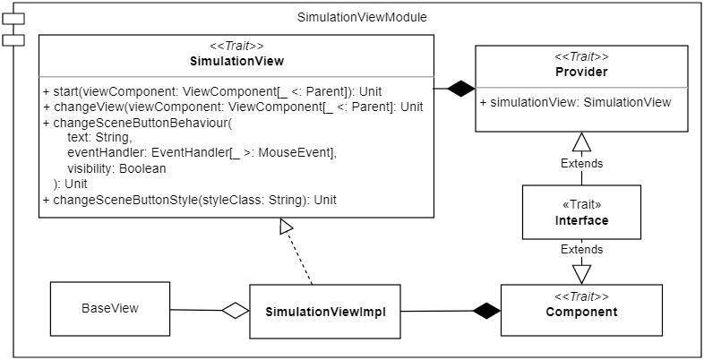
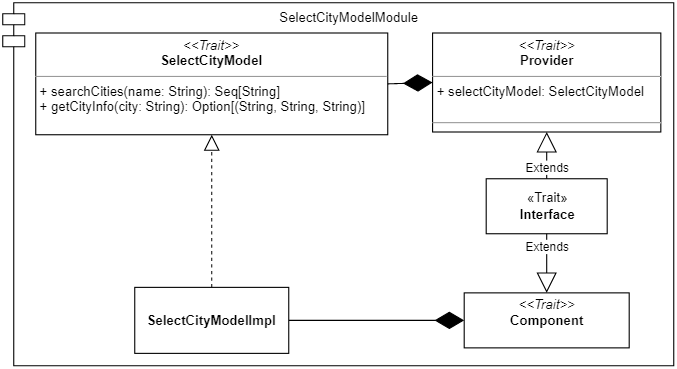
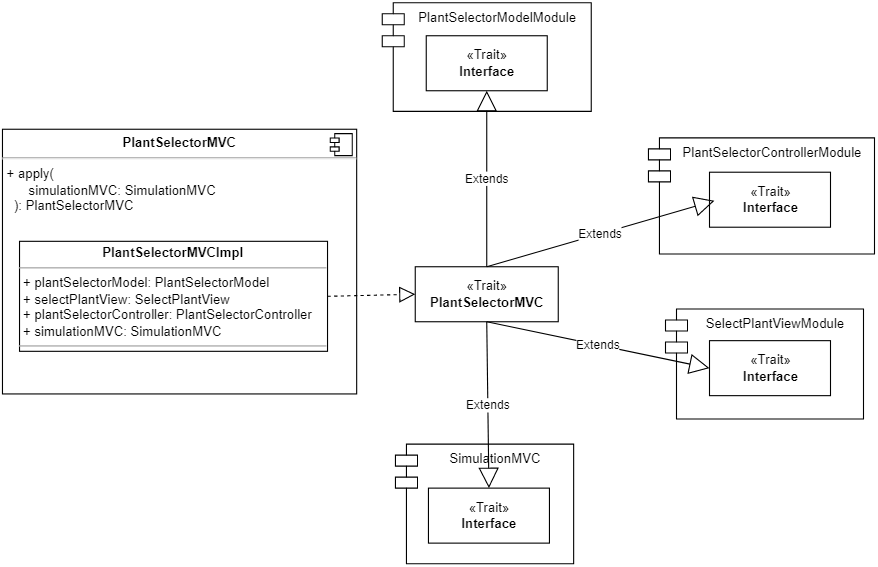
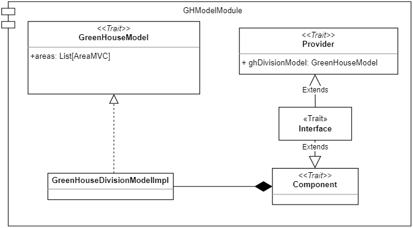

# 4. Design dettagliato
In questo capitolo verrà descritta nel dettaglio l'architettura del sistema, analizzandone i diversi componenti principali e le loro caratteristiche.

L'applicazione è costituita da diverse scene, ciascuna delle quali racchiude una propria logica applicativa ed effettua delle elaborazioni a seguito delle azioni compiute dall'utente. Per riuscire a rispettare i requisiti e realizzare un sistema che fosse sufficientemente modulare, facilmente estendibile e quanto più possibile riutilizzabile e manutenibile, si è deciso di utilizzare il _Pattern MVC_ in combinazione al _Cake pattern_.

Tramite il _Pattern MVC_, come già descritto nella sezione [Sec. 3.2](#32-pattern-architetturali-utilizzati), abbiamo la possibilità di separare la logica di presentazione dei dati da quella di business, realizzando una View del tutto indipendente dal modello. In questo modo, se in un futuro si decidesse di adottare una tecnologia diversa da _ScalaFX_ per l'implementazione della View, si potrebbe tranquillamente intraprendere questo cambiamento, senza dover modificare il Model associato alle diverse schermate.

Il _Cake pattern_, invece, ci dá la possibilità di risolvere in modo agevole le dipendenze che legano gli elementi dell'_MVC_ tramite l'utilizzo di meccanismi della programmazione funzionale come: _mix-in_, _self-type_, _type members_, ecc... 

Questa strategia, sostanzialmente, prevede di implementare il _pattern MVC_ come una composizione di tre elementi: Model (M), View (V) e Controller (C), i quali presentano le seguenti dipendenze: C->V, V->C e C->M. 
Più precisamente, possiamo realizzare questi tre elementi incapsulando già al loro interno la risoluzione delle dipendenze precedentemente citate: alla fine, potremo istanziare un oggetto _MVC_ che li detiene tutti e tre e che è in grado di di accedere alle rispettive proprietà, senza doversi preoccupare del loro collegamento.

Gli elementi Model, View e Controller vengono racchiusi in moduli, composti da:
- un `trait` (`Model`, `View` o `Controller`), il quale definisce l'interfaccia del rispettivo elemento;
-	una classe `ModelImpl`, `ViewImpl` o `ControllerImpl`, che rappresenta l'implementazione dell’interfaccia;
- un `trait Component`, il quale racchiude la classe implementativa. Tale trait assume forme differenti in base al modulo nel quale è racchiuso:
  - nel caso del Model si compone esclusivamente della classe implementativa [Fig. 4.1];
  - nel caso della View contiene il campo `context` di tipo `Requirements`, il quale viene utilizzato per specificare le dipendenze che legano la View al Controller [Fig. 4.2];
  - nel caso del Controller contiene sempre il capo `context` di tipo `Requirements` che viene, però, utilizzato per specificare le dipendenze che legano il Controller al Model e alla View [Fig. 4.3];
- un `trait Provider` che si occupa di detenere il rispettivo oggetto  di tipo `View`, `Model` o `Controller`;
- un `trait Interface` che si occupa di completare e connettere tutti i componenti del modulo per renderli utilizzabili nell'oggetto _MVC_.

  
  
 Fig. 4.1 - Model module 

[Fig. 4.1]: img/cake_model.png

  
  
 Fig. 4.2 - View module 

[Fig. 4.2]: img/cake_view.png

  
  
 Fig. 4.3 - Controller module 

[Fig. 4.3]: img/cake_controller.png

Tutti gli elementi principali dell'applicazione, che richiedono di eseguire operazioni o di elaborare informazioni e fornire risultati, a seguito delle azioni compiute dall'utente, sono state realizzate seguendo questa strategia e nelle seguenti sezioni, verranno descritti con maggiore dettaglio.

## 4.1 View e Controller: elementi comuni

I componenti, descritti nelle successive sottosezioni, fattorizzano elementi comuni del codice e permettono di evitarne la ripetizione.

### ViewComponent
`ViewComponent` è un’interfaccia generica che rappresenta un componente della View e, come si può vedere dalla figura [Fig. 4.1.1], richiede che il tipo generico `A` sia sottotipo di `Parent`, ossia la classe base dei nodi con figli di _JavaFX_. 

Per l’implementazione di `ViewComponent` si è rispettato il pattern _Template Method_, definendo una classe astratta `AbstractViewComponent` dove è contenuto il template dei componenti. In tale classe viene incapsulata la logica necessaria per il caricamento dei layout e per la loro inizializzazione, lasciando alle sottoclassi la definizione del rispettivo componente interno associato al file _FXML_.

Tutte le View estenderanno da tale classe, in modo da creare componenti modulari ed evitare ripetizioni del codice nell’inizializzazione dei layout.

  
  
 Fig. 4.1.1 - View Component 

[Fig. 4.1.1]: img/view_component.png

### ContiguousSceneView
`ContiguousSceneView` (vedi [Fig. 4.1.2]) è un’interfaccia generica che risulta utile per definire un componente della View che ha la necessità di richiedere al proprio Controller di effettuare operazioni particolari prima di notificare la View principale di visualizzare la nuova scena.

Tale interfaccia richiede che il nuovo elemento View da impostare sia di un tipo generico `A` sottotipo di `Parent`, ossia la classe base dei nodi con figli di _JavaFX_. 

  
  
 Fig. 4.1.2 - ContiguousSceneView 

[Fig. 4.1.2]: img/contiguousSceneView.png

### SceneController
Gli elementi comuni ai diversi Controller sono stati racchiusi all'interno dell'interfaccia `SceneController`, contenente il metodo `beforeNextScene` e la quale si occupa di eseguire le operazioni che devono essere effettuate prima di poter cambiare scena.

  
  
 Fig. 4.1.3 - SceneController

[Fig. 4.1.3]: img/scene_controller.png

## 4.2 Gestione della simulazione

La struttura articolata dell'applicazione ha introdotto la necessità di sviluppare un elemento che coordinasse i vari componenti Model, View e Controller, collocandosi ad un livello superiore. Nella sezione seguente si discuterà il design di tale elemento.

### 4.2.1 SimulationMVC
`SimulationMVC` (vedi [Fig. 4.2.1.1]) rappresenta l’elemento _MVC_ principale della simulazione. Ad alto livello, questo componente si colloca al di sopra di tutti gli altri in quanto permette di:
-	mantenere aggiornati i vari componenti della simulazione in base allo scorrere del tempo;
-	detenere i riferimenti ad istanze inizializzate da altri componenti, al fine di poter essere accedute da coloro che ne necessitano;
-	inizializzare e modificare la schermata visualizzata in ogni momento dell’esecuzione dell’applicazione.

L'`Interface` di  `SimulationMVC` sarà estesa dalla maggiorparte dei componenti MVC del progetto.

In particolare, la classe `SimulationMVC` racchiude i sottocomponenti `SimulationView` e `SimulationController`, derivanti dai rispettivi moduli. Come si può vedere dalla rappresentazione, `SimulationMVC` non racchiude un componente di tipo Model in quanto questo aspetto viene gestito da altri componenti _MVC_.

  
  
 Fig. 4.2.1.1 - SimulationMVC 

[Fig. 4.2.1.1]: img/simulationMVC.png

### 4.2.2 View della simulazione

Il `SimulationViewModule` [Fig. 4.2.2.1] rappresenta la View principale dell'applicazione e si occupa di gestire: la scena, le _sotto-view_ e gli elementi comuni alle interfacce. 

Al suo interno troviamo il `trait SimulationView`, il quale include i metodi utili per l’avvio dell’applicazione, per gestire gli elementi comuni delle schermate e per passare da una _sotto-view_ all’altra.

Quando l'applicazione viene lanciata, viene creato prima di tutto il componente base dell’applicazione, rappresentato dall'elemento `BaseView`. 
Quest'ultimo è il componente che funge da contenitore delle _sotto-view_, che racchiude gli elementi comuni a tutte le pagine e che fornisce i metodi per gestirli.

  
  
 Fig. 4.2.2.1 - SimulationViewModule 

[Fig. 4.2.2.1]: img/simulation_view.png

### 4.2.3 Controller della simulazione

Il controller della simulazione (vedi [Fig. 4.2.3.1]) è stato racchiuso nel `SimulationControllerModule` che si compone, in particolare, del trait `SimulationController`, il quale espone:
  - campi dove verranno salvate l’istanza `Environment` della località e le istanze `Plant` delle piante selezionate dall’utente;
  - metodi per gestire il tempo virtuale della simulazione, che richiamano il `TimeModel`;
  - metodi per notificare l’`EnvironmentController`, di cui detiene il riferimento, di un cambiamento del `timeValue` e dello scoccare di una nuova ora, al fine di aggiornare la rispettiva View;
  - metodo per sottoscrive _callback_ da eseguire quando vi è un nuovo valore del `Timer` disponibile (es: `AreaDetailsController` richiede l’aggiornamento del timer visualizzato all’interno delle aree).

  
  
 Fig. 4.2.3.1 - SimulationController 

[Fig. 4.2.3.1]: img/simulationController.png

## 4.3 Impostazione dei parametri della simulazione

Uno dei requisiti dell'applicazione è quello di permettere all'utente di personalizzare la simulazione (vedi requisito n°1 in sezione [Sec. 2.2](#22-requisiti-utente)), impostando:
- la località di ubicazione della serra;
- le tipologie di piante da coltivare all'interno di essa.

Al fine di soddisfare queste funzionalità, sono stati sviluppati i seguenti elementi dell'architettura.

### 4.3.1 Selezione della città
La prima schermata che viene presentata all’utente è quella per la selezione della città, nella quale verranno mostrate una serie di località selezionabili, permettendo di effettuare una ricerca con auto-completamento del testo.

Considerando che la realizzazione di questa funzionalità richiede sia una View che un Model con cui ottenere i dati delle città, si è deciso di seguire il _Pattern MVC_ e il _Cake pattern_, realizzando l’elemento `SelectCityMVC` con i rispettivi sotto moduli `SelectCityModelModule`, `SelectCityControllerModule`, `SelectCityViewModule`.

  
  
 Fig. 4.3.1.1 - MVC per la selezione della città 

[Fig. 4.3.1.1]: img/select_city_MVC.png

### Model per la selezione della città

Il Model per la selezione della città viene racchiuso all'interno del modulo `SelectCityModelModule`, costituito, in particolare, dal `trait SelectCityModel` che espone i diversi metodi utili per effettuare la ricerca delle città.

  
  
 Fig. 4.3.1.2 - Model per la selezione della città 

[Fig. 4.3.1.2]: img/select_city_model.png

### Controller per la selezione della città

Il Controller per la selezione della città è racchiuso all’interno del modulo `SelectCityControllerModule` [Fig. 4.3.1.3] e comprende il `trait SelectCityController`, il quale rappresenta l’interfaccia del Controller ed espone diversi metodi per rispondere alle esigenze della View per interagire con il Model.

Una volta che l'utente ha selezionato una città, il Controller procederà alla creazione dell'oggetto `Environment`, che verrà poi salvato nel componente superiore `SimulationMVC` specificato nei suoi `Requirements`.

  
  
 Fig. 4.3.1.3 - Controller per la selezione della città 

[Fig. 4.3.1.3]: img/select_city_controller.png

#### Environment

 `Environment` [Fig. 4.3.1.4] è la componente del sistema che rappresenta l'ubicazione della serra.  Il suo scopo è quello di, una volta selezionata la città, reperire le previsioni meteorologiche previste per la giornata in cui si svolge la simulazione. Le informazioni così ottenute vengono poi messe a disposizione dell'applicazione al fine di aggiornare i parametri ambientali durante tutto lo svolgimento della stessa. I parametri ambientali influenzeranno i parametri rilevati all'interno di ogni area, secondo le formule implementate in ogni sensore.

  
  
 Fig. 4.3.1.4 - Architettura del componente Environment 

[Fig. 4.3.1.4]: img/environment.png

### View per la selezione delle città
La view per la selezione delle città viene racchiusa nel modulo `SelectCityViewModule` [Fig. 4.3.1.4]. Al suo interno troviamo:
-	il `trait SelectCityView`, il quale rappresenta l’interfaccia della _view_ e che detiene metodi che possono essere richiamati sulla _view_. Tale interfaccia, come tutti gli altri, estende da `ViewComponent`;
-	la classe `SelectCityViewImpl`, è l'implementazione dell’interfaccia, racchiusa all’interno del trait `Component`. Tale classe rappresenta anche il _controller_ dell’FXML associato, infatti estendendo da `AbstractViewComponent`, contiene già la logica necessaria al caricamento del file;
-	il `trait Component`, il quale presenta il campo context di tipo `Requirements`, dove cattura le dipendenze necessarie alla view.
-	il `trait Provider`, il quale offre l’istanza del l’oggetto `selectCityView` che potrà poi essere utilizzato nell’MVC;
-	il `trait Interface`, è l’interfaccia che potrà essere utilizzata dall’MVC per avere la view.

  
  
 Fig. 4.3.1.4 - View per la selezione della città 

[Fig. 4.3.1.4]: img/select_city_view.png

### 4.3.2 Selezione delle piante
Per poter realizzare il meccanismo di selezione delle piante si è deciso di adottare, come già detto precedentemente, il _pattern MVC_ e il _Cake pattern_.

In particolare, come si può vedere dalla figura [Fig. 4.3.2.1], la classe `PlantSelectorMVC`, racchiude i componenti: `plantSelectorModel`, `plantSelectorController` e `selectPlantView` derivanti dai rispettivi moduli. L’adozione di quest’architettura, quindi, non rende più necessaria l’istanziazione di ogni componente e il loro successivo collegamento per risolvere le diverse dipendenze, ma gli elementi del _pattern MVC_ vengono racchiusi all’interno di `PlantSelectorMVC` e possono essere acceduti liberamente.

Una volta, quindi, che tutti gli elementi che costituiscono il _pattern MVC_ sono stati realizzati, `PlantSelectorMVC`, semplicemente estendendo il `trait Interface` di ognuno di loro è in grado di ottenere tutte le loro proprietà e le dipendenze che li legano sono già state risolte al momento della loro creazione, quindi, `PlantSelectorMVC` non si deve più preoccupare di questo aspetto, ma può passare direttamente al loro utilizzo.

Per poter utilizzare `plantSelectorModel`, `plantSelectorController` o `selectPlantView`, basterà semplicemente istanziare `PlantSelectorMVC` e accedere ai suoi elementi. 

  
  
 Fig. 4.3.2.1 - MVC per la selezione delle piante 

[Fig. 4.3.2.1]: img/plant_selector_MVC.png

#### Model per la selezione delle piante

Il Model per la selezione delle piante ([Fig. 4.3.2.2]) viene racchiuso all'interno di un modulo chiamato `PlantSelectorModelModule`, nello specifico all'interno del suddetto modulo torviamo:

- il `trait PlantSelectorModel`, il quale espone i diversi metodi che potranno essere richiamati sul Model e che consentono la gestione del meccanismo di selezione delle piante;
- la classe `PlantSelectorModelImpl`, la quale detiene l'implementazione dei metodi dell'interfaccia `PlantSelectorModel` e viene racchiusa all'interno del `trait Component`;
- il `trait Provider`, che detiene l'oggetto `plantSelectorModel` che potrà essere utilizzato dall'MVC;
- il `trait interface`, il quale verrà poi esteso da `PlantSelectorMVC` che in questo modo potrà utilizzare l'elemento `plantSelectorModel` e accedere alle proprieta del modello.

L'architettura realizzata tramite questi componenti e il loro _mix-in_ costituisce, quindi, il _Cake Pattern_ del Model.

  
  
 Fig. 4.3.2.2 - Model per la selezione delle piante 

[Fig. 4.3.2.2]: img/plant_selector_model.png

Il Model ha come obiettivo principale quello di mantenre sempre aggiornata la lista delle piante selezionate dall'utente, per fare questo è necessario che il Controller lo informi ogni qual volta l'utente compie un'azione relativa alla selezione delle piante. 

La lista di piante rappresenta un elemento osservabile dal Controller, infatti, ogni qual volta viene aggiunto o rimosso un elemento a questa lista, il Controller viene notificato e si occupa di propagare tale informazione alla View. Il Controller, quindi, richiamando il metodo `registerCallbackPlantSelection` si registra all'`Observable` della lista delle piante e specifica quali sono le azioni che devono essere intraprese quando: una nuova pianta viene selezionata, se viene generato un errore o in caso di completamento dell'emmissione dei dati.

Infine, il Model, una volta che l'utente ha terminato la selezione delle piante che intende coltivare all'interno della serra e richiede di dare il via alla simulazione, si occupa di istanziare gli oggetti `Plant`, rappresentanti le piante scelte e contenenti tutte le diverse informazioni utili per la loro gestione.

#### View per la selezione delle piante

La View per la selezione delle piante ([Fig. 4.3.2.3]), viene racchiusa all'interno del modulo `SelectPlantViewModule` e al suo interno troviamo:

- il `trait SelectPlantView`, che detiene i diversi metodi che potranno essere richiamati sulla View e che si occupano di gestire l'interazione con l'utente. 

  Il `trait SelectPlantView` rappresenta anche il Controller dell'FXML, per la relativa schermata di selezione delle piante. Essa implementa sia l'interfaccia  `ViewComponent` che l'interfaccia `ContiguousSceneView`. In particolare, `SelectPlantView`, racchiude il `BorderPane` che contiente i diversi elementi della     scena di selzione delle piante, tale scena viene inserita all'interno della `BaseView` dell'applicazione che contiene gli elementi comuni a tutte le schermate   che vengono sempre riportati;
- la classe `SelectPlantViewImpl`, la quale detiene l'implementazione dei metodi del `trait SelectPlantView` e viene racchiusa all'interno del `trait Component`;
- il `trait Component`, il quale rispetto al Model, contiente un campo `context` di tipo `Requirements`, nello specifico `Requirments` è un  _type member_ e viene utilizzato per specificare le dipendenze che legano la View agli altri elementi del _pattern MVC_, di conseguenza il tipo `Requirements` sarà proprio rappresentato dal `Provider` di `PlantSelectorControllerModule`, inoltre la View per poter svolgere le proprie funzioni, necessita anche di accedere alle proprietà di `SimulationMVC`, di conseguenza anche il `Provider` di `SimulationMVC`, contribuisce alla definizione di `Requirements`;
- il `trait Provider`, che detiene l'oggetto `SelectPlantView` che potrà essere utilizzato dall MVC;
- il `trait Interface`, il quale dà la possibilità a `PlantSelectorMVC`, che lo estende, di poter utilizzare l'elemento `selectPlantView` e accedere alle proprietà della View.

  
  
 Fig. 4.3.2.3 - View per la selezione delle piante 

[Fig. 4.3.2.3]: img/select_plant_view.png

La View per la selezione delle piante, inizialmente si occuperà di mostrare le piante selezionabili all'utente, ottenendole dal Controller, dopodichè si occuperà di notificare il Controller ogni qual volta l'utente compirà un'azione di selezione o di deselezione e nel caso in cui il Controller li notifichi, il verificarsi di una situazione di errore, si occuperà di mostrare un messaggio di errore all'utente.

#### Controller per la selezione delle piante
Il Controller per la selezione delle piante ([Fig. 4.3.2.4]), è stato racchiuso all'interno del modulo `PlantSelectorControllerModule`, al cui interno troviamo:

- il `trait PlantSelectorController`, il quale estende l'interfaccia `SceneController` contenente i metodi comuni a tutti i controllers e detiene i diversi metodi che potranno essere richiamati
pe rla gestione della selezione delle piante;
- la classe `PlantSelectorControllerImpl`, la quale contiene l'implementazione dei metodi del `trait PlantSelectorController` e viene racchiusa all'interno del `trait Component`;
- il `trait Component`, che come già visto per la View, racchiude l'oggetto `context` di tipo `Requirements` che in questo caso contiene le dipendenze che legano il Controller alla View e il Model e pertanto è realizzato attraverso il `Provider` di `PlantSelectorModelModule` e di `SelectPlantViewModule`, in quanto il Controller per poter funzionare correttamente ha la necessità di comunicare con entrambi questi elementi.

  Inoltre il Controller per poter svolgere le sue funzioni, necesita di accedere alle proprietà di `SimulationMVC`, di conseguenza anche il `Provider` di `SimulationMVC` contribuisce alla definizione di `Requirements`;
- il `trait Interface`, il quale estende sia il `trait Provider` che il `trait Component` ereditando tutte le loro proprietà consentendo a `PlantSelectorMVC`, che lo estende, di poter utilizzare l'elemento `plantSelectorController` racchiuso all'interno di `Provider` e di poter accedere ai suoi metodi.

  
  
 Fig. 4.3.2.4 - Controller per la selezione delle piante 

[Fig. 4.3.2.4]: img/plant_selector_controller.png

Inizialmente il Controller si occupa di impostare la schermata di selezione delle piante, richiedendo al Model quali siano le piante che possono essere selezionate e alla View, di mostrare tali piante all'utente.

Dopodichè, il compito principale del Controller per la selezione delle piante, consiste nel notificare il Model ogni qual volta l'utente compie un'azione di selezione o deselzione per una specifica pianta e nel caso in cui si verifichi una situazione di errore notificatagli dal Model, richiederà alla View di mostrare all'utente un'apposito messaggio, che lo informi dell'errore rilevato. 

#### Plant

Il trait `Plant` (vedi [Fig. 4.3.2.5]) espone dei metodi per ottenere le informazioni principali rispetto alle piante selezionate dall’utente, queste verranno visualizzate all’interno delle aree e verranno utilizzate per monitorare i parametri vitali delle stesse. 

Il companion object `Plant` permette di creare l’istanza della pianta che verrà salvata all’interno del `SimulationController` col fine di renderla accessibile agli altri componenti del sistema che necessitano delle informazioni relative alle piante scelte.

  
  
 Fig. 4.3.2.5 - Architettura del componente Plant 

[Fig. 4.3.2.5]: img/plant.png

## 4.4 Caricamento dei dati delle piante

Una volta che l'utente ha provveduto a selezionare le piante che intende coltivare all'interno della serra e ha richiesto l'avvio della simulazione, l'applicazione provvede a raccogliere tutti i dati relativi alle piante, ai loro parametri ottimali e alle condizioni ambientali della città di ubicazione della serra. 

Per poter raccogliere le informazioni relative alle piante, l'applicazione impiega un certo tempo, di conseguenza, per mantenere l'interfaccia reattiva e fornire infromazioni all'utente relative ai compiti che il sistema sta svolgendo in questo momento, si è deciso di inserire un componente intermedio, che mostri il caricamento dei dati.

In particolare, si è deciso di realizzare l'elemento `LoadingPlantMVC`, il quale racchiude i comonenti del _pattern MVC_ dedicati al caricamento dei dati delle piante.

Come si può vedere dalla figura [Fig. 4.4.1] anche `LoadingPlantMVC` sfrutta il _Cake pattern_ ed estende: il `trait Interface` di `PlantSelectorModelModule`, il `trait Interface` di `LoadingPlantControllerModule` e il `trait Interface` di `LoadingPlantViewModule`. Di conseguenza, risulta che il Model del `LoadingPlantMVC` è lo stesso di `PlantSelectorMVC`, questo perchè è proprio questo Model che detiene le infromazioni relative alle piante selezionate dall'utente e che può essere utilizzato per poter istanziare l'oggetto `Plant`, contenente tutti i dati utili alla gestione delle piante all'interno della serra.

  
  
 Fig. 4.4.1 - MVC per il caricamento dei dati delle piante 

[Fig. 4.4.1]: img/loading_plant_MVC.png

Per poter accedere agli elementi Model, View e Controller e alle loro proprietà, chi ne avesse bisogno avrà solamente la necessita di istanziare il componente `LoadingPlantMVC` e accedere ai suoi elementi.

 Una volta creato l'elemento MVC inoltre, le dipendenze presente fra i diversi componenti del pattern vengono già risolte automaticamente e l'utilizzatore non si deve preoccupare di questo aspetto, ma può concentrarsi solamente sul loro utilizzo.

Dato che il Model è già stato discusso nel precedente paragrafo [Par. Model per la selezione delle piante](#model-per-la-selezione-delle-piante), di seguito verranno discussi solamente i componenti View e Controller per il caricamento dei dati.

#### View per il caricamento dei dati delle piante

La View per il caricamento dei dati delle piante ([Fig. 4.4.2]) si trova all'interno del modulo `LoadingPlantViewModule` al cui interno troviamo:

- il `trait LoadingPlantView`, che contiene i metodi della View che possono essere richiamati per gestire l'interazione con l'utente. `LoadingPlantView` estende sia l'interfaccia `ViewComponent` che l'interfaccia `ContigusSceneView`, in quanto rappresenta una scena che viene inserita all'interno di quella madre e consente il proseguimento alla scena successiva;
- la classe `LoadingPlantViewImpl`, la quale detiene l'implementazione dei metodi relativi alla View ed è racchiusa all'interno del `trait Component`;
- il `trait Component`, che contiene l'oggetto `context` di tipo `Requirements` costituito dal `Provider` di `LoadingPlantControllerModule`, inoltre la View per poter svolgere le proprie funzioni, necessita anche di accedere alle proprietà di `SimulationMVC`, di conseguenza anche il `Provider` di `SimulationMVC`, contribuisce alla definizione di `Requirements`;
- il `trait Provider`, il quale detiene l'oggetto `loadingPlantView` che potrà essere utilizzato dall'MVC;
- il `trait Interface`, che estende sia l'interfaccia `Provder` che l'interfaccia `Component` e che a sua volta può essere esteso dall'elemento MVC, consentendoli di ereditare le proprietà della View.

  
  
 Fig. 4.4.2 - View per il caricamento dei dati delle piante 

[Fig. 4.4.2]: img/loading_plant_view.png

La View per il caricamento dei dati delle piante, presenta un `ProgressIndicator`, che viene incrementato di volta in volta, a mano a mano che i diversi dati delle piante vengono caricati e i rispettivi oggetti `Plant` vengono istanziati. Una volta che il caricamento dei dati risulta essere completato, si può passare alla schermata successiva.

#### Controller per il caricamento dei dati delle piante

Il Controller per il caricamento dei dati delle piante si trova all'interno del modulo `LoadingPlantControllerModule`, nello specifico all'intenro del suddetto modulo troviamo:

- il `trait LoadingPlantController`, il quale estende l'interfaccia `SceneController`contenente i metodi comuni a tutti i controllers e detiene i diversi metodi che potranno essere richiamati sul Controller, che si occuperà di fungere da intermediario fra View e Model;
- la classe `LoadingPlantControllerImpl`, che implementa l'interfaccia `LoadingPlantController` ed è racchiusa all'interno del `trait Component`;
- il `trait Component`, il quale oltre a contenere la classe `LoadingPlantControllerImpl`, detiene anche l'oggetto `context`, che viene utilizzato per specificare quali siano gli elementi che devono essere compresi nel Controller, affinchè questi possa funzionare correttamente. 

  Nello specifico, il Controller, necessita sia del Model che della View per svolgere la sua funzione di intermediaro, di conseguenza, il _type member_ `Requirements` sarà proprio costituito dai `Provider` di `PlantSelectorModelModule` e della `LoadingPlantViewModule`, inoltre il Controller per poter svolgere correttamente le sue funzioni, necesita di accedere alle proprietà di `SimulationMVC`, di conseguenza anche il `Provider` di `SimulationMVC` contribuisce alla definizione di `Requirements`;
- il trait `Provider`, che contiene il campo `plantSelectorController`, che potrà essere utilizzato dall'elemento MVC;
- il trait `Interface`, il quale potrà essere esteso da `LoadingPlantMVC`, per poter ottenere le proprietà del `Controller`.

  
  
Fig. 4.4.3 - Controller per il caricamento dei dati delle piante 

[Fig. 4.4.3]: img/loading_plant_controller.png

Come possibile vedere dalla figura [Fig. 4.4.3], il `LoadingPlantController` presenta un unico metodo `setupBehaviour`, il quale si occupa di registrare la _callback_ sul Model relativa al caricamento dei dati delle piante. Infatti, all'intenro di questo metodo, viene richiamata la funzione `registerCallbackPlantInfo` di `PlantSelectorModel`, specificando quali sono le azioni che devono essere intraprese quando: viene istanziata una nuova pianta con tutte le relative informazioni, viene prodotto un errore o tutte le piante siano state create e i relativi dati caricati. 

Ne risulta, quindi, che quando verrà prodotta una nuova pianta il Controller richiamerà il metodo `incrementProgressIndicator` della View e quando invece il caricamento dei dati delle piante risulterà essere completato, il Controller richiederà alla View di passare alla schermata successiva.

## 4.5 Avvio Simulazione

Una volta che l’utente ha personalizzato i parametri della simulazione e sono state caricate le informazioni relative alle piante, viene avviata la simulazione e, in particolare, vengono inizializzati gli elementi utili alla visualizzazione dello stato globale della serra, delle variazioni ambientali esterne e dello scorrere del tempo.

In particolare, in questa sezione verranno discussi gli elementi architetturali che soddisfano il requisito utente n°2 (vedi [Sec. 2.2](#22-requisiti-utente)).

### 4.5.1 Variazioni ambientali

Per poter realizzare la visualizzazione delle variazioni ambientali esterne nell’arco della giornata si è introdotto l’elemento `EnvironmentMVC` (vedi [Fig. 4.5.1.1]), sviluppato mediante il _Cake Pattern_, che racchiude i componenti model, view e controller responsabili dell’aggiornamento dei valori ambientali.

  
  
 Fig. 4.5.1.1 - Architettura di EnvironmentMVC 

[Fig. 4.5.1.1]: img/environmentMVC.png

#### Model per l'aggiornamento dei valori ambientali

Il model viene racchiuso nel `EnvironmentModelModule` (vedi [Fig. 4.5.1.2]), al cui interno troviamo il trait `EnvironmentModel`, che espone metodi per:
  - ottenere tutti i valori ambientali aggiornati, da mostrare nell’interfaccia utente;
  - ottenere i singoli valori ambientali aggiornati per ogni tipologia di sensore che verrà installato all’interno delle aree;
  - notificare il model di aggiornare i valori ambientali correnti, secondo l’ora segnalata dal `SimulationController` che gestisce l’interazione con il `TimeModel`.

  
  
 Fig. 4.5.1.2 - Architettura di EnvironmentModel 

[Fig. 4.5.1.2]: img/environmentModelModule.png

#### View per l'aggiornamento dei valori ambientali

La view viene racchiusa nel `EnvironmentViewModule` (vedi [Fig. 4.5.1.3]), al cui interno troviamo il trait `EnvironmentView`, che espone i metodi per:
  - visualizzare il nome della città selezionata
  - visualizzare i valori ambientali aggiornati
  - visualizzare il tempo virtuale aggiornato
  - visualizzare lo stato globale della serra, quindi la sua suddivisione in aree 
  - richiedere alla view principale di cambiare scena al concludersi della simulazione
  - settare lo stile e la behaviour del pulsante comune a tutte le view, rispettando il layout stabilito nei mockup dell’applicazione

Tale trait estende `ViewComponent` in quanto rappresenta una scena inserita all’interno di quella madre.

Invece, l’oggetto `context` di tipo `Requirements` specifica quali siano le dipendenze che devono essere soddisfatte affinchè la view possa lavorare correttamente. Nello specifico ha bisogno dell’`EnvironmentController` per notificarlo delle interazioni dell’utente (es: modifica della velocità della simulazione), e del `SimulationMVC` per accedere al suo elemento view e notificarlo di passare ad una nuova scena (es: scena di fine simulazione) oppure di modificare lo stile di un elemento grafico comune (es: pulsante comune a tutte le view).

  
  
 Fig. 4.5.1.3 - Architettura di EnvironmentView 

[Fig. 4.5.1.3]: img/environmentViewModule.png

#### Controller per l'aggiornamento dei valori ambientali

Il controller è racchiuso all’interno del modulo `EnvironmentControllerModule` (vedi [Fig. 4.5.1.4]), al cui interno troviamo il trait `EnvironmentController`, che espone i metodi per:
  - richiedere al SimulationController di inizializzare il componente che gestisce il tempo virtuale
  - richiedere al SimulationController di stoppare il tempo virtuale
  - richiedere al model di aggiornare i valori ambientali e alla view di visualizzarli; inoltre, si occupa di notificare i sensori della modifica avvenuta
  - notificare il `SimulationController` della modifica, da parte dell’utente, della velocità della simulazione 
  - notificare la view della conclusione della simulazione, allo scadere del tempo
  - recuperare l’elemento view associato ad esso
  - ripristinare la visualizzazione dello stato globale della simulazione quando si esce dalla visualizzazione del dettaglio di un’area

L’oggetto `context` di tipo `Requirements` specifica quali siano le dipendenze che devono essere soddisfatte affinchè il controller possa lavorare correttamente (es: `EnvironmentView` per richiedere la visualizzazione del tempo trascorso, `EnvironmentModel` per richiedere l’aggiornamento dei valori ambientali, `SimulationMVC` per controllare la componente tempo)

  
  
 Fig. 4.5.1.4 - Architettura di EnvironmentController 

[Fig. 4.5.1.4]: img/environmentControllerModule.png

### 4.5.2 Tempo virtuale

`TimeModel` (vedi [Fig. 4.5.2.1]) è un trait che espone metodi per gestire il tempo virtuale della simulazione, il quale è modellato, a sua volta, dal trait `Timer`. 

`TimeModel` e `Timer` rappresentano anche due companion object che racchiudono l’implementazione delle rispettive interfacce e possono essere utilizzati per inizializzarne un’istanza.

In particolare, il model si occupa di avviare e stoppare il `Timer`, oltre che di modificarne la velocità: queste operazioni vengono richiamate dal `SimulationController`, a seguito di feedback ricevuti dall’`EnvironmentMVC`.

All’avvio del `Timer`, il `TimeModel` ha il compito di specificare i task da eseguire ad ogni tick e al concludersi del tempo stabilito per la simulazione. A questo scopo, il model detiene un riferimento al `SimulationController` che utilizzerà per notificarlo del valore `timeValue` aggiornato, dello scoccare di una nuova ora (al fine di aggiornare i `currentEnvironmentValues`) e dell’esaurimento del tempo della simulazione.

  
  
 Fig. 4.5.2.1 - Architettura per la gestione del tempo virtuale 

[Fig. 4.5.2.1]: img/time.png

## 4.6 Serra

In questa sezione vengono descritti i componenti necessari a soddisfare i seguenti requisiti utente (vedi requisiti n° 3,4,5,6 in sezione [Sec. 2.2](#22-requisiti-utente)):
- osservare lo stato globale della serra;
- osservare lo stato all'interno di una specifica area;
- compiere operazioni per la cura ordinaria delle coltivazioni all'interno delle singole aree, le quali potranno essere messe in atto anche per far fronte alle diverse situazioni di allarme
- in caso di allarme, visualizzare i suggerimenti rispetto alle azioni da compiere per ristabilire lo stato dell'area

### 4.6.1 Suddivisione in aree
Per poter realizzare la suddivisione in aree si è deciso di adottare, come detto precedentemente, il pattern _MVC_ e il _Cake pattern_

In particolare come si può vedere nella figura [Fig. 4.4.1.1], la classe `GreenHouseMVC` racchiude i  componenti: `GreenHouseModel`, `GreenHouseController` e `GreenHouseView` derivanti dai rispettivi moduli. Tale classe, verrà istanziata all'interno dell' environment creando automaticamente tutti gli elementi e i loro collegamenti e rendendoli accessibili liberamente. Inoltre si occuperà anche di creare gli MVC delle singole aree, assegnando ad ognuno una pianta tra quelle selezionate dall'utente.

  
  
 Fig. 4.4.1.1 - Rappresentazione MVC della suddivisione in aree 

[Fig. 4.4.1.1]: img/greenhouseDivisionMVC.png

#### Model per la suddivisione in aree

Il model viene racchiuso nel suo rispettivo modulo `GHModelModule` [Fig. 4.4.1.1.1],  al cui interno troviamo: 

- il `trait GreenHouseModel` che espone i diversi metodi che potranno essere richiamati sul model per: 
  - ottenere la lista dei componenti MVC delle singole aree che compongono la serra (`areas` [Sec. 4.4.1.4](#4414-Aree)).
- la classe `GreenHouseDivisionModelImpl`, la quale si occupa di implementare l'interfaccia appena descritta;
- `trait Provider` che si occupa di detenere l'oggetto `ghDivisionModel`

Il model ha come obiettivo quello di memorizzare la lista dei singoli MVC di ogni area di cui è composta la serra.

  
  
  Fig. 4.4.1.1.1 - Model per la suddivisione in aree 

[Fig. 4.4.1.1.1]: img/greenhouseDivision_model.png

#### View per la suddivisione in aree

La view viene racchiusa nel modulo `GHViewodule` [Fig. 4.4.1.2.1], al cui interno troviamo gli elementi descritti precedentemente riguardanti l'implementazione del _cake_pattern_ così realizzati:

- `trait GHDivisionView`, che definisce i metodi che possono essere richiamati sulla view, nello specifico quello per:
  - richiedere  di ripulire e disegnare lo spazio di interfaccia relativa alla visualizzazione della composizione della serra. 

  Questa interfaccia rappresenta inoltre il controller dell'FXML per la relativa sezione, infatti bisogna ricordare che la `ghDivisionView` è racchiusa all'interno della più ampia view che è `EnvironmentView`. Questo trait, come gli altri, per poter essere inseriti all'interno della scena principale, implementa `ViewComponent `.
- la classe `GreenHouseDivisionViewImpl` la quale si occupa di implementare i metodi dell'interfaccia appena descritta.
- `trait Provider` che si occupa di detenere l'oggetto `ghDivisionView`.

La view ha come ruolo principale quello di mostrare e mantenere aggiornata la suddivisione della serra in aree. Questo obiettivo viene raggiunto mediante il metodo `printDivision`. Tale metodo verrà richiamato sia all'avvio della schermata dell'environment, quindi quella principale dell'applicazione, che ogni intervallo di tempo per aggiornare i valori rilevati all'interno delle aree e quando lo stato di un'area cambia e passa da NORMALE ad ALLARME.

Il model ha come obiettivo quello di memorizzare la lista dei singoli MVC di ogni area di cui è composta la serra.

  
  
  Fig. 4.4.1.2.1 - View per la suddivisione in aree 

[Fig. 4.4.1.2.1]: img/greenhouseDivision_view.png

#### Controller per la suddivisione in aree

Il controller viene racchiuso all'interno del modulo `GHControllerModule` [Fig. 4.4.1.3.1], il quale include:

- `trait GreenHouseController`, che definisce i metodi che possono essere richiamati sul controller per:
  - richiedere l'aggiornamento della view
  - stoppare l'aggiornamento periodico e ad eventi della view
- la classe `GreenhouseDivisionControllerImpl`, che implementa i metodi dell'interfaccia appena descritta.
- `trait Provider` che si occupa di detenere l'oggetto `ghDivisionController`.

Il compito principale del controller è quello di richiamare l'aggiornamento della view affinchè questa mostri lo stato delle aree e i rispettivi valori rilevati al loro interno.

  
  
  Fig. 4.4.1.3.1 - Controller per la suddivisione in aree 

[Fig. 4.4.1.3.1]: img/greenhouseDivision_controller.png

#### Aree

Per realizzare le singole aree che compongono la serra si è deciso di implementare ancora una volta il pattern _MVC_ e il _Cake pattern_

In particolare come si può vedere nella [Fig. 4.4.1.4.1] , la classe `AreaMVC` racchiude i  componenti: `AreaModel`, `AreaController` e `AreaView` derivanti dai rispettivi moduli, inoltre racchiude all'interno del proprio contesto l'istanza corrente del `SimulationMVC` in modo tale che questa sia accedibile sia dalla view che dal controller.

Tale classe verrà istanziata durante il setup della divisione della serra e memorizzata all'interno del `greenHouseDivisionModel`. Alla sua istanziazione essa creerà, a seguito dell'implementazione del cake pattern, tutti gli elementi e i loro collegamenti, rendendoli così accedibili liberamente.

  
  
  Fig. Fig. 4.4.1.4.1 - Rappresentazione MVC di un'area 

[Fig. 4.4.1.4.1]: img/areaMVC.png

**Model della singola area**

Il model viene racchiuso nel rispettivo modulo `areaModelModule` [Fig. 4.4.1.4.1.1], al cui interno troviamo:

- il `trait AreaModel` che espone i diversi metodi che potranno essere richiamati sul model, nello specifico quelli per:
  - aggiornare e ottenere lo stato dell'area;
  - ottenere le informazioni della pianta contenuta nell'area;
  - tutti i metodi necessari memorizzare le azioni effettuate dagli utenti sui sensori.
- la classe `AreaModelImpl`, la quale si occupa di implementare l'interfaccia appena descritta.
- `trait Provider` che si occupa di detenere l'oggetto `areaModel`.

Il model dell'area ha come principale obiettivo quello di memorizzare lo stato dell'area e le operazioni effettuate dagli utenti sui singoli sensori. per raggiungere questo obiettivo si appoggia sulle classi `ManageSensor` e  `AreaSensorHelper`che si occuperanno di memorizzare e gestire i singoli sensori e sull'oggetto `AreaComponentState` il quale memorizza le operazioni effettuate dall'utente.

Il model come si può intuire risulta essere quindi condiviso con l'MVC del dettaglio dell'area, questo in quanto è necessario poter ricondurre le operazioni dell'utente all'area su cui le effettua.

  
  
  Fig. 4.4.1.4.1.1 - Model dell'area 

[Fig. 4.4.1.4.1.1]: img/area_model.png

**View della singola area**

La view viene racchiusa nel modulo `AreaViewModule` [Fig. 4.4.1.4.2.1], al cui interno troviamo:

- `trait AreaView`, che definisce i metodi che possono essere richiamati sulla view, in particolare troviamo quello per:
  - richiedere il disegno dell'area

Questa interfaccia rappresenta inoltre il controller dell'FXML per la relativa sezione, infatti bisogna ricordare che la AreaView è racchiusa all'interno della più ampia view che è `GHDivisionView`.
  Questo trait, come gli altri, per poter essere inseriti all'interno della scena principale, implementa `ViewComponent `, oltre a ciò implementa anche `ContiguousSceneView` necessario per accedere alla scena incaricata di mostrare del dettaglio dell'area.
- la classe `AreaViewImpl` la quale si occupa di implementare i metodi dell'interfaccia appena descritta e viene racchiusa all'interno del `trait Component`.
- `trait Provider` che si occupa di detenere l'oggetto `areaView`.

La view ha come ruolo principale quello di mostrare lo stato di un'area, il nome della pianta e i valori dei parametri rilevati all'interno di essa e dare la possibiltà all'utente di accedere al dettaglio dell'area selezionata.

  
  
  Fig. 4.4.1.4.2.1 - View dell'area 

[Fig. 4.4.1.4.2.1]: img/area_model.png

**Controller della singola area**

Il controller viene racchiuso all'interno del modulo `AreaControllerModule` [Fig. 4.4.1.4.3.1], il quale include:

- `trait AreaController`, che definisce i metodi che possono essere richiamati sul controller, ossia quello per:
  - richiamare il disegno dell'area
Il trait estende un ulteriore trait rappresentato da `SceneController` necessario per poter accedere alla scena che si occupa del dettaglio dell'area.
- la classe `AreaControllerImpl`, che implementa i metodi dell'interfaccia appena descritta e viene racchiusa all'interno del `trait Component`.
- `trait Provider` che si occupa di detenere l'oggetto `areaController`.

Il compito principale del controller è quello di richiamare  la creazione dell'interfaccia grafica delegata alla view affinchè questa mostri lo stato delle aree e i rispettivi valori rilevati al loro interno e di gestire il cambio di scena da quella generale in cui è possibile visualizzare tutte le aree a quello specifico di dettaglio della singola area.

  
  
  Fig. 4.4.1.4.3.1 - Controller dell'area 

[Fig. 4.4.1.4.3.1]: img/area_controller.png

### 4.6.2 Visualizzazione dettaglio aree

Per realizzare il dettaglio delle aree si è deciso di implementare ancora una volta il pattern _MVC_ e il _Cake pattern_

In particolare come si può vedere nella [Fig. 4.6.2.1], la classe `AreaDetailsMVC` racchiude i  componenti: `AreasModel`, `AreaDetailsController` e `AreaDetailsView` derivanti dai rispettivi moduli.

Tale classe verrà istanziata nel momento in cui un utente decide di visionare il dettaglio di un'area, scelta tra le disponibili che compongono la serra. Alla sua istanziazione essa creerà, a seguito dell'implementazione del cake pattern, tutti gli elementi e i loro collegamenti, rendendoli così accedibili liberamente.

  
  
  Fig. 4.6.2.1 - Rappresentazione MVC del dettaglio di un'area 

[Fig. 4.6.2.1]: img/areaDetailsMVC.png

#### Model del dettaglio area
Come si può vedere nella [Fig. 4.4.2.1] il model è lo stesso implementato per le singole aree, questo poichè risulta necessario affinchè vengano memorizzate le operazioni effettuate dull'utente in modo da poter aggiornare, con una determinata frequenza il valore rilevato dai sensori. Per questo motivo si rimanda alla [Sec. Aree](#aree) per i dettagli.

Il model in questione risulterà anche condiviso con gli MVC che gestiscono la parte visuale dei sensori presenti all'interno dell'area ([Sec. Area parameter](#Area-parameter)).

#### View del dettaglio di un'area
La view del dettaglio di un'area viene racchiusa nell’`AreaDetailsViewModule`, come raffigurato nella figura [Fig. 4.6.2.2]. Oltre agli elementi necessari al _cake pattern_, all’interno troviamo:
  -	il `trait AreaDetailsView`, il quale estende da `ViewComponent` e anche da `ContiguousSceneView` perché richiede delle operazioni specifiche prima di passare alla scena successiva, come verrà descritto nel paragrafo successivo sul modulo del controller. Espone metodi per consentire l’aggiornamento delle informazioni della view relative:
    - alle piante (nome della pianta, descrizione e immagine), 
    - al tempo virtuale,
    - allo stato dell’area,
    - ai messaggi di aiuto all’utente in caso di allarme;
  -	la classe `AreaDetailsViewImpl`, la quale detiene l’implementazione dell’interfaccia `AreaDetailsView`.

  
  
  Fig. 4.6.2.2 - View del dettaglio di un'area 

[Fig. 4.6.2.2]: img/area_details_view.png

#### Controller del dettaglio area
Il controller viene racchiuso all'interno del modulo `AreaDetailsControllerModule` [Fig. 4.6.2.3], il quale include:

- `trait AreaDetailsController`, che definisce i metodi che possono essere richiamati sul controller, in particolare quello per inizializzare la view. Il trait estende un ulteriore trait rappresentato da `SceneController` necessario per poter ritornare alla schermata principale dell'applicazione e per terminare l'aggiornamento delle informazioni alla view.
- la classe `AreaDetailsControllerImpl`, che implementa i metodi dell'interfaccia appena descritta e viene racchiusa all'interno del `trait Component`;
- `trait Component`il quale contiene il campo `context`di tipo `Requirements`, il quale viene utilizzato per specificare le dipendenze che legano il controller alla view e al model. Questo è necessario affinchè il controller possa elaborare le operazioni effettuate dall'utente aggiornando di conseguenza il model;
- `trait Provider` che si occupa di detenere l'oggetto `AreaController`;
- `trait Interface` che si occupa di completare e connettere tutti i componenti del modulo per renderli utilizzabili nell'oggetto che istanzierà l'MVC.

Il compito principale del controller è quello di richiamare la creazione dell'interfaccia grafica rappresentante il dettaglio dell'area. Per assolvere a tale compito il controller provvede, mediante la classe di utility `AreaSensorHelper` dove si trova nel model, alla creazione degli MVC dei incaricati della gestione dei sensori presenti all'interno dell'area, specificatamente:
- `AreaAirHumidityMVC`, che gestisce le azioni riguardo al sensore che rileva l'umidità dell'aria all'interno dell'area;
- `AreaLuminosityMVC`, che gestisce le azioni riguardo al sensore che rileva la luminosità dell'area;
- `AreaTemperatureMVC`, che gestisce le azioni riguardo al sensore che rileva la temperatura dell'area;
- `AreaSoilMoistureMVC`, che gestisce le azioni riguardo al sensore che rileva l'umidità del suolo dell'area.

  
  
  Fig. 4.6.2.3 - Controller del dettaglio di un'area 

[Fig. 4.6.2.3]: img/area_details_controller.png

#### Parametri dell'area

Con l’obiettivo di rendere l’applicazione modulare e scalabile nell’aggiunta di nuovi sensori, si è deciso di separare il componente per la gestione del dettaglio di un’area con la visualizzazione dei valori ottenuti dai sensori e le loro azioni che possono essere compiute.

Ciascun componente è rappresentato con un modulo MVC separato, con una propria view e un proprio controller. Il model rimane sempre lo stesso implementato per le singole aree e per il dettaglio dell’area descritto nella [Sec. Aree](#aree).

I comportamenti dei vari parametri sono stati raccolti in delle interfacce comuni: 
-	`AreaParameterMVC`, per i componenti mvc;
-	`AreaParameterView`, per i componenti view;
-	`AreaParameterController`, per i componenti controller.

**MVC dei parametri**

Il trait `AreaParameterMVC`, come mostrato in figura [Fig. 4.6.2.4] rappresenta l’interfaccia generale dei componenti mvc dei parametri. In particolare contiene tre campi che sono necessari alla composizione dell’elemento mvc: 
-	`areaModel`, il model associato alla singola area 
-	`areaParameterView`, la view associata al parametro
-	`areaParameterController`, il controller associato al parametro

  
  
  Fig. 4.6.2.4 - Trait MVC dei parametri 

[Fig. 4.6.2.4]: img/area_parameter_mvc.png

**View dei parametri**

Il `trait AreaParameterView` (figura [Fig. 4.6.2.5]) espone i metodi che consentono l’aggiornamento del valore corrente e la descrizione del parametro. 

Di tale interfaccia è stata poi definita una classe astratta `AbstractAreaParameterView` che implementa i metodi comuni dei parametri. Sfruttando il _template method_, lascia la definizione delle variabili `descriptionLabel` e `currentValueLabel`, ovvero le `Label` dedicate alla descrizione e al valore corrente, alle sottoclassi che la estendono. La classe astratta poi si occuperà di aggiornare queste informazioni, incapsulandone la logica.

  
  
  Fig. 4.6.2.5 - Trait view dei parametri 

[Fig. 4.6.2.5]: img/area_parameter_view.png

**Controller dei parametri**

Il `trait AreaParameterController` fornisce metodi per l’inizializzazione dell’aggiornamento dei parametri della view e per l’interruzione di tali quando la scena viene cambiata.

Come è possibile vedere nella figura [Fig. 4.6.2.6], anche per questa interfaccia è presente una classe astratta `AbstractAreaParameterController` per fattorizzare le parti in comune dei parametri. Seguendo anche qui, il _template method_, abbiamo che i metodi da implementare nelle sotto-classi sono:
-	`updateCurrentValue`: la funzione che si occupa di aggiornare il valore corrente e il suo stato;
-	`updateDescription`: la funzione che si occupa di aggiornare la descrizione del parametro.

  
  
  Fig. 4.6.2.6 - Trait controller dei parametri 

[Fig. 4.6.2.6]: img/area_parameter_controller.png

**Singoli parametri**

Come formulato nei requisiti, l'applicazione prevede di avere quattro sensori che permettono di rilevare i seguenti parametri: luminosità, temperatura, umidità del suolo e dell'aria. 

Ognuno di questi è realizzato seguendo il _cake pattern_ implementando le interfacce comuni ed estendendo le relative classi astratte descritte precedentemente.

Il compito principale di questi componenti è quello di definire le azioni che possono essere svolte sull'area che andranno ad influenzare il valore del parametro riferito. In particolare, la view si occuperà di gestire gli elementi grafici delle azioni, mentre il controller di gestire il loro comportamento e il cambiamento dello stato del model.

Nello specifico abbiamo i seguenti componenti:
- `AreaLuminosityView` e `AreaLuminosityController` che si occupano di gestire le azioni per la schermatura dell'area e per la regolazione dell'intensità della luce;
- `AreaTemperatureView` e `AreaTemperatureController` che si occupano di gestire le azioni per l'isolare l'area e regolare la temperatura;
- `AreaAirHumidityView` e `AreaAirHumidityController` che si occupano di gestire l'attivazione e la disattivazione del nebulizzatore e dell'ventilatore;
- `AreaLuminosityView` e `AreaLuminosityController` che si occupano di gestire le azioni per innaffiare e per smuovere il terreno.

<!-- **Controller**

**Controller dei singoli sensori**

I controller vengono ciascuno racchiuso nel proprio modulo, il quale all'interno contiene:
- `trait AreaXXXController`, che definisce i metodi che possono essere richiamati sul controller, in particolare quelli per ottenere e modificare i valori attuali relativi alle azioni intraprese dall'utente. Questo trait inoltre estende l'oggetto `AreaParametersController` come punto comune tra tutti i controller dei sensori.
- la classe `AreaXXXImpl`, che implementa i metodi dell'interfaccia appena descritta e viene racchiusa all'interno del `trait Component`.
- `trait Component`il quale contiene il campo `context`di tipo `Requirements`, il quale viene utilizzato per specificare le dipendenze che legano il controller alla view e al model. Questo è necessario affinchè il controller possa elaborare le operazioni effettuate dall'utente aggiornando di conseguenza il model.
- `trait Provider` che si occupa di detenere l'oggetto `AreaXXXController`.
- `trait Interface` che si occupa di completare e connettere tutti i componenti del modulo per renderli utilizzabili nell'oggetto che istanzierà l'MVC.  -->

### 4.6.3 Sensori
Ogni area è monitorata da quattro sensori principali, i quali si occupano di rilevare i seguenti parametri: luminosità, temperatura, umidità dell'aria e del terreno.

Per il progetto non sono stati utilizzati dei sensori veri e propri ma bensì simulati, quindi, i sensori che si occupano di monitorare le diverse aree della serra sono stati emulati tramite software.

In particolare, il codice dei sensori rientra nel package `model` del progetto, in quanto essi possono essere sfruttati dai diversi componenti Model dell'applicazione e racchiudono la logica di aggiornamento e notifica dei nuovi valori rilevati.

  
  
Fig. 4.4.3.1 - Interfaccie Sensor e SensorWithTimer 

[Fig. 4.4.3.1]: img/sensor.png

Per poter realizzare i sensori, prima di tutto si è deciso di analizzare quali sono gli aspetti comuni che questi presentano e di raccogliere questi aspetti all'interno di un interfaccia comune per tutte le successive implementazioni. Il `trait Sensor` realizzato ([Fig. 4.4.3.1]), rappresenta proprio l'interfaccia che assolve questo scopo e al suo intenro troviamo la dichiarazione dei metodi:

- `setObserverEnvironmentValue`, il quale si occupa di registrare l'`observable` del sensore interessato a ricevere aggiornamenti sul parametro ambientale di riferimento rispetto ai dati dell'ambiente, quindi ad esempio, al sensore della l'uminosità interesserà sapere ogni qual volta viene emesso un nuovo dato dall'ambiente relativo ai _lux_, in modo tale da poter aggiornare il proprio valore. 

  Per poter rilevare il nuovo valore, ogni sensore tiene conto del parametro ambientale di riferimento e tramite questo metodo, ha la possibilità di registrare l'`observer` per poter ricevere notifica, di ogni nuovo valore rilevato;
- `setObserverActionArea`, il valore rilevato da un sensore, non dipende solamente dal parametro ambientale di riferimento, ma può anche essere influenzato dalle azioni correttive che vengono compiute dall'utente, di conseguenza, per poter ricevere notifica di ogni nuova azione che viene computa dall'utente, il sensore registra un `observer` al relativo `observable` dello stato dell'area.

  Ogni qual volta viene compiuta una nuova azione, nell'area monitorata dal sensore, egli viene notificato e si occuperà di analizzare l'azione che è stata compiuta e nel caso in cui questa  influenzi il parametro monitorato, potrà decidere di aggiustare il valore rilevato e sucessivamente di emettere questo nuovo valore;
- `onNextAction`, è il metodo che racchiude i compiti che devono essere svolti ogni qual volta l'utente compie una nuova azione per l'area monitorata;
- `onNextEnvironmentValue`, è il metodo al cui interno vengono specificate le azioni che devono essere intraprese ogni qual volta viene emesso un nuovo valore, per il parametro ambientale di riferimento.

Una volta racchiusi gli aspetti comuni dei sensori all'interno dell'interfaccia `Sensor`, ci si è interrogati su come l'aggiornamento e l'emissione dei valori rilevati dai sensori doveva avvenire, giungendo alla conclusione che esistono due tipologie di sensori: i sensori che effettuano un'aggiornamento periodico del valore rilevato, rappresentati dall'interfaccia `SensorWithTimer` e i sensori che invece cambiano il valore rilevato istantaneamente, al verificarsi di determinate condizioni.

L'interfaccia `SensorWithTimer` estende l'interfaccia `Sensor`, di conseguenza `SensorWithTimer` è un sottotipo di `Sensor` e rispetto al sensore normale, effettua l'aggiornamento del parametro riilevato periodicamente, emettendo di volta in volta un nuovo valore; per fare questo `SensorWithTimer` richiede l'implementazione di un unico metodo `registerTimerCallback`, il quale consente il collegamento del sensore al timer della simulazione, consentendoli di specificare un tempo che deve trascorrere rispetto a quello virtuale della simulazione.

Ogni qual volta il sensore riceve l'evento del timer, che lo informa del fatto che il tempo specificato è trascorso, egli si occuperà a rilevare il nuovo valore e di emettere tale valore sul flusso dell'`observable` dedicato, in modo tale da infromare l'area del nuovo parametro rilevato.

Le classi `Sensor` e `SensorWithTimer`, vengono inizialmente implementate dalle classi astratte `AbstractSensor` e `AbstractSensorWithTimer`, di fatto tramite queste classi astratte, viene lasciato alle classi dei sensori solamente l'implemendatione del metodo ` protected computeNextSensorValue`, in questi caso quindi, possiamo dire di aver utilizzato il _pattern template method_ in quanto le classi astratte rappresentano il template dei sensori e il metodo `computeNextSensorValue`, contiene proprio il comportamento che le sottoclassi devono implementare.

#### Sensore per la luminosità

  
  
Fig. 4.4.3.1.1 - Sensore della luminosità

[Fig. 4.4.3.1.1]: img/sensor_luminosity.png

Il sensore della luminosità ([Fig. 4.4.3.1.1]) non è un sensore periodico, di fatti egli implementa solamente l'interfaccia `Sensor` estendendo la classe astratta `AbstractSensor`, la quale racchiude già l'implementazione comune di alcuni metodi dell'interfaccia.

Il sensore della luminosità, quindi, è un sensore istantaneo, il che significa che non appena ha luogo un cambiamento della luminosità o viene compiuta un'azione da parte dell'utente che la influenza, il sensore cambierà subito il suo valore, senza aspettare un aggiornamento periodico, questo perchè la velocità con cui la luce cambia all'interno di un ambiente e molto rapida rispetto, invece, a quella che può essere la velocità di aggiornamento della temperatura. Ad esempio, se immaginiamo di trovarci in una stanza buia in cui vi è una temperatura più bassa rispetto a quella esterna, se decidiamo di aprire la finestra, la luce entrerà subito, mentre la temperatura interna impiegerà diverso tempo per avvicinarsi a quella dell'ambiente.

Per poter calcolare correttamente il valore della luminosita, bisogna tenere conto delle azioni che l'utente può compiere, che possono influenzarla, le quali sono: 

- **l'apertura o chiusura delle porte dell'area**, in particolare se le porte della serra sono chiuse la luce presente all'interno dell'area sarà leggermente minore rispetto a quella ambientale, in quanto le pareti della serra la filtreranno, se invece le porte della serra sono aperte ,la luce dell'ambiente non verrà più filtrata  ed entrerà completamente;
- **la regolazione dell'intensità delle lampade**, l'utente ha la possibilità di regolare la luminosità delle lampade, poste all'interno dell'area. La luce prodotta dalle lampade sommata alla luminosità dell'ambiente, contribuisocono alla determinazione del valore rilevato dal sensore.

Per poter determinare il valore del parametro rilevato rispetto allo stato dell'area, è stato definito l'oggetto `FactoryFunctionsLuminosity` visibile in figura [Fig. 4.4.3.1], il quale rappresenta una _factory_ di funzioni, che possono essere utilizzate per poter deterimanare il nuovo valore rilevato dal sensore. 

Ogni qual volta l'utente compie una nuova azione o viene rilevato un nuovo parametro ambientale, a seconda dello stato in cui si trovano i comonenti della serra, si richiama la funzione della _factory_ corrispondente, in modo da determinare il nuovo valore rilevato.

Nello specifico, abbiamo detto nella precedente sezione [Sec. 4.4.3](#443-sensori), che ogni sensore presenta due `observer`, uno che viene notificato ogni qual volta un nuovo valore ambientale viene rilevato e l'altro che viene invece notificato, ogni qual volta l'utente compie una nuova aizone sull'area. Quando uno di questi due eventi si verifica, in ogni caso, il sensore controlla lo stato attuale dei componenti dell'area e poi sceglie la funzione da applicare per calcolare il nuovo valore, infine, emette questo nuovo valore sul flusso dell'`observable`, dedicato alle rilevazioni.

#### Sensore per la temperatura
Il sensore della temperatura, è un sensore dotato di timer, pertanto ha la possibilità di fornire periodicamente l'infomrazione del valore rilevato. 

Come si può vedere dalla figura [Fig. 4.4.3.2.1], il sensore, implementa l'interfaccia `SensorWithTimer` tramite la classe astratta `AbstractSensorWithTimer`. 

  
  
Fig. 4.4.3.2.1 - Sensore della temperatura

[Fig. 4.4.3.2.1]: img/sensor_temperature.png

L'utente all'intenro dell'area monitorata dal sensore, ha la possibilità di regolare la temperatura, questa operazione chiaramente influisce sulle rilevazioni del parametro, inoltre, anche l'apertura o la chiusura delle porte dell'area possono influenzare il valore della temperatura.

In particolare, nel caso in cui le porte dell'area siano aperte, la temperatura verrà completamente influenzata da quella esterna e il valore rilevato dal sensore si aviccineraà periodicamente a quello ambientale, quando invece, le porte dell'area sono chiuse, la temperatura verrà completamente influenzata da quella interna, regolata dall'utente e le rilevazioni effettuate dal sensore cercheranno di avvicinarsi periodicamente a questo valore, fino a quando non lo avranno raggiunto.

Per poter calcolare le rilevazioni del sensore della temperatura, è stato realizzato l'oggetto `FactoryFunctionsTemperature`, il quele rappresenta una _factory_ di funzioni che possono essere applicate per poter calcolare il nuovo valore della temperatura.

Specificatamente, il sensore della temperatura effettua un aggiornamento del valore rilevato: ogni qual volta l'utente compie una nuova azione che influenzi il parametro, nel caso in cui venga rilevato un nuovo valore della temperatura esterna o nel caso in cui il timer, abbia emesso l'evento indicante lo scadere del tempo per le rilevazioni periodiche. Quindi, ogni qual volta si verifica una di queste condizioni, il sensore della temperatura utilizza la _factory_, per poter calcolare il nuovo valore della rilevazione. 

#### Sensore per l'umiditià dell'aria

Il sensore della l’umidità dell’aria, è un sensore in grado di aggiornare periodicamente fornendo, ai componenti interessati, il valore corrente rilevato.

Come rappresentato nella figura [Fig. 4.5.1], il sensore implementa l’interfaccia `SensorWithTimer` estendendo la classe astratto `AbstractSensorWithTimer`.

  
  
Fig. 4.5.1 - Sensore per l'umidità dell'aria

[Fig. 4.5.1]: img/sensor_air_humidity.png

I valori rilevati dal sensore dipendono dall’umidità dell’aria dell’ambiente, in particolare, se le porte dell’area sono aperte, allora il valore si avvicinerà periodicamente a quello ambientale, se invece, le porte dell’area sono chiuse, allora il valore dell’umidità sarà inferiore a quello ambientale.

Le azioni che possono fare l’utente per regolare i parametri sono: l’attivazione della ventilazione dell’aria per diminuire il valore, oppure l’attivazione del sistema di nebulizzatore, il quale aumenterà il valore.

Anche qui, è stato realizzato un oggetto _factory_ per calcolare le funzioni da applicare ai valori in base allo stato, chiamato `FactoryFunctionsAirHumidity`. Ogni volta che: l’utente compie una nuova azione o nel caso in cui venga aggiornato l'umidità ambientale oppure quando il timer abbia emesso un evento, allora il sensore dell’umidità dell’aria procederà al calcolo del nuovo valore.

#### Sensore per l'umidità del suolo

Il sensore dell’umidità del suolo estende da `AbstractSensorWithTimer`, con già i metodi necessari all’aggiornamento periodico dei valori [Fig. 4.5.1].

  
  
Fig. 4.5.1 - Sensore per l'umidità del suolo

[Fig. 4.5.1]: img/sensor_soil_humidity.png

Se nella località di ubicazione della serra sta piovendo e se le porte dell'area sono aperte, allora il valore del sensore è influenzato dalla quantità di precipitazione della pioggia, se invece non sta piovendo, oppure se le porte dell'area sono chiuse, allora il valore diminuisce a mano a mano che passa il tempo, perché l’acqua tende ad evaporare.

L’utente, per regolare l'umidità del suolo, potrà innaffiare, aumentando il valore del parametro, oppure smuovere il terreno per diminuire il valore. Queste azioni sono istantanee, ovvero il valore dell’umidità viene aggiornato immediatamente in base all’azione intrapresa.

Per quanto riguarda le funzioni da applicare al calcolo del nuovo valore, è stato utilizzato l’oggetto _factory_ `FactoryFunctionsSoilHumidity`. Il valore viene aggiornato ogni volta che venga emesso un valore dell’ambiente o del timer, oppure un evento dall’utente.

## 4.7 Fine simulazione
Nel caso in cui l'utente, una volta nella schermata principale della simulazione decida di fermarla in anticipo, o nel caso in cui il tempo virtuale sia interamente trascorso, egli verrà reinderizzatto alla schermata di fine simulazione, in cui li verrà data la possibilità di iniziarne una nuova.

Gli elementi grafici della schermata di fine simulazione, sono contenuti all'interno del relativo `.fxml` e `FinishSimulationView` rappresenta il Controller FXML, associato a tale schermata.

  
  
Fig. 4.5.1 - View fine simulazione

[Fig. 4.5.1]: img/finish_simulation_view.png

Come si può vedere dalla figura [Fig. 4.5.1], per poter realizzare la View di fine simulazione è stata definita l'interfaccia `FinishSimulationView`, la quale estende l'interfaccia `ViewComponent`, dichiarando che il pannello principale, contenente tutti i diversi elementi di questa scena, è un `BorderPane`. 

La scena di fine simulazione, quindi, verrà mostrata all'interno della scena madre e grazie alle relazione che vi sono fra i diversi elementi dell'architettura, `FinishSimulationView`, è in grado di accedere alle proprietà di `SimulationView`, riuscendo a specificare quale dovrà essere l'azione che dove essere compiuta nel caso in cui l'utente, clicchi sul pulsante "Start a new simulation".

In particolare, Se l'utente decida di premere il pulsante presente sulla scena, che li consente di iniziare una nuova simulazione, verrà istanziato l'elemento `SelectCityMVC` e l'applicazione riprenderà dalla schermata si selezione della città.

## 4.8 Pattern utilizzati

Per la realizzazione di questo progetto sono stati adoperati i pattern creazionali e comportamentali descritti nelle seguenti sottosezioni.

### Factory
Il _pattern Factory_ è un pattern creazionale e ci da la possibilità di poter creare degli oggetti senza dover specificare la loro classe, consentendoci di poter cambiare in modo abbastanza aegvole l'oggetto creato. Le _factories_, quindi, come dice il nome, ci rappresentano delle vere e proprie "fabbirche di oggetti", che possiamo utilizzare per istanziare gli oggetti di cui abbiamo bisogno e con determinate caratteristiche.

Per il progetto si è fatto utilizzo del _pattern Factory_, in particolare di _StaticFactory_, per produrre le funzioni necessarie ai sensori, per poter calcolare l'aggiornamento del loro parametro di riferimento. 

Nella programmazione funzionale, infatti, è possibile specificare dei metodi che abbiano come tipo di ritorno delle funzioni, si è sfruttata quindi questa possibilità, per poter realizzare delle _factories_, che restituissero la funzione da applicare, per poter determinare l'aggiornamento del valore rilevato.

### Singleton
Per lo sviluppo del progetto si è fatto largo uso di questo design pattern creazionale, il quale garantisce che di una determinata classe venga creata una e una sola istanza e fornisce un punto di accesso globale ad essa.

In Scala è particolarmente semplice implementare tale pattern in quanto gli object sono classi con esattamente una istanza che viene inizializzata in modo lazy (su richiesta) quando ci riferiamo ad essa: prima di ciò nessuna istanza dell’object sarà presente nello heap.

### Template method
Il pattern _Template Method_ è un pattern comportamentale basato sulle classi. Permette di catturare il _template_ dell’algoritmo attraverso dei metodi astratti che verranno poi implementati nelle sottoclassi. Grazie a questo pattern è possibile fattorizzare in una classe la parte invariante di un algoritmo e di lasciare alle sottoclassi di implementare il comportamento che può variare, favorendo un maggiore riuso del codice.

Questo pattern è utilizzato all’interno del progetto definendo le seguenti classi astratte:
- `AbstractViewComponent`, pe rappresentare i componenti della view
- `AbstractSensor`, utilizzato per la definizione dei sensori
- `AbstractParameterView` e `AbstractParameterController` per i componenti view e controller dei parametri nel dettaglio dell’area.

### Strategy
All'interno del progetto è stato ampiamente utilizzato il _pattern Strategy_, ossia l'incapapsulamento di un algoritmo all'interno di una classe, mantenendo un'interfaccia generica, in quanto direttamente supportato nel linguaggio come passaggio di funzioni _higher-order_ e per fare si che le classi che lo utilizzano rendano dinamico il proprio comportamento utilizzando in modo intercambiabile le diverse implementazioni degli algoritmi definiti nell'interfaccia generica.

## 4.9 Organizzazione del codice

Il sistema è stato organizzato in 5 package principali: 
- **mvc**, contiene gli oggetti MVC relativi ai componenti principali della simulazione precedentemente descritti;
- **prolog**, contiene un oggetto necessario all'interazione fra il linguaggio Scala e Prolog;
- **controller**, contiene gli elementi controller necessari a gestire le interazioni fra i componenti view e model;
- **model**, contiene gli elementi model che racchiudono la logica di business dell'applicazione;
- **view**, contiene gli elementi view che detengono le componenti delle diverse interfacce grafiche e gestiscono le interazioni con l'utente.

  
  
Fig. 4.9.1 - Organizzazione dei package del progetto

[Fig. 4.9.1]: img/package.png

