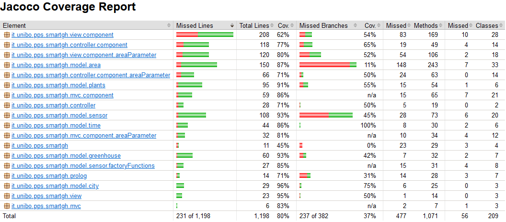

# 5. Implementazione
Il seguente capitolo, motiva e dettaglia aspetti implementativi ritenuti rilevanti,
per una corretta comprensione del progetto. 

Va inoltre sottolineato, che il codice realizzato, è stato opportunamente documentato mediante la `Scaladoc`, la quale può essere utilizzata come un ulteriore riferimento per meglio comprendere l'implementazione del programma e il suo comportamento.

## 5.1 Utilizzo del paradigma funzionale
Durante lo sviluppo del progetto, si è cercato di utilizzare il più possibile il paradigma funzionale, cercando di raffinare sempre di più la soluzione adottata per poter sfruttare al meglio i vantaggi che questo pardigma offre. 

Se infatti durante la realizzazione di una detemrinata funzionalità, ci si rendeva conto di aver utilizzato un'approcio più legato all'_object-oriented_ che a al paradigma funzionale, dopo aver valutato i diversi aspetti della soluzione, che potevano essere migliorati e modificati adottando, invece, elementi del paradigma funzinoale, si procedeva con il _refactoring_ del codice e all'effettuazione di queste modifiche.

Nelle seguenti sezioni, verranno descritti con maggiore dettaglio alcuni elementi della programmazione funzionale, che sono stati utilizzati all'interno del progetto e alcuni esempi del loro utilizzo.

### 5.1.1 Higher-order functions
Un meccanismo efficace spesso utilizzato nella programmazione funzionale è quello delle _funzioni higher order_. Sono delle funzioni che accettano altre funzioni come parametri e/o restituiscono una funzione come risultato. 

L’utilizzo di queste funzioni, ha permesso di rendere il codice riusabile e di permettere una facile ed immediata realizzazione del _pattern Strategy_, in quanto consente di passare alle funzioni delle strategie esterne.

Esse sono state utilizzate in molte parti del progetto e in particolare, un esempio di utilizzo, si può trovare negli oggetti `Factory` delle funzioni per il calcolo di nuovi valori dei sensori, di cui di seguito è possibile visualizzare un estratto di codice:

```scala
/** Updates the current soil moisture value according to the precipitation value when gates are open. */
val updateGatesOpenValue: (Double, Double) => Double = _ - _ * RainFactor
```

In particolare, si tratta di una funzione utilizzata per calcolare il valore dell’umidità del suolo nel caso in cui la porta dell’area sia aperta. 

La funzione prende in ingresso due valori: il valore corrente dell’umidità e il valore della precipitazione. Nell’esempio, l’implementazione della funzione è stata specificata attraverso l’utilizzo delle funzioni _literal_ (funzioni _lambda_ in _Java_) e grazie alla sintassi di _Scala_ e all’inferenza del tipo, è possibile semplificare la funzione utilizzando il _placeholder_ underscore_ rendendo il codice il più idiomatico possibile.

### 5.1.2 Currying
In _Scala_ è possibile definire funzioni _curried_, ossia la valutazione di una funzione che assuma parametri multipli può essere tradotta nella valutazione di una sequenza di funzioni.

È un meccanismo che consente di applicare il DRY (_Don't repeat yourself_), favorendo quindi il riuso del codice. Infatti quando una funzione è _curried_, è possibile applicare parzialmente la funzione per poterla utilizzarla in più punti del codice.

Nel seguente estratto di codice è possibile vedere un esempio di definizione di funzione _currying_.

```scala
private def extractTerm(solveInfo: SolveInfo)(term: String) =
  extractTermToString(solveInfo, term).replace("'", "")
```

Tale funzione, in particolare, si occupa di estrarre il termine dalla soluzione ottenuta da _Prolog_, rimuovendo poi gli apici.

```scala
override def getCityInfo(city: String): Option[(String, String, String)] =
  searchCity(city).headOption match
    case Some(s) => val e = extractTerm(s); Some(e("X"), e("Y"), e("Z"))
    case _ => None
```

La funzione viene utilizzata all'interno del Model di select city per estrarre le informazioni associate alla città selezionata. Per chiamare la funzione si deve mantenere la stessa notazione _currying_. Nell'esempio, la funzione viene applicata parzialmente passando un solo argomento, in questo modo ritorna una nuova funzione che può essere consumata in seguito specificando il secondo argomento. 

### 5.1.3 Type members

La keyword `type` in _Scala_ introduce il concetto di _type members_ all'interno di una classe, oltre ai _field_ e _method members_ che, solitamente, già troviamo.
Viene impiegata principalmente per creare l'alias di un tipo più complicato: il _type system_ sostituirà l'alias con l'_actual type_ quando effettuerà il _type checking_.

I _type members_, analogamente agli altri membri delle classi, possono essere _abstract_ ed è, dunque, possibile specificare il tipo concreto nell'implementazione.

In merito al progetto, i _type members_ sono stati utilizzati per:

-  definire il tipo di dato restituito dalle richieste HTTP in quanto risultava complesso e poco esplicativo (non rilevava l'intento).

```scala
/** Data structure that will contains the city's environment values. */
type EnvironmentValues = Map[String, Any]

/** Data structure that will contains plant's optimal values. */
type OptimalValues = Map[String, Any]
```
- definire le dipendenze tra i componenti Model, View e Controller nell'utilizzo del _Cake pattern_

```scala
/** The controller requirements. */
  type Requirements = EnvironmentViewModule.Provider with EnvironmentModelModule.Provider with SimulationMVC.Provider
```

### 5.1.4 For-comprehension
Al fine di rendere il codice meno imperativo, si è fatto uso della _for-comprehension_, un costrutto funzionale basato sulle "monadi" per operare sulle collezioni. 

Oltre a rendere il codice più funzionale, la scelta dell'utilizzo della _for-comprehension_ è supportato dall'incremento della leggibilità del codice, come si può vedere nel seguente estratto di programma, utilizzato per la creazione degli oggetti `ManageSensor`, il cui compito è racchiudere tutte le informazioni utili riguardati un sensore.

```scala
    for
        (key, m) <- mapSensorNamesAndMessages.toList
        optK = m.getOrElse("name", "")
        um = m.getOrElse("um", "")
        msg = m.getOrElse("message", "")
    yield ManageSensorImpl(
        key,
        optimalValueToDouble.getOrElse("min_" + optK, 0.0),
        optimalValueToDouble.getOrElse("max_" + optK, 0.0),
        um,
        sensorsMap(key),
        BigDecimal(sensorsMap(key).getCurrentValue).setScale(2, BigDecimal.RoundingMode.HALF_UP).toDouble,
        msg,
        firstSensorStatus(
            BigDecimal(sensorsMap(key).getCurrentValue).setScale(2, BigDecimal.RoundingMode.HALF_UP).toDouble,
            optimalValueToDouble.getOrElse("min_" + optK, 0.0),
            optimalValueToDouble.getOrElse("max_" + optK, 0.0)
        )
    )
```
Nell'esempio si itera sulla mappa contenete le costanti riguardanti i sensori, come il nome del sensore, l'unità di misura e il messaggio di errore associato ad esso. Questi valori vengono poi impiegati nella costruzione dell'oggetto `ManageSensor` in modo da reperire le informazioni relative ad un sensore per una specifica pianta, creare e memorizzare l'istanza del relativo sensore, inizializzare il suo stato e tenere traccia del valore corrente rilevato da esso. 

### 5.1.5 Trait mixins
In _Scala_, le classi possono avere un unica superclasse ma molti _mixins_, attraverso l'utilizzo delle _keywords_ `extends` e `with`.

Un _mixin_ è una classe o un interfaccia in cui alcuni o tutti i suoi metodi e/o proprietà non sono implementati, richiedendo che un'altra classe o interfaccia fornisca le implementazioni mancanti. Gli elementi _mixins_, sono spesso descritti come "inclusi" o "impilati in", piuttosto che "ereditati".

Il _mixins_, utilizzato con le interfaccie, consente ai `traits`, di poter essere concatenati utilizzando la composizione piuttosto che l'ereditarietà.

Per il progetto, in particolare nella realizzazione dei diversi _Cake pattern_, si è fatto utilizzo dei _mixins_, infatti ad esempio, al termine di ogni modulo: Model, View o Controller, troviamo il `trait Interface` dichiarato nel seguente modo:

```scala
trait Interface extends Provider with Component
```

Tale dichiarazione indica che l'elemento `Interface`, ha come supertipo `Provider` e un _mixin_ con `Component`, che li consente di utilizzare le sue proprietà.

## 5.2 Utilizzo del paradigma logico
Il team di sviluppo, inizialmente, si è posto come obiettivo per la realizzazione del progetto, l'utilizzo del paradigma logico. In fase di progettazione, quindi, ci si è interrogati su come poter utilizzare la programmazione logica all'interno del progetto, giungendo alla conclusione che il modo migliore per poterlo fare, nel caso della nostra applicazione, consisteva nell'utilizzo di _Prolog_ come database, sul quale effettuare delle interrogazioni per poter ottene informazioni relative alle piante e alle città.

Nello specifico, sono stati realizzati due file `.txt`, uno contenente l'elenco delle città in cui può essere ubicata la serra e l'altro contenente l'elenco dei nomi delle piante assieme ai loro identificativi.

### 5.2.1 Utilizzo di Prolog per la selezione della città
All'inizio, quando l'utente si trova nella schermata iniziale dell'applicazione, deve effettuare l'inserimento del nome della città nella quale verrà ubicata la serra.

Per consentire quest'operazione, la classe `UploadCities`, si occupa di convertire il file `cities.txt`, in un file _Prolog_: `cities.pl`, che verrà inserito all'interno della _home directory_ dell'utente, all'interno della cartella `pps`.

Questo file, `cities.pl`, contiene le regole sulle città, scritte in questo modo:

```prolog
% city('city', 'latitude', 'longitude').
city('Bologna', '44.4939', '11.3428').
city('Cesena', '44.1333', '12.2333').
``` 
Il file `cities.pl` contiene, inoltre, una regola `search_city` che consente di convertire i nomi delle città in array di caratteri, in modo da facilitare il meccanismo di ricerca.

```prolog
search_city([H|T], X, Y, Z) :- city(X, Y, Z), atom_chars(X, [H|T]).
```

Infine, `SelectCityModelModule`, utilizza questo file e la libreria [_TuProlog_](https://apice.unibo.it/xwiki/bin/view/Tuprolog/), per poter visualizzare i diversi nomi delle città e implementare il _live search_. Infatti, ogni qual volta l'utente inserisce dei caratteri nel `TextField`, della schermata, questi caratteri vengono utilizatti, per definire il _goal_ che si intende risolvere e determinare la città che l'utente vuole selezionare.

```scala
  private def searchCity(city: String, start: String = "['", sep: String = "','", end: String = "']"): Iterable[SolveInfo] =
    engine("search_city(" + city.mkString(start, sep, end) + ", X, Y, Z)")
``` 

### 5.2.2 Utilizzo di Prolog per la selezione delle piante
Per consentire all'utente la selezione delle piante, che si intende coltivare all'interno della serra, la classe `UploadPlants`, prima che venga mostrata la schermata di selezione delle piante all'utente, si occupa di convertire il file `plants.txt`, in un file _Prolog_: `plants.pl`, contenente i records che detengono le infromazioni sulle piante, i quali risultano essere scritti nel seguente modo:

```prolog
plant('Alcea rosea', 'alcea rosea').
plant('Basil', 'ocimum basilicum').
```

Una volta che il file `plants.pl` è stato scritto e inserito all'interno della _home directory_ dell'utente, `PlantSelectorModelModule`, si occupa di utilizzare questo file tramite la libreria _TuProlog_, per poter mostrare le piante selezionabili all'utente e in seguito, una volta selezionate le piante, per poter prendere il loro identificativo e istanziare gli oggetti `Plant`.

```scala
override def getAllAvailablePlants: List[String] =
    engine("plant(X, Y).").map(extractTermToString(_, "X").replace("'", "")).toList

override def getPlantsSelectedIdentifier: List[String] =
    selectedPlants
        .map(s => "\'" + s + "\'")
        .flatMap(s => engine("plant(" + s + ", Y).").map(extractTermToString(_, "Y")))
        .toList

``` 

## 5.3 Programmazione reattiva e asincrona

Per lo sviluppo del progetto si è fatto uso sia della programmazione reattiva (di tipo event-based) che di quella asincrona, scegliendo di sfruttare i metodi forniti dalla libreria [_monix.io_](https://monix.io/).

I meccanismi di programmazione asincrona, come `Task`, sono stati utilizzati per effettuare operazioni in modo asincrono, che possono richiedere un periodo di tempo considerevole per poter essere completate e pertanto possono risultare bloccanti per il flusso di controllo dell'applicazione, come ad esempio, l'impostazione della velocità del tempo virtuale della simulazione:

```scala
    override def setSpeed(speed: Double): Unit =
      Task {
        timer.changeTickPeriod(timeSpeed(speed))
      }.executeAsync.runToFuture
```

Per quanto riguarda la programmazione reattiva, sono stati sfruttati meccanismi come il data type `Observable` e la classe astratta `ConcurrentSubject` che sono stati impiegati in diversi aspetti, come ad esempio per: 

-	la gestione della logica del `Timer`

```scala
    private def timer(from: FiniteDuration, period: FiniteDuration): Unit =
      cancelable = Observable
        .fromIterable(from.toSeconds to duration.toSeconds)
        .throttle(period, 1)
        .map(Duration(_, TimeUnit.SECONDS))
        .foreachL(consumer)
        .doOnFinish(onFinishTask)
        .runToFuture
```

- aggiornare periodicamente la visualizzazione dello scorrere del tempo nelle varie schermate

```scala
private val subjectTimerValue = ConcurrentSubject[String](MulticastStrategy.publish)
``` 

```scala
override def notifyTimeValueChange(timeValue: String): Unit =
        Task {
          subjectTimerValue.onNext(timeValue)
        }.executeAsync.runToFuture
```

-	notificare i sensori della disponibilità di un nuovo valore ambientale tra temperatura, umidità e luminosità;

```scala
def setSensorSubjects(subjects: Map[String, ConcurrentSubject[Double, Double]]): Unit =
  subjects.foreach((k, v) =>
    k match
      case "temp" => sensorsMap(TemperatureKey).setObserverEnvironmentValue(v)
      case "hum" => sensorsMap(AirHumidityKey).setObserverEnvironmentValue(v)
      case "lux" => sensorsMap(BrightnessKey).setObserverEnvironmentValue(v)
      case "soilMoist" => sensorsMap(SoilHumidityKey).setObserverEnvironmentValue(v)
  )
```

-	notificare i sensori dello scorrere del tempo col fine di ricalcolare periodicamente i valori rilevati all’interno delle aree

```scala
override protected def registerTimerCallback(verifyTimePass: String => Boolean): Unit =
  addTimerCallback((s: String) => if verifyTimePass(s) then computeNextSensorValue())
```

-   aggiornare periodicamente la View relativa alla suddivisione in aree

```scala
      override def updateView(): Unit =
        ghDivisionModel.areas.foreach(a =>
          a.areaModel
            .changeStatusObservable()
            .subscribe(
              (s: AreaStatus) => {
                s match
                  case AreaStatus.ALARM => drawView()
                  case _ =>
                Continue
              },
              (ex: Throwable) => ex.printStackTrace(),
              () => {}
            ) :: subscriptionAlarm
        )

        subscriptionTimeout = timeoutUpd.subscribe()
```

-	mantenere reattiva l’applicazione a seguito di richieste HTTP che possono inficiare sulla _user experience_ (es: caricamento dati nei componenti `Plant` ed `Environment`)

```scala
      override def startEmittingPlantsSelected(): Unit =
        Task {
          selectedPlants
            .zip(getPlantsSelectedIdentifier)
            .foreach((name, identifier) => subjectPlantInfo.onNext(Plant(name, identifier)))
          subjectPlantInfo.onComplete()
        }.executeAsync.runToFuture

```

Per quanto riguarda gli aggiornamenti degli elementi della GUI, che sono stati implementati mediante l'utilizzo della libreria _JavaFX_, si è disposto del metodo `runLater` della classe `Platform` presente all'interno della stessa libreria.
Tale metodo prende in input un oggetto di tipo `Runnable` che verrà eseguito dal _JavaFX Application Thread_, quando questo non sarà impegnato nell'esecuzione di altri lavori. Ciò permette, quindi, di utilizzare un meccanismo asincrono diverso dal `Task`: quest'ultimo, infatti, non avrebbe funzionato in quanto non può modificare lui stesso il _JavaFX scene graph_.

```scala
override def updateState(state: String): Unit =
        Platform.runLater { () =>
          statusLabel.setText(state)
          statusLabel.getStyleClass.setAll(state)
        }
```

## 5.4 Richieste dei dati

Per reperire i dati relativi alle previsioni metereologiche della città in cui è ubicata la serra e quelli relativi alle piante si è fatto uso di richieste HTTP. A tal fine si è deciso di utilizzare la libreria [_requests_](https://github.com/com-lihaoyi/requests-scala) per permettere di effettuare la richiesta al rispettivo url: [weatherapi](https://www.weatherapi.com/api-explorer.aspx), per le previsioni meteorologiche e [open.plantbook](https://open.plantbook.io/), per le piante. 

```scala
val query =
          "http://api.weatherapi.com/v1/forecast.json?key=" + apiKey + "&q=" + nameCity.replace(
            " ",
            "%20"
          ) + "&days=1&aqi=no&alerts=no"
val r: Response = requests.get(query)
```
Ottenuta la risposta dal web Server, qualora questa abbia dato esito positivo, si è proceduto ad effettuare il _parsing_ per poter ottenere il _JSON_, mediante la libreria [_json4s_](https://github.com/json4s/json4s). Qualora, invece, l'esito della risposta fosse negativo, si è deciso di impostare un valore di default. 

Al fine di valutare l'esito della risposta, si è fatto uso del `Try match` per identificare se la richiesta va a buon fine: caso di `Success`, o meno, caso di `Failure`.

```scala
Try(requests.post(url = url, data = data)) match {
    case Success(r: Response) =>
        implicit val formats: DefaultFormats.type = org.json4s.DefaultFormats
        parse(r.text()).extract[RequestResult].get("access_token").fold[String]("")(res => res.toString)
    case Failure(_) => ""
    }
```

Il _JSON_ ottenuto in caso di successo, è stato poi utilizzato per l'implementazione del `type` definito nell'interfaccia della classe `Environment`, nel caso della città e `Plant`, nel caso delle informazioni relative alla pianta.

Per entrambe le implementazioni, si è deciso di assengare a `type` il tipo concreto `Map[String, Any]` in quanto il _JSON_ ottenuto come risposta, contiene valori anche complessi, ad esempio _sub-json_.

A partire dall'oggetto contenente l'implementazione del `type,` sono state estrapolate le informazioni utili alla simulazione. 

Nel caso delle città questo è rappresentato dalle previsioni meteorologiche orarie, che vengono successivamente filtrate in base all'orario richiesto, mentre nel caso delle piante è rappresentato da: nome della pianta, valori ottimali dei sensori (temperatura, luminosità ed umidità del suolo e dell'aria) e l'_url_ per reperire l'immagine. A partire dal nome è stata effettuata inoltre la richiesta al sito [wikipedia](https://it.wikipedia.org/wiki/Pagina_principale) per ottenere la descrizione della pianta.

## 5.5 Utilizzo di ScalaFX e JavaFX
Per l’implementazione dell’interfaccia grafica sono state utilizzate le librerie: [_ScalaFX_](https://www.scalafx.org/), un _DSL_ scritto in _Scala_ che fa da _wrapper_ agli elementi di _JavaFx_ e [_JavaFX_](https://openjfx.io/). 

Nello specifico, si è deciso di gestire le parti statiche dell’applicazione attraverso la creazione dei _layout_ in formato _FXML_. Siccome nella libreria _ScalaFX_ non è prevista la gestione di questa funzionalità, si è deciso di integrare quest'ultima con la libreria _JavaFX_.

_FXML_ è un formato _XML_ che permette di comporre applicazioni _JavaFX_, separando il codice per la gestione degli elementi dalla parte di visualizzazione dei _layout_. Inoltre, l’utilizzo di [_SceneBuilder_](https://gluonhq.com/products/scene-builder/) ha facilitato la creazione delle pagine fornendo una renderizzazione visiva e intuitiva, attraverso il suo ambiente grafico.

La logica di caricamento del file _FXML_ viene racchiusa nella classe astratta `AbstractViewComponent`, tutti i componenti della View estendono da tale classe specificando il file _FXML_ associato e possono ottenere già in automatico il _layout_ caricato.

Di fatto, il componente View, rappresenta il Controller associato al _layout_. Il Controller può ottenere il riferimento agli elementi dell’interfaccia attraverso gli `id` specificati nell’_FXML_ e il caricatore, ossia `FXMLLoader`, il quale cercherà di istanziarli e di renderli accessibili. Il Controller ha il compito di inizializzare gli elementi dell’interfaccia utente e di gestirne il loro comportamento dinamico.

## 5.6 Testing
Per testare le funzinalità principali del porgramma, si è deciso di utilizzare la modalità _Test Driven Development (TDD)_. Questa strategia, prevede di scrivere per prima cosa il codice di testing, indicando il compoertamento corretto della funzionalità che si vuole testare e successivamente scrivere il codice di produzione, affinchè i test individuati passino correttamente. Una volta scritto il codice di produzione e aver passato i test si può procedere al _refactoring_ e al miglioramento della soluzione ottenuta. 

Il _TDD_, quindi, si compone di tre diverse fasi che si susseguono: red, green e refactor. Nella fase red si ha solo il codice di testing e di conseguenza, i test che sono stati scritti, non passerano, in quanto il codice di produzione risulta essere mancante, nella fase green, invece, si procede alla scrittura del codice di produzione in modo da poter superare i test precedentemente definiti e infine nella fase di refactor, il codice di produzione scritto viene migliorato.

Il team di lavoro, per lo sviluppo dell'applicazione, ha inoltre deciso di adottare la pratica di _Continuous Integration_, decidendo di realizzare due flussi di lavoro sul relativo _repository_, il primo dedicato all'esecuzione dei test sui diversi sistemi operativi: Windows, Linux, Mac e il secondo diretto a deterimnare la _coverage_ ottenuta, mediante i test effettuati.

Per questo progetto le funzionalità del modello, che racchiudono la logica di business, sono state testate mediante l'utilizzo di _ScalaTest_, mentre per testare gli elementi della View, siccome è stata utilizzata la libreria _ScalaFX_, si è deciso di utilizzare, per il testing, la libreria _TestFx_.

Nelle seguenti sezioni, è possibile trovare una descrizione maggiormente dettagliata relativa ai test effettuati, le modalità utilizzate e la _coverage_ ottenuta.

### 5.6.1 Utilizzo di ScalaTest
Per testare le funzionalità legate alla logica di business dell'applicazione, si è deciso di utilizzare la libreria [_ScalaTest_](https://www.scalatest.org/), realizzando diverse _suits_ di testing.

In particolare, tutte le diverse classi di testing realizzate che utilizzano _ScalaTest_, estendono la classe `AnyFunSuite` e i test sono stati scritti seguendo il seguente stile:
```scala
test("At the beginning the temperature should be initialized with the default value") {
    val defaultTemperatureValue = 27
    areaComponentsState.temperature shouldEqual defaultTemperatureValue
}
```

Per verificare determinate condizioni, come ad esempio di uguaglianza, minoranza o maggioranza, si è fatto utilizzo dei `matchers` di _ScalaTest_. Nello specifico, se la classe di testing estende il `trait Matchers`, ha la possibilità di utilizzare all'interno dei test, delle _keywords_ come: `should be`, `equal`, `shouldEqual` ecc. che consentono di verificare le condizioni espresse. 

Infine, per testare il verificarsi di determinati risultati o condizioni, che però possono impiegare un certo tempo per avvenire, da quando è stato generato l'evento che ne è la causa, si è fatto uso di `eventually`. In particolare, se la classe di test estende il `trait Eventually`, ha la possibilità di definire dei test, che presentano una condizione che prima o poi si deve verificare entro un lasso di tempo predefinito.
```scala
test("The air humidity value should decrease because the ventilation and the humidity are inactive") {
    setupTimer(500 microseconds)
    initialValueTest()

    eventually(timeout(Span(1000, Milliseconds))) {
        humiditySensor.getCurrentValue should be < initialHumidity
    }
}
```

### 5.6.2 Utilizzo di Unit test e TestFx
Per poter testare gli aspetti relativi alla visualizzazione dei dati e all'interfaccia utente, si è deciso di utilizzare le librerie [_TestFx_](https://github.com/TestFX/TestFX/wiki) e [_JUnit_](https://junit.org/junit5/docs/current/user-guide/).

_TestFx_, richiede che per poter scrivere dei test, che vadano a verificare degli elementi di _JavaFX_, la classe di testing estenda la classe `ApplicationExtension`, dopodiché è necessario definire un metodo contrassegnato dalla notazione `@Start`, per impostare la schermata che si vuole testare; una volta fatto questo si ha la possibilità di definire i test per la GUI.

Nello specifico, i diversi _Unit tests_ che si vogliono realizzare devono prendere tutti come argomento `FxRobot`, il quale rappresenta un oggetto che può essere utilizzato per poter simulare i comportamenti dell'utente sull'interfaccia grafica, come mostrato nel seguente esempio.

```scala
@Test def testAfterPlantSelection(robot: FxRobot): Unit =
    //...
    val checkBox = robot.lookup(selectablePlantsBoxId)
                        .queryAs(classOf[VBox])
                        .getChildren
                        .get(plantIndex)
    //when:
    robot.clickOn(checkBox)

    //then:
    assertEquals(robot.lookup(selectedPlantBoxId)
                .queryAs(classOf[VBox])
                .getChildren.size, selectedPlantNumber)
    verifyThat(numberPlantsSelectedId, hasText(selectedPlantNumber.toString))
```
Come si può vedere sempre dall'esempio, per verificare le proprietà degli elementi dell'interfaccia, è stata utilizzata la clase `FxAssert` e il metodo `verifyThat`, il quale consente, una volta passato l'id del componente _FXML_, di verificare una determinata proprietà su di esso. Le proprietà possono essere definite tramite i `matchers` di TestFX.

In questo modo, quindi, è stato possible per il team di sviluppo effettuare dei test automatici sull'interfaccia grafica che si intende mostrare all'utente. 

Va comunque sottolineato che per testare gli aspetti di View, sono stati svolti anche numerosi test manuali, anche perchè molto spesso, risultava essere complicato tramite test automatici, verificare determinate condizioni, questi di fatti non possono essere considerati completamente esaustivi nella verifica degli aspetti di interazione con l'utente.

### 5.6.3 Coverage
Come detto in precedenza, il team di sviluppo ha realizzato anche un flusso di lavoro dedicato alla _coverage_, in modo tale da poter analizzare la copertura ottenuta, ogni qual volta vengono inseriti dei nuovi tests o modificati quelli precedenti.

La _code coverage_ fa riferimento, sostanzialmente, alla quantità di istruzioni di codice che vengono eseguite durante l'esecuzione dei tests, tuttavia ottenere una _coverage_ del 100% non significa che il testing effettuato riesca a ricoprire tutti gli scenari, infatti l'obiettivo che ci si è dati, non è stato quello di raggiungere il 100% della copertura ma di testare le cose giuste.

In particolare, per poter ottenere i risultati relativi alla _coverage_ si è fatto utilizzo del _tool_ [_JaCoCo_](https://www.eclemma.org/jacoco/), ottenendo alla fine il risultato illustrato in figura [Fig. 5.6.3.1].

<div align="center">
  
  <p> Fig. 5.6.3.1 - Coverage finale ottenuta </p>
</div>

[Fig. 5.6.3.1]: img/coverage.png

Come si può vedere dalla [Fig. 5.6.3.1], la coverage finale ottenuta è del 79% su un totale di 129 test effettuati.

Gli elementi per cui si ha una _coverage_ più elevata sono quelli che fanno riferimento al Model dell'applicazione, mentre quelli per cui si ha una _coverage_ più bassa fanno riferimento agli elementi della View, che come spiegato nella precedente sezione [Sec. 5.6.2](#562-utilizzo-di-unit-test-e-testfx), sono stati testati sia tramite test automatici che tramite test manuali.

## 5.7 Suddivisione del lavoro
Durante lo _sprint preview_, una volta determinati i dviersi prodotti che si vuole realizzare e i dversi tasks necessari per il loro completamento, questi vengono poi assegnati a uno o più membri del gruppo, incaricati della loro esecuzione.

Il completamento di uno o più tasks, individuati nel _product backlog_, può dare luogo alla stesura di diversi elementi del codice di produzione. 

Nelle seguenti sezioni, ogni membro del gruppo si è impegnato nel descrivere le parti di codice da lui stesso implementate o effettuate in collaborazione con altri membri del gruppo.

### 5.7.1 Folin Veronika

Inizialmente mi sono occupata della selezione delle piante da coltivare all’interno della serra e, in particolare, ho sviluppato:
-	l’oggetto di utility `UploadPlants`, che si occupa di convertire un file testuale (contenente i nomi e gli id delle piante selezionabili) in un file _Prolog_ che verrà utilizzato dal modulo `PlantSelectorModelModule` per visualizzare le tipologie di coltivazioni disponibili;
-	la classe `Plant` che si compone dell’interfaccia che rappresenta la pianta selezionata dall’utente e che racchiude, oltre al nome e all’identificatore, le informazioni ottenute mediante una richiesta HTTP come l’immagine, la descrizione e i valori ambientali ottimali per la crescita della stessa.

All’interno del modulo `Environment`, ho gestito tramite _reactive programming_ (sfruttando la libreria _monix.io_) la richiesta per reperire le previsioni metereologiche in quanto questa operazione può richiedere diverso tempo e può influire sulla reattività dell’applicazione.

Dopodiché mi sono occupata della realizzazione dei componenti per la visualizzazione dello stato aggiornato della simulazione, ovvero dei dati relativi all’ambiente in cui è immersa la serra e dello scorrere del tempo. Nello specifico mi sono occupata dell’implementazione:
-	del modulo `EnvironmentMVC` e dei rispettivi sottomoduli `EnvironmentModelModule`, `EnvironmentViewModule` ed `EnvironmentControllerModule`;
-	di `TimeModel`, la cui interfaccia espone metodi per controllare il `Timer` sviluppato da _Elena_. La realizzazione di questo componente ha richiesto l’utilizzo di elementi della programmazione asincrona, forniti dalla libreria _monix.io_.

L’introduzione di `EnvironmentMVC` ha richiesto la collaborazione con gli altri membri del gruppo per collegare l’elemento ai seguenti componenti:
-	`Sensor`, al fine di notificarli quando è disponibile un aggiornamento dei valori ambientali. A tale scopo si sono sfruttati elementi della programmazione reattiva;
-	`GreenHouseDivisionMVC`, al fine di inizializzare la visualizzazione delle aree.

Successivamente, insieme al resto del gruppo, mi sono dedicata allo sviluppo del componente MVC principale dell’applicazione. In particolare, ho realizzato:
-	`SimulationMVC`;
-	`SimulationController`, che si occupa di detenere i riferimenti ad istanze inizializzate da altri componenti e di mantenere aggiornati i vari componenti della simulazione (es: `EnvironmentMVC`, `AreaDetailsMVC`) in base allo scorrere del tempo, anche attraverso l’utilizzo della programmazione reattiva. 

Nel terzo sprint mi sono occupata di raccogliere gli elementi comuni relativi alle diverse view dell'applicazione, realizzando l'interfaccia `ContiguousSceneView`.

Come gli altri membri del gruppo, nell'ultimo sprint ho compiuto operazioni di refactoring e di ottimizzazione del codice per poter migliorare ulteriormente la soluzione proposta.

Infine, ho creato e gestito il componente `HelpView` che si occupa di visualizzare la guida utente all’interno dell’applicazione.

Per quanto riguarda la parte di testing, ho realizzato le seguenti classi di test:
-	`PlantTest`
-	`UploadPlantTest`
-	`EnvironmentViewModuleTest`
- `EnvironmentModelTest`


### 5.7.2 Mengozzi Maria
Nello sviluppo del progetto mi sono occupata insieme ad _Elena_ della selezione della città in cui è ubicata la serra. Specificatamente ho realizzato:

- l'oggetto di utility `UploadCities`, esso incapsula il meccanismo utile a convertire il file testuale contenente il nome dei comuni italiani nel file _Prolog_ utilizzato nell'applicazione per la visualizzazione e la scelta della città;
- il modulo `Environment`, che racchiude l'interfaccia e l'implementazione del meccanismo di salvataggio della città scelta;
- il meccanismo per reperire, mediante una richiesta HTTP, le previsioni meteorologiche previste per la giornata in cui si svolge la simulazione e per ottenere, a partire da questi, i dati ambientali rispettivi ad uno specifico orario (`updateCurrentEnvironmentValues` nel modulo `EnvironmentModelModule`).

Sempre insieme ad _Elena_ mi sono occupata della realizzazione dei controller (`AreaDetailsController` e `AreaXXXController`) per la schermata del dettaglio di un area e lateralmente alla gestione del suo MVC. Nel caso del controller ho gestito i metodi relativi all'interfacciamento con il Model, da me realizzato.

Inoltre, ho collaborato con _Anna_ per quanto riguarda il collegamento tra i sensori e le aree e i parametri ambientali, e insieme al resto del gruppo per la definizione della struttura del progetto e il collegamento tra le varie parti realizzate.

Per quanto riguarda l’identificazione di una sezione di progetto pienamente riconducibile alla sottoscritta, si possono indicare le aree. Nello specifico, le parti da me singolarmente implementate comprendono:
- il modulo `GreenHouseDivisionMVC` e i rispettivi sottomoduli `GHModelModule`, `GHControllerModule` e `GHViewModule`. Tale modulo si occupa di gestire la parte di suddivisione della serra in aree e il suo continuo aggiornamento durante tutto lo svolgimento della simulazione, mediante la sottoscrizione di un evento di tipo `interval` e all'evento di cambio di stato di un'area. 

  La sottoscrizione a questi due eventi è stata scelta al fine di non sovraccaricare l'_EDT (Event Dispatch Thread)_ con richieste di aggiornamento della view, le quali avrebbero reso meno reattiva l'interfaccia.
- il modulo `AreaMVC` e i rispettivi sottomoduli `AreaModelModule`, `AreaControllerModule` e `AreaViewModule`. Il seguente modulo si occupa di implementare le singole aree che compongono le serra, per farlo interagisce con i sensori presenti al suo interno affinchè, possa mantenere aggiornati e mostrare all'utente i valori rilevati da questi ultimi. 

  In particolare, il Model oltre a tenere traccia dei valori rilevati dai parametri, si occupa anche di memorizzare le operazioni effettuate dall'utente per riportare e mantenere i parametri nei range ottimali e notificare il cambio di stato dell'area. 
- le classi `ManageSensor`e `AreaSensorHelper`, le quali vengno utilizzate dal modulo `AreaModelModule` per assolvere al suo compito e in particolare, per tutte quelle operazioni che coinvolgono i sensori.


Per la parte di testing mi sono occupata della realizzazione delle seguenti classi di test:
- `AreaTest`
- `UploadCitiesTest`
- `EnvironmentTest`
- `GreenHouseTest`
- `GreenHouseDivisionViewTest`

Inoltre, alcune delle funzionalità da me implementate sono presenti anche nelle altre classi di test.

### 5.7.3 Vitali Anna 
Nelle fasi iniziali di implementazione del progetto, mi sono impegnata nella realizzazione del meccanismo di selezione delle piante, realizzando gli elementi del _pattern MVC_ che si occupano di implementare questa funzionalità, che sono:

- `PlantSelectorModelModule`, il quale rappresenta il modulo che detiene il Model per la selezione delle piante, presenti nel file _Prolog_ generato dalla classe _utility_, sviluppata da _Veronika_. 

    Dopo aver sviluppato questa parte, insieme alla collega _Elena_, abbiamo provveduto ad effettuare il _refactoring_ delle parti in comune relative dell'utilizzo di _Prolog_, sia per la seslezione delle piante, che per la selezione delle città;
- `SelectPlantViewModule`, rappresentante il modulo che detiene la View per la selezione delle piante, che si occupa di gestire i componenti dell'interfaccia grafica e dell'interazione con l'utente;
- `PlantSelectorControllerModule`, il quale rappresenta il modulo che detiene il Controller per il meccanismo di selezione delle piante, che svolge la funzione di intermediario fra View e Model;
- `PlantSelectorMVC`, che rappresenta il compoenente che detiene tutti gli elementi del _pattern MVC_, per la selezione delle piante.

Dopodichè, mi sono dedicata alla realizzazione della View di fine simulazione, realizzando la classe `FinishSimulationView`.

Nel secondo sprint, invece, mi sono concentrata maggiromente sulla realizzazione dei sensori, dei loro meccanismi di aggiornamento e notifica, definendo inizialmente assieme ad _Elena_, l'architettura generale dei sensori, in particolare abbiamo realizzato: le'interfacce `Sensor` e `SensorWithTimer`, le classi astratte `AbstractSensor` e `AbstractSensorWithTimer` e la classe `AreaComponentsState`. 

Successivamente, mi sono dedicata all'implementazione dei sensori relativi alla luminosità e alla temperatura, realizzando le classi:

- `LuminositySensor`, rappresentante il sensore dedicato alla luminosità;
- `FactoryFunctionsLuminosity`, la quale contiene le funzioni che possono essere applicate per calcolare la luminosità attuale, all'interno dell'area della serra, in base a specifiche condizioni;
- `TemperatureSensor`, rappresentante il sensore dedicato alla temperatura;
- `FactoryFunctionsTemperature`, che contiene le funzioni che possono essere applicate, per poter determinare il valore attuale della temperatura all'interno dell'area, in base a specifiche condizioni.

Quando tutti i sensori sono stati completati, assieme alle colleghe _Veronika_ ed _Elena_, abbiamo provveduto a collegare questi ultimi all'`EnvironmentModelModule` e successivamente asieme a _Maria_, all'`AreaModelModule`.

Infine, siccome durante l'utilizzo dell'applicazione, si è visto che i dati delle piante impiegavano un discreto tempo per venire caricati completamente, per mantenere l'applicazione reattiva e fornire informazioni all'utente, ho provveduto a realizzare il compoenente `LoadingPlantMVC` e i suoi elementi:

- `loadingPlantControllerModule`, il quale si occupa di gestire l'interazione fra la View e il Model, che in questo caso è rappresentato sempre da `PlantSelectorModelModule`;
- `loadingPlantViewModule`, che si occupa di gestire gli elementi dell'interfaccia grafica che occorre mostrare all'utente, per il caricamento dei dati.

Una volta che tutti gli MVC sono stati implementati, assieme alle altre compagne di progetto, abbiamo provveduto alla rifattorizzazione di `SimulatioinView` e alla definizione di `SimulationController`, nonchè alla realizzazione di `SimulationMVC`. Infine, mi sono occupata di raccogliere gli elementi comuni relativi ai diversi Controller dell'applicazione, realizzando l'interfaccia `SceneController`.

Nell' ultimo sprint, mi sono dedicata assieme agli altri membri del gruppo, ad operazioni di _refactoring_ e di ottimizzazione del codice, per poter raffinare e migliorare ulteriormente la soluzione proposta.

Per quanto concerne l'attività di testing, invece, ho effettuato la realizzazione dei seguenti tests:

- `PlantSelectorModelModuleTest`;
- `AreaComponentsStateTest`;
- `FactoryFunctionsLuminosityTest`;
- `FactoryFunctionsTemperaturetest`;
- `LuminositySensorTest`;
- `TemperatureSensortest`;
- `FinishSimulationViewTest`;
- `SelectPlantViewModuleTest`.

### 5.7.4 Yan Elena
Durante il primo sprint mi sono occupata soprattutto delle classi di view per fornire un’applicazione concreta con cui l’utente potesse interagire. 

In particolare, usando le librerie _ScalaFX_ e _JavaFX_, ho realizzato le classi:
- `SimulationView`, la View principale dell’applicazione che fornisce i servizi di cui necessitano le sotto-view;
- `ViewComponent` e `AbstractViewComponent`, da cui tutte le view possono estendere dalla classe astratta, in modo da favorire la creazione di componenti modulari;
- `BaseView`, il componente base dell’applicazione che contiene tutti gli elementi comuni delle interfacce.

Successivamente ho lavorato sul componente di selezione della città, in particolare, le parti realizzate riguardano il modulo `SelectCityMVC` con i rispettivi sottomoduli:
- `SelectCityModelModule`, il modulo Model che si occupa di ricercare le città che sono presenti nel file _Prolog_, generato dalla classe utility sviluppata da _Maria_. Dopo aver sviluppato questa parte, insieme ad _Anna_, abbiamo rifattorizzato le parti in comune relative all’integrazione di _Scala_ e _Prolog_.
- `SelectCityControllerModule`, il modulo Controller che si occupa di gestire il comportamento in base alle azioni dell’utente sulla View richiedendo al Model le informazioni necessarie. Una volta che l’utente avrà selezionato la città, il Controller si occuperà di salvare la città attraverso il componente `Environment` realizzato da _Maria_.
- `SelectCityViewModule`, il modulo View per la selezione della città.

Di seguito ho sviluppato il componente `Timer` utilizzando la programmazione asincrona con gli `Observer` forniti dalla libreria _monix.io_. Dopodiché insieme a _Veronika_ abbiamo collegato il `Timer` con il `TimerModel`.

Nel secondo sprint abbiamo poi raffinato la struttura del progetto ed effettuato il  collegamento tra le varie parti realizzate, coinvolgendo tutti i membri del gruppo.

Assieme ad _Anna_, abbiamo progettato l’interfaccia `Sensor` e `SensorWithTimer` con le rispettive classi astratte. In seguito ho realizzato l’implementazione dei sensori `AirHumiditySensor` e `SoilHumiditySensor` e i relativi oggetti factory (`FactoryFunctionsAirHumidity` e `FactoryFunctionsSoilHumidity`).

Durante il terzo sprint, mi sono dedicata allo sviluppo dei componenti del dettaglio area e ai suoi quattro parametri. Nello specifico ho realizzato:
- i moduli View e MVC del dettaglio area e dei parametri;
- le interfacce generali per i parametri (`AreaParameterMVC`, `AreaParameterController` e `AreaParameterView`) e le classi astratte per il Controller e la View, rispettivamente `AbstractAreaParameterController` e `AbstractAreaParameterView`

Mentre i moduli del _controller_ sono stati realizzati collaborando con _Maria_.

L'ultimo sprint è stato lasciato per raffinare lo stile grafico dell'applicazione e alle operazioni di refactoring e di ottimizzazione del codice.

Per quanto riguarda la parte di testing, ho realizzato i seguenti test:
- `SelectCityModelModuleTest.scala`
- `SelectCityViewModuleTest.scala`
- `FactoryFunctionsAirHumidityTest.scala`
- `FactoryFunctionsSoilHumidityTest.scala`
- `AirHumiditySensorTest.scala`
- `SoilHumiditySensorTest.scala`
- `TimerTest.scala`
- `AbstractViewTest.scala` (classe astratta che si occupa del setup delle proprietà necessarie per il testing dell'interfaccia con `TestFX`)
- `AbstractAreaDetailsViewTest.scala` (classe astratta che si occupa di istanziare la pagina dell’area dettaglio)
- `AreaDetailsViewModuleTest.scala`
- `AbstractAreaParameterViewTest.scala` (classe astratta che contiene test basilari sui parametri presenti nell’area dettaglio)
- `AreaAirHumidityViewModuleTest.scala`
- `AreaLuminosityViewModuleTest.scala`
- `AreaSoilMoistureViewModuleTest.scala`
- `AreaTemperatureViewModuleTest.scala`

