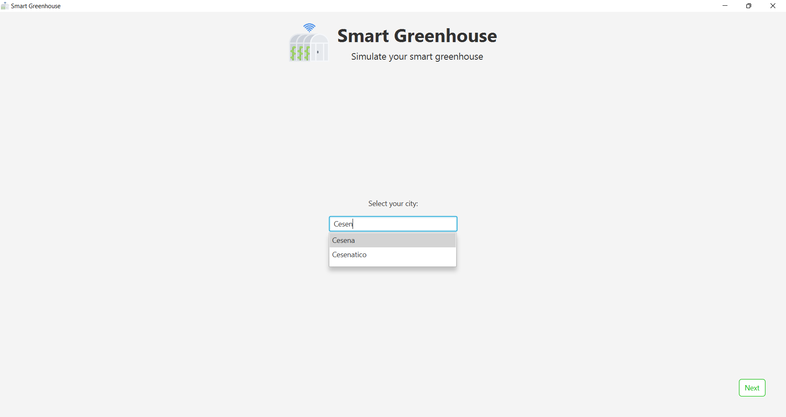
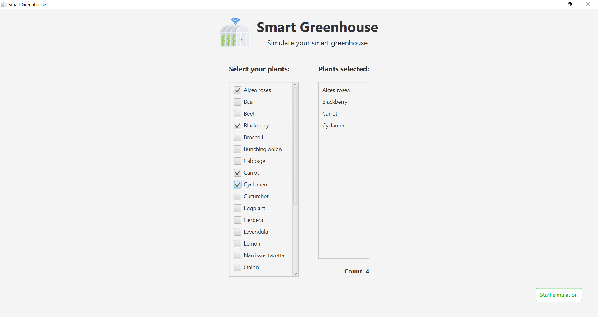
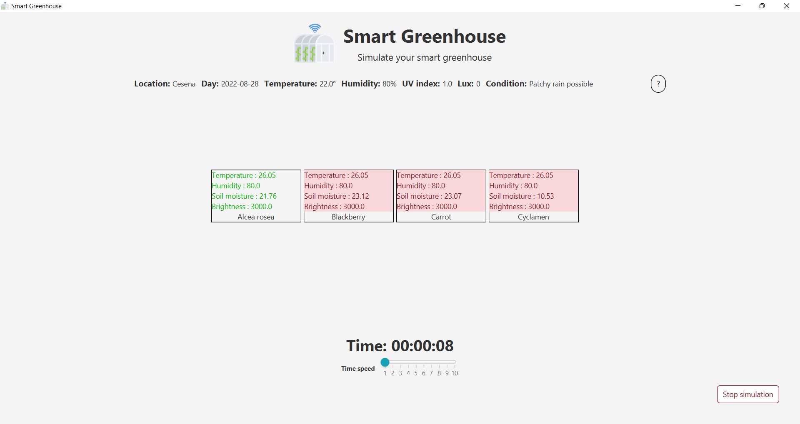
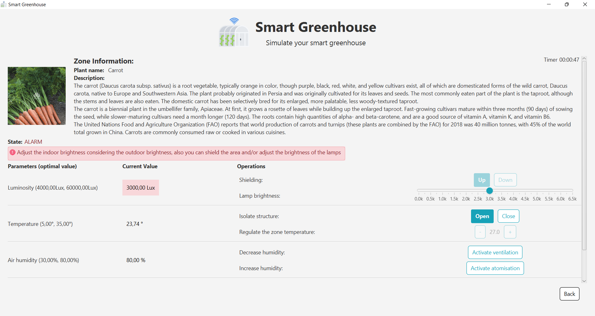
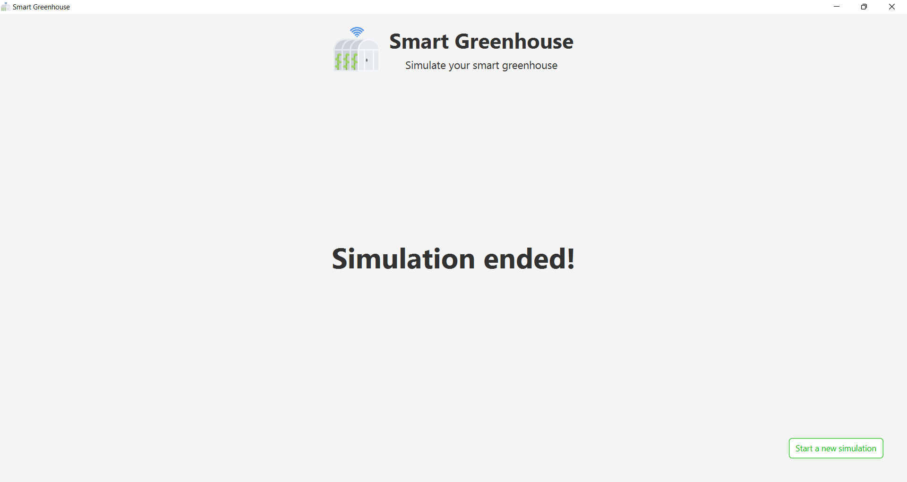

# 8. Guida utente

All’avvio dell’applicazione, l’utente dovrà selezionare il comune di ubicazione della serra ([Fig. 8.1]). Successivamente, dovrà  scegliere una o più piante da coltivare all’interno di essa, tra le 25 specie che verranno mostrate nell’apposita schermata ([Fig. 8.2]).

  
  
 Fig. 8.1 - Schermata per la selezione del comune di ubicazione 

[Fig. 8.1]: img/userGuide_selectCity.png

  
  
 Fig. 8.2 - Schermata per la selezione delle piante 

[Fig. 8.2]: img/userGuide_selectCity.png

Una volta scelte le piante, verrà visualizzata una schermata di loading in attesa di ottenere le informazioni richieste dal web.

Dopodiché sarà possibile avviare la simulazione. Quest'ultima potrà essere monitorata attraverso due schermate: una principale in cui è possibile visionare lo stato globale della serra, monitorare i dati ambientali e lo scorrere del tempo virtuale; e una schermata di dettaglio nella quale è possibile visualizzare lo stato relativo ad una specifica area.

In particolare, come mostrato dalla figura ([Fig. 8.3]), la schermata principale mostra nella parte superiore i dati ambientali relativi alle condizioni metereologiche che si verificano nella città di ubicazione della serra, i quali vengono aggiornati periodicamente, con cadenza oraria.
 
Nella sezione centrale è possibile visualizzare la suddivisione in aree della struttura ed ognuna di queste riporta le informazioni relative alla pianta coltivata e i parametri ambientali rilevati all’interno dell’area, i quali vengono influenzati da quelli dell’ambiente; inoltre, è possibile dedurre lo stato di allarme di un’area in base al colore mostrato. Nello specifico, il colore verde indica una situazione ottimale per la crescita della pianta; mentre il colore rosso indica una situazione critica per essa, ovvero i sensori all'interno dell’area hanno rilevato uno o più valori dei parametri ambientali che non rientrano nei range ottimali.

Nella parte inferiore della schermata l’utente ha la possibilità di visualizzare lo scorrere del tempo d’esecuzione, il quale parte virtualmente dalle ore 00:00 e termina alle ore 24:00, per cui la simulazione ha una durata totale di 24 ore. Nella parte sottostante alla visualizzazione del tempo virtuale, l’utente ha a disposizione uno slider con cui poter incrementare la velocità della simulazione. Alternativamente, mediante il pulsante "Terminate simulation", è possibile terminare in anticipo la simulazione.

  
  
 Fig. 8.3 - Schermata principale della simulazione 

[Fig. 8.3]: img/userGuide_mainView.png

Cliccando su una specifica area, si potrà visualizzare la schermata di dettaglio ([Fig. 8.4]) in cui sarà possibile visionare: l’immagine e la descrizione della pianta coltivata; lo stato dell’area, se di allarme o normale; i valori ottimali e correnti per ogni parametro ambientale rilevato dai sensori posti all’interno dell’area e le azioni che possono essere intraprese per regolare i parametri rilevati al suo interno.

In relazione ad ogni parametro, vi è l’indicazione se siano stati rilevati dei valori critici o meno. Nel caso in cui venga segnalata una situazione di allarme, all’utente verranno mostrati dei suggerimenti relativi alle azioni che possono essere intraprese per riportare l’area in una condizione ottimale.

  
  
 Fig. 8.4 - Schermata per la visualizzazione in dettaglio dell'area 

[Fig. 8.4]: img/userGuide_detailArea.png

Qualora l’utente abbia deciso di terminare in anticipo la simulazione oppure siano trascorse le 24 ore virtuali, l’utente verrà reindirizzato alla schermata di fine simulazione ([Fig. 8.5]) in cui si avrà la possibilità di iniziarne una nuova, semplicemente cliccando sul pulsante “Start a new simulation”.

  
  
 Fig. 8.5 - Schermata finale 

[Fig. 8.5]: img/userGuide_finishSimulation.png
