# Smart Greenhouse Simulator

## Autori

[Veronika Folin](mailto:veronika.folin@studio.unibo.it),
[Maria Mengozzi](mailto:maria.mengozzi3@studio.unibo.it),
[Anna Vitali](mailto:anna.vitali4@studio.unibo.it),
[Elena Yan](mailto:elena.yan@studio.unibo.it)

## Indice
- [Introduzione](#introduzione)
- [1. Processo di sviluppo](#1-processo-di-sviluppo)
  - [1.1 Meetings](#11-meetings)
  - [1.2 Divisione dei tasks](#12-divisione-dei-tasks)
  - [1.3 Strumenti utilizzati](#13-strumenti-utilizzati)
- [2. Requisiti](#2-requisiti)
  -  [2.1 Requisiti di business](#21-requisiti-di-business)
  -  [2.2 Requisiti utente](#22-requisiti-utente)
  -  [2.3 Requisiti funzionali](#23-requisiti-funzionali)
  -  [2.4 Requisiti non funzionali](#24-requisiti-non-funzionali)
  -  [2.5 Requisiti implementativi](#25-requisiti-implementativi)
- [3. Design Architetturale](#3-design-architetturale)
  - [3.1 Architettura complessiva](#31-architettura-complessiva)
  - [3.2 Pattern architetturali utilizzati](#32-pattern-architetturali-utilizzati)
- [4. Design dettagliato](#4-design-dettagliato)
  - [4.1 View e Controller: elementi comuni](#41-view-e-controller-elementi-comuni)
  - [4.2 Gestione della simulazione](#42-gestione-della-simulazione)
  - [4.3 Impostazione dei parametri della simulazione](#43-impostazione-dei-parametri-della-simulazione)
  - [4.4 Caricamento dei dati delle piante](#44-caricamento-dei-dati-delle-piante)
  - [4.5 Avvio Simulazione](#45-avvio-simulazione)
  - [4.6 Serra](#46-serra)
  - [4.7 Visualizzazione del dettaglio di un'area](#47-visualizzazione-del-dettaglio-di-unarea)
  - [4.8 Sensori](#48-sensori)
  - [4.9 Fine Simulazione](#49-fine-simulazione)
  - [4.10 Pattern utilizzati](#410-pattern-utilizzati)
  - [4.11 Organizzazione del codice](#411-organizzazione-del-codice)
- [5. Implementazione](#5-implementazione)
  - [5.1 Utilizzo del paradigma funzionale](#51-utilizzo-del-paradigma-funzionale)
  - [5.2 Utilizzo del paradigma logico](#52-utilizzo-del-paradigma-logico)
  - [5.3 Programmazione reattiva ed asincrona](#53-programmazione-reattiva-e-asincrona)
  - [5.4 Richieste dei dati](#54-richieste-dei-dati)
  - [5.5 Utilizzo di ScalaFX e JavaFX](#55-utilizzo-di-scalafx-e-javafx)
  - [5.6 Testing](#56-testing)
  - [5.7 Suddivisione del lavoro](#57-suddivisione-del-lavoro)
- [6. Retrospettiva](#6-retrospettiva)
  - [6.1 Avviamento](#61-avviamento)
  - [6.2 Sprint](#62-sprint)
  - [6.3 Commenti finali](#63-commenti-finali)
- [7. Conclusioni](#7-conclusioni)
- [Guida utente](#guida-utente)

<div style="page-break-after: always;"></div>

# Introduzione

Per il progetto di _Paradigmi di Programmazione e Sviluppo_, si è pensato di realizzare un'applicazione che permetta di simulare la gestione di una serra intelligente, in grado di ricevere aggiornamenti periodici sulle condizioni ambientali e di generare, in automatico, suggerimenti per chi si occupa della sua manutenzione.

Una volta avviata l'applicazione, sarà possibile selezionare la località di ubicazione della serra e le piante da coltivare al suo interno.

La serra è suddivisa in aree ed ognuna di esse è monitorata da quattro sensori, i quali rilevano parametri rilevanti per la vita delle piante al suo interno: luminosità, umidità del terreno, temperatura e umidità dell'aria.

L'utente avrà la possibilità di visualizzare l'aggiornamento delle condizioni metereologiche e di osservare l'evoluzione dello stato delle singole aree della serra.

Nel caso in cui una determinata zona della serra entri in uno stato di allarme, per uno o più parametri di cui sono stati rilevati valori critici, l'utente avrà la possibilità di intraprendere azioni correttive al fine di riportare i valori nei range ottimali.

<div style="page-break-after: always;"></div>

# 1. Processo di sviluppo

Per il processo di sviluppo, il team di lavoro ha deciso di utilizzare un approccio _SCRUM-inspired_. In particolare,  [_SCRUM_](https://www.scrum.org/) è un _framework_ di sviluppo software agile, iterativo e incrementale, che consente la gestione dello sviluppo del prodotto.

Specificatamente, tale processo prevede di:
1. nominare uno studente (ad esempio, chi ha l'idea del progetto) che fungerà da _committente_ o esperto del dominio, e che cercherà di garantire l'usabilità e la qualità del risultato;
2. designare uno studente (ad esempio, chi pensa di avere doti di coordinamento) che ricoprirà il ruolo di _product owner_;
3. effettuare un meeting iniziale in cui redigere un _product backlog_ e definire un primo sprint organizzativo;
4. utilizzare sprint corti, da 15-20 ore di lavoro, con l'obiettivo di ottenere ad ogni sprint dei risultati "tangibili", ossia con un valore per gli _stakeholder_;
5. fare meeting frequenti ed a inizio/fine sprint (opportunamente documentati da un brevissimo report del risultato, anch'esso da tenere in versione), realizzando uno _sprint backlog_ per mantenere traccia dell'organizzazione dei lavori.

## 1.1 Meetings

I meetings sono stati realizzati definendo, inizialmente, un ordine del giorno redatto principalmente dal _product owner_, in collaborazione con gli altri membri del gruppo che possono suggerire modifiche o nuovi aspetti da discutere.

Sono stati svolti incontri brevi e frequenti, pressoché quotidiani, in modo da mantenere aggiornati i diversi membri del gruppo sullo stato di avanzamento del progetto.

Per quanto riguarda gli sprint, come specificato precedentemente, essi sono stati svolti nell'arco di una settimana lavorativa e discussi in incontri a inizio e fine periodo. 

In particolare, durante l’incontro di inizio sprint, viene definito il _product backlog_ relativo mentre, durante quello di fine Sprint, vengono discussi i risultati ottenuti e viene revisionato il lavoro svolto.

I diversi meetings sono stati tenuti in modalità _smart-working_, attraverso l’utilizzo di piattaforme per videoconferenze.

Ogni meeting e il rispettivo ordine del giorno sono stati tracciati in un apposito file, che è possibile trovare fra gli artefatti del progetto.

### 1.1.1 Sprint planning

Lo _sprint planning_ è un meeting in cui il team pianifica il lavoro che deve essere svolto e portato a termine durante lo sprint. Questo prevede di individuare i diversi elementi del _product backlog_ e i differenti _sprint tasks_ che devono essere effettuati per poter raggiungere gli obiettivi prefissati. Di conseguenza, durante i diversi _sprint planning_ sono stati discussi i seguenti punti:

1.	definizione dell’obiettivo principale dello sprint;
2.	stato di sviluppo da raggiungere alla fine dello sprint, tramite il raffinamento del _product backlog_;
3.	definizione dei diversi tasks da svolgere per il raggiungimento degli obiettivi preposti;
4.	assegnazione dei task ai diversi membri del gruppo.

### 1.1.2 Sprint review

Lo _sprint review_ è un meeting che ha luogo alla fine dello sprint e che ha l’obiettivo di revisionare e valutare il lavoro svolto dal team di sviluppo. 

Pertanto, durante i differenti _sprint review_ sono stati discussi i seguenti punti:

1.	analisi dell’incremento ottenuto rispetto al risultato precedente, valutando il lavoro che è stato svolto;
2.	aggiornamento e adattamento del _product backlog_;
3.	valutazione di eventuali ritardi rispetto ai tempi definiti in precedenza;
4.	formalizzazione del risultato ottenuto, riportandolo nello _sprint result_ del relativo _product backlog_.

### 1.1.3 Daily SCRUM

Il _daily SCRUM_ rappresenta un momento in cui il team si riunisce e ogni membro mette al corrente i collaboratori del proprio operato. Il meeting è breve (circa 15-20 minuti) e durante questo tipo di incontro ogni membro del gruppo espone i seguenti punti:

1.	il lavoro svolto nella giornata corrente;
2.	le eventuali problematiche riscontrate durante lo sviluppo, chiedendo consigli agli altri membri del team su come poterle risolvere;
3.	la pianificazione dei successivi compiti che si intende svolgere, a fronte di quanto emerso nei precedenti punti.

Va specificato che questi meetings non sono stati svolti necessariamente tutti in videoconferenza, ma anche via chat. Inoltre, queste occasioni di discussione, in quanto giornaliere e di breve durata, non sono state documentate.

## 1.2 Divisione dei tasks

All’avvio di ciascuno sprint settimanale, mediante il _product backlog_,  sono stati assegnati a ciascun membro del team una serie di tasks da svolgere.

In particolare, ogni componente del team ha contribuito al progetto realizzando i tasks descritti di seguito.

#### Folin Veronika

<table>
  <thead>
    <td><b>Macro-obiettivo</b></td>
    <td><b>Task</b></td>
  </thead>
  
  <tr>
    <td rowspan="2">Selezionare le piante da coltivare all'interno della serra</td>
    <td>Caricamento delle piante selezionabili in un file Prolog</td>
  </tr>
  <tr>
    <td>Creare interfaccia componente pianta</td>
  </tr>
  
  <tr>
    <td rowspan="2">Avvio della simulazione</td>
    <td>Creare layout schermata di visualizzazione stato globale della serra</td>
  </tr>
  <tr>
    <td>Creare componente Model per gestire l'avvio del tempo</td>
  </tr>
  
  <tr>
    <td rowspan="3">Consentire lo scorrimento fra le diverse pagine dell'applicazione</td>
    <td>Realizzazione architettura MVC tramite cake pattern per la visualizzazione dello stato globale della serra</td>
  </tr>
  <tr>
    <td>Realizzazione MVC globale della simulazione*</td>
  </tr>
  <tr>
    <td>Realizzazione collegamento fra i diversi MVC*</td>
  </tr>
  
  <tr>
    <td rowspan="2">Visualizzare lo stato aggiornato della simulazione</td>
    <td>Aggiornamento parametri ambientali tramite richieste periodiche*</td>
  </tr>
  <tr>
    <td>Gestione e visualizzazione aggiornamento tempo</td>
  </tr>
  
  <tr>
    <td>Visualizzare lo stato aggiornato delle singole aree</td>
    <td>Gestire interazione e collegamento fra: l'environment e i sensori*</td>
  </tr>
  
   <tr>
    <td rowspan="2">Consentire la gestione di un'area</td>
    <td>Refactor e ottimizzazione views dell'applicazione</td>
  </tr>
  <tr>
    <td>Collegare mvc dettaglio aree all'applicazione*</td>
  </tr>
  
  <tr>
    <td>Miglioramento reattività dell'applicazione</td>
    <td>Gestire tramite reactive programming le richieste per i parametri dell'ambiente</td>
  </tr>
  
  <tr>
    <td rowspan="3">Miglioramento dell'esperienza utente</td>
    <td>Sistemare elementi dell'interfaccia grafica*</td>
  </tr>
  <tr>
    <td>Verifica del coretto funzionamento dell'applicazione tramite test manuali*</td>
  </tr>
  <tr>
    <td>Sostituzione piante prive di descrizione o con descrizione non esaustiva</td>
  </tr>
  
  <tr>
    <td>Guida utente per l'applicazione</td>
    <td>Inserire guida utente nell'applicazione</td>
  </tr>
  
  <tr>
    <td rowspan="3">Documentazione</td>
    <td>Raffinare diagrammi UML*</td>
  </tr>
  <tr>
    <td>Terminare report*</td>
  </tr>
  <tr>
    <td>Scrivere file README</td>
  </tr>
  
  <tr>
    <td rowspan="4">Applicazione finale</td>
    <td>Operazioni finali di refactoring del codice, miglioramento dei test e ottimizzazione degli imports*</td>
  </tr>
  <tr> 
    <td>Realizzare file .jar*</td>
  </tr>
  <tr>
    <td>Valutare coverage finale ottenuta*</td>
  </tr>
  <tr>
    <td>Effettuare prima release dell'applicazione*</td>
  </tr>
  
 </table>
 
#### Mengozzi Maria

<table>
  <thead>
    <td><b>Macro-obiettivo</b></td>
    <td><b>Task</b></td>
  </thead>
  
  <tr>
    <td rowspan="3">Selezionare la città di ubicazione della serra</td>
    <td>Caricamento delle città in un file Prolog</td>
  </tr>
  <tr>
    <td>Creare interfaccia componente città</td>
  </tr>
  <tr>
    <td>Realizzazione meccanismo di salvataggio della città selezionata</td>
  </tr>
  
  <tr>
    <td>Avvio della simulazione</td>
    <td>Realizzare la visualizzazione della suddivisione in aree e del nome delle piante in ciascuna zona della serra</td>
  </tr>
  
  <tr>
    <td rowspan="3">Consentire lo scorrimento fra le diverse pagine dell'applicazione</td>
    <td>Realizzazione architettura MVC tramite cake pattern per la divisione in aree della serra</td>
  </tr>
  <tr>
    <td>Realizzazione MVC globale della simulazione*</td>
  </tr>
  <tr>
    <td>Realizzazione collegamento fra i diversi MVC*</td>
  </tr>
  
  <tr>
    <td rowspan="3">Visualizzare lo stato aggiornato della simulazione</td>
    <td>Aggiornamento parametri ambientali tramite richieste periodiche*</td>
  </tr>
  <tr>
    <td>Definizione interfaccia area e realizzare la sua implementazione</td>
  </tr>
  <tr>
    <td>Gestire il collegamento fra: la serra, le aree e le piante</td>
  </tr>
  
  <tr>
    <td>Visualizzare lo stato aggiornato delle singole aree</td>
    <td>Gestire interazione e collegamento fra: le aree e i sensori*</td>
  </tr>
  
  <tr>
    <td rowspan="3">Consentire la gestione di un'area</td>
    <td>Realizzare model dettaglio aree</td>
  </tr>
  <tr>
    <td>Realizzare controller dettaglio aree*</td>
  </tr>
  <tr>
    <td>Collegare mvc dettaglio aree all'applicazione*</td>
  </tr>
  
  <tr>
    <td rowspan="5">Miglioramento dell'esperienza utente</td>
    <td>Sistemare elementi dell'interfaccia grafica*</td>
  </tr>
  <tr>
    <td>Verificare adattabilità dei diversi componenti alla dimensione dello schermo e al resizing</td>
  </tr>
  <tr>
    <td>Verifica del coretto funzionamento dell'applicazione tramite test manuali*</td>
  </tr>
  <tr>
    <td>Miglioramento stile aree nella schermata principale</td>
  </tr>
  <tr>
    <td>Refactor gestione stati aree e sensori</td>
  </tr>
  
  <tr>
    <td>Guida utente per l'applicazione</td>
    <td>Scrivere guida utente per l'applicazione*</td>
  </tr>
  
  <tr>
    <td rowspan="2">Documentazione</td>
    <td>Raffinare diagrammi UML*</td>
  </tr>
  <tr>
    <td>Terminare report*</td>
  </tr>
  
  <tr>
    <td rowspan="4">Applicazione finale</td>
    <td>Operazioni finali di refactoring del codice, miglioramento dei test e ottimizzazione degli imports*</td>
  </tr>
  <tr> 
    <td>Realizzare file .jar*</td>
  </tr>
  <tr>
    <td>Valutare coverage finale ottenuta*</td>
  </tr>
  <tr>
    <td>Effettuare prima release dell'applicazione*</td>
  </tr>
  
 </table>

#### Vitali Anna

<table>
  <thead>
    <td><b>Macro-obiettivo</b></td>
    <td><b>Task</b></td>
  </thead>
  
  <tr>
    <td rowspan="2">Selezionare le piante da coltivare all'interno della serra</td>
    <td>Creare layout schermata di selezione delle piante</td>
  </tr>
  <tr>
    <td>Realizzazione meccanismo di salvataggio delle piante selezionate</td>
  </tr>
  
  <tr>
    <td rowspan="2">Avvio della simulazione</td>
    <td>Creare componente Controller gestire l'avvio del tempo</td>
  </tr>
  <tr>
    <td>Creare layout schermata di fine simulazione</td>
  </tr>
 
  <tr>
    <td rowspan="3">Consentire lo scorrimento fra le diverse pagine dell'applicazione</td>
    <td>Realizzazione architettura MVC tramite cake pattern per la selezione delle piante</td>
  </tr>
  <tr>
    <td>Realizzazione MVC globale della simulazione*</td>
  </tr>
  <tr>
    <td>Realizzazione collegamento fra i diversi MVC*</td>
  </tr>
  
 <tr>
    <td rowspan="6">Visualizzare lo stato aggiornato delle singole aree</td>
    <td>Impostazione formula di aggiornamento dei valori dei sensori*</td>
  </tr>
  <tr>
    <td>Definizione interfaccia sensori*</td>
  </tr>
  <tr>
    <td>Implementazione sensore luminosità</td>
  </tr>
  <tr>
    <td>Implementazione sensore temperatura</td>
  </tr>
  <tr>
    <td>Gestire interazione e collegamento fra: le aree e i sensori*</td>
  </tr>
  <tr>
    <td>Gestire interazione e collegamento fra: l'environment e i sensori*</td>
  </tr>
  
  <tr>
    <td rowspan="2">Consentire la gestione di un'area</td>
    <td>Refactor e ottimizzazione controllers dell'applicazione</td>
  </tr>
  <tr>
    <td>Collegare mvc dettaglio aree all'applicazione*</td>
  </tr>
  
  <tr>
    <td>Miglioramento reattività dell'applicazione</td>
    <td>Gestire tramite reactive programming le richieste per i parametri delle piante</td>
  </tr>
  
  <tr>
    <td rowspan="4">Miglioramento dell'esperienza utente</td>
    <td>Sistemare elementi dell'interfaccia grafica*</td>
  </tr>
  <tr>
    <td>Verifica del coretto funzionamento dell'applicazione tramite test manuali*</td>
  </tr>
  <tr>
    <td>Miglioramento stile schermata selezione delle piante</td>
  </tr>
  <tr>
    <td>Refactor registrazione callbacks timer*</td>
  </tr>
  
  <tr>
    <td>Guida utente per l'applicazione</td>
    <td>Scrivere guida utente per l'applicazione*</td>
  </tr>
  
  <tr>
    <td rowspan="2">Documentazione</td>
    <td>Raffinare diagrammi UML*</td>
  </tr>
  <tr>
    <td>Terminare report*</td>
  </tr>
  
  <tr>
    <td rowspan="4">Applicazione finale</td>
    <td>Operazioni finali di refactoring del codice, miglioramento dei test e ottimizzazione degli imports*</td>
  </tr>
  <tr> 
    <td>Realizzare file .jar*</td>
  </tr>
  <tr>
    <td>Valutare coverage finale ottenuta*</td>
  </tr>
  <tr>
    <td>Effettuare prima release dell'applicazione*</td>
  </tr>
  
 </table>

#### Yan Elena

<table>
  <thead>
    <td><b>Macro-obiettivo</b></td>
    <td><b>Task</b></td>
  </thead>
  
  <tr>
    <td rowspan="2">Selezionare la città di ubicazione della serra</td>
    <td>Creare layout schermata di selezione della città</td>
  </tr>
  <tr>
    <td>Realizzazione live search delle città</td>
  </tr>
  
  <tr>
    <td rowspan="2">Avvio della simulazione</td>
    <td>Gestire l'aggiornamento dello scorrere del tempo</td>
  </tr>
  <tr>
    <td>Gestire la modifica della velocità dello scorre del tempo</td>
  </tr>
  
  <tr>
    <td rowspan="4">Consentire lo scorrimento fra le diverse pagine dell'applicazione</td>
    <td>Refactoring schermata BaseView, con aggiunta pulsanti per la navigazione</td>
  </tr>
  <tr>
    <td>Realizzazione architettura MVC tramite cake pattern per la selezione della città</td>
  </tr>
  <tr>
    <td>Realizzazione MVC globale della simulazione*</td>
  </tr>
  <tr>
    <td>Realizzazione collegamento fra i diversi MVC*</td>
  </tr>
  
  <tr>
    <td rowspan="6">Visualizzare lo stato aggiornato delle singole aree</td>
    <td>Impostazione formula di aggiornamento dei valori dei sensori*</td>
  </tr>
  <tr>
    <td>Definizione interfaccia sensori*</td>
  </tr>
  <tr>
    <td>Implementazione sensore umidità dell'aria</td>
  </tr>
  <tr>
    <td>Implementazione sensore umidità del terreno</td>
  </tr>
  <tr>
    <td>Gestire interazione e collegamento fra: le aree e i sensori*</td>
  </tr>
  <tr>
    <td>Gestire interazione e collegamento fra: l'environment e i sensori*</td>
  </tr>
  
  <tr>
    <td rowspan="3">Consentire la gestione di un'area</td>
    <td>Realizzare controller dettaglio aree*</td>
  </tr>
  <tr>
    <td>Realizzare view dettaglio aree</td>
  </tr>
  <tr>
    <td>Collegare mvc dettaglio aree all'applicazione*</td>
  </tr>
  
  <tr>
    <td rowspan="6">Miglioramento dell'esperienza utente</td>
    <td>Sistemare stile pulsanti delle diverse schermate</td>
  </tr>
  <tr>
    <td>Sistemare elementi dell'interfaccia grafica*</td>
  </tr>
  <tr>
    <td>Verifica del coretto funzionamento dell'applicazione tramite test manuali*</td>
  </tr>
  <tr>
    <td>Aggiunta icona applicazione</td>
  </tr>
  <tr>
    <td>Refactor registrazione callbacks timer*</td>
  </tr>
  <tr>
    <td>Refactor gestione stati pulsanti della schermata dettaglio area</td>
  </tr>
  
  <tr>
    <td rowspan="2">Documentazione</td>
    <td>Raffinare diagrammi UML*</td>
  </tr>
  <tr>
    <td>Terminare report*</td>
  </tr>
  
  <tr>
    <td rowspan="4">Applicazione finale</td>
    <td>Operazioni finali di refactoring del codice, miglioramento dei test e ottimizzazione degli imports*</td>
  </tr>
  <tr> 
    <td>Realizzare file .jar*</td>
  </tr>
  <tr>
    <td>Valutare coverage finale ottenuta*</td>
  </tr>
  <tr>
    <td>Effettuare prima release dell'applicazione*</td>
  </tr>
  
</table>

\* questi task sono stati completati a seguito di una collaborazione fra più componenti del gruppo (vedere i diversi _product backlog_ relativi al progetto per maggiori dettagli).

### 1.2.1 Aggregazione dei risultati

Il progetto è stato realizzato attraverso l'utilizzo di un _repository_ GitHub.

In questo modo, dopo che ad ogni membro del gruppo sono stati affidati i diversi compiti da svolgere, è possibile procedere all'esecuzione dei tasks in modo indipendente, aprendo un proprio _branch_ di lavoro sul _repository_ del progetto.

Al termine dello sprint, i diversi _branches_ vengono chiusi e uniti, tramite l'operazione di `merge`, al _branch_ di sviluppo principale (`develop`). 

Tuttavia, nel caso in cui il completamento del lavoro di uno dipenda dall'esecuzione di quello di altri, i membri coinvolti collaborano al fine di unire i diversi _branches_ o ne creano di nuovi da cui partire, in modo da proseguire e completare i tasks successivi.

Una volta che tutti i lavori per il progetto sono stati terminati e si è quindi pronti per la prima _release_ dell'applicazione, si provvederà all'unione del _branch_ `develop` con il _branch_ `master`, che contiene le versioni rilasciate del progetto.

### 1.2.2 Revisione dei task

Al termine di ogni sprint, si procede alla revisione del lavoro svolto  durante la settimana. In particolare, si verifica la realizzazione dei tasks affidati a ogni membro del gruppo, analizzandone la loro completezza in base alla _definition of done_ stabilita all'inizio del progetto.

Se durante l'incontro ci si rende conto di alcuni aspetti del lavoro svolto che potrebbero essere migliorati o di incompletezze nel risultato ottenuto, si richiede al rispettivo membro responsabile di correggere o completare i lavori che gli sono stati affidati,  prima di proseguire con il successivo sprint.

Infine, a seguito dell'incontro di _sprint review_, si può decidere di effettuare il _refactoring_ di elementi già realizzati, dando luogo a nuovi tasks che dovranno essere realizzati nello sprint successivo.

## 1.3 Strumenti utilizzati

Per la realizzazione del progetto sono stati utilizzati differenti _tool_ a supporto del processo di sviluppo. Tali strumenti hanno come obiettivo quello di agevolare gli sviluppatori durante tutta la realizzazione del progetto, cercando di automatizzarne i diversi aspetti.

Pertanto, gli strumenti impiegati per il progetto sono riportati di seguito:

-	**SBT**, per la _build automation_;
-	**Wartremover**, per valutare la qualità del codice prodotto, individuando possibili pattern problematici;
-	**Scalastyle**, per formattare correttamente il codice in conformità alle convenzioni di _Scala_;
-	**ScalaTest**, per la scrittura ed esecuzione di test automatizzati sul codice di produzione;
-	**UnitTest**, per la verifica delle funzionalità della _UI_;
-	**GitHub**, come servizio di hosting per il codice sorgente e i files utilizzati durante il processo di sviluppo;
-	**GitHub Actions**, per promuovere la _continuous integration_;
-	**Trello**, come tool collaborativo per la gestione degli sprint tasks.

<div style="page-break-after: always;"></div>

# 2. Requisiti

In questa sezione verranno discussi i requisiti dell'applicazione che verrà realizzata, a partire da quelli di business fino a quelli funzionali e non funzionali.

I requisiti verranno numerati in modo tale che, nel seguito, potranno essere ricondotti alle rispettive sottosezioni.

## 2.1 Requisiti di business
I requisiti di business previsti dall'applicazione sono:

1. simulare una serra intelligente in cui sono posti dei sensori per il monitoraggio delle coltivazioni;
2. ricevere una segnalazione ogni qual volta venga rilevato un valore critico;
3. effettuare azioni correttive al fine di ripristinare i valori ottimali.

## 2.2 Requisiti utente
Il committente ha richiesto un sistema che rispetti la seguente descrizione:

> Sono un'insegnante di "_Tecniche delle produzioni vegetali e zootecniche_" dell'istituto agrario di Cesena. Nell'ultimo periodo, per via della pandemia, gli studenti non hanno avuto la possibilità di sperimentare la gestione di una serra, argomento previsto dal corso. Vorrei, quindi, che gli studenti avessero la possibilità, attraverso un simulatore, di provare questa esperienza. 
> 
> La serra è una struttura divisa in aree adibite alla coltivazione e alla conservazione di specie vegetali bisognose di particolari condizioni ambientali. In ogni area dell'impianto è possibile coltivare una sola tipologia di piantagione che viene solitamente monitorata da dei sensori che rilevano 4 parametri essenziali per la loro crescita: luminosità e temperatura ambientale, umidità del suolo e dell'aria. 
> 
> Mi piacerebbe che ogni studente potesse personalizzare la propria serra scegliendo la località in cui verrà virtualmente situata, il numero di aree in cui sarà suddivisa e le tipologie di piante da coltivare in quest'ultime.
>
> Un buono stato di salute delle coltivazioni può essere ottenuto rispettando specifici range di valori; questi ultimi possono essere influenzati sia dalle condizioni ambientali all'interno della serra che dalle condizioni metereologiche. I parametri ottimali dovranno essere visualizzabili dagli studenti, in modo tale che abbiano un riferimento teorico durante la simulazione.
>
> Vorrei quindi un'applicazione che simuli lo stato globale della serra nell'arco di una giornata, mostrando in particolare i valori rilevati nelle singole aree ed eventuali situazioni critiche per le coltivazioni all'interno di esse, segnalate mediante un avviso. Inoltre, al verificarsi di quest'ultima situazione, lo studente dovrà essere opportunamente guidato nelle azioni correttive.
>
> Tali criticità potranno essere gestite dallo studente mediante uno o più dei seguenti metodi:
> - regolando l'intensità luminosa delle lampade o schermando l'area, in relazione ad una scarsa o eccessiva luminosità; 
> - isolando l'area interessata e impostando la temperatura interna della stessa;
> - annaffiando o smuovendo il terreno, rispettivamente in caso di bassa o alta umidità del suolo;
> - nebulizzando o ventilando l'ambiente, rispettivamente in caso di bassa o alta umidità ambientale.

Chi farà uso dell'applicazione potrà quindi:

1. impostare i seguenti parametri della simulazione:
	1. la località di ubicazione della serra
	2. il numero di aree
	3. la tipologia di pianta da coltivare all'interno di ogni area
	
2. visualizzare le variazioni ambientali nell'arco della giornata, relative a:
	1. luminosità
	2. temperatura
	3. umidità
	4. condizioni metereologiche (es: soleggiato, nuvoloso, ecc...)

3. osservare lo stato globale della serra, in particolare:
	1. la suddivisione in aree
	2. il nome della pianta coltivata per ogni rispettiva area 
	3. lo stato dell'area, nello specifico se risulta essere o meno in allarme

4. osservare lo stato all'interno di una specifica area, includendo:
	1. le informazioni riguardanti la coltivazione
		1. immagine
		2. nome
		3. descrizione
		4. parametri ottimali di riferimento
	2. i parametri rilevati dai sensori
	3. un'indicazione dello stato attuale dell'area, se risulta essere o meno in allarme

5. compiere operazioni per la cura ordinaria delle coltivazioni all'interno delle singole aree, le quali potranno essere messe in atto anche per far fronte alle diverse situazioni di allarme, in particolare:
	1. regolare l'intensità luminosa delle lampade
	2. schermare l'area
	3. isolare l'area
	4. impostare la temperatura interna all'area
	5. annaffiare il terreno
	6. smuovere il terreno
	7. nebulizzare l'ambiente
	8. ventilare l'ambiente

6. in caso di allarme, visualizzare i suggerimenti rispetto alle azioni da intraprendere per ristabilire lo stato dell'area

## 2.3 Requisiti funzionali

Sono stati identificati i seguenti requisiti funzionali:

1. la personalizzazione della simulazione, permettendo all'utente di specificare:
	1. la località 
	2. le tipologie di piante da coltivare, scegliendo tra quelle disponibili e visualizzando quelle selezionate
	
2. all'avvio della simulazione da parte dell'utente, il sistema dovrà essere in grado di:
	1. richiedere le previsioni metereologiche previste per il giorno stesso
	2. dedurre il numero di aree in base alla quantità di specie scelte e, di conseguenza, disegnarne la struttura della serra

3. l'osservazione dello stato di esecuzione della simulazione:
	1. visualizzando lo scorrere del tempo e permettendo all'utente di impostarne la velocità

4. l'osservazione dello stato globale della serra, visualizzando:
	1. le condizioni ambientali che verranno aggiornate durante tutta l'esecuzione in base alle previsioni metereologiche
	2. la suddivisione in aree
	3. il nome della pianta presente in ogni area
	4. i parametri rilevati dai sensori all'interno delle singole aree
	5. l'eventuale stato di allarme di un'area

5. alla richiesta di accesso ad una specifica area, mostrare:
	1. lo scorrere del tempo
	2. le informazioni relative alla coltivazione (immagine, nome, descrizione)
	3. lo stato attuale 
	4. i valori ottimali per ogni parametro
	5. i valori attuali per ogni grandezza misurata, evidenziando quando questi non rientrano nel range ottimale
	6. le possibili azioni che possono essere intraprese in caso di allarme, associandole ai parametri che influenzano, come:
		1. aprire e chiudere la schermatura dell'area
		2. regolare l'intensità luminosa delle lampade, una volta schermata l'area
		3. isolare termicamente la struttura
		4. regolare la temperatura, una volta isolata l'area
		5. nebulizzare l'ambiente
		6. ventilare l'ambiente
		7. smuovere il terreno 
		8. innaffiare

6. visualizzare in tempo reale l'aggiornamento dei valori a seguito di:
	1. modifiche delle condizioni metereologiche
	2. azioni intraprese dall'utente

7. la possibilità di terminare la simulazione in qualsiasi momento e di avviarne una nuova

## 2.4 Requisiti non funzionali
Sono stati identificati i seguenti requisiti non funzionali:
- l'applicazione deve essere _cross-platform_, cioè eseguibile sia su Windows che su MacOS e Linux, o comunque su qualsiasi sistema operativo capace di supportare _Java Runtime Environment_ versione 16 e successive;
- l'interfaccia deve essere reattiva alle azioni dell'utente;
- l'applicazione non deve mai interrompersi qualora si verifichi un errore ma deve, invece, mostrare un messaggio di errore all'utente;
- l'applicazione deve essere sufficientemente modulare in modo tale che sia possibile riutilizzare i suoi componenti in contesti diversi.
- il sistema deve essere capace di scalare a seguito dell'aggiunta di nuovi componenti (es: aggiunta di nuovi sensori).

## 2.5 Requisiti implementativi
Di seguito vengono riportati i requisiti relativi all'implementazione del sistema:
- il sistema sarà sviluppato in _Scala 3_ e per eventuali feature sarà possibile integrare delle teorie _Prolog_;
- il sistema farà riferimento a _JDK 11_ ed eventuali librerie esterne utilizzate dovranno supportare, almeno, tale versione;
- il testing del sistema sarà effettuato utilizzando _ScalaTest_ e, per i componenti che rappresentano la View, _JUnit_.

<div style="page-break-after: always;"></div>

# 3. Design architetturale

Durante il primo meeting di avviamento del progetto, il team di sviluppo ha provveduto a definire ad alto livello il design architetturale dell'applicazione, il cui risultato verrà descritto nelle seguenti sezioni.

## 3.1 Architettura complessiva

Come componente principale dell'architettura si è deciso di adottare `Simulation`, il quale si occuperà di gestire i diversi elementi dell'applicazione.

Come si può osservare nella figura [Fig. 3.1.1], il componente `Simulation` viene suddiviso in tre elementi principali:
- `Simulation Model`, costituito dai diversi componenti dell'applicazione che si occupano di gestire la logica di funzionamento del programma;
- `SimulationView`, il quale è incaricato di mostrare i diversi elementi dell'interfaccia grafica e di gestire l'interazione con l'utente;
- `SimulationController`, che ricopre il ruolo di intermediario fra View e Model e si occupa di gestire lo scambio di informazioni fra questi due elementi.

<div align="center">
  
  <p> Fig. 3.1.1 - Architettura ad alto livello </p>
</div>

[Fig. 3.1.1]:img/architettura_alto_livello.png

Il Model, nello specifico è costituito dai componenti:
- `Time`, che rappresenta il tempo virtuale dell'applicazione;
- `Environment`, che rappresenta l'ambiente in cui è immersa la serra che si vuole gestire;
- `Greenhouse`, che rappresenta la serra della simulazione e si compone di aree rappresentate, a loro volta, dall'elemento `Area`;
- `Area`, che rappresenta una zona della serra dove viene coltivata una delle piante selezionate dall'utente, rappresentate dall'elemento `Plant`. Infine, un'area viene monitorata da appositi sensori, rappresentati dal componente `Sensor`.

## 3.2 Pattern architetturali utilizzati

Per realizzare la simulazione si è deciso di utilizzare il pattern architetturale _MVC (Model, View, Controller)_, il quale consente di separare la logica di presentazione dei dati dalla logica di business, al fine di rendere quanto più possibile indipendenti i diversi moduli che lo costituiscono.

Nello specifico, il funzionamento del _pattern MVC_ è il seguente:

- il Model cattura il comportamento dell'applicazione, indipendentemente dall'interfaccia utente, e fornisce i metodi per poter accedere ai dati;
- il Controller riceve i comandi dell'utente attraverso la View e reagisce modificando lo stato dei componenti View e Model;
- la View visualizza i dati contenuti nel Model e si occupa dell'interazione con gli utenti, notificando il Controller.

In sintesi, si è deciso di utilizzare questo pattern in quanto favorisce il riuso del codice, facilità la manutenzione del software e ne agevola la scalabilità.

<div style="page-break-after: always;"></div>

# 4. Design dettagliato
In questo capitolo verrà descritta nel dettaglio l'architettura del sistema, analizzandone i principali componenti e le rispettive caratteristiche.

L'applicazione è costituita da diverse scene, ciascuna delle quali racchiude una propria logica applicativa ed effettua delle elaborazioni a seguito delle azioni compiute dall'utente. Per riuscire a rispettare i requisiti e realizzare un sistema che fosse sufficientemente modulare, facilmente estendibile e quanto più possibile riutilizzabile e manutenibile, si è deciso di utilizzare il _Pattern MVC_ in combinazione al _Cake pattern_.

Tramite il _Pattern MVC_, come già descritto nella sezione [Sec. 3.2](#32-pattern-architetturali-utilizzati), abbiamo la possibilità di separare la logica di presentazione dei dati da quella di business, realizzando una View del tutto indipendente dal modello. In questo modo, se in un futuro si decidesse di adottare una tecnologia diversa da _ScalaFX_ per l'implementazione della View, si potrebbe tranquillamente intraprendere questo cambiamento, senza dover modificare il Model associato alle diverse schermate.

Il _Cake pattern_, invece, ci dá la possibilità di risolvere in modo agevole le dipendenze che legano gli elementi dell'_MVC_ tramite l'utilizzo di meccanismi della programmazione funzionale come: _mix-in_, _self-type_, _type members_, ecc... 

Questa strategia, sostanzialmente, prevede di implementare il _pattern MVC_ come una composizione di tre elementi: Model (M), View (V) e Controller (C), i quali presentano le seguenti dipendenze: C->V, V->C e C->M. 
Più precisamente, possiamo realizzare questi tre elementi incapsulando già al loro interno la risoluzione delle dipendenze precedentemente citate: alla fine, potremo istanziare un oggetto _MVC_ che li detiene tutti e tre e che è in grado di accedere alle rispettive proprietà, senza doversi preoccupare del loro collegamento.

Gli elementi Model, View e Controller vengono racchiusi in moduli, composti da:
- un `trait` (`Model`, `View` o `Controller`), il quale definisce l'interfaccia del rispettivo elemento;
-	una classe `ModelImpl`, `ViewImpl` o `ControllerImpl`, che rappresenta l'implementazione dell’interfaccia;
- un `trait Component`, il quale racchiude la classe implementativa. Tale `trait` assume forme differenti in base al modulo nel quale è racchiuso:
  - nel caso del Model si compone esclusivamente della classe implementativa [Fig. 4.1];
  - nel caso della View contiene il campo `context` di tipo `Requirements`, il quale viene utilizzato per specificare le dipendenze che legano la View al Controller [Fig. 4.2];
  - nel caso del Controller contiene sempre il capo `context` di tipo `Requirements` che viene, però, utilizzato per specificare le dipendenze che legano il Controller al Model e alla View [Fig. 4.3];
- un `trait Provider` che si occupa di detenere il rispettivo oggetto  di tipo `View`, `Model` o `Controller`;
- un `trait Interface` che si occupa di completare e connettere tutti i componenti del modulo per renderli utilizzabili nell'oggetto _MVC_.

<div align="center">
  
  <p> Fig. 4.1 - Model module </p>
</div>

[Fig. 4.1]: img/cake_model.png

<div align="center">
  
  <p> Fig. 4.2 - View module </p>
</div>

[Fig. 4.2]: img/cake_view.png

<div align="center">
  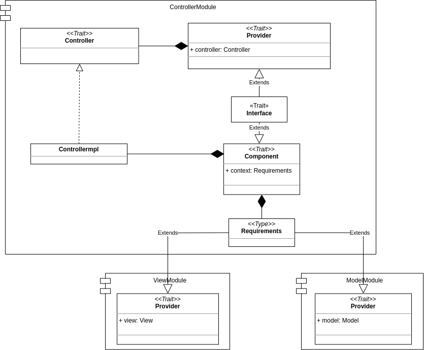
  <p> Fig. 4.3 - Controller module </p>
</div>

[Fig. 4.3]: img/cake_controller.png


Tutti gli elementi principali dell'applicazione, che richiedono di eseguire operazioni o di elaborare informazioni e fornire risultati a seguito delle azioni compiute dall'utente, sono stati realizzati seguendo questa strategia e nelle seguenti sezioni verranno descritti con maggiore dettaglio.

## 4.1 View e Controller: elementi comuni

I componenti, descritti nelle successive sottosezioni, fattorizzano elementi comuni del codice e permettono di evitarne la ripetizione.

### ViewComponent
`ViewComponent` è un’interfaccia generica che rappresenta un componente della View e, come si può vedere dalla figura (vedi [Fig. 4.1.1]), richiede che il tipo generico `A` sia sottotipo di `Parent`. Quest'ultimo è la classe base dei nodi con figli di _JavaFx_. 

Per l’implementazione di `ViewComponent` si è rispettato il pattern _Template Method_, definendo una classe astratta `AbstractViewComponent` dove è contenuto il template dei componenti. In tale classe viene incapsulata la logica necessaria per il caricamento dei layout e per la loro inizializzazione, lasciando alle sottoclassi la definizione del file _FXML_ associato.

Tutte le View estenderanno da tale classe, in modo da creare componenti modulari ed evitare ripetizioni del codice nel caricamento dei layout.

<div align="center">
  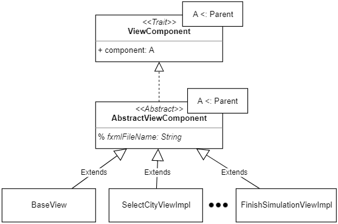
  <p> Fig. 4.1.1 - View Component </p>
</div>

[Fig. 4.1.1]: img/view_component.png


### ContiguousSceneView
`ContiguousSceneView` (vedi [Fig. 4.1.2]) è un’interfaccia generica che risulta utile per definire un componente della View che ha la necessità di richiedere al proprio Controller di effettuare operazioni particolari prima di notificare la View principale di visualizzare la nuova scena.

Tale interfaccia richiede che il nuovo elemento View da impostare sia di un tipo generico `A` sottotipo di `Parent`, ossia la classe base dei nodi con figli di _JavaFX_. 

<div align="center">
  
  <p> Fig. 4.1.2 - ContiguousSceneView </p>
</div>

[Fig. 4.1.2]: img/contiguousSceneView.png

### SceneController
Gli elementi comuni ai diversi Controller sono stati racchiusi all'interno dell'interfaccia `SceneController` (vedi [Fig. 4.1.3]), contenente il metodo `beforeNextScene` che si occupa di eseguire le operazioni che devono essere effettuate, prima di poter effettuare il cambio di scena.

<div align="center">
  
  <p> Fig. 4.1.3 - SceneController</p>
</div>

[Fig. 4.1.3]: img/scene_controller.png

## 4.2 Gestione della simulazione

La struttura articolata dell'applicazione ha introdotto la necessità di sviluppare un elemento che coordinasse i vari componenti Model, View e Controller, collocandosi ad un livello superiore. Nella sezione seguente si discuterà il design di tale elemento.

### SimulationMVC
`SimulationMVC` (vedi [Fig. 4.2.1]) rappresenta l’elemento _MVC_ principale della simulazione. Ad alto livello, questo componente si colloca al di sopra di tutti gli altri in quanto permette di:
-	mantenere aggiornati i vari componenti della simulazione in base allo scorrere del tempo;
-	detenere i riferimenti ad istanze inizializzate da altri componenti, al fine di poter essere accedute da coloro che ne necessitano;
-	inizializzare e modificare la schermata visualizzata in ogni momento dell’esecuzione dell’applicazione.

L'`Interface` di  `SimulationMVC` sarà estesa dalla maggior parte dei componenti MVC del progetto.

In particolare, la classe `SimulationMVC` racchiude i sottocomponenti `SimulationView` e `SimulationController`, derivanti dai rispettivi moduli. Come si può vedere dalla rappresentazione, `SimulationMVC` non racchiude un componente di tipo Model in quanto questo aspetto viene gestito da altri componenti _MVC_.

<div align="center">
  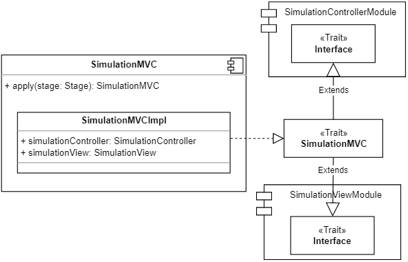
  <p> Fig. 4.2.1 - SimulationMVC </p>
</div>

[Fig. 4.2.1]: img/simulationMVC.png


### View della simulazione

Il `SimulationViewModule` (vedi [Fig. 4.2.2]) rappresenta la View principale dell'applicazione e si occupa di gestire: la scena, le _sotto-view_ e gli elementi comuni alle interfacce. 

Al suo interno troviamo il `trait SimulationView`, il quale include i metodi utili per l’avvio dell’applicazione, per gestire gli elementi comuni delle schermate e per passare da una _sotto-view_ all’altra.

Quando l'applicazione viene lanciata, viene creato prima di tutto il componente base dell’applicazione, rappresentato dall'elemento `BaseView`. 
Quest'ultimo è il componente che funge da contenitore delle _sotto-view_, che racchiude gli elementi comuni a tutte le pagine e che fornisce i metodi per gestirli.

<div align="center">
  
  <p> Fig. 4.2.2 - SimulationViewModule </p>
</div>

[Fig. 4.2.2]: img/simulation_view.png

### Controller della simulazione

Il controller della simulazione (vedi [Fig. 4.2.3]) è stato racchiuso nel `SimulationControllerModule` che si compone, in particolare, del trait `SimulationController`, il quale espone:
  - campi dove verranno salvate l’istanza `Environment` della località e le istanze `Plant` delle piante selezionate dall’utente;
  - metodi per gestire il tempo virtuale della simulazione, che richiamano il `TimeModel`;
  - metodi per notificare l’`EnvironmentController`, di cui detiene il riferimento, di un cambiamento del `timeValue` e dello scoccare di una nuova ora, al fine di aggiornare la rispettiva View;
  - il metodo `subscribeTimerValue` per sottoscrive _callback_ da eseguire quando vi è un nuovo valore del `Timer` disponibile (es: `AreaDetailsController` richiede l’aggiornamento del timer visualizzato all’interno delle aree).

<div align="center">
  
  <p> Fig. 4.2.3 - SimulationController </p>
</div>

[Fig. 4.2.3]: img/simulationController.png

## 4.3 Impostazione dei parametri della simulazione

Uno dei requisiti dell'applicazione è quello di permettere all'utente di personalizzare la simulazione (vedi requisito n°1 in sezione [Sec. 2.2](#22-requisiti-utente)), impostando:
- la località di ubicazione della serra;
- le tipologie di piante da coltivare all'interno di essa.

Al fine di soddisfare queste funzionalità, sono stati sviluppati i seguenti elementi dell'architettura.

### 4.3.1 Selezione della città
La prima schermata che viene presentata all’utente è quella per la selezione della città, nella quale verranno mostrate una serie di località selezionabili, permettendo di effettuare una ricerca con auto-completamento del testo.

Considerando che la realizzazione di questa funzionalità richiede sia una View che un Model con cui ottenere i dati delle città, si è deciso di seguire il _Pattern MVC_ e il _Cake pattern_, realizzando l’elemento `SelectCityMVC` con i rispettivi sotto moduli `SelectCityModelModule`, `SelectCityControllerModule`, `SelectCityViewModule`.

<div align="center">
  
  <p> Fig. 4.3.1.1 - MVC per la selezione della città </p>
</div>

[Fig. 4.3.1.1]: img/select_city_MVC.png

#### Model per la selezione della città

Il Model per la selezione della città viene racchiuso all'interno del modulo `SelectCityModelModule`, costituito, in particolare, dal `trait SelectCityModel` che espone i diversi metodi utili per effettuare la ricerca delle città e per la verifica della sua esistenza.

<div align="center">
  
  <p> Fig. 4.3.1.2 - Model per la selezione della città </p>
</div>

[Fig. 4.3.1.2]: img/select_city_model.png

#### Controller per la selezione della città

Il Controller per la selezione della città è racchiuso all’interno del modulo `SelectCityControllerModule` (vedi [Fig. 4.3.1.3]) e comprende il `trait SelectCityController`, il quale rappresenta l’interfaccia del Controller ed espone dei metodi per rispondere alle esigenze della View per interagire con il Model.

Nello specifico, il Controller presenta metodi per:
- effettuare la ricerca della città,
- controllare se la città selezionata dall'utente è corretta o meno. Nel caso non fosse valida, verrà richiamata la View per gestire il caso; altrimenti si procederà alla creazione dell’oggetto `Environment`, che verrà poi salvato nel componente superiore `SimulationMVC`.

<div align="center">
  
  <p> Fig. 4.3.1.3 - Controller per la selezione della città </p>
</div>

[Fig. 4.3.1.3]: img/select_city_controller.png

#### Environment

 `Environment` (vedi [Fig. 4.3.1.4]) è la componente del sistema che rappresenta l'ubicazione della serra.  Il suo scopo è quello di, una volta selezionata la città, reperire le previsioni meteorologiche previste per la giornata in cui si svolge la simulazione. 
 
 Le informazioni così ottenute vengono poi messe a disposizione dell'applicazione al fine di aggiornare i parametri ambientali durante tutto lo svolgimento della stessa. I parametri ambientali influenzeranno i parametri rilevati all'interno di ogni area, secondo le formule implementate in ogni sensore.

<div align="center">
  
  <p> Fig. 4.3.1.4 - Architettura del componente Environment </p>
</div>

[Fig. 4.3.1.4]: img/environment.png

#### View per la selezione delle città

La View per la selezione delle città viene racchiusa nel modulo `SelectCityViewModule` (vedi [Fig. 4.3.1.5]). 

Al suo interno troviamo il `trait SelectCityView`, il quale rappresenta l’interfaccia della View e detiene metodi che possono essere richiamati sulla stessa. Tale interfaccia espone un metodo per settare il messaggio di errore da mostrare all’utente e un metodo per passare alla scena successiva. 

La classe `SelectCityViewImpl`, invece, è l'implementazione dell’interfaccia, e rappresenta anche il Controller dell’_FXML_ associato. Infatti, estendendo da `AbstractViewComponent`, contiene già la logica necessaria al caricamento del file.

<div align="center">
  
  <p> Fig. 4.3.1.5 - View per la selezione della città </p>
</div>

[Fig. 4.3.1.5]: img/select_city_view.png

### 4.3.2 Selezione delle piante

Per poter realizzare il meccanismo di selezione delle piante si è deciso di adottare, come già detto precedentemente, il _Pattern MVC_ e il _Cake pattern_.

In particolare, come si può vedere dalla figura [Fig. 4.3.2.1], `PlantSelectorMVC` racchiude i componenti `plantSelectorModel`, `plantSelectorController` e `selectPlantView`, derivanti dai rispettivi moduli. 

<div align="center">
  
  <p> Fig. 4.3.2.1 - MVC per la selezione delle piante </p>
</div>

[Fig. 4.3.2.1]: img/plant_selector_MVC.png

#### Model per la selezione delle piante

Il Model per la selezione delle piante (vedi [Fig. 4.3.2.2]) viene racchiuso all'interno di un modulo chiamato `PlantSelectorModelModule`, nello specifico all'interno del suddetto modulo troviamo il `trait PlantSelectorModel`, il quale espone i diversi metodi che potranno essere richiamati sul Model e che consentono la gestione del meccanismo di selezione delle piante.

<div align="center">
  
  <p> Fig. 4.3.2.2 - Model per la selezione delle piante </p>
</div>

[Fig. 4.3.2.2]: img/plant_selector_model.png

Il Model ha come obiettivo principale quello di mantenere sempre aggiornata la lista delle piante selezionate dall'utente. Per fare questo, è necessario che il Controller lo informi ogni qual volta l'utente compia un'azione relativa alla selezione delle piante. 

La lista di piante rappresenta un elemento osservabile dal Controller: infatti, ogni qual volta viene aggiunto o rimosso un elemento a questa lista, il Controller viene notificato e si occupa di propagare tale informazione alla View. Il Controller, richiamando il metodo `registerCallbackPlantSelection`, si registra all'`Observable` della lista delle piante e specifica quali siano le azioni che devono essere intraprese quando: 
- una nuova pianta viene selezionata;
- viene generato un errore;
- viene completata l'emissione dei dati.

Infine, il Model, una volta che l'utente decide di dare il via alla simulazione, si occupa di istanziare gli oggetti `Plant`, rappresentanti le piante scelte e contenenti tutte le diverse informazioni utili per la loro gestione.

#### View per la selezione delle piante

La View per la selezione delle piante (vedi [Fig. 4.3.2.3]) viene racchiusa all'interno del modulo `SelectPlantViewModule` in cui possiamo trovare il `trait SelectPlantView`, che detiene i diversi metodi che potranno essere richiamati sulla View e che si occupano di gestire l'interazione con l'utente. 

Tale trait rappresenta il Controller dell'_FXML_ per la rispettiva schermata ed, inoltre, implementa le interfacce  `ViewComponent` e `ContiguousSceneView`. 

<div align="center">
  
  <p> Fig. 4.3.2.3 - View per la selezione delle piante </p>
</div>

[Fig. 4.3.2.3]: img/select_plant_view.png

La View per la selezione delle piante, inizialmente, si occuperà di mostrare le piante selezionabili dall'utente, ottenendole dal Controller; dopodiché, si occuperà di notificare il Controller ogni qual volta l'utente compirà un'azione di selezione o di deselezione. Nel caso in cui il Controller notifichi un errore, la View si occuperà di mostrare un messaggio all'utente.

#### Controller per la selezione delle piante

Il Controller per la selezione delle piante (vedi [Fig. 4.3.2.4]) è stato racchiuso all'interno del modulo `PlantSelectorControllerModule`, al cui interno troviamo il `trait PlantSelectorController`. 

Tale `trait` estende l'interfaccia `SceneController`, contenente i metodi comuni a tutti i Controller, e detiene i diversi metodi che potranno essere richiamati per la gestione della selezione delle piante.

<div align="center">
  
  <p> Fig. 4.3.2.4 - Controller per la selezione delle piante </p>
</div>

[Fig. 4.3.2.4]: img/plant_selector_controller.png

Inizialmente, il Controller si occupa di impostare la schermata di selezione delle piante richiedendo al Model la lista di piante selezionabili e alla View di mostrarle all'utente.

Dopodiché, il suo compito principale consiste nel notificare il Model ogni qual volta l'utente compia un'azione di selezione o deselezione per una specifica pianta e, nel caso in cui si verifichi una situazione di errore, nel richiedere alla View di mostrare all'utente un apposito messaggio.

#### Plant

Il `trait Plant` (vedi [Fig. 4.3.2.5]) espone dei metodi per ottenere le informazioni principali rispetto alle piante selezionate dall’utente: queste verranno visualizzate all’interno delle aree e verranno utilizzate per monitorare i parametri vitali delle stesse. 

Il companion object `Plant` permette di creare un'istanza della pianta che verrà salvata all’interno del `SimulationController`, col fine di renderla accessibile ai componenti del sistema che necessitano delle informazioni relative alle piante scelte.

<div align="center">
  
  <p> Fig. 4.3.2.5 - Architettura del componente Plant </p>
</div>

[Fig. 4.3.2.5]: img/plant.png

## 4.4 Caricamento dei dati delle piante

Una volta che l'utente ha provveduto a selezionare le piante che intende coltivare all'interno della serra e ha richiesto l'avvio della simulazione, l'applicazione provvede a raccogliere tutti i dati relativi alle piante e ai loro parametri ottimali.

Per poter raccogliere tali informazioni, l'applicazione impiega un certo tempo: di conseguenza, per mantenere l'interfaccia reattiva e fornire all'utente informazioni relative ai compiti che il sistema sta svolgendo in tale istante, si è deciso di inserire un componente intermedio che mostri il caricamento dei dati.

A tal proposito, è stato realizzato l'elemento `LoadingPlantMVC`, il quale racchiude i componenti del _Pattern MVC_ dedicati al caricamento dei dati delle piante (vedi [Fig. 4.4.1]): `PlantSelectorModelModule`, `LoadingPlantControllerModule` e `LoadingPlantViewModule`. 
Di conseguenza, risulta che il Model del `LoadingPlantMVC` è lo stesso di `PlantSelectorMVC` in quanto detiene già le informazioni relative alle piante selezionate dall'utente e può essere utilizzato per istanziare l'oggetto `Plant`.

<div align="center">
  
  <p> Fig. 4.4.1 - MVC per il caricamento dei dati delle piante </p>
</div>

[Fig. 4.4.1]: img/loading_plant_MVC.png

Dato che il Model è già stato discusso nel precedente paragrafo ([Model per la selezione delle piante](#model-per-la-selezione-delle-piante)), di seguito verranno discussi solamente i componenti View e Controller per il caricamento dei dati.

#### View per il caricamento dei dati delle piante

La View per il caricamento dei dati delle piante (vedi [Fig. 4.4.2]) si trova all'interno del modulo `LoadingPlantViewModule` al cui interno troviamo il `trait LoadingPlantView`, che contiene i metodi della View che possono essere richiamati per gestire l'interazione con l'utente. 

`LoadingPlantView` estende sia l'interfaccia `ViewComponent` che l'interfaccia `ContiguousSceneView`, in quanto rappresenta una scena che viene inserita all'interno di quella madre e consente il proseguimento alla scena successiva. Inoltre, la View per poter svolgere le proprie funzioni necessita anche di accedere alle proprietà di `SimulationMVC`.
<div align="center">
  
  <p> Fig. 4.4.2 - View per il caricamento dei dati delle piante </p>
</div>

[Fig. 4.4.2]: img/loading_plant_view.png

Questa View presenta un `ProgressIndicator` che viene incrementato di volta in volta, a mano a mano che i diversi dati delle piante vengono caricati e i rispettivi oggetti `Plant` vengono istanziati. Una volta che il caricamento dei dati risulta essere completato, si può passare alla schermata successiva.

#### Controller per il caricamento dei dati delle piante

Il Controller per il caricamento dei dati delle piante si trova all'interno del modulo `LoadingPlantControllerModule` e, nello specifico, all'interno del suddetto modulo troviamo il `trait LoadingPlantController`, il quale estende l'interfaccia `SceneController` e detiene i diversi metodi che potranno essere richiamati per svolgere le funzioni intermediarie fra View e Model.

<div align="center">
  
  <p>Fig. 4.4.3 - Controller per il caricamento dei dati delle piante </p>
</div>

[Fig. 4.4.3]: img/loading_plant_controller.png

Come possibile vedere dalla figura [Fig. 4.4.3], il `LoadingPlantController` presenta un unico metodo `setupBehaviour`, il quale si occupa di registrare la _callback_ sul Model relativa al caricamento dei dati delle piante. Difatti, all'interno di questo metodo viene richiamata la funzione `registerCallbackPlantInfo` di `PlantSelectorModel` in cui viene specificato quali siano le azioni da intraprendere quando: 
- viene istanziata una nuova pianta; 
- viene prodotto un errore;
- tutte le piante sono state create e i relativi dati caricati. 

Ne risulta che quando verrà prodotta una nuova pianta il Controller richiamerà il metodo `incrementProgressIndicator` della View e che, quando il caricamento dei dati delle piante risulterà essere completato, il Controller richiederà alla View di passare alla schermata successiva.

## 4.5 Avvio Simulazione

Una volta che l’utente ha personalizzato i parametri della simulazione e sono state caricate le informazioni relative alle piante, viene avviata la simulazione e, in particolare, vengono inizializzati gli elementi utili alla visualizzazione dello stato globale della serra, delle variazioni ambientali esterne e dello scorrere del tempo.

Nello specifico, in questa sezione verranno discussi gli elementi architetturali che soddisfano il requisito utente n°2 (vedi [Sec. 2.2](#22-requisiti-utente)).

### 4.5.1 Variazioni ambientali

Per poter realizzare la visualizzazione delle variazioni ambientali esterne nell’arco della giornata si è introdotto l’elemento `EnvironmentMVC` (vedi [Fig. 4.5.1.1]), sviluppato mediante il _Cake Pattern_, che racchiude i componenti Model, View e Controller responsabili dell’aggiornamento dei valori ambientali.

<div align="center">
  
  <p> Fig. 4.5.1.1 - Architettura di EnvironmentMVC </p>
</div>

[Fig. 4.5.1.1]: img/environmentMVC.png


#### Model per l'aggiornamento dei valori ambientali

Il Model viene racchiuso nel `EnvironmentModelModule` (vedi [Fig. 4.5.1.2]), al cui interno troviamo il trait `EnvironmentModel`, che espone metodi per:
  - ottenere tutti i valori ambientali aggiornati, da mostrare nell’interfaccia utente;
  - ottenere i singoli valori ambientali aggiornati per ogni tipologia di sensore che verrà installato all’interno delle aree;
  - notificare il Model di aggiornare i valori ambientali correnti, secondo l’ora segnalata dal `SimulationController` che gestisce l’interazione con il `TimeModel`.

<div align="center">
  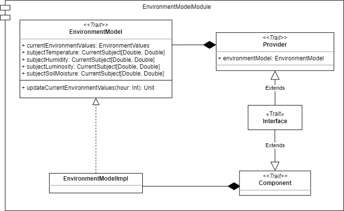
  <p> Fig. 4.5.1.2 - Architettura di EnvironmentModel </p>
</div>

[Fig. 4.5.1.2]: img/environmentModelModule.png

#### View per l'aggiornamento dei valori ambientali

La View viene racchiusa nel `EnvironmentViewModule` (vedi [Fig. 4.5.1.3]), al cui interno troviamo il trait `EnvironmentView`, che espone i metodi per:
  - visualizzare il nome della città selezionata;
  - visualizzare i valori ambientali aggiornati;
  - visualizzare il tempo virtuale aggiornato;
  - visualizzare lo stato globale della serra, quindi la sua suddivisione in aree;
  - richiedere alla view principale di cambiare scena al concludersi della simulazione;
  - settare lo stile e il _behaviour_ del pulsante comune a tutte le View, rispettando il layout stabilito nei mockup dell’applicazione.

Tale trait estende `ViewComponent` in quanto rappresenta una scena inserita all’interno di quella madre.

Invece, l’oggetto `context` di tipo `Requirements` specifica quali siano le dipendenze che devono essere soddisfatte affinché la View possa lavorare correttamente. Nello specifico, ha bisogno dell’`EnvironmentController` per notificarlo delle interazioni dell’utente (es: modifica della velocità della simulazione), e del `SimulationMVC` per accedere al suo elemento View e notificarlo di passare ad una nuova scena (es: scena di fine simulazione) oppure di modificare lo stile di un elemento grafico comune (es: pulsante comune a tutte le View).

<div align="center">
  
  <p> Fig. 4.5.1.3 - Architettura di EnvironmentView </p>
</div>

[Fig. 4.5.1.3]: img/environmentViewModule.png

#### Controller per l'aggiornamento dei valori ambientali

Il Controller è racchiuso all’interno del modulo `EnvironmentControllerModule` (vedi [Fig. 4.5.1.4]), al cui interno troviamo il trait `EnvironmentController`, che espone i metodi per:
  - richiedere al `SimulationController` di inizializzare il componente che gestisce il tempo virtuale;
  - richiedere al `SimulationController` di stoppare il tempo virtuale;
  - richiedere al Model di aggiornare i valori ambientali e alla View di visualizzarli, oltre a notificare i sensori della modifica avvenuta;
  - notificare il `SimulationController` della modifica, da parte dell’utente, della velocità della simulazione;
  - notificare la View della conclusione della simulazione, allo scadere del tempo;
  - recuperare l’elemento View associato ad esso;
  - ripristinare la visualizzazione dello stato globale della simulazione quando si esce dalla visualizzazione del dettaglio di un’area.

L’oggetto `context` di tipo `Requirements` specifica quali siano le dipendenze che devono essere soddisfatte affinché il controller possa lavorare correttamente (es: `EnvironmentView` per richiedere la visualizzazione del tempo trascorso, `EnvironmentModel` per richiedere l’aggiornamento dei valori ambientali, `SimulationMVC` per controllare la componente tempo).

<div align="center">
  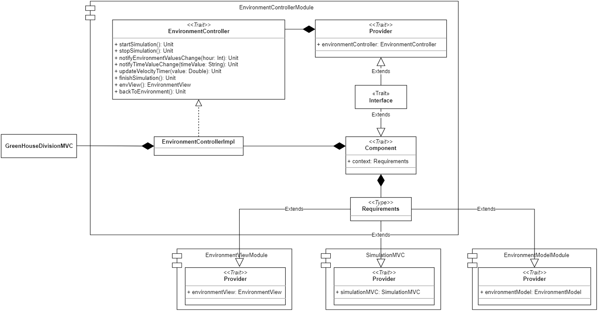
  <p> Fig. 4.5.1.4 - Architettura di EnvironmentController </p>
</div>

[Fig. 4.5.1.4]: img/environmentControllerModule.png


### 4.5.2 Tempo virtuale

`TimeModel` (vedi [Fig. 4.5.2.1]) è un `trait` che espone metodi per gestire il tempo virtuale della simulazione, il quale è modellato, a sua volta, dal `trait Timer`. 

`TimeModel` e `Timer` rappresentano anche due companion object che racchiudono l’implementazione delle rispettive interfacce e possono essere utilizzati per inizializzarne un’istanza.

In particolare, il Model si occupa di avviare e stoppare il `Timer`, oltre che di modificarne la velocità: queste operazioni vengono richiamate dal `SimulationController`, a seguito di feedback ricevuti dall’`EnvironmentMVC`.

All’avvio del `Timer`, il `TimeModel` ha il compito di specificare i task da eseguire ad ogni _tick_ e al concludersi del tempo stabilito per la simulazione. A questo scopo, il Model detiene un riferimento al `SimulationController` che utilizzerà per notificarlo del valore `timeValue` aggiornato, dello scoccare di una nuova ora (al fine di aggiornare i `currentEnvironmentValues`) e dell’esaurimento del tempo della simulazione.

<div align="center">
  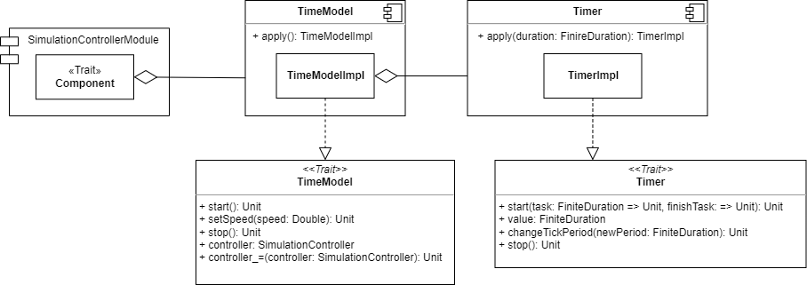
  <p> Fig. 4.5.2.1 - Architettura per la gestione del tempo virtuale </p>
</div>

[Fig. 4.5.2.1]: img/time.png


## 4.6 Serra

In questa sezione vengono descritti i componenti necessari a soddisfare i seguenti requisiti utente (vedi requisiti n° 3,4,5,6 in sezione [Sec. 2.2](#22-requisiti-utente)):
- osservare lo stato globale della serra;
- osservare lo stato all'interno di una specifica area;
- compiere operazioni per la cura ordinaria delle coltivazioni all'interno delle singole aree, le quali potranno essere messe in atto anche per far fronte alle diverse situazioni di allarme;
- in caso di allarme, visualizzare i suggerimenti rispetto alle azioni da compiere per ristabilire lo stato dell'area.

### 4.6.1 Suddivisione in aree

Per poter realizzare la suddivisione in aree si è deciso di adottare, come detto precedentemente, il _Pattern MVC_ e il _Cake pattern_.

In particolare, come si può vedere nella figura [Fig. 4.6.1.1], la classe `GreenHouseMVC` racchiude i  componenti: `GreenHouseModel`, `GreenHouseController` e `GreenHouseView` derivanti dai rispettivi moduli.

Tale classe verrà istanziata all'interno dell'`EnvironmentController` e si occuperà di creare gli _MVC_ delle singole aree, assegnando ad ognuno di esse una pianta tra quelle selezionate dall'utente.

<div align="center">
  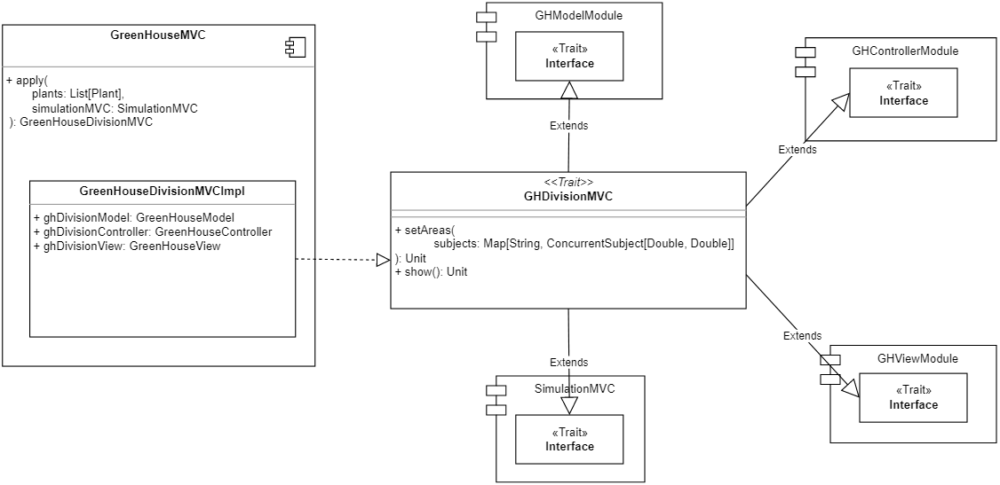
  <p> Fig. 4.6.1.1 - MVC per la suddivisione in aree </p>
</div>

[Fig. 4.6.1.1]: img/greenhouseDivisionMVC.png

#### Model per la suddivisione in aree

Il Model viene racchiuso nel suo rispettivo modulo `GHModelModule` (vedi [Fig. 4.6.1.2]), al cui interno troviamo il `trait GreenHouseModel` che espone il metodo per ottenere la lista dei componenti _MVC_ delle singole aree che compongono la serra (`areas`, vedi [sezione](#aree)).

Il Model, quindi, ha l'obiettivo di memorizzare la lista dei singoli _MVC_ di cui è composta la serra.

<div align="center">
  
  <p>  Fig. 4.6.1.2 - Model per la suddivisione in aree </p>
</div>

[Fig. 4.6.1.2]: img/greenhouseDivision_model.png

#### View per la suddivisione in aree

La View viene racchiusa nel modulo `GHViewModule` (vedi [Fig. 4.6.1.3]), al cui interno troviamo il `trait GHDivisionView`, che definisce i metodi che possono essere richiamati sulla View e, nello specifico, quello per richiedere di ripulire e disegnare lo spazio di interfaccia relativa alla visualizzazione della composizione della serra. 

Questa interfaccia rappresenta inoltre il Controller dell'_FXML_ per la relativa sezione: infatti, bisogna ricordare che la `ghDivisionView` è racchiusa all'interno della più ampia View che è `EnvironmentView`. 

Inoltre, per poter essere inserita all'interno della scena principale come le altre View, il `trait` implementa `ViewComponent`.

La View ha come ruolo principale quello di mostrare e mantenere aggiornata la suddivisione della serra in aree. Questo obiettivo viene raggiunto mediante il metodo `printDivision`. Quest'ultimo verrà richiamato sia all'avvio della schermata dell'`EnvironmentMVC` che ad ogni intervallo di tempo (per aggiornare i valori rilevati all'interno delle aree o quando lo stato di un'area cambia e passa da NORMALE ad ALLARME).

<div align="center">
  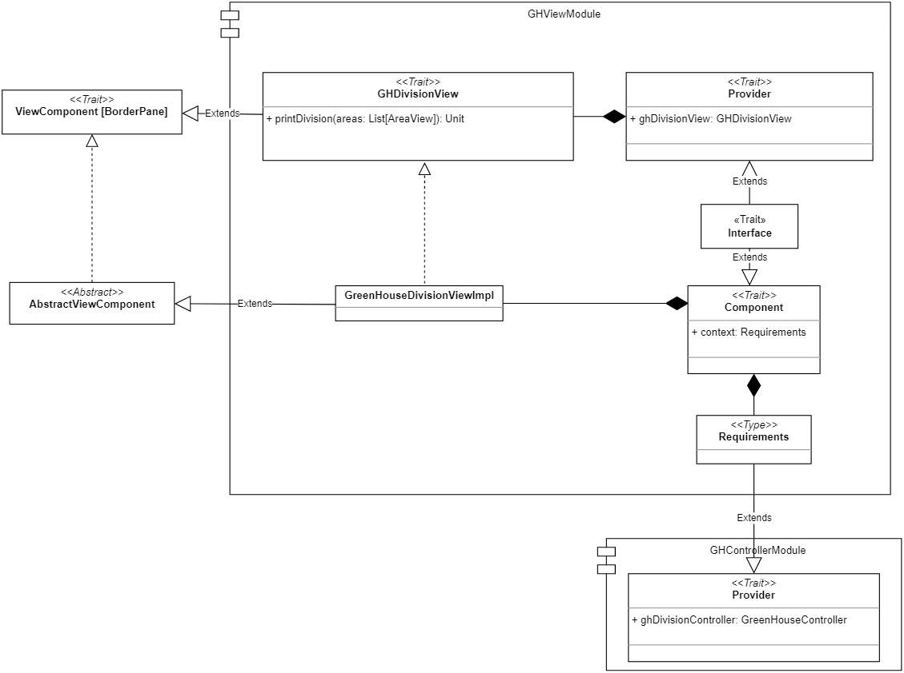
  <p>  Fig. 4.6.1.3 - View per la suddivisione in aree </p>
</div>

[Fig. 4.6.1.3]: img/greenhouseDivision_view.png

#### Controller per la suddivisione in aree

Il Controller viene racchiuso all'interno del modulo `GHControllerModule` (vedi [Fig. 4.6.1.4]), il quale include il `trait GreenHouseController`, che definisce i metodi che possono essere richiamati sul Controller per:
  - richiedere l'aggiornamento della View;
  - stoppare l'aggiornamento periodico e ad eventi della View.

Il compito principale del Controller è quello di richiedere l'aggiornamento della View affinché questa mostri lo stato delle aree e i rispettivi valori rilevati all'interno.

<div align="center">
  
  <p>  Fig. 4.6.1.4 - Controller per la suddivisione in aree </p>
</div>

[Fig. 4.6.1.4]: img/greenhouseDivision_controller.png

#### Aree

Per realizzare le singole aree che compongono la serra si è deciso di implementare ancora una volta il _Pattern MVC_ e il _Cake pattern_.

In particolare, come si può vedere nella [Fig. 4.6.1.5] , la classe `AreaMVC` racchiude i  componenti: `AreaModel`, `AreaController` e `AreaView` derivanti dai rispettivi moduli; inoltre, racchiude all'interno del proprio contesto l'istanza corrente del `SimulationMVC` in modo tale che questa sia accessibile sia dalla View che dal Controller.

Tale classe verrà istanziata durante il _setup_ della divisione della serra e memorizzata all'interno del `greenHouseModel`.

<div align="center">
  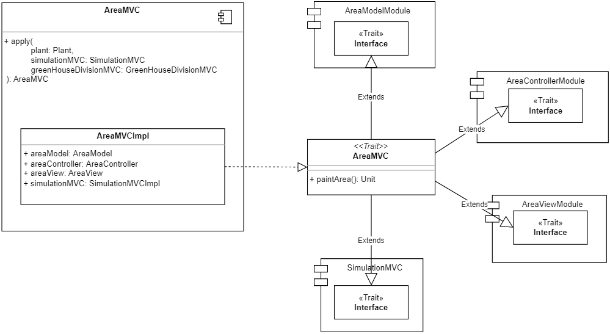
  <p>  Fig. 4.6.1.5 - Rappresentazione MVC di un'area </p>
</div>

[Fig. 4.6.1.5]: img/areaMVC.png

**Model della singola area**

Il Model viene racchiuso nel rispettivo modulo `AreaModelModule` ([Fig. 4.6.1.6]), al cui interno troviamo il `trait AreaModel` che espone i diversi metodi che potranno essere richiamati sul Model per:
  - aggiornare e ottenere lo stato dell'area;
  - ottenere le informazioni della pianta contenuta nell'area;
  - tutti i metodi necessari a memorizzare le azioni effettuate dagli utenti sui sensori.

Il Model dell'area ha come principale obiettivo quello di memorizzare lo stato dell'area e le operazioni effettuate dagli utenti sui singoli sensori. Per raggiungere questo obiettivo, si appoggia sulle classi `ManageSensor` e  `AreaSensorHelper` che si occuperanno di memorizzare e gestire i singoli sensori, e sull'oggetto `AreaComponentState`, il quale memorizza le operazioni effettuate dall'utente.

Il Model, come si può intuire, risulta essere condiviso con l'_MVC_ del dettaglio dell'area in quanto è necessario poter ricondurre le operazioni dell'utente all'area su cui le ha effettuate.

<div align="center">
  
  <p>  Fig. 4.6.1.6 - Model dell'area </p>
</div>

[Fig. 4.6.1.6]: img/area_model.png

**View della singola area**

La View viene racchiusa nel modulo `AreaViewModule` ([Fig. 4.6.1.7]), al cui interno troviamo il `trait AreaView`, che definisce i metodi che possono essere richiamati sulla View per richiedere il disegno dell'area.

Questa interfaccia rappresenta, inoltre, il Controller dell'_FXML_ per la relativa sezione: infatti, bisogna ricordare che la `AreaView` è racchiusa all'interno della più ampia View che è `GHDivisionView`.

Questo trait, come gli altri, per poter essere inseriti all'interno della scena principale, implementa `ViewComponent `. Oltre a ciò, implementa anche `ContiguousSceneView` per permettere di passare alla scena incaricata di mostrare il dettaglio dell'area.

La View ha come ruolo principale quello di mostrare lo stato di un'area, il nome della pianta e i valori dei parametri rilevati all'interno di essa; inoltre, dà la possibilità all'utente di accedere al dettaglio dell'area selezionata.

<div align="center">
  
  <p>  Fig. 4.6.1.7 - View dell'area </p>
</div>

[Fig. 4.6.1.7]: img/area_model.png

**Controller della singola area**

Il Controller viene racchiuso all'interno del modulo `AreaControllerModule` (vedi [Fig. 4.6.1.8]), il quale include il `trait AreaController` che definisce i metodi che possono essere richiamati sul Controller per richiamare il disegno dell'area.

Il trait estende `SceneController`, necessario per poter accedere alla scena che mostra il dettaglio dell'area.

Il compito principale del Controller è quello di richiamare la creazione dell'interfaccia grafica delegata alla View affinché questa mostri lo stato delle aree e i rispettivi valori rilevati al loro interno, oltre a gestire il cambio di scena da quella generale a quella specifica della singola area.

<div align="center">
  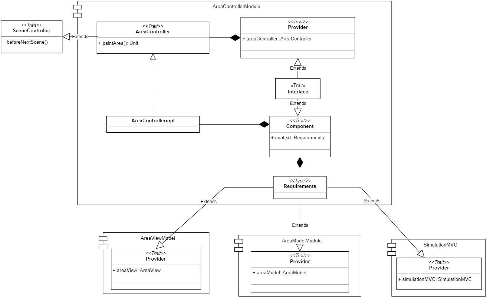
  <p>  Fig. 4.6.1.8 - Controller dell'area </p>
</div>

[Fig. 4.6.1.8]: img/area_controller.png

## 4.7 Visualizzazione del dettaglio di un'area

### 4.7.1 Dettaglio di un'area 

Per realizzare il dettaglio delle aree si è deciso di implementare ancora una volta il _Pattern MVC_ e il _Cake pattern_.

In particolare, come si può vedere nella [Fig. 4.7.1.1], la classe `AreaDetailsMVC` racchiude i  componenti: `AreasModel`, `AreaDetailsController` e `AreaDetailsView` derivanti dai rispettivi moduli.

Tale classe verrà istanziata nel momento in cui un utente decide di visionare il dettaglio di un'area, scelta tra quelle che compongono la serra. 

<div align="center">
  
  <p>  Fig. 4.7.1.1 - Rappresentazione MVC del dettaglio di un'area </p>
</div>

[Fig. 4.7.1.1]: img/areaDetailsMVC.png

#### Model del dettaglio area

Come si può vedere nella [Fig. 4.7.1.1], il Model è lo stesso implementato per le singole aree poiché risulta necessario che vengano memorizzate le operazioni effettuate dull'utente. In questo modo sarà possibile aggiornare, con una determinata frequenza, il valore rilevato dai sensori. 

Per questo motivo si rimanda al paragrafo [Aree](#aree) per i dettagli.

Il Model in questione risulterà essere condiviso anche con gli _MVC_ che gestiscono la parte visuale dei sensori presenti all'interno delle aree ([Sec. 4.7.2](#472-parametri-dellarea)).

#### View del dettaglio di un'area

La View del dettaglio di un'area viene racchiusa nell’`AreaDetailsViewModule`, come raffigurato nella figura [Fig. 4.7.1.2].

Oltre agli elementi necessari al _Cake pattern_, all’interno troviamo il `trait AreaDetailsView`, il quale estende da `ViewComponent` e anche da `ContiguousSceneView` in quanto richiede delle operazioni specifiche prima di passare alla scena successiva, come verrà descritto nel paragrafo successivo relativo al modulo del Controller. Inoltre, espone metodi per consentire l’aggiornamento delle informazioni della View relative:
  - alle piante (nome della pianta, descrizione e immagine); 
  - al tempo virtuale;
  - allo stato dell’area;
  - ai messaggi di aiuto all’utente in caso di allarme.

<div align="center">
  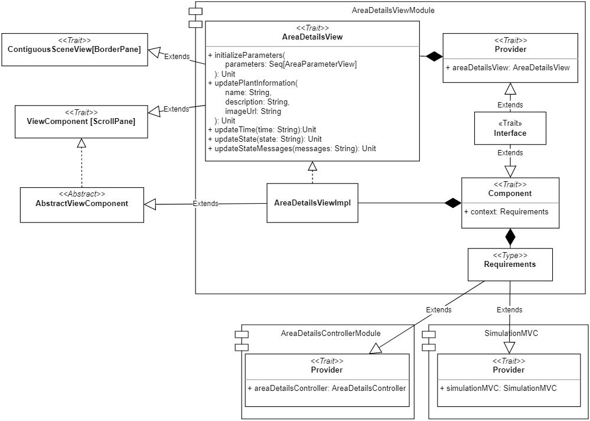
  <p>  Fig. 4.7.1.2 - View del dettaglio di un'area </p>
</div>

[Fig. 4.7.1.2]: img/area_details_view.png

#### Controller del dettaglio area

Il Controller viene racchiuso all'interno del modulo `AreaDetailsControllerModule` ([Fig. 4.7.1.3]), il quale include il `trait AreaDetailsController` che definisce i metodi che possono essere richiamati sul Controller ed, in particolare, quello per inizializzare la View. 

Il `trait` estende `SceneController`, necessario per poter ritornare alla schermata principale dell'applicazione e per terminare l'aggiornamento delle informazioni alla View.

Il compito principale del Controller è quello di richiamare la creazione dell'interfaccia grafica rappresentante il dettaglio dell'area. Per assolvere a tale compito il Controller provvede, mediante la classe di utility `AreaSensorHelper`, alla creazione degli _MVC_ incaricati della gestione dei sensori presenti all'interno dell'area e specificatamente:
- `AreaAirHumidityMVC`, che gestisce le azioni riguardo al sensore che rileva l'umidità dell'aria all'interno dell'area;
- `AreaLuminosityMVC`, che gestisce le azioni riguardo al sensore che rileva la luminosità dell'area;
- `AreaTemperatureMVC`, che gestisce le azioni riguardo al sensore che rileva la temperatura dell'area;
- `AreaSoilMoistureMVC`, che gestisce le azioni riguardo al sensore che rileva l'umidità del suolo dell'area.

<div align="center">
  
  <p>  Fig. 4.7.1.3 - Controller del dettaglio di un'area </p>
</div>

[Fig. 4.7.1.3]: img/area_details_controller.png

### 4.7.2 Parametri dell'area

Con l’obiettivo di rendere l’applicazione modulare e scalabile all'aggiunta di nuovi sensori, si è deciso di separare il componente per la gestione del dettaglio di un’area dalla visualizzazione dei valori ottenuti dai sensori e le rispettive azioni che possono essere compiute.

Ciascun componente è rappresentato da un modulo _MVC_ separato, composto da una propria View e un proprio Controller. Il Model rimane quello implementato per le singole aree e per il dettaglio dell’area descritto nel paragrafo [Aree](#aree).

I comportamenti dei vari parametri sono stati raccolti in interfacce comuni: 
-	`AreaParameterMVC`, per i componenti _MVC_;
-	`AreaParameterView`, per i componenti View;
-	`AreaParameterController`, per i componenti Controller.

#### MVC dei parametri

Il `trait AreaParameterMVC`, come mostrato in figura [Fig. 4.7.2.1], rappresenta l’interfaccia generale dei componenti _MVC_ dei parametri. In particolare, contiene tre campi che sono necessari alla composizione dell’elemento: 
-	`areaModel`, ossia il model associato alla singola area;
-	`areaParameterView`, ossia la view associata al parametro;
-	`areaParameterController`, ossia il controller associato al parametro.

<div align="center">
  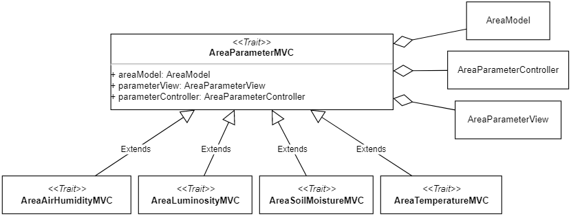
  <p>  Fig. 4.7.2.1 - Trait MVC dei parametri </p>
</div>

[Fig. 4.7.2.1]: img/area_parameter_mvc.png

**View dei parametri**

Il `trait AreaParameterView` (vedi [Fig. 4.7.2.2]) espone i metodi che consentono l’aggiornamento del valore corrente e la descrizione del parametro. 

Di tale interfaccia è stata poi definita una classe astratta `AbstractAreaParameterView` che implementa i metodi comuni dei parametri. Dato l'utilizzo del _template method_, lascia la definizione delle variabili `descriptionLabel` e `currentValueLabel`, ovvero le _label_ dedicate alla descrizione e al valore corrente, alle sottoclassi che la estendono. La classe astratta si occuperà di aggiornare queste informazioni, incapsulandone la logica.

<div align="center">
  
  <p>  Fig. 4.7.2.2 - Trait view dei parametri </p>
</div>

[Fig. 4.7.2.2]: img/area_parameter_view.png

**Controller dei parametri**

Il `trait AreaParameterController` fornisce metodi per l’inizializzazione 
e l'interruzione dell’aggiornamento dei parametri della View.

Come è possibile vedere nella figura [Fig. 4.7.2.3], anche per questa interfaccia è presente una classe astratta `AbstractAreaParameterController`, utile a  fattorizzare le parti in comune ai parametri. Seguendo anche qui il _template method_, abbiamo che i metodi da implementare nelle sotto-classi sono:
-	`updateCurrentValue`, ossia la funzione che si occupa di aggiornare il valore corrente e il suo stato;
-	`updateDescription`, ossia la funzione che si occupa di aggiornare la descrizione del parametro.

<div align="center">
  
  <p>  Fig. 4.7.2.3 - Trait controller dei parametri </p>
</div>

[Fig. 4.7.2.3]: img/area_parameter_controller.png

**Singoli parametri**

Come formulato nei requisiti, l'applicazione prevede di avere quattro sensori che permettono di rilevare in ogni area i seguenti parametri: luminosità, temperatura, umidità del suolo e dell'aria. 

Ognuno di questi è realizzato seguendo il _Cake pattern_, implementando le interfacce comuni ed estendendo le relative classi astratte descritte precedentemente.

Il compito principale di questi componenti è quello di definire le azioni che possono essere svolte all'interno dell'area e che andranno ad influenzare il valore del rispettivo parametro. 

In particolare, la View si occuperà di gestire gli elementi grafici delle azioni mentre, il Controller, di gestire il loro comportamento e il cambiamento dello stato del Model.

Nello specifico, abbiamo i seguenti componenti:
- `AreaLuminosityView` e `AreaLuminosityController` che si occupano di gestire le azioni per la schermatura dell'area e per la regolazione dell'intensità della luce;
- `AreaTemperatureView` e `AreaTemperatureController` che si occupano di gestire le azioni per isolare l'area e regolare la temperatura;
- `AreaAirHumidityView` e `AreaAirHumidityController` che si occupano di gestire l'attivazione e la disattivazione del nebulizzatore e del ventilatore;
- `AreaLuminosityView` e `AreaLuminosityController` che si occupano di gestire le azioni per innaffiare e per smuovere il terreno.

## 4.8 Sensori

Come detto precedentemente, ogni area è monitorata da dei sensori. Per il progetto non ne sono stati utilizzati dei veri e propri ma bensì simulati ed emulati tramite software.

In particolare, il codice dei sensori rientra nel package `model` del progetto in quanto essi possono essere sfruttati dai diversi componenti Model dell'applicazione, racchiudendo la logica di aggiornamento e notifica dei nuovi valori rilevati.

<div align="center">
  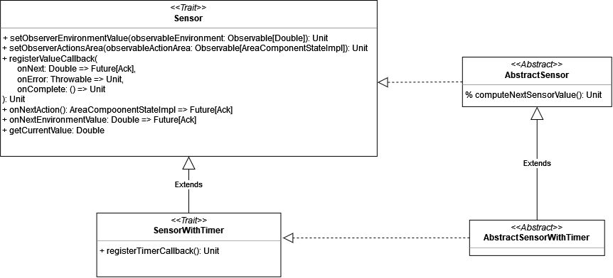
  <p>Fig. 4.8.1 - Interfacce Sensor e SensorWithTimer </p>
</div>

[Fig. 4.8.1]: img/sensor.png

Prima di tutto, per poter realizzare i sensori si è deciso di analizzare quali siano gli aspetti comuni che questi presentano e di raccoglierli all'interno di un interfaccia comune. 

Il `trait Sensor` ([Fig. 4.8.1]) rappresenta proprio l'interfaccia che assolve a questo scopo e al suo interno troviamo la dichiarazione dei metodi:
- `setObserverEnvironmentValue`, il quale si occupa di registrare l'`Observer` del sensore interessato a ricevere aggiornamenti rispetto al parametro ambientale di riferimento. Ad esempio, al sensore della luminosità interesserà sapere ogni qual volta viene emesso un nuovo dato relativo al parametro _lux_, al fine di aggiornare il proprio valore. 
- `setObserverActionArea`. Difatti, il valore rilevato da un sensore non dipende solamente dal parametro ambientale di riferimento, ma può essere influenzato anche dalle azioni correttive che vengono compiute dall'utente. Di conseguenza, per poter ricevere notifica di ogni nuova azione, il sensore registra un `observer` sul relativo `observable` dello stato dell'area. Il sensore si occuperà di analizzare l'azione che è stata compiuta e, nel caso in cui questa influenzi il parametro monitorato, aggiusterà il valore rilevato e lo emetterà.
- `onNextAction`, ossia il metodo che racchiude i compiti che devono essere svolti ogni qual volta l'utente compie una nuova azione nell'area monitorata.
- `onNextEnvironmentValue`, ossia il metodo al cui interno vengono specificate le azioni che devono essere intraprese ogni qual volta viene emesso un nuovo valore per il parametro ambientale di riferimento.

Una volta racchiusi gli aspetti comuni dei sensori all'interno dell'interfaccia `Sensor`, ci si è interrogati su come l'aggiornamento e l'emissione dei valori rilevati dai sensori dovesse avvenire.
Si è giunti alla conclusione che esistono due tipologie di sensori: quelli che effettuano un'aggiornamento periodico del valore rilevato, rappresentati dall'interfaccia `SensorWithTimer`, e quelli che cambiano il valore rilevato istantaneamente, al verificarsi di determinate condizioni.

L'interfaccia `SensorWithTimer` estende l'interfaccia `Sensor` e rispetto al sensore normale, effettua l'aggiornamento del parametro rilevato periodicamente, emettendo di volta in volta un nuovo valore. 

A tal fine, `SensorWithTimer` richiede l'implementazione di un unico metodo `registerTimerCallback`, il quale consente al sensore di specificare al timer della simulazione il tempo virtuale che deve trascorrere tra un aggiornamento e l'altro.

Ogni qual volta il sensore riceve l'evento dal timer, che lo informa del fatto che il tempo specificato è trascorso, esso si occuperà di rilevare il nuovo valore e di emetterlo sul flusso dell'`Observable` dedicato, in modo tale da informare l'area del nuovo parametro rilevato.

Le classi `Sensor` e `SensorWithTimer` vengono inizialmente implementate dalle classi astratte `AbstractSensor` e `AbstractSensorWithTimer`. Conseguentemente, viene lasciato alle classi dei sensori solamente l'implementazione del metodo ` protected computeNextSensorValue`. Questa implementazione utilizza, quindi, il pattern _template method_ in quanto le classi astratte rappresentano il template dei sensori e il metodo `computeNextSensorValue` contiene il comportamento che le sottoclassi devono implementare.

### 4.8.1 Sensore per la luminosità

<div align="center">
  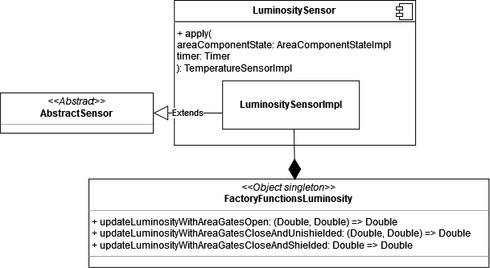
  <p>Fig. 4.8.1.1 - Sensore della luminosità</p>
</div>

[Fig. 4.8.1.1]: img/sensor_luminosity.png


Il sensore della luminosità (vedi [Fig. 4.8.1.1]) non è un sensore periodico: difatti, esso implementa solamente l'interfaccia `Sensor` ed estende la classe astratta `AbstractSensor`, la quale racchiude già l'implementazione di alcuni metodi dell'interfaccia.


Il sensore della luminosità, quindi, è un sensore istantaneo: non appena ha luogo un cambiamento della luminosità esterna o viene compiuta un'azione da parte dell'utente, il sensore cambierà subito il suo valore, senza aspettare un aggiornamento periodico, in quanto la velocità con cui la luce cambia all'interno di un ambiente è molto rapida rispetto a quella che può essere la velocità di aggiornamento della temperatura. Ad esempio, se immaginassimo di trovarci in una stanza buia in cui vi è una temperatura più bassa rispetto a quella esterna e decidessimo di aprire la finestra, la luce entrerà subito mentre la temperatura interna impiegherà diverso tempo per alzarsi.

Per poter calcolare correttamente il valore della luminosità, bisogna tenere conto delle azioni che l'utente può compiere, come: 

- **l'apertura o chiusura delle porte dell'area**. In particolare, se le porte della serra sono chiuse la luce presente all'interno dell'area sarà leggermente minore rispetto a quella esterna in quanto le pareti della serra la filtreranno; se, invece, le porte della serra sono aperte, la luce dell'ambiente non verrà filtrata ed entrerà completamente.
- **la regolazione dell'intensità delle lampade** per cui l'utente ha la possibilità di regolare la luminosità delle lampade, poste all'interno dell'area. La luce prodotta dalle lampade, sommata alla luminosità dell'ambiente, contribuiscono alla determinazione del valore rilevato dal sensore.


Per poter determinare il valore del parametro rilevato rispetto all'attuale stato dell'area, è stato definito l'oggetto `FactoryFunctionsLuminosity` (vedi [Fig. 4.8.1.1]), il quale rappresenta una _factory_ di funzioni che possono essere utilizzate per determinare il nuovo valore rilevato dal sensore. 


Ogni qual volta l'utente compie una nuova azione o viene rilevato un nuovo parametro ambientale, a seconda dello stato in cui si trovano i componenti della serra, si richiama la funzione della _factory_ corrispondente, in modo da determinare il nuovo valore rilevato.

Nello specifico, abbiamo detto nella precedente sezione [Sec. 4.8](#48-sensori) che ogni sensore presenta due `Observer`: uno che viene notificato ogni qual volta un nuovo valore ambientale viene rilevato e l'altro che viene notificato ogni qual volta l'utente compie una nuova azione sull'area. Quando uno di questi due eventi si verifica, il sensore controlla lo stato attuale dei componenti dell'area e, successivamente, sceglie la funzione da applicare per calcolare il nuovo valore; infine, emette questo nuovo valore sul flusso dell'`Observable`.


### 4.8.2 Sensore per la temperatura

Il sensore della temperatura è un sensore dotato di timer, pertanto si occupa di aggiornare periodicamente il valore rilevato. 

Come si può vedere dalla figura [Fig. 4.8.2.1], il sensore implementa l'interfaccia `SensorWithTimer` tramite la classe astratta `AbstractSensorWithTimer`. 

<div align="center">
  
  <p>Fig. 4.8.2.1 - Sensore della temperatura</p>
</div>

[Fig. 4.8.2.1]: img/sensor_temperature.png

L'utente, che regola la temperatura interna dell'area, influisce sulle rilevazioni del parametro, ma anche l'apertura o la chiusura delle porte dell'area possono influenzarne il valore.

In particolare, nel caso in cui le porte dell'area fossero aperte, la temperatura verrà completamente influenzata da quella esterna e il valore rilevato dal sensore si avvicinerà periodicamente a quello ambientale. Quando, invece, le porte dell'area sono chiuse, la temperatura verrà completamente influenzata da quella interna regolata dall'utente e le rilevazioni effettuate dal sensore si avvicineranno periodicamente a questo valore, fino a quando non lo avranno raggiunto.

Per poter calcolare le rilevazioni del sensore della temperatura, è stato realizzato l'oggetto `FactoryFunctionsTemperature`, il quale rappresenta una _factory_ di funzioni che possono essere applicate per poter calcolare il nuovo valore della temperatura.

Più precisamente, il sensore della temperatura effettua un aggiornamento del valore rilevato:
- ogni qual volta l'utente compie una nuova azione che influenza il parametro;
- nel caso in cui venga rilevato un nuovo valore della temperatura esterna; 
- nel caso in cui il timer abbia emesso l'evento che indica al sensore di effettuare una nuova rilevazione.

### 4.8.3 Sensore per l'umidità dell'aria

Il sensore della l’umidità dell’aria è un sensore in grado di aggiornare periodicamente il valore rilevato.

Come rappresentato nella figura [Fig. 4.8.3.1], il sensore implementa l’interfaccia `SensorWithTimer`, estendendo la classe astratta `AbstractSensorWithTimer`.

<div align="center">
  
  <p>Fig. 4.8.3.1 - Sensore per l'umidità dell'aria</p>
</div>

[Fig. 4.8.3.1]: img/sensor_air_humidity.png


Se le porte dell'area sono aperte, i valori rilevati dal sensore si avvicineranno periodicamente a quello ambientale; se, invece, le porte dell’area sono chiuse, il valore dell’umidità sarà inferiore a quello ambientale.

Le azioni che può intraprendere l’utente per regolare l'umidità sono: 
- attivare la ventilazione dell’ambiente per diminuirne il valore; 
- attivare il sistema di nebulizzazione, il quale ne aumenterà il valore.

Anche qui, è stato realizzato un oggetto _factory_, chiamato `FactoryFunctionsAirHumidity`, per selezionare la funzione da applicare al valore in base allo stato dell'area. 

Il sensore procederà al calcolo del nuovo valore ogni qual volta:
- l'utente compia una azione che regola tale parametro;
- venga aggiornato il valore dell'umidità esterna;
- il timer abbia emesso un evento.

### 4.8.4 Sensore per l'umidità del suolo

Il sensore dell’umidità del suolo estende da `AbstractSensorWithTimer`, che detiene già al suo interno i metodi necessari all’aggiornamento periodico dei valori (vedi [Fig. 4.8.4.1]).

<div align="center">
  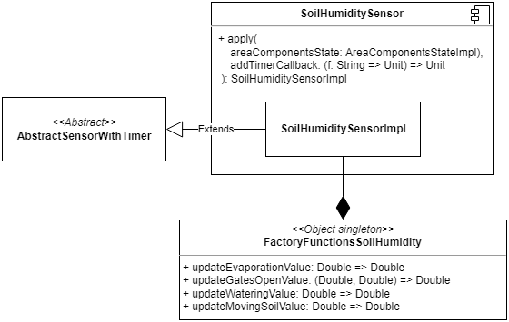
  <p>Fig. 4.8.4.1 - Sensore per l'umidità del suolo</p>
</div>

[Fig. 4.8.4.1]: img/sensor_soil_humidity.png

Se nella località di ubicazione della serra sta piovendo e se le porte dell'area sono aperte, il valore del sensore sarà influenzato dalla quantità di precipitazioni; se, invece, non sta piovendo oppure se le porte dell'area sono chiuse, il valore diminuirà mano a mano che passa il tempo in quanto l’acqua tende ad evaporare.

L’utente, per regolare l'umidità del suolo, potrà:
- innaffiare, aumentando il valore del parametro;
- smuovere il terreno per diminuirne il valore. 

Queste azioni sono istantanee, ovvero il valore dell’umidità viene aggiornato immediatamente a seguito dell'azione intrapresa.

Per quanto riguarda le funzioni da applicare al calcolo del nuovo valore, è stato utilizzato l’oggetto _factory_ `FactoryFunctionsSoilHumidity`. 

## 4.9 Fine simulazione

Nel caso in cui l'utente decida di fermare la simulazione in anticipo o nel caso in cui il tempo virtuale sia interamente trascorso, egli verrà reindirizzato alla schermata di fine simulazione in cui gli verrà data la possibilità di iniziarne una nuova.

Gli elementi grafici della schermata di fine simulazione sono contenuti all'interno del rispettivo file _FXML_ e `FinishSimulationView` ne rappresenta il Controller.

<div align="center">
  
  <p>Fig. 4.9.1 - View fine simulazione</p>
</div>

[Fig. 4.9.1]: img/finish_simulation_view.png

Come si può vedere dalla figura [Fig. 4.9.1], per poter realizzare la View di fine simulazione è stata definita l'interfaccia `FinishSimulationView`, la quale estende l'interfaccia `ViewComponent`, dichiarando che il pannello principale, contenente tutti i diversi elementi di questa scena, è un `BorderPane`. 

La scena di fine simulazione, quindi, verrà mostrata all'interno della scena madre e, grazie alle relazione che vi sono fra i diversi elementi dell'architettura, `FinishSimulationView` è in grado di accedere alle proprietà di `SimulationView` per specificare quale dovrà essere l'azione che dove essere compiuta nel caso in cui l'utente clicchi sul pulsante "_Start a new simulation_". In tal caso, verrà istanziato di nuovo l'elemento `SelectCityMVC` e l'applicazione riprenderà dalla schermata di selezione della città.

## 4.10 Pattern utilizzati

Per la realizzazione di questo progetto sono stati adoperati i pattern creazionali e comportamentali descritti nelle seguenti sottosezioni.

### Factory

Il _pattern Factory_ è un pattern creazionale che ci dà la possibilità di creare degli oggetti senza dover specificare la loro classe e ci consente di cambiare in modo abbastanza agevole l'oggetto creato. 

Le _factories_, come dice il nome, rappresentano delle vere e proprie "fabbriche di oggetti" che possiamo utilizzare per istanziare gli oggetti di cui abbiamo bisogno e con determinate caratteristiche.

All'interno del progetto si è fatto utilizzo, in particolare, del pattern _StaticFactory_, per produrre le funzioni necessarie a calcolare l'aggiornamento dei parametri rilevati dai sensori. 

Nella programmazione funzionale, infatti, è possibile specificare dei metodi che abbiano come tipo di ritorno delle funzioni. Si è sfruttata, quindi, questa possibilità per poter realizzare delle _factories_ che restituissero la funzione da applicare per determinare l'aggiornamento del valore rilevato.

### Singleton

Per lo sviluppo del progetto si è fatto largo uso di questo pattern creazionale, il quale garantisce che di una determinata classe venga creata una sola istanza, fornendo un punto di accesso globale ad essa.

In Scala è particolarmente semplice implementare tale pattern in quanto gli _object_ sono classi con esattamente una istanza che viene inizializzata in modo _lazy_ (su richiesta) quando ci riferiamo ad essa: prima di ciò, nessuna istanza dell’_object_ sarà presente nello _heap_.

Infine, si è anche utilizzato il pattern _factory_ tramite i _companion object_ associati alle classi, i quali danno la possibilità di istanziare la classe corrispondente mantenendo privata la sua implementazione.

### Template method

Il pattern _Template Method_ è un pattern comportamentale basato sulle classi. Permette di catturare il _template_ dell’algoritmo attraverso dei metodi astratti che verranno poi implementati nelle sottoclassi. Grazie a questo pattern, è possibile fattorizzare in una classe la parte invariante di un algoritmo e lasciare alle sottoclassi il compito di implementare il comportamento che può variare, favorendo un maggiore riuso del codice.

Questo pattern è stato utilizzato all’interno del progetto per definire le seguenti classi astratte:
- `AbstractViewComponent` che rappresenta i componenti della View;
- `AbstractSensor`, utilizzato per la definizione dei sensori;
- `AbstractParameterView` e `AbstractParameterController` per i componenti View e Controller dei parametri nel dettaglio dell’area.

### Strategy

All'interno del progetto è stato ampiamente utilizzato il _pattern Strategy_, ossia l'incapsulamento di un algoritmo all'interno di una classe, permettendo di mantenere un'interfaccia generica.

Questo pattern è direttamente supportato nel linguaggio mediante il passaggio di funzioni _higher-order_, facendo sì che le classi che lo utilizzano rendano dinamico il proprio comportamento e utilizzino in modo intercambiabile le diverse implementazioni degli algoritmi definiti nell'interfaccia generica.

## 4.11 Organizzazione del codice

Il sistema è stato organizzato in 5 package principali: 
- **mvc**, che contiene gli oggetti _MVC_ relativi ai componenti principali della simulazione precedentemente descritti;
- **prolog**, che contiene un oggetto necessario all'interazione fra il linguaggio _Scala_ e _Prolog_;
- **controller**, che contiene gli elementi Controller necessari a gestire le interazioni fra i componenti View e Model;
- **model**, che contiene gli elementi Model che racchiudono la logica di business dell'applicazione;
- **view**, che contiene gli elementi View che detengono le componenti delle diverse interfacce grafiche e gestiscono le interazioni con l'utente.

<div align="center">
  
  <p>Fig. 4.11.1 - Organizzazione dei package del progetto</p>
</div>

[Fig. 4.11.1]: img/package.png

<div style="page-break-after: always;"></div>

# 5. Implementazione
Il seguente capitolo motiva e dettaglia aspetti implementativi ritenuti rilevanti per una corretta comprensione del progetto. 

Va inoltre sottolineato che il codice realizzato è stato opportunamente documentato mediante la `Scaladoc`, la quale può essere utilizzata come ulteriore riferimento per meglio comprendere l'implementazione del programma e il suo comportamento.

## 5.1 Utilizzo del paradigma funzionale
Durante lo sviluppo del progetto, si è cercato di utilizzare il più possibile il paradigma funzionale e di raffinare sempre di più la soluzione adottata, per poter sfruttare al meglio i vantaggi che questo paradigma offre. 

Se, durante la realizzazione di una determinata funzionalità, ci si rendeva conto di aver utilizzato un approccio più legato all'_object-oriented_ che a al paradigma funzionale, dopo aver valutato i diversi aspetti di una possibile soluzione più funzionale, si procedeva con il _refactoring_ del codice.

Nelle seguenti sezioni verranno descritti con maggiore dettaglio alcuni elementi della programmazione funzionale che sono stati utilizzati all'interno del progetto, riportando alcuni esempi del loro utilizzo.

### 5.1.1 Higher-order functions
Un meccanismo efficace, spesso utilizzato nella programmazione funzionale, è quello delle _funzioni higher order_. Queste sono delle funzioni che accettano altre funzioni come parametri e/o restituiscono una funzione come risultato. 

L’utilizzo di queste funzioni ha permesso di rendere il codice riusabile e di adoperare facilmente il _pattern Strategy_, in quanto consente di passare alle funzioni delle strategie esterne.

Esse sono state utilizzate in molte parti del progetto: un esempio del loro utilizzo si può trovare negli oggetti `Factory` delle funzioni per il calcolo dei nuovi valori dei sensori (vedi codice riportato di seguito).

```scala
/** Updates the current soil moisture value according to the precipitation value when gates are open. */
val updateGatesOpenValue: (Double, Double) => Double = _ - _ * RainFactor
```

In particolare, si tratta di una funzione utilizzata per calcolare il valore dell’umidità del suolo nel caso in cui la porta dell’area sia aperta. 

La funzione prende in ingresso due valori: il valore corrente dell’umidità e il valore delle precipitazioni. Nell’esempio l’implementazione della funzione è stata specificata attraverso l’utilizzo delle funzioni _literal_ (funzioni _lambda_ in _Java_) e, grazie alla sintassi di _Scala_ e all’inferenza dei tipi, è possibile semplificare la funzione utilizzando il _placeholder_ underscore_, rendendo il codice il più idiomatico possibile.

### 5.1.2 Currying
In _Scala_ è possibile definire funzioni _curried_, per cui la valutazione di una funzione che assume parametri multipli può essere tradotta nella valutazione di una sequenza di funzioni.

È un meccanismo che consente l'applicazione del principio _DRY (Don't repeat yourself)_, favorendo quindi il riuso di codice. Infatti, quando una funzione è _curried_, è possibile applicare parzialmente la funzione per poterla utilizzare in più punti del codice.

Nel seguente estratto di codice è possibile vedere un esempio dell'utilizzo di questo meccanismo.

```scala
private def extractTerm(solveInfo: SolveInfo)(term: String) =
  extractTermToString(solveInfo, term).replace("'", "")
```

La funzione `extractTerm` si occupa di estrarre il termine dalla soluzione ottenuta da _Prolog_, rimuovendo gli apici.

```scala
override def getCityInfo(city: String): Option[(String, String, String)] =
  searchCity(city).headOption.fold(None) { s =>
    val e = extractTerm(s)
    Some(e("X"), e("Y"), e("Z"))
  }
```

La funzione viene utilizzata all'interno del Model di select city per estrarre le informazioni associate alla città selezionata. Per chiamare la funzione si deve mantenere la stessa notazione _currying_. Nell'esempio la funzione viene applicata parzialmente passando un solo argomento e, in questo modo, ritorna una nuova funzione che può essere consumata in seguito specificando il secondo argomento. 

### 5.1.3 Type members

La keyword `type` in _Scala_ introduce il concetto di _type members_ all'interno di una classe, oltre ai _field_ e _method members_ che, solitamente, già troviamo.
Viene impiegata principalmente per creare l'alias di un tipo più complicato: il _type system_ sostituirà l'alias con l'_actual type_ quando effettuerà il _type checking_.

I _type members_, analogamente agli altri membri delle classi, possono essere _abstract_ ed è, dunque, possibile specificare il tipo concreto nell'implementazione.

In merito al progetto, i _type members_ sono stati utilizzati per:

-  definire il tipo di dato restituito dalle richieste HTTP in quanto risultava complesso e poco esplicativo (non rilevava l'intento).

```scala
/** Data structure that will contains the city's environment values. */
type EnvironmentValues = Map[String, Any]

/** Data structure that will contains plant's optimal values. */
type OptimalValues = Map[String, Any]
```
- definire le dipendenze tra i componenti Model, View e Controller nell'utilizzo del _Cake pattern_

```scala
/** The controller requirements. */
  type Requirements = EnvironmentViewModule.Provider with EnvironmentModelModule.Provider with SimulationMVC.Provider
```

### 5.1.4 For-comprehension
Al fine di rendere il codice meno imperativo, si è fatto uso della _for-comprehension_: un costrutto funzionale per operare sulle collezioni e basato sulle _monadi_. 

Oltre a rendere il codice più funzionale, la scelta dell'utilizzo della _for-comprehension_ è supportata dall'incremento della leggibilità del codice, come si può vedere nel seguente estratto di programma. Il costrutto viene utilizzato per la creazione degli oggetti `ManageSensor`, il cui compito è racchiudere tutte le informazioni utili riguardati un sensore.

```scala
for
    (key, m) <- mapSensorNamesAndMessages.toList
    optK = m.getOrElse("name", "")
    um = m.getOrElse("um", "")
    msg = m.getOrElse("message", "")
yield ManageSensorImpl(
    key,
    optimalValueToDouble.getOrElse("min_" + optK, 0.0),
    optimalValueToDouble.getOrElse("max_" + optK, 0.0),
    um,
    sensorsMap(key),
    BigDecimal(sensorsMap(key).getCurrentValue).setScale(2, BigDecimal.RoundingMode.HALF_UP).toDouble,
    msg,
    firstSensorStatus(
        BigDecimal(sensorsMap(key).getCurrentValue).setScale(2, BigDecimal.RoundingMode.HALF_UP).toDouble,
        optimalValueToDouble.getOrElse("min_" + optK, 0.0),
        optimalValueToDouble.getOrElse("max_" + optK, 0.0)
    )
)
```
Nell'esempio si itera sulla mappa contenete le costanti come il nome del sensore, l'unità di misura e il messaggio di errore associato ad esso. Questi valori vengono poi impiegati nella costruzione dell'oggetto `ManageSensor`, in modo da reperire le informazioni rispetto al sensore per uno specifico parametro, crearne e memorizzarne l'istanza, inizializzare il suo stato e tenere traccia del valore corrente rilevato da esso. 

### 5.1.5 Trait mixins
In _Scala_ le classi possono avere un'unica superclasse ma molti _mixins_, attraverso l'utilizzo delle _keywords_ `extends` e `with`.

Un _mixin_ è una classe o un interfaccia in cui alcuni o tutti i suoi metodi e/o proprietà non sono implementati, richiedendo che un'altra classe o interfaccia fornisca le implementazioni mancanti. Gli elementi _mixins_ sono spesso descritti come "inclusi" o "impilati in", piuttosto che "ereditati".

Il _mixins_, utilizzato con le interfacce, consente ai `traits` di poter essere concatenati utilizzando la composizione piuttosto che l'ereditarietà.

Per il progetto, in particolare nella realizzazione dei diversi _Cake pattern_, si è fatto utilizzo di questo meccanismo. Ad esempio, al termine di ogni modulo Model, View o Controller troviamo il `trait Interface` dichiarato nel seguente modo:

```scala
trait Interface extends Provider with Component
```

Tale dichiarazione indica che l'elemento `Interface` ha come supertipo `Provider` e un _mixin_ con `Component`, che gli consente di utilizzare le relative proprietà.

## 5.2 Utilizzo del paradigma logico
Il team di sviluppo si è posto, come obiettivo per la realizzazione del progetto, l'utilizzo del paradigma logico. In fase di progettazione ci si è interrogati su come poter sfruttare la programmazione logica all'interno del progetto, giungendo alla conclusione di utilizzare _Prolog_ come database sul quale effettuare delle interrogazioni, per poter ottenere informazioni relative alle piante e alle città.

Nello specifico, sono stati realizzati due file `.txt`: uno contenente l'elenco delle città in cui può essere ubicata la serra e l'altro contenente l'elenco dei nomi delle piante assieme ai loro identificativi.

### 5.2.1 Utilizzo di Prolog per la selezione della città
All'inizio l'utente, quando si trova nella schermata iniziale dell'applicazione, deve effettuare l'inserimento del nome della città nella quale verrà ubicata la serra.

Per consentire quest'operazione, la classe `UploadCities` si occupa di convertire il file `cities.txt` in un file _Prolog_ `cities.pl`, che verrà inserito all'interno della _home directory_ dell'utente, all'interno della cartella `pps`.

Il file `cities.pl` contiene le regole sulle città, scritte in questo modo:

```prolog
city('Bologna', '44.4939', '11.3428').
city('Cesena', '44.1333', '12.2333').
``` 
Tale file contiene, inoltre, una regola `search_city` che consente di convertire i nomi delle città in array di caratteri, in modo da facilitare il meccanismo di ricerca.

```prolog
search_city([H|T], X, Y, Z) :- city(X, Y, Z), atom_chars(X, [H|T]).
```

Infine, `SelectCityModelModule` utilizza questo file e la libreria [_TuProlog_](https://apice.unibo.it/xwiki/bin/view/Tuprolog/) per poter visualizzare i diversi nomi delle città e implementare il _live search_. Infatti, ogni qual volta l'utente inserisce dei caratteri nel `TextField` della schermata, questi vengono utilizzati per definire il _goal_ che si intende risolvere, al fine di determinare la città che l'utente intende selezionare.

```scala
private def searchCity(city: String, start: String = "['", sep: String = "','", end: String = "']"): Iterable[SolveInfo] =
  engine("search_city(" + city.mkString(start, sep, end) + ", X, Y, Z)")
``` 

### 5.2.2 Utilizzo di Prolog per la selezione delle piante
Per consentire all'utente la selezione delle piante che si intende coltivare all'interno della serra, la classe `UploadPlants`, prima che venga mostrata l'apposita schermata, si occupa di convertire il file `plants.txt` in un file _Prolog_ `plants.pl`, contenente i records che detengono le informazioni sulle piante. Quest'ultimi risultano essere scritti nel seguente modo:

```prolog
plant('Alcea rosea', 'alcea rosea').
plant('Basil', 'ocimum basilicum').
```

Una volta che il file `plants.pl` è stato scritto e inserito all'interno della _home directory_ dell'utente, `PlantSelectorModelModule` utilizza questo file, tramite la libreria _TuProlog_, per poter mostrare le piante selezionabili dall'utente e in seguito per poter prendere il loro identificativo e istanziare gli oggetti `Plant`.

```scala
override def getAllAvailablePlants: List[String] =
  engine("plant(X, Y).").map(extractTermToString(_, "X").replace("'", "")).toList

override def getPlantsSelectedIdentifier: List[String] =
  selectedPlants
    .flatMap(s => engine("plant(\'" + s + "\', Y).")
    .map(extractTermToString(_, "Y")))
    .toList

``` 

## 5.3 Programmazione reattiva e asincrona

Per lo sviluppo del progetto si è fatto uso sia della programmazione reattiva (di tipo event-based) che di quella asincrona, scegliendo di sfruttare i metodi forniti dalla libreria [_monix.io_](https://monix.io/).

I meccanismi di programmazione asincrona, come `Task`, sono stati utilizzati per effettuare operazioni che possono richiedere un periodo di tempo considerevole per poter essere completate e, pertanto, possono risultare bloccanti per il flusso di controllo dell'applicazione. Ad esempio, l'impostazione della velocità del tempo virtuale della simulazione:

```scala
override def setSpeed(speed: Double): Unit =
  Task {
    timer.changeTickPeriod(timeSpeed(speed))
  }.executeAsync.runToFuture
```

Per quanto riguarda la programmazione reattiva, sono stati sfruttati meccanismi come il data type `Observable` e la classe astratta `ConcurrentSubject` che sono stati impiegati, ad esempio, per: 

-	la gestione della logica del `Timer`;

```scala
private def timer(from: FiniteDuration, period: FiniteDuration): Unit =
  cancelable = Observable
    .fromIterable(from.toSeconds to duration.toSeconds)
    .throttle(period, 1)
    .map(Duration(_, TimeUnit.SECONDS))
    .foreachL(consumer)
    .doOnFinish(onFinishTask)
    .runToFuture
```

- aggiornare periodicamente la visualizzazione dello scorrere del tempo nelle varie schermate;

```scala
private val subjectTimerValue = ConcurrentSubject[String](MulticastStrategy.publish)
``` 

```scala
override def notifyTimeValueChange(timeValue: String): Unit =
  Task {
    subjectTimerValue.onNext(timeValue)
  }.executeAsync.runToFuture
```

-	notificare l'area che il sensore relativo a un determinato parametro ha effettuato una nuova rilevazione;

```scala
override def computeNextSensorValue(): Unit =
  Task {
    currentValue = checkInRange(areaComponentsState.humidityActions match
      case Watering => updateWateringValue(currentValue)
      case MovingSoil => updateMovingSoilValue(currentValue)
      case _ =>
        areaComponentsState.gatesState match
          case Open if currentEnvironmentValue > 0.0 => updateGatesOpenValue(currentValue, currentEnvironmentValue)
          case _ => updateEvaporationValue(currentValue)
    )
    areaComponentsState.humidityActions = None
    subject.onNext(currentValue)
  }.executeAsync.runToFuture
```

-	notificare i sensori dello scorrere del tempo, col fine di ricalcolare periodicamente i valori rilevati all’interno delle aree;

```scala
override protected def registerTimerCallback(verifyTimePass: String => Boolean): Unit =
  addTimerCallback(s => if verifyTimePass(s) then computeNextSensorValue())
```

-   aggiornare periodicamente la View relativa alla suddivisione in aree;

```scala
override def updateView(): Unit =
  ghDivisionModel.areas.foreach(
    _.areaModel
      .changeStatusObservable()
      .subscribe(
        s => {
          s match
            case AreaStatus.ALARM => drawView()
            case _ =>
          Continue
        },
        _.printStackTrace(),
        () => {}
      ) :: subscriptionAlarm
  )
  subscriptionTimeout = timeoutUpd.subscribe()
```

-	mantenere reattiva l’applicazione a seguito di richieste HTTP che possono inficiare sulla _user experience_ (es: caricamento dati nei componenti `Plant` ed `Environment`);

```scala
override def startEmittingPlantsSelected(): Unit =
  Task {
    selectedPlants
      .zip(getPlantsSelectedIdentifier)
      .foreach((name, identifier) => subjectPlantInfo.onNext(Plant(name, identifier)))
    subjectPlantInfo.onComplete()
  }.executeAsync.runToFuture

```

Per quanto riguarda gli aggiornamenti degli elementi della GUI, che sono stati implementati mediante l'utilizzo della libreria _JavaFX_, si è disposto del metodo `runLater` della classe `Platform` presente all'interno della stessa libreria.
Tale metodo prende in input un oggetto di tipo `Runnable` che verrà eseguito dal _JavaFX Application Thread_, quando questo non sarà impegnato nell'esecuzione di altri lavori. Ciò permette, quindi, di utilizzare un meccanismo asincrono diverso dal `Task`: quest'ultimo, infatti, non avrebbe funzionato in quanto non può modificare lui stesso il _JavaFX scene graph_.

```scala
override def updateState(state: String): Unit =
  Platform.runLater { () =>
    statusLabel.setText(state)
    statusLabel.getStyleClass.setAll(state)
  }
```

## 5.4 Richieste dei dati

Per reperire i dati relativi alle previsioni metereologiche della città in cui è ubicata la serra e quelli relativi alle piante, si è fatto uso di richieste HTTP. A tal fine, si è deciso di utilizzare la libreria [_requests_](https://github.com/com-lihaoyi/requests-scala) per permettere di effettuare la richiesta ai rispettivi url: [weatherapi](https://www.weatherapi.com/api-explorer.aspx), per le previsioni meteorologiche e [open.plantbook](https://open.plantbook.io/), per le piante. 

```scala
val query =
          "http://api.weatherapi.com/v1/forecast.json?key=" + apiKey + "&q=" + nameCity.replace(
            " ",
            "%20"
          ) + "&days=1&aqi=no&alerts=no"
val r: Response = requests.get(query)
```

Ottenuta la risposta dal web Server, si procede nei seguenti due modi: 
  1. con esito positivo si effettua il _parsing_ per ottenere il _JSON_, mediante la libreria [_json4s_](https://github.com/json4s/json4s); 
  2. con esito negativo si imposta un valore di default. 

Al fine di valutare l'esito della risposta, si è fatto uso del `Try match` per identificare se la richiesta è andata a buon fine, caso di `Success`, o meno, caso di `Failure`.

```scala
Try(requests.post(url = url, data = data)) match {
  case Success(r: Response) =>
    implicit val formats: DefaultFormats.type = org.json4s.DefaultFormats
    parse(r.text()).extract[RequestResult].get("access_token").fold[String]("")(_.toString)
  case Failure(_) => ""
}
```

Il _JSON_ ottenuto in caso di successo è stato poi utilizzato per l'implementazione del `type` definito nell'interfaccia della classe `Environment`, nel caso della città, e `Plant`, nel caso delle informazioni relative alla pianta.

Per entrambe le implementazioni, si è deciso di assegnare a `type` il tipo concreto `Map[String, Any]` in quanto il _JSON_ ottenuto come risposta, contiene valori anche complessi (ad esempio, _sub-json_).

A partire dall'oggetto contenente l'implementazione del `type,` sono state estrapolate le informazioni utili alla simulazione. 

Nel caso delle città, questo è rappresentato dalle previsioni meteorologiche orarie, che vengono successivamente filtrate in base all'orario richiesto,. Nel caso delle piante, è rappresentato da: nome della pianta, valori ottimali dei sensori (temperatura, luminosità ed umidità del suolo e dell'aria) e l'_url_ per reperire l'immagine. Inoltre, a partire dal nome, è stata effettuata la richiesta al sito [Wikipedia](https://it.wikipedia.org/wiki/Pagina_principale) per ottenere la descrizione della pianta.

## 5.5 Utilizzo di ScalaFX e JavaFX
Per l’implementazione dell’interfaccia grafica sono state utilizzate le librerie: [_ScalaFX_](https://www.scalafx.org/), un _DSL_ scritto in _Scala_ che fa da _wrapper_ agli elementi di _JavaFx_, e [_JavaFX_](https://openjfx.io/). 

Nello specifico, si è deciso di gestire le parti statiche dell’applicazione attraverso la creazione di _layout_ in formato _FXML_. Siccome nella libreria _ScalaFX_ non è prevista la gestione di questa funzionalità, si è deciso di integrare quest'ultima con la libreria _JavaFX_.

_FXML_ è un formato _XML_ che permette di comporre applicazioni _JavaFX_, separando il codice per la gestione degli elementi dalla parte di visualizzazione dei _layout_. Inoltre, l’utilizzo di [_SceneBuilder_](https://gluonhq.com/products/scene-builder/) ha facilitato la creazione delle pagine attraverso il suo ambiente grafico, fornendo una renderizzazione visiva e intuitiva.

La logica di caricamento del file _FXML_ viene racchiusa nella classe astratta `AbstractViewComponent`: tutti i componenti della View estendono da tale classe, specificando il file _FXML_ associato, e possono ottenere in automatico il _layout_ caricato.

Di fatto, il componente View rappresenta il Controller associato al _layout_. Il Controller può ottenere il riferimento agli elementi dell’interfaccia attraverso gli `id` specificati nell’_FXML_ e mediante il caricatore, ossia `FXMLLoader` che cercherà di istanziarli e di renderli accessibili. Tale Controller ha il compito di inizializzare gli elementi dell’interfaccia utente e di gestirne il loro comportamento dinamico.

## 5.6 Testing
Per testare le funzionalità principali del programma, si è deciso di utilizzare la modalità _Test Driven Development (TDD)_. Questa strategia prevede di scrivere per prima cosa il codice di testing, indicando il comportamento corretto della funzionalità che si vuole testare, e successivamente di scrivere il codice di produzione, affinché i test individuati passino correttamente. Una volta scritto il codice di produzione e passato i test, si può procedere al _refactoring_ e al miglioramento della soluzione ottenuta. 

Il _TDD_, quindi, si compone di tre diverse fasi che si susseguono: red, green e refactor. Nella fase red si ha solo il codice di testing e, di conseguenza, i test che sono stati scritti non passeranno in quanto il codice di produzione risulta essere mancante. Nella fase green, invece, si procede alla scrittura del codice di produzione, in modo da poter superare i test precedentemente definiti. Infine, nella fase di refactor, il codice di produzione scritto viene migliorato.

Il team di lavoro, per lo sviluppo dell'applicazione, ha inoltre deciso di adottare la pratica di _Continuous Integration_, decidendo di realizzare due flussi di lavoro sul relativo _repository_: il primo dedicato all'esecuzione dei test sui diversi sistemi operativi (Windows, Linux e MacOS); il secondo diretto a determinare la _coverage_ ottenuta mediante i test effettuati.

Per questo progetto, le funzionalità del modello che racchiudono la logica di business sono state testate mediante l'utilizzo di _ScalaTest_ mentre, per testare gli elementi della View e siccome è stata utilizzata la libreria _ScalaFX_, si è deciso di utilizzare la libreria di testing _TestFx_.

Nelle seguenti sezioni, è possibile trovare una descrizione maggiormente dettagliata relativa ai test effettuati, le modalità utilizzate e la _coverage_ ottenuta.

### 5.6.1 Utilizzo di ScalaTest
Per testare le funzionalità legate alla logica di business dell'applicazione, sono state realizzate diverse _suits_ mediante la libreria [_ScalaTest_](https://www.scalatest.org/).

Tutte le diverse classi realizzate estendono `AnyFunSuite` e i test sono stati scritti seguendo questo stile:

```scala
test("At the beginning the temperature should be initialized with the default value") {
    val defaultTemperatureValue = 27
    areaComponentsState.temperature shouldEqual defaultTemperatureValue
}
```

Per verificare determinate condizioni come, ad esempio, di uguaglianza, minoranza o maggioranza, si è fatto utilizzo dei `matchers` di _ScalaTest_. Nello specifico, se la classe di testing estende il `trait Matchers`, ha la possibilità di utilizzare all'interno dei test delle _keywords_ come `should be`, `equal`, `shouldEqual`, ecc... che consentono di verificare le condizioni espresse. 

Infine, per testare il verificarsi di determinati risultati o condizioni che, però, possono impiegare un certo tempo per avvenire da quando è stato generato l'evento che ne è la causa, si è fatto uso di `eventually`. In particolare, se la classe di test estende il `trait Eventually`, ha la possibilità di definire dei test che presentano una condizione che prima o poi si deve verificare entro un lasso di tempo predefinito.

```scala
test("The air humidity value should decrease because the ventilation and the humidity are inactive") {
  setupTimer(500 microseconds)
  initialValueTest()

  eventually(timeout(Span(1000, Milliseconds))) {
      humiditySensor.getCurrentValue should be < initialHumidity
  }
}
```

### 5.6.2 Utilizzo di Unit test e TestFx
Per poter testare gli aspetti relativi alla visualizzazione dei dati e all'interfaccia utente, si è deciso di utilizzare le librerie [_TestFx_](https://github.com/TestFX/TestFX/wiki) e [_JUnit_](https://junit.org/junit5/docs/current/user-guide/).

_TestFx_ richiede che, per poter scrivere dei test che vadano a verificare degli elementi di _JavaFX_, la classe di testing estenda la classe `ApplicationExtension`. Dopodiché, è necessario definire un metodo contrassegnato dalla notazione `@Start` per impostare la schermata che si vuole testare: una volta fatto questo, si ha la possibilità di definire i test per la GUI.

Nello specifico, i diversi _Unit tests_ che si vogliono realizzare devono prendere come argomento `FxRobot`, il quale rappresenta un oggetto che può essere utilizzato per poter simulare i comportamenti dell'utente sull'interfaccia grafica, come mostrato nel seguente esempio.

```scala
@Test def testAfterPlantSelection(robot: FxRobot): Unit =
  //...
  val checkBox = robot.lookup(selectablePlantsBoxId)
                      .queryAs(classOf[VBox])
                      .getChildren
                      .get(plantIndex)
  //when:
  robot.clickOn(checkBox)

  //then:
  assertEquals(robot.lookup(selectedPlantBoxId)
              .queryAs(classOf[VBox])
              .getChildren.size, selectedPlantNumber)
  verifyThat(numberPlantsSelectedId, hasText(selectedPlantNumber.toString))
```
Come si può vedere sempre dall'esempio, per verificare le proprietà degli elementi dell'interfaccia, è stata utilizzata la classe `FxAssert` e il metodo `verifyThat`, il quale consente, una volta passato l'id del componente _FXML_, di verificare una determinata proprietà su di esso. Le proprietà possono essere definite tramite i `matchers` di _TestFX_.

In questo modo è stato possibile effettuare dei test automatici sull'interfaccia grafica che si intende mostrare all'utente. 

Va comunque sottolineato che, per testare gli aspetti di View, sono stati svolti anche numerosi test manuali. Molto spesso risultava essere complicato, tramite i soli test automatici, verificare determinate condizioni perciò questo tipo di test, di fatto, non può essere considerato completamente esaustivo nella verifica degli aspetti di interazione con l'utente.

### 5.6.3 Coverage
Come detto in precedenza, il team di sviluppo ha realizzato anche un flusso di lavoro dedicato alla _coverage_, in modo tale da poter analizzare la copertura ottenuta ogni qual volta vengono inseriti dei nuovi tests o modificati quelli precedenti.

La _code coverage_ fa riferimento, sostanzialmente, alla quantità di istruzioni di codice che vengono eseguite durante l'esecuzione dei tests. Tuttavia, ottenere una _coverage_ del 100% non significa che il testing effettuato riesca a ricoprire tutti gli scenari: infatti, l'obiettivo che ci si è dati non è stato quello di raggiungere il 100% della copertura ma di testare funzioni mirate.

In particolare, per poter ottenere i risultati relativi alla _coverage_, si è fatto utilizzo del _tool_ [_JaCoCo_](https://www.eclemma.org/jacoco/).

<div align="center">
  
  <p> Fig. 5.6.3.1 - Coverage finale ottenuta </p>
</div>

[Fig. 5.6.3.1]: img/coverage.png

Come si può vedere dalla [Fig. 5.6.3.1], la coverage finale ottenuta è del 80% su un totale di 126 test effettuati.

Gli elementi per cui si ha una _coverage_ più elevata sono quelli che fanno riferimento al Model dell'applicazione, mentre quelli per cui si ha una _coverage_ più bassa fanno riferimento agli elementi della View che, come spiegato nella precedente sezione [Sec. 5.6.2](#562-utilizzo-di-unit-test-e-testfx), sono stati testati sia tramite test automatici che tramite test manuali.

## 5.7 Suddivisione del lavoro
Durante lo _sprint preview_, una volta determinati i diversi prodotti che si vogliono realizzare e i diversi tasks necessari per il loro completamento, questi vengono poi assegnati a uno o più membri del gruppo, incaricati della loro esecuzione.

Il completamento di uno o più tasks, individuati nel _product backlog_, può dare luogo alla stesura di diversi elementi del codice di produzione. 

Nelle seguenti sezioni, ogni membro del gruppo si è impegnato nel descrivere le parti di codice da lui stesso implementate o effettuate in collaborazione con altri membri del gruppo.

### 5.7.1 Folin Veronika

Inizialmente mi sono occupata della selezione delle piante da coltivare all’interno della serra e, in particolare, ho sviluppato:
-	l’oggetto di utility `UploadPlants`, che si occupa di convertire un file testuale (contenente i nomi e gli id delle piante selezionabili) in un file _Prolog_ che verrà utilizzato dal modulo `PlantSelectorModelModule` per visualizzare le tipologie di coltivazioni disponibili;
-	la classe `Plant`, che si compone dell’interfaccia che rappresenta la pianta selezionata dall’utente e che racchiude, oltre al nome e all’identificatore, le informazioni ottenute mediante una richiesta HTTP come l’immagine, la descrizione e i valori ambientali ottimali per la crescita della stessa.

All’interno del modulo `Environment`, ho gestito tramite _reactive programming_ (sfruttando la libreria _monix.io_) la richiesta per reperire le previsioni metereologiche in quanto questa operazione può richiedere diverso tempo e può influire sulla reattività dell’applicazione.

Dopodiché mi sono occupata della realizzazione dei componenti per la visualizzazione dello stato aggiornato della simulazione, ovvero dei dati relativi all’ambiente in cui è immersa la serra e dello scorrere del tempo. Nello specifico mi sono occupata dell’implementazione:
-	del modulo `EnvironmentMVC` e dei rispettivi sottomoduli `EnvironmentModelModule`, `EnvironmentViewModule` ed `EnvironmentControllerModule`;
-	di `TimeModel`, la cui interfaccia espone metodi per controllare il `Timer` sviluppato da _Elena_. La realizzazione di questo componente ha richiesto l’utilizzo di elementi della programmazione asincrona, forniti dalla libreria _monix.io_.

L’introduzione di `EnvironmentMVC` ha richiesto la collaborazione degli altri membri del gruppo per collegare l’elemento ai seguenti componenti:
-	`Sensor`, al fine di notificarli quando è disponibile un aggiornamento dei valori ambientali. A tale scopo si sono sfruttati elementi della programmazione reattiva;
-	`GreenHouseDivisionMVC`, al fine di inizializzare la visualizzazione delle aree.

Successivamente, insieme al resto del gruppo, mi sono dedicata allo sviluppo del componente MVC principale dell’applicazione. In particolare, ho realizzato:
-	`SimulationMVC`;
-	`SimulationController`, che si occupa di detenere i riferimenti ad istanze inizializzate da altri componenti e di mantenere aggiornati i vari componenti della simulazione (es: `EnvironmentMVC`, `AreaDetailsMVC`) in base allo scorrere del tempo, anche attraverso l’utilizzo della programmazione reattiva. 

Nel terzo sprint mi sono occupata di raccogliere gli elementi comuni relativi alle diverse View dell'applicazione, realizzando l'interfaccia `ContiguousSceneView`.

Come gli altri membri del gruppo, nell'ultimo sprint ho compiuto operazioni di refactoring e di ottimizzazione del codice per poter migliorare ulteriormente la soluzione proposta.

Infine, ho creato e gestito il componente `HelpView` che si occupa di visualizzare la guida utente all’interno dell’applicazione.

Per quanto riguarda la parte di testing, ho realizzato le seguenti classi di test:
-	`PlantTest`
-	`UploadPlantTest`
-	`EnvironmentViewModuleTest`
- `EnvironmentModelTest`


### 5.7.2 Mengozzi Maria
Nello sviluppo del progetto mi sono occupata insieme ad _Elena_ della selezione della città in cui è ubicata la serra. Specificatamente ho realizzato:

- l'oggetto di utility `UploadCities`, esso incapsula il meccanismo utile a convertire il file testuale contenente il nome dei comuni italiani nel file _Prolog_ utilizzato nell'applicazione per la visualizzazione e la scelta della città;
- il modulo `Environment`, che racchiude l'interfaccia e l'implementazione del meccanismo di salvataggio della città scelta;
- il meccanismo per reperire, mediante una richiesta HTTP, le previsioni meteorologiche previste per la giornata in cui si svolge la simulazione e per ottenere, a partire da questi, i dati ambientali rispettivi ad uno specifico orario (`updateCurrentEnvironmentValues` nel modulo `EnvironmentModelModule`).

Sempre insieme ad _Elena_ mi sono occupata della realizzazione dei controller (`AreaDetailsController` e `AreaXXXController`) per la schermata del dettaglio di un area e lateralmente alla gestione del suo MVC. Nel caso del controller ho gestito i metodi relativi all'interfacciamento con il Model, da me realizzato.

Inoltre, ho collaborato con _Anna_ per quanto riguarda il collegamento tra i sensori e le aree e i parametri ambientali, e insieme al resto del gruppo per la definizione della struttura del progetto e il collegamento tra le varie parti realizzate.

Per quanto riguarda l’identificazione di una sezione di progetto pienamente riconducibile alla sottoscritta, si possono indicare le aree. Nello specifico, le parti da me singolarmente implementate comprendono:
- il modulo `GreenHouseDivisionMVC` e i rispettivi sottomoduli `GHModelModule`, `GHControllerModule` e `GHViewModule`. Tale modulo si occupa di gestire la parte di suddivisione della serra in aree e il suo continuo aggiornamento durante tutto lo svolgimento della simulazione, mediante la sottoscrizione di un evento di tipo `interval` e all'evento di cambio di stato di un'area. 

  La sottoscrizione a questi due eventi è stata scelta al fine di non sovraccaricare l'_EDT (Event Dispatch Thread)_ con richieste di aggiornamento della view, le quali avrebbero reso meno reattiva l'interfaccia.
- il modulo `AreaMVC` e i rispettivi sottomoduli `AreaModelModule`, `AreaControllerModule` e `AreaViewModule`. Il seguente modulo si occupa di implementare le singole aree che compongono le serra, per farlo interagisce con i sensori presenti al suo interno affinché, possa mantenere aggiornati e mostrare all'utente i valori rilevati da questi ultimi. 

  In particolare, il Model oltre a tenere traccia dei valori rilevati dai parametri, si occupa anche di memorizzare le operazioni effettuate dall'utente per riportare e mantenere i parametri nei range ottimali e notificare il cambio di stato dell'area. 
- le classi `ManageSensor`e `AreaSensorHelper`, le quali vengono utilizzate dal modulo `AreaModelModule` per assolvere al suo compito e in particolare, per tutte quelle operazioni che coinvolgono i sensori.


Per la parte di testing mi sono occupata della realizzazione delle seguenti classi di test:
- `AreaTest`
- `UploadCitiesTest`
- `EnvironmentTest`
- `GreenHouseTest`
- `GreenHouseDivisionViewTest`

Inoltre, alcune delle funzionalità da me implementate sono presenti anche nelle altre classi di test.

### 5.7.3 Vitali Anna 
Nelle fasi iniziali di implementazione del progetto, mi sono impegnata nella realizzazione del meccanismo di selezione delle piante, realizzando gli elementi del _pattern MVC_ che si occupano di implementare questa funzionalità, che sono:

- `PlantSelectorModelModule`, il quale rappresenta il modulo che detiene il Model per la selezione delle piante, presenti nel file _Prolog_ generato dalla classe _utility_, sviluppata da _Veronika_. 

    Dopo aver sviluppato questa parte, insieme alla collega _Elena_, abbiamo provveduto ad effettuare il _refactoring_ delle parti in comune relative dell'utilizzo di _Prolog_, sia per la selezione delle piante, che per la selezione delle città;
- `SelectPlantViewModule`, rappresentante il modulo che detiene la View per la selezione delle piante, che si occupa di gestire i componenti dell'interfaccia grafica e dell'interazione con l'utente;
- `PlantSelectorControllerModule`, il quale rappresenta il modulo che detiene il Controller per il meccanismo di selezione delle piante, che svolge la funzione di intermediario fra View e Model;
- `PlantSelectorMVC`, che rappresenta il componente che detiene tutti gli elementi del _pattern MVC_, per la selezione delle piante.

Dopodiché, mi sono dedicata alla realizzazione della View di fine simulazione, realizzando la classe `FinishSimulationView`.

Nel secondo sprint, invece, mi sono concentrata maggiormente sulla realizzazione dei sensori, dei loro meccanismi di aggiornamento e notifica, definendo inizialmente assieme ad _Elena_, l'architettura generale dei sensori, in particolare abbiamo realizzato: le'interfacce `Sensor` e `SensorWithTimer`, le classi astratte `AbstractSensor` e `AbstractSensorWithTimer` e la classe `AreaComponentsState`. 

Successivamente, mi sono dedicata all'implementazione dei sensori relativi alla luminosità e alla temperatura, realizzando le classi:

- `LuminositySensor`, rappresentante il sensore dedicato alla luminosità;
- `FactoryFunctionsLuminosity`, la quale contiene le funzioni che possono essere applicate per calcolare la luminosità attuale, all'interno dell'area della serra, in base a specifiche condizioni;
- `TemperatureSensor`, rappresentante il sensore dedicato alla temperatura;
- `FactoryFunctionsTemperature`, che contiene le funzioni che possono essere applicate, per poter determinare il valore attuale della temperatura all'interno dell'area, in base a specifiche condizioni.

Quando tutti i sensori sono stati completati, assieme alle colleghe _Veronika_ ed _Elena_, abbiamo provveduto a collegare questi ultimi all'`EnvironmentModelModule` e successivamente assieme a _Maria_, all'`AreaModelModule`.

Infine, siccome durante l'utilizzo dell'applicazione, si è visto che i dati delle piante impiegavano un discreto tempo per venire caricati completamente, per mantenere l'applicazione reattiva e fornire informazioni all'utente, ho provveduto a realizzare il componente `LoadingPlantMVC` e i suoi elementi:

- `loadingPlantControllerModule`, il quale si occupa di gestire l'interazione fra la View e il Model, che in questo caso è rappresentato sempre da `PlantSelectorModelModule`;
- `loadingPlantViewModule`, che si occupa di gestire gli elementi dell'interfaccia grafica che occorre mostrare all'utente, per il caricamento dei dati.

Una volta che tutti gli MVC sono stati implementati, assieme alle altre compagne di progetto, abbiamo provveduto alla rifattorizzazione di `SimulatioinView` e alla definizione di `SimulationController`, nonché alla realizzazione di `SimulationMVC`. Infine, mi sono occupata di raccogliere gli elementi comuni relativi ai diversi Controller dell'applicazione, realizzando l'interfaccia `SceneController`.

Nell'ultimo sprint, mi sono dedicata assieme agli altri membri del gruppo, ad operazioni di _refactoring_ e di ottimizzazione del codice, per poter raffinare e migliorare ulteriormente la soluzione proposta.

Per quanto concerne l'attività di testing, invece, ho effettuato la realizzazione dei seguenti tests:

- `PlantSelectorModelModuleTest`;
- `AreaComponentsStateTest`;
- `FactoryFunctionsLuminosityTest`;
- `FactoryFunctionsTemperatureTest`;
- `LuminositySensorTest`;
- `TemperatureSensorTest`;
- `FinishSimulationViewTest`;
- `SelectPlantViewModuleTest`.

### 5.7.4 Yan Elena
Durante il primo sprint mi sono occupata soprattutto delle classi di view per fornire un’applicazione concreta con cui l’utente potesse interagire. 

In particolare, usando le librerie _ScalaFX_ e _JavaFX_, ho realizzato le classi:
- `SimulationView`, la View principale dell’applicazione che fornisce i servizi di cui necessitano le sotto-view;
- `ViewComponent` e `AbstractViewComponent`, da cui tutte le view possono estendere dalla classe astratta, in modo da favorire la creazione di componenti modulari;
- `BaseView`, il componente base dell’applicazione che contiene tutti gli elementi comuni delle interfacce.

Successivamente ho lavorato sul componente di selezione della città, in particolare, le parti realizzate riguardano il modulo `SelectCityMVC` con i rispettivi sottomoduli:
- `SelectCityModelModule`, il modulo Model che si occupa di ricercare le città che sono presenti nel file _Prolog_, generato dalla classe utility sviluppata da _Maria_. Dopo aver sviluppato questa parte, insieme ad _Anna_, abbiamo rifattorizzato le parti in comune relative all’integrazione di _Scala_ e _Prolog_.
- `SelectCityControllerModule`, il modulo Controller che si occupa di gestire il comportamento in base alle azioni dell’utente sulla View richiedendo al Model le informazioni necessarie. Una volta che l’utente avrà selezionato la città, il Controller si occuperà di salvare la città attraverso il componente `Environment` realizzato da _Maria_.
- `SelectCityViewModule`, il modulo View per la selezione della città.

Di seguito ho sviluppato il componente `Timer` utilizzando la programmazione asincrona con gli `Observer` forniti dalla libreria _monix.io_. Dopodiché insieme a _Veronika_ abbiamo collegato il `Timer` con il `TimerModel`.

Nel secondo sprint abbiamo poi raffinato la struttura del progetto ed effettuato il  collegamento tra le varie parti realizzate, coinvolgendo tutti i membri del gruppo.

Assieme ad _Anna_, abbiamo progettato l’interfaccia `Sensor` e `SensorWithTimer` con le rispettive classi astratte. In seguito ho realizzato l’implementazione dei sensori `AirHumiditySensor` e `SoilHumiditySensor` e i relativi oggetti factory (`FactoryFunctionsAirHumidity` e `FactoryFunctionsSoilHumidity`).

Durante il terzo sprint, mi sono dedicata allo sviluppo dei componenti del dettaglio area e ai suoi quattro parametri. Nello specifico ho realizzato:
- i moduli View e MVC del dettaglio area e dei parametri;
- le interfacce generali per i parametri (`AreaParameterMVC`, `AreaParameterController` e `AreaParameterView`) e le classi astratte per il Controller e la View, rispettivamente `AbstractAreaParameterController` e `AbstractAreaParameterView`

Mentre i moduli del _controller_ sono stati realizzati collaborando con _Maria_.

L'ultimo sprint è stato lasciato per raffinare lo stile grafico dell'applicazione e alle operazioni di refactoring e di ottimizzazione del codice.

Per quanto riguarda la parte di testing, ho realizzato i seguenti test:
- `SelectCityModelModuleTest.scala`
- `SelectCityViewModuleTest.scala`
- `FactoryFunctionsAirHumidityTest.scala`
- `FactoryFunctionsSoilHumidityTest.scala`
- `AirHumiditySensorTest.scala`
- `SoilHumiditySensorTest.scala`
- `TimerTest.scala`
- `AbstractViewTest.scala` (classe astratta che si occupa del setup delle proprietà necessarie per il testing dell'interfaccia con `TestFX`)
- `AbstractAreaDetailsViewTest.scala` (classe astratta che si occupa di istanziare la pagina dell’area dettaglio)
- `AreaDetailsViewModuleTest.scala`
- `AbstractAreaParameterViewTest.scala` (classe astratta che contiene test basilari sui parametri presenti nell’area dettaglio)
- `AreaAirHumidityViewModuleTest.scala`
- `AreaLuminosityViewModuleTest.scala`
- `AreaSoilMoistureViewModuleTest.scala`
- `AreaTemperatureViewModuleTest.scala`

<div style="page-break-after: always;"></div>

# 6. Retrospettiva

Come descritto nel capitolo [Ch. 1](#1-processo-di-sviluppo), per realizzare il progetto è stato utilizzato un approccio _SCRUM-inspired_ e, pertanto, il team ha provveduto ad effettuare degli sprint settimanali con l'obiettivo di realizzare diversi _product backlog_ che potessero fornire un risultato tangibile per l'utente finale.

Prima di definire i diversi _product backlog_ ed effettuare gli sprint, il team di lavoro ha concordato sulla _"definition of done"_ di un task: sostanzialmente, si è stabilito il criterio secondo il quale un prodotto può effettivamente definirsi concluso. Dunque, un prodotto si ritiene completato quando tutti i tasks individuati per poterlo realizzare sono stati portati a termine e quando il codice di implementazione è stato adeguatamente testato (con esito positivo) ed opportunamente documentato mediante la _Scala doc_.

Nelle seguenti sezioni verranno riassunte le diverse iterazioni svolte dal team di sviluppo, considerando, inoltre, una fase iniziale di avviamento in cui si è provveduto a definire i requisiti del progetto e ad impostare l'ambiente di lavoro.

Molte delle informazioni che varranno riportate è possibile ritrovarle all'interno dei files relativi al processo di sviluppo del progetto. Difatti, gli sprint che sono stati effettuati, i _product backlog_ e i tasks eseguiti per essi, sono stati opportunamente documentati all'interno della directory `/process` del progetto.

## 6.1 Avviamento

In questa prima fase del processo di sviluppo del progetto, i membri del gruppo hanno provveduto a definire i requisiti dell'applicativo che si vuole realizzare.
In particolare, sono stati definiti e opportunamente numerati i requisiti di business, utente, funzionali, non funzionali e implementativi che l'applicazione deve rispettare.

Successivamente, il gruppo ha impostato l'ambiente di lavoro per il progetto, creando le diverse directories per contenere i files e i _mockup_ delle diverse schermate, in modo da avere un riferimento, seppur minimale, del risultato che si vuole ottenere. Infine, sono stati impostati i flussi di lavoro per il processo di _Continuous Integration_.

Va inoltre sottolineato che, per la gestione del _repository_, è stata utilizzata la metodologia _Git flow_ e, pertanto, è stato creato il branch principale `master` e il branch di sviluppo `develop`.

## 6.2 Sprint

### 6.2.1 Sprint 1 - 25/07/2022

L'obiettivo di questo sprint consiste nel realizzare le funzionalità di base per poter impostare l'ambiente della simulazione. 

Pertanto, i _product backlog_ che sono stati individuati sono i seguenti:

- selezionare la città di ubicazione della serra;
- selezionare le piante da coltivare all'interno della serra;
- avvio della simulazione.

Al termine di questo sprint, l'utente ha la possibilità di visualizzare e interagire con le diverse schermate dell'applicazione singolarmente ed ha, inoltre, la possibilità di lanciare l'avvio della simulazione tramite dei parametri di default, potendo osservare lo scorrere del tempo e modificarne la velocità d'esecuzione.

In conclusione, sommando i diversi costi per i task che sono stati svolti, si ottiene che il costo totale richiesto per realizzare i diversi _product backlog_ è di 52.

### 6.2.2 Sprint 2 - 02/08/2022

L'obiettivo di questo sprint consiste nel dare la possibilità all'utente di visualizzare lo stato della simulazione. In particolare, per raggiungere questo scopo occorre gestire i seguenti componenti: le aree della serra, i sensori, i valori rilevati dai sensori nelle diverse aree, i parametri ambientali e il tempo virtuale della simulazione.

Pertanto, i _product backlog_ che sono stati individuati sono i seguenti:

- consentire lo scorrimento fra le diverse pagine dell'applicazione;
- visualizzare lo stato aggiornato della simulazione;
- visualizzare lo stato aggiornato delle singole aree.

Al termine di questo sprint, è possibile interagire con le schermate principali che riguardano la personalizzazione dei parametri scelti dall'utente e la visualizzazione dell'andamento della simulazione. Quest'ultima consiste nell'aggiornamento periodico (diretto dal tempo virtuale) dei parametri rilevati dai sensori nelle diverse aree, sulla base di quelli ottenuti rispetto alla località selezionata.

In conclusione, sommando i diversi costi per i task che sono stati svolti, si ottiene che il costo totale richiesto per realizzare i diversi _product backlog_ è di 68.

### 6.2.3 Sprint 3 - 10/08/2022

L'obiettivo di questo sprint consiste nel dare la possibilità all'utente di poter visualizzare il dettaglio dello stato di un'area e di poter intraprendere operazioni correttive, necessarie a riportare i parametri in allarme all'interno del range ottimale per la pianta. Inoltre, si vuole migliorare l'esperienza utente, perfezionando la reattività e l'aspetto dell'interfaccia grafica. 

I _product backlog_ che sono stati individuati per questo sprint sono i seguenti:
- consentire la gestione di un area;
- miglioramento reattività dell'applicazione;
- miglioramento dell'esperienza utente;
- guida utente per l'applicazione.

Al termine dello sprint, l'utente è in grado di visualizzare il dettaglio di un'area, di gestire situazioni di allarme, di accedere a una guida utente per poter meglio comprendere il funzionamento dell'applicazione e di interagire con un'interfaccia grafica maggiormente reattiva e stilisticamente migliorata.

In conclusione, sommando i diversi costi per i task che sono stati svolti, si ottiene che il costo totale richiesto per realizzare i diversi _product backlog_ è di 46.

### 6.2.4 Sprint 4 - 21/08/2022

L'obiettivo di questo sprint consiste nella revisione di quanto prodotto fino ad ora e nella consegna dell'applicazione finale all'utente.

Pertanto, i _product backlog_ che sono stati individuati sono i seguenti:
- miglioramento dell'esperienza utente;
- documentazione;
- applicazione finale.

Al termine di questo sprint, il team di sviluppo consegna l'applicazione finale, ottimizzata rispetto all'esperienza utente e alla qualità del codice. Inoltre, viene consegnato il report che documenta le fasi di sviluppo del progetto.

In conclusione, sommando i diversi costi per i task che sono stati svolti, si ottiene che il costo totale richiesto per realizzare i diversi _product backlog_ è di 41.

## 6.3 Commenti finali

Il gruppo, sin dall'inizio, ha valutato positivamente l'adozione della metodologia _Scrum_ in quanto ha permesso di suddividere il carico di lavoro in maniera equa, valutando preventivamente l'_effort_ dei singoli _task_. Inoltre, sin dal termine del primo sprint, è stato possibile consegnare all'utente un prototipo dell'applicazione funzionante ed opportunamente testato.

Il primo sprint ha permesso di ottenere una prima versione dell'applicazione attraverso cui è possibile impostare i parametri della simulazione e visualizzare lo scorrere del tempo.

A posteriori, si è evidenziato che il secondo sprint è stato quello più consistente in quanto ha introdotto le funzionalità _core_ dell'applicazione: la visualizzazione dello stato globale e delle singole aree, periodicamente aggiornata.

Il terzo sprint si è rilevato meno impegnativo dei precedenti, pur introducendo la seconda parte di funzionalità _core_ dell'applicazione, ossia la gestione delle azioni compiute dall'utente all'interno delle aree.

Infine, nel quarto sprint il gruppo non ha sviluppato nuove funzionalità ma si è concentrato sulle migliorie rispetto all'esperienza utente e alla qualità del codice, al fine di rilasciare l'applicazione finale.

<div style="page-break-after: always;"></div>

# 7. Conclusioni

Al termine del progetto, il gruppo si ritiene soddisfatto in quanto ha risposto in maniera completa ai requisiti prefissati. 

L'adozione della metodologia di sviluppo _SCRUM-inspired_ ha agevolato la realizzazione del progetto. In particolare, gli sprint settimanali hanno consentito di ottenere nel breve termine un prototipo che potesse essere revisionato dall'utente committente.

In aggiunta, la pianificazione degli sprint ha consentito ai membri del gruppo di individuare lavori che potessero essere conclusi entro la scadenza concordata ed, inoltre, lo strumento _Trello_ ha permesso a tutti i componenti di verificare in maniera continuativa la progressione del lavoro svolto.

L'applicazione del _Test Driven Development_ ha favorito lo sviluppo di un maggior numero di test e il raggiungimento di una alta _coverage_ del software prodotto, rispetto a quanto si può ottenere, invece, mediante la pratica che prevede di scrivere i test dopo l'implementazione.

Infine, l'adozione di tecnologie per la _Continuous Integration_ ha permesso di verificare su diversi sistemi operativi, ogni qual volta venisse apportata una modifica al codice di produzione, che non fossero state introdotte regressioni nei test.

Riteniamo che la realizzazione di questo progetto abbia accresciuto le nostre competenze e la nostra professionalità in quanto:
- ha consentito di lavorare con due nuovi paradigmi, quello logico e funzionale, e di integrarli, per la prima volta, in un'unica applicazione;
- necessitava di una programmazione complessa, ma guidata da un processo di sviluppo più sofisticato rispetto a quelli adottati nel percorso triennale;
- ha migliorato le capacità di collaborazione e di coordinazione all'interno del team.

<div style="page-break-after: always;"></div>

# Guida utente

All’avvio dell’applicazione, l’utente dovrà selezionare il comune di ubicazione della serra ([Fig. 1]). Successivamente, dovrà  scegliere una o più piante da coltivare all’interno di essa, tra le 25 specie che verranno mostrate nell’apposita schermata ([Fig. 2]).

<div align="center">
  
  <p> Fig. 1 - Schermata per la selezione del comune di ubicazione </p>
</div>

[Fig. 1]: img/userGuide_selectCity.png

<div align="center">
  
  <p> Fig. 2 - Schermata per la selezione delle piante </p>
</div>

[Fig. 2]: img/userGuide_selectCity.png

Una volta scelte le piante, verrà visualizzata una schermata di loading in attesa di ottenere le informazioni richieste dal web.

Dopodiché sarà possibile avviare la simulazione. Quest'ultima potrà essere monitorata attraverso due schermate: una principale in cui è possibile visionare lo stato globale della serra, monitorare i dati ambientali e lo scorrere del tempo virtuale; e una schermata di dettaglio nella quale è possibile visualizzare lo stato relativo ad una specifica area.

In particolare, come mostrato dalla figura ([Fig. 3]), la schermata principale mostra nella parte superiore i dati ambientali relativi alle condizioni metereologiche che si verificano nella città di ubicazione della serra, i quali vengono aggiornati periodicamente, con cadenza oraria.
 
Nella sezione centrale è possibile visualizzare la suddivisione in aree della struttura ed ognuna di queste riporta le informazioni relative alla pianta coltivata e ai parametri ambientali rilevati all’interno dell’area.

Inoltre, è possibile dedurre lo stato di allarme di un’area in base al colore mostrato: il colore verde indica una situazione ottimale per la crescita della pianta, mentre il colore rosso indica una situazione critica per essa, ovvero i sensori all'interno dell’area hanno rilevato uno o più valori dei parametri che non rientrano nei range ottimali.

Nella parte inferiore della schermata l’utente ha la possibilità di visualizzare lo scorrere del tempo d’esecuzione, il quale parte virtualmente dalle ore 00:00 e termina alle ore 24:00, per cui la simulazione ha una durata totale di 24 ore. 

Nella parte sottostante alla visualizzazione del tempo virtuale, l’utente ha a disposizione uno slider con cui poter incrementare la velocità della simulazione. Alternativamente, mediante il pulsante "_Terminate simulation_", è possibile terminare in anticipo la simulazione.

<div align="center">
  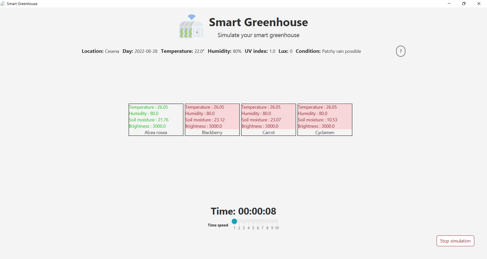
  <p> Fig. 3 - Schermata principale della simulazione </p>
</div>

[Fig. 3]: img/userGuide_mainView.png

Cliccando su una specifica area, si potrà visualizzare la schermata di dettaglio ([Fig. 4]) in cui sarà possibile visionare: l’immagine e la descrizione della pianta coltivata; lo stato dell’area, se di allarme o normale; i valori ottimali e correnti per ogni parametro ambientale rilevato dai sensori posti all’interno dell’area e le azioni che possono essere intraprese per regolare i parametri rilevati al suo interno.

In relazione ad ogni parametro, vi è l’indicazione se siano stati rilevati dei valori critici o meno. Nel caso in cui venga segnalata una situazione di allarme, all’utente verranno mostrati dei suggerimenti relativi alle azioni che possono essere intraprese per riportare l’area in una condizione ottimale.

<div align="center">
  
  <p> Fig. 4 - Schermata per la visualizzazione in dettaglio dell'area </p>
</div>

[Fig. 4]: img/userGuide_detailArea.png


Qualora l’utente abbia deciso di terminare in anticipo la simulazione oppure siano trascorse le 24 ore virtuali, l’utente verrà reindirizzato alla schermata di fine simulazione ([Fig. 5]) in cui avrà la possibilità di iniziarne una nuova, semplicemente cliccando sul pulsante “_Start a new simulation_”.

<div align="center">
  
  <p> Fig. 5 - Schermata finale </p>
</div>

[Fig. 5]: img/userGuide_finishSimulation.png
